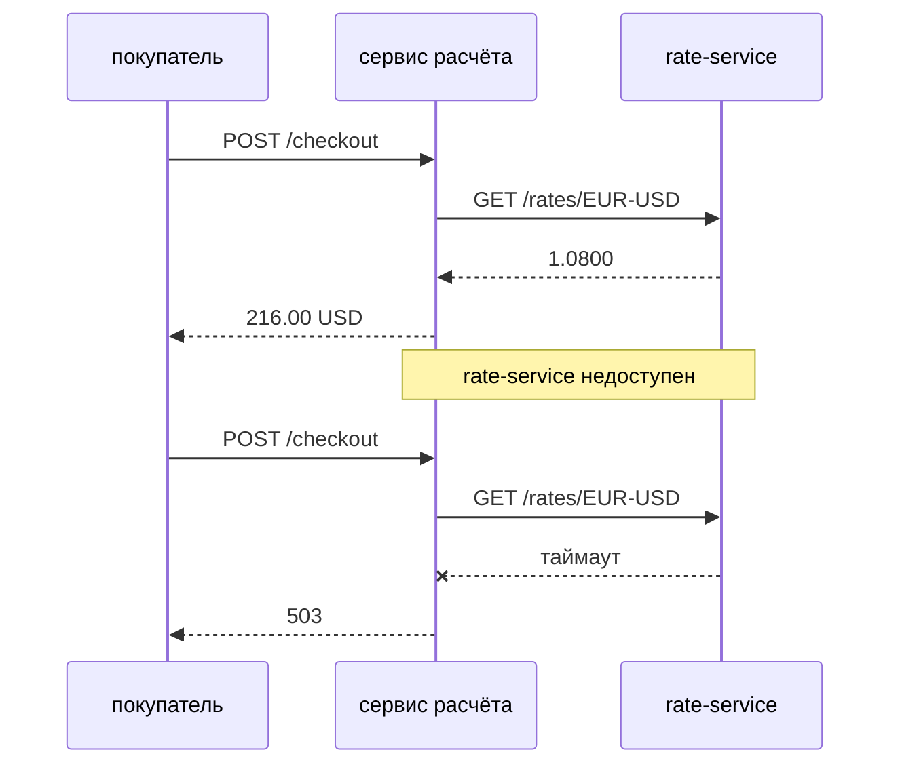
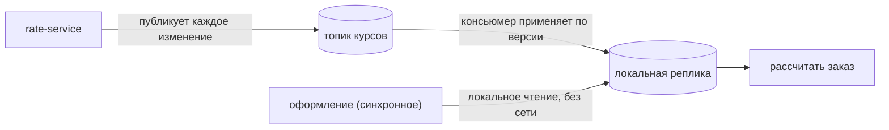
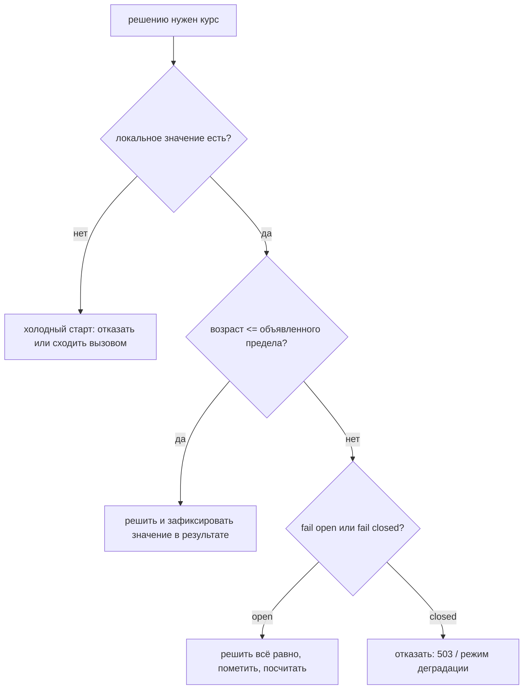

# Асинхронные данные в точке синхронного решения

Идут двое часов. Курс меняется по расписанию **rate-service** — когда двинулся
рынок, когда завершился плановый импорт. Оформление заказа происходит по
расписанию **покупателя**, и рассчитать его нужно раньше, чем доиграет анимация
кнопки. Вопрос в том, что соединяет эти часы, и любой ответ — это размен между
тем, *насколько число актуально*, и тем, *сколько чужой хрупкости вы на себя
берёте*.

Форм всего две. Либо вы получаете значение внутри решения, либо держите его
копию и решаете локально. Всё остальное — TTL, события, снапшоты, circuit
breaker — детали поверх этого выбора.

## Вариант 1: спросить владельца прямо внутри решения



Это честная отправная точка, и она правильна чаще, чем можно подумать по
архитектурным схемам: ответ всегда актуален, никакую копию поддерживать не надо,
и следующему инженеру нечего объяснять. Запустите пример **Вызывать владельца
каждый раз** и посмотрите, во что это обходится на самом деле.

- **Задержки складываются.** Каждое решение платит сетевой round trip, и они
  суммируются: три таких обращения в одном запросе — три round trip на
  критическом пути.
- **Доступности перемножаются.** Оформление работает, только когда живы и сервис
  расчёта, и rate-service. Два сервиса по 99,9% дают 99,8%, и с каждой новой
  зависимостью арифметика ухудшается. Запустите **Владелец недоступен**: сервис
  расчёта жив, его база жива, а оформление мертво.
- **Вы импортировали чужую проблему с ёмкостью.** Ваш всплеск трафика теперь их
  всплеск трафика.

Таймауты, повторы и circuit breaker (см. [таймауты, фолбэки и circuit
breaker](topic:service-timeouts-fallbacks)) делают отказ *быстрым*, а не
несуществующим — и фолбэк, на который переключается разомкнутый breaker, почти
всегда является локально закэшированным значением. То есть вы всё равно приходите
к варианту 2; лучше прийти к нему осознанно.

## Вариант 2: держать значение локально



Локальная копия превращает распределённый вопрос в локальный. Решение читает
память или локальную таблицу и не может упасть из-за кого-то другого. Заполнить
эту копию можно двумя способами:

| | **Read-through кэш (TTL)** | **Event-carried state transfer** |
| --- | --- | --- |
| Кто инициирует | потребитель, при промахе | владелец, при каждом изменении |
| Устаревание | всегда вплоть до TTL | задержка доставки, обычно миллисекунды |
| Нагрузка на владельца | один вызов на ключ за TTL | одна публикация на изменение |
| Холодный старт | за него платит первый запрос | перечитать лог / снапшот |
| Владелец недоступен | промахи падают или отдают просроченное | реплика продолжает отвечать, просто перестаёт обновляться |
| Связанность | потребитель знает API владельца | потребитель знает *схему событий* владельца |

Кэш дешевле в реализации и не требует участия владельца. Event-carried state
transfer требует, чтобы владелец публиковал события, но полностью убирает вызов
с пути решения — и именно это имеют в виду, когда говорят, что сервис должен уметь
отвечать, пользуясь только своими данными. Поэтому он есть в любом каталоге
паттернов (см. [микросервисные паттерны](topic:microservice-patterns) и [типы
взаимодействия](topic:microservice-interaction-types)).

### TTL — не гарантия свежести

Это **ограничение на то, насколько вам позволено ошибаться**. TTL в 60 секунд не
означает, что значению не больше 60 секунд, — он означает, что если владелец
изменил курс через секунду после вашего запроса, оставшиеся 59 вы отдавали старый.
Запустите **Локальный кэш с TTL** и посмотрите ровно на это. Выбирать TTL нужно
вопросом «насколько это может быть неверным, прежде чем кто-то потеряет деньги», а
не «сколько нагрузки я хочу сэкономить».

Кэш приносит с собой ещё две вещи: при истечении TTL множество параллельных
запросов промахивается одновременно и лавиной идёт к владельцу (лечится
джиттером, single-flight обновлением или refresh-ahead), и копия должна где-то
*жить* — карта в процессе быстрее всего, но она своя у каждого инстанса и умирает
при деплое, а Redis общий, но это ещё один сервис на критическом пути. Кэш в
памяти, чувствительный к её нехватке, — это ровно случай для [мягких
ссылок](topic:reference-types-cache).

## Event-carried state transfer по существу

Владелец публикует событие, которое **несёт состояние**, а не просто уведомление:

```json
{ "pair": "EUR/USD", "rate": "1.0950", "version": 7, "validFrom": "2026-07-27T10:15:00Z" }
```

Разница существенна. Событие-уведомление («курс EUR/USD изменился») заставляет
каждого потребителя идти за значением обратно, что возвращает связанность,
которую вы убирали, и умножает её на число потребителей. Событие, несущее
состояние, избавляет потребителя от вопросов.

Потребитель держит **read model**: свою копию, сформированную под свои решения,
которую он может читать, но не имеет права считать источником истины. Это
денормализация через границу сервиса — тот же размен, что и при [денормализации
таблицы](topic:database-normalization), только с сетью посередине. Записи
по-прежнему идут владельцу; реплика отвечает на чтения.

Для издателя это [асинхронная
коммуникация](topic:sync-vs-async-communication) со всеми её обычными
обязанностями: публиковать надёжно ([паттерн Outbox](topic:outbox-pattern) или
хотя бы [транзакционный слушатель событий](topic:spring-transactional-event-listener),
чтобы никогда не опубликовать то, что откатили), и сделать топик настоящим —
[компактифицированные топики Kafka](topic:kafka-vs-rabbitmq) хранят последнее
событие по каждому ключу вечно, и именно это делает реплику восстановимой.

## Решение, которое и определяет весь дизайн: насколько старыми могут быть данные?

Именно этот вопрос слушает интервьюер, и он **бизнесовый**, а не технический:



Предел задаётся для решения, а не для сервиса. По одному и тому же курсу в одной
и той же системе:

- показать примерную цену на карточке товара — минуты допустимы, fail open;
- рассчитать корзину при оформлении — секунды, fail closed;
- провести платёж или сделать бухгалтерскую проводку — курс должен браться из
  записи, которую вы сможете защитить на аудите, так что это вообще не вопрос кэша.

Без объявленного предела код не может узнать, что данные слишком старые, поэтому
молча считает по тому, что есть. Это и показывает пример **Просроченный кэш во
время аварии**: просроченная запись отдаётся, авария нигде не проявляется, и
«stale-if-error» случается с вами, а не выбирается вами. Объявленный предел
превращает то же самое чтение либо в видимую деградацию, либо в честный отказ.

## Сбой, ради которого существует эта тема

Асинхронный поток не падает громко. Он останавливается.

Зависший поток-слушатель, consumer group, так и не переподключившаяся после
ребалансировки, партиция без назначенного консьюмера, ошибка десериализации,
проглоченная в `catch`, — и реплика просто перестаёт меняться. Все запросы
по-прежнему успешны. Задержки прекрасны. Доля ошибок нулевая. И каждая цена
получасовой давности. Запустите **Поток встал, ничего не упало** — этот прогон
выглядит здоровее корректного.

Поэтому мониторить нужно то, что действительно изменилось: **возраст данных и
отставание консьюмера**, а не долю ошибок.

- Экспортируйте `now - lastAppliedEventTimestamp` по группам ключей как gauge и
  вешайте на него алерт.
- Экспортируйте consumer lag (Kafka) или глубину очереди (RabbitMQ) и алертьте по
  ним.
- Публикуйте **heartbeat-события** для редко меняющихся данных — иначе ключ,
  который законно не менялся час, неотличим от оборванной трубы.
- Заметьте, что догоняние исправляет, а что нет: после возобновления потока
  накопленное доставляется, но самое новое событие в нём может само оказаться
  получасовым. Догнать поток — не то же самое, что быть актуальным.

## Как сделать локальную копию надёжной

1. **Каждое событие несёт версию (или монотонную метку времени) и ключ.**
   Применяйте событие, только если его версия больше имеющейся; остальные
   отбрасывайте. Одно это правило делает потребителя идемпотентным при доставке
   at-least-once и невосприимчивым к перестановке порядка после ребалансировки —
   запустите **Дубли и события не по порядку**. Это тот же механизм, что и в
   [паттерне Inbox](topic:inbox-pattern), и та же логика, что при [защите от
   дублей продаж](topic:duplicate-sale-prevention).
2. **Реплика должна восстанавливаться из лога.** Перечитайте компактифицированный
   топик или загрузите снапшот; не завязывайте это на доступность владельца.
   Реплика, которую нельзя восстановить, — это кэш с лишними шагами, см.
   **Холодный старт и восстановление**.
3. **Решите, где она живёт.** В памяти — быстрее всего и пусто после каждого
   деплоя; локальная таблица переживает перезапуск и позволяет восстанавливаться
   лениво. Если она в памяти, её пишет поток-слушатель, а читают потоки запросов,
   значит нужна [конкурентная карта](topic:concurrenthashmap-vs-synchronized-map),
   а не `HashMap`.
4. **Фиксируйте значение в самом решении.** Сохраняйте на заказе `rate`, его
   `version` и `validFrom`. Расчёт, сделанный в 10:15, должен объясняться и в
   16:00, а на вопрос «по какому курсу считали» нельзя отвечать, глядя в
   сегодняшнюю таблицу курсов.
5. **Версионируйте схему событий.** Владелец добавит поля. Потребители обязаны
   игнорировать незнакомые и продолжать работать; ломающее изменение публикуется
   как новый тип события или новый топик, и на время миграции живут оба.
6. **Имейте ответ на «данных нет вообще».** Совсем новый инстанс, совсем новая
   валютная пара: отказать, сходить одним синхронным вызовом или взять
   задокументированное значение по умолчанию. Выбирайте осознанно — то, что
   выбрано по умолчанию, и будет поведением в проде.

## Когда локальную копию держать не нужно

- **Данных очень много или высокая кардинальность.** Реплицировать весь каталог
  товаров в шесть сервисов ради одного поля хуже, чем сделать вызов.
- **Данные чувствительные.** Каждая реплика — ещё одно место, где живут
  персональные данные, ещё один объект аудита, ещё одно место для удаления по
  запросу.
- **Нужна транзакционная гарантия, а не значение.** На вопрос «это место ещё
  свободно» реплика не отвечает: бронировать должен владелец.
- **Данные меняются намного быстрее, чем вы их читаете.** Если значение при
  каждом чтении другое, вы поддерживаете реплику, чтобы ею не пользоваться.
- **Потребитель один и обращается редко.** Вызов проще; оставьте себе возможность
  передумать позже.

## Ответ на собеседовании за 60 секунд

> Решение синхронное, значит, оно не должно зависеть от синхронного вызова
> сервиса, которому принадлежат данные. Я держу значение локально — для курса
> валют через event-carried state transfer: rate-service публикует каждое
> изменение вместе со значением, версией и временем действия, мой консьюмер
> применяет события по версии в собственную read model, и оформление читает эту
> модель без сетевых вызовов. Применение по версии делает повторную доставку и
> перестановку порядка безвредными, а топик компактифицирован, поэтому новый
> инстанс восстанавливает реплику, перечитав его, — и это работает даже пока
> rate-service лежит. Дальше то, что и определяет дизайн: я объявляю, насколько
> старым значение может быть для каждого решения. Карточка товара терпит минуты и
> работает по fail open; оформление — секунды и fail closed; проводка использует
> сохранённый курс, а не закэшированный. Курс, по которому принято решение,
> фиксируется в заказе вместе с версией, чтобы цену можно было объяснить потом. И
> поскольку остановившийся поток не бросает исключений, я алерчу на возраст данных
> и отставание консьюмера, а не на долю ошибок. Read-through кэш с TTL — облегчённая
> версия той же идеи, когда владелец не может публиковать события, но TTL — это
> ограничение на допустимую ошибку, а не гарантия свежести.

## Частые заблуждения

- **«Кэш делает данные свежими».** Кэш делает их *доступными*. Свежесть он по
  построению ухудшает; TTL лишь ограничивает насколько.
- **«Ничего не падает, значит, с данными всё в порядке».** Устаревание не бросает
  исключений. Health-check, доля ошибок и задержки выглядят идеально, пока
  остановившийся консьюмер отдаёт часовой курс.
- **«Событие — это уведомление, потребитель сам дочитает детали».** Тогда вы
  сохранили синхронный вызов и добавили брокер. Кладите состояние в событие.
- **«События приходят по порядку и ровно один раз».** Нет. Применяйте по версии —
  и это предположение перестанет быть нужным.
- **«Реплика — теперь мои данные».** Это read model. Записи идут владельцу, и при
  расхождении прав владелец.
- **«Если потеряем реплику, восстановим её через API владельца».** Это привязывает
  восстановление к доступности и лимитам владельца ровно тогда, когда всё плохо.
  Восстанавливайтесь из лога.
- **«Просто сделаем TTL поменьше».** TTL в одну секунду — это синхронный вызов с
  лишними шагами, и он отдаёт владельцу весь ваш трафик.
- **«Eventual consistency означает, что можно показывать что угодно».** Она
  означает ограниченное устаревание, которое вы выбрали, измеряете и можете
  объяснить: предел, который никто не записал, — это не eventual consistency, а
  незамеченный баг.
