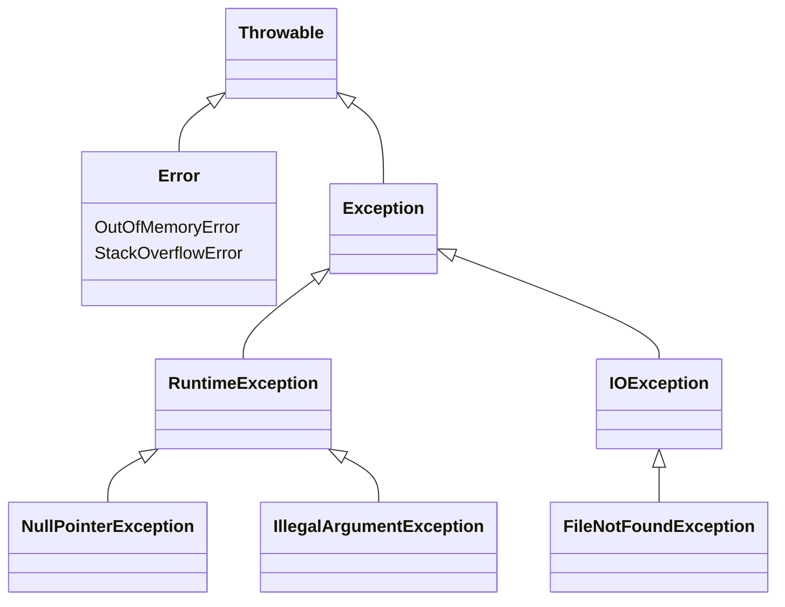
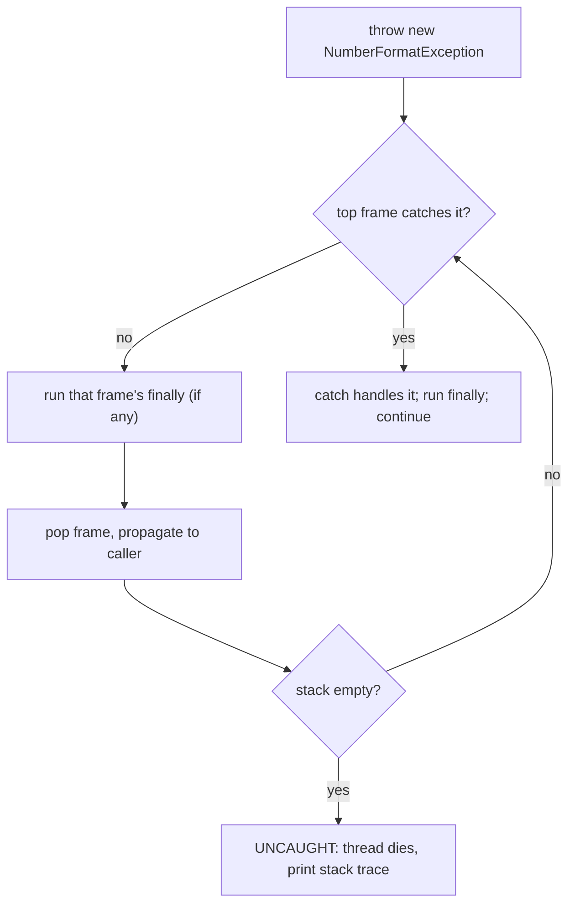

# Exceptions in Java and Their Types

## The intuition

An exception is Java's way of saying *"I cannot finish this normally — stop and
deal with it."* Think of a **kitchen during a busy service**: a cook discovers the
fridge is empty mid-recipe. They can't just keep cooking, so they raise their hand
and shout. If the cook next to them knows how to handle it (grabs a substitute),
service continues. If nobody can handle it, the shout travels all the way to the
head chef, and if even they can't cope, the whole order is abandoned. That shout is
a thrown exception; the hand-off up the line is **propagation**; the head chef
giving up is an **uncaught** exception.

Two questions an interviewer always asks: **how is the exception machinery
structured**, and **what types exist**.

## The type hierarchy

Everything throwable in Java descends from `Throwable`. Picture it as a
**postal sorting office** with two big chutes:

- **`Error`** — the building is on fire. `OutOfMemoryError`, `StackOverflowError`.
  These signal a broken JVM you are *not meant to catch and recover from* — like a
  fire alarm, you evacuate, you don't try to keep sorting mail.
- **`Exception`** (but **not** `RuntimeException`) — **checked** exceptions, e.g.
  `IOException`, `SQLException`. These are *registered parcels*: the post office
  (the compiler) makes you **sign for them** — you must either `catch` them or
  declare `throws`. They model expected-but-external trouble (a file is missing, the
  network dropped).
- **`RuntimeException`** and its subclasses — **unchecked** exceptions, e.g.
  `NullPointerException`, `IllegalArgumentException`, `ArithmeticException`. These are
  *ordinary letters*: no signature required, the compiler stays silent. They usually
  mean a **bug in the code** (you dereferenced null, passed a bad argument).

The single rule that decides "checked vs unchecked": is it a `RuntimeException` (or
`Error`)? Then it's **unchecked**. Everything else under `Exception` is **checked**.
This is plain Java [inheritance](topic:oop-principles) — `catch (Exception e)` works
because every checked and unchecked exception *is-a* `Exception`.

## How throwing and propagation work

Each method call adds a frame to the **call stack** — like a stack of order tickets
on a spike, newest on top. When code does `throw new SomeException(...)`, the JVM
abandons the current frame and walks **down the spike** looking for a frame whose
`try` has a matching `catch`:

A `catch (T)` matches if the thrown object **is-a** `T` — so `catch (Exception e)`
catches a `NumberFormatException`, but `catch (IOException e)` does not. The **first**
matching frame on the way down wins, like the first person in the line who knows the
recipe takes over.

**`finally` always runs** — it's the *"turn off the stove no matter what"* block. It
runs whether the `try` succeeded, threw and was caught, or threw and is just passing
through (a frame with `finally` but no matching `catch` still runs its cleanup before
the exception moves on). That's why `finally` (and try-with-resources) is where you
close files and connections.

## The 60-second interview answer

> All thrown objects in Java extend `Throwable`, which splits into `Error` and
> `Exception`. `Error` (e.g. `OutOfMemoryError`) signals an unrecoverable JVM
> problem you shouldn't catch. `Exception` splits again: `RuntimeException` and its
> subclasses are **unchecked** — the compiler doesn't force you to handle them, and
> they usually indicate programming bugs like `NullPointerException`. Every other
> `Exception` (e.g. `IOException`) is **checked** — the compiler forces you to either
> `catch` it or declare `throws`. When you `throw`, the JVM unwinds the call stack
> frame by frame, running each frame's `finally`, until it finds a `catch` whose type
> is a supertype of the thrown exception; if none exists, the exception is uncaught
> and the thread terminates with a stack trace.

## Why it matters in production

- **Checked vs unchecked shapes your API.** Checked exceptions force callers to deal
  with failure but clutter signatures; most modern frameworks (Spring, Hibernate) wrap
  them in unchecked exceptions so business code stays clean.
- **It drives transaction rollback.** Spring's `@Transactional` rolls back on
  unchecked exceptions by default but **not** on checked ones — see
  [@Transactional Rollback Rules](topic:spring-transactional-rollback). Knowing the
  hierarchy is the difference between a committed and a rolled-back transaction.
- **`finally` / try-with-resources prevents leaks.** Connections, files, and locks
  must be released even when something throws — like switching off the stove before
  you leave the kitchen, fire or no fire.

## Common traps and misconceptions

- **"Catch everything with `catch (Exception e)`."** That hides bugs and swallows
  `InterruptedException`. Catch the narrowest type you can actually handle.
- **Catching `Throwable` / `Error`.** Don't — you'd "catch" `OutOfMemoryError` and
  pretend the fire is out. Let `Error`s propagate.
- **"`finally` doesn't run on exceptions."** It does — that's its entire purpose. (It
  is skipped only by `System.exit` or a JVM crash.)
- **`throw` vs `throws`.** `throw` *raises* an exception right now; `throws` is a method
  declaration that *warns callers* a checked exception may escape. Different keywords,
  different jobs.
- **Empty `catch {}` blocks.** Swallowing an exception silently is like binning the
  fire alarm — the problem reappears later, harder to find.
- **Unchecked ≠ "less serious".** A `NullPointerException` can crash you just as hard;
  unchecked only means the *compiler* doesn't force handling.
