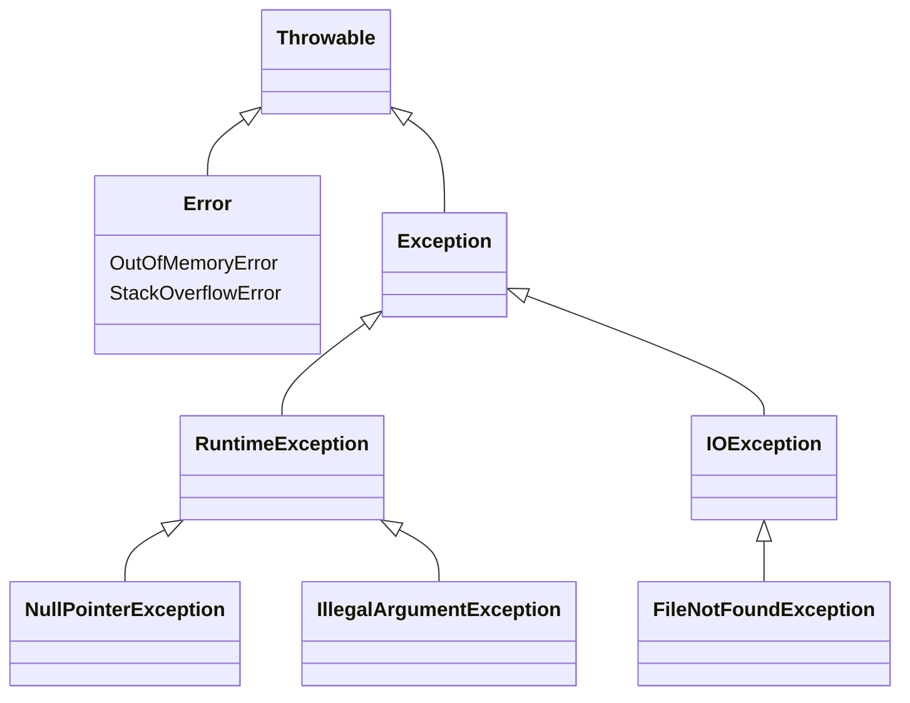
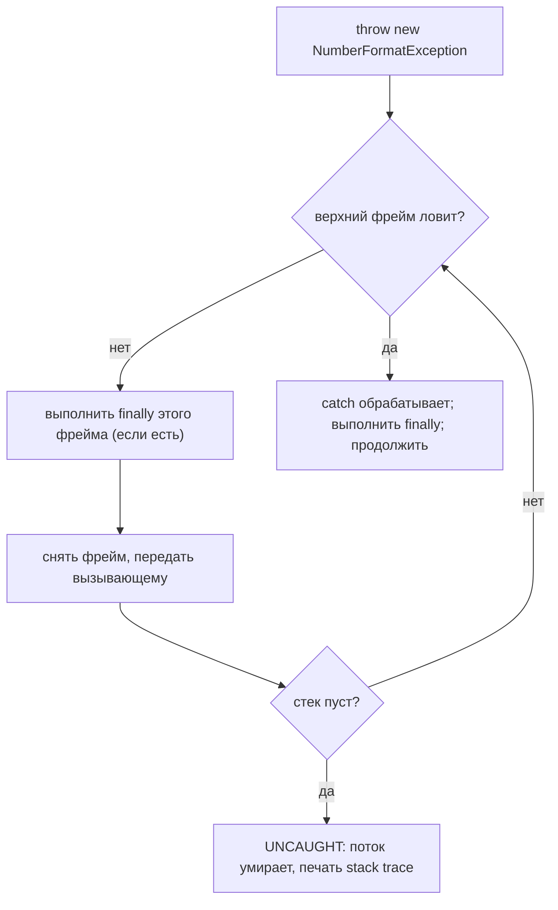

# Исключения в Java и их типы

## Интуиция

Исключение — это способ Java сказать: *«Я не могу завершить это нормально —
остановись и разберись».* Представь **кухню в час пик**: повар посреди рецепта
обнаруживает, что холодильник пуст. Он не может просто продолжать готовить, поэтому
поднимает руку и кричит. Если сосед знает, что делать (берёт замену), сервис
продолжается. Если никто не может помочь, крик доходит до шеф-повара, а если и он не
справляется — весь заказ отменяется. Этот крик — брошенное исключение; передача по
цепочке — это **распространение (propagation)**; шеф-повар, который сдался, — это
**непойманное** исключение.

Два вопроса, которые всегда задаёт интервьюер: **как устроен механизм исключений** и
**какие бывают типы**.

## Иерархия типов

Всё, что можно бросить в Java, наследуется от `Throwable`. Представь это как
**почтовый сортировочный центр** с двумя большими жёлобами:

- **`Error`** — здание горит. `OutOfMemoryError`, `StackOverflowError`. Это сигнал
  о сломанной JVM, который *не предназначен для перехвата и восстановления* — как
  пожарная тревога: ты эвакуируешься, а не продолжаешь сортировать почту.
- **`Exception`** (но **не** `RuntimeException`) — **проверяемые** исключения,
  например `IOException`, `SQLException`. Это *заказные посылки*: почта (компилятор)
  заставляет тебя **расписаться за них** — нужно либо `catch`, либо объявить `throws`.
  Они моделируют ожидаемые внешние проблемы (файла нет, сеть оборвалась).
- **`RuntimeException`** и его наследники — **непроверяемые** исключения, например
  `NullPointerException`, `IllegalArgumentException`, `ArithmeticException`. Это
  *обычные письма*: подпись не нужна, компилятор молчит. Обычно они означают **баг в
  коде** (обращение к null, неверный аргумент).

Единственное правило «проверяемое или нет»: это `RuntimeException` (или `Error`)?
Тогда **непроверяемое**. Всё остальное под `Exception` — **проверяемое**. Это
обычное [наследование](topic:oop-principles) в Java — `catch (Exception e)`
работает, потому что любое проверяемое и непроверяемое исключение *является*
`Exception`.

## Как работают бросок и распространение

Каждый вызов метода добавляет фрейм в **стек вызовов** — как стопка чеков-заказов на
шпильке, новый сверху. Когда код выполняет `throw new SomeException(...)`, JVM
бросает текущий фрейм и идёт **вниз по шпильке**, ища фрейм, чей `try` имеет
подходящий `catch`:

`catch (T)` подходит, если брошенный объект **является** `T` — поэтому
`catch (Exception e)` ловит `NumberFormatException`, а `catch (IOException e)` —
нет. Побеждает **первый** подходящий фрейм на пути вниз, как первый человек в
цепочке, который знает рецепт, берёт дело на себя.

**`finally` выполняется всегда** — это блок *«выключи плиту, что бы ни случилось»*.
Он срабатывает, успешно ли завершился `try`, бросил и был пойман, или бросил и
просто проходит мимо (фрейм с `finally`, но без подходящего `catch`, всё равно
выполняет очистку, прежде чем исключение пойдёт дальше). Поэтому именно в `finally`
(и в try-with-resources) закрывают файлы и соединения.

## Ответ за 60 секунд

> Все бросаемые объекты в Java наследуются от `Throwable`, который делится на
> `Error` и `Exception`. `Error` (например, `OutOfMemoryError`) сигнализирует о
> невосстановимой проблеме JVM, которую не следует ловить. `Exception` делится
> дальше: `RuntimeException` и его наследники — **непроверяемые**, компилятор не
> заставляет их обрабатывать, и обычно они указывают на баги вроде
> `NullPointerException`. Любое другое `Exception` (например, `IOException`) —
> **проверяемое**: компилятор заставляет либо поймать его через `catch`, либо
> объявить `throws`. При `throw` JVM раскручивает стек вызовов фрейм за фреймом,
> выполняя `finally` каждого фрейма, пока не найдёт `catch`, тип которого является
> супертипом брошенного исключения; если такого нет — исключение не поймано, и поток
> завершается со stack trace.

## Почему это важно в продакшене

- **Проверяемые vs непроверяемые формируют твой API.** Проверяемые заставляют
  вызывающего обрабатывать сбой, но засоряют сигнатуры; большинство современных
  фреймворков (Spring, Hibernate) оборачивают их в непроверяемые, чтобы бизнес-код
  оставался чистым.
- **Это управляет откатом транзакции.** `@Transactional` в Spring по умолчанию
  откатывается на непроверяемых исключениях, но **не** на проверяемых — см.
  [Правила отката @Transactional](topic:spring-transactional-rollback). Знание
  иерархии — это разница между зафиксированной и откатанной транзакцией.
- **`finally` / try-with-resources предотвращает утечки.** Соединения, файлы и
  блокировки нужно освобождать, даже если что-то бросило исключение — как выключить
  плиту, прежде чем покинуть кухню, пожар там или нет.

## Частые ловушки и заблуждения

- **«Ловлю всё через `catch (Exception e)`».** Это прячет баги и проглатывает
  `InterruptedException`. Лови самый узкий тип, который реально можешь обработать.
- **Перехват `Throwable` / `Error`.** Не надо — так ты «поймаешь»
  `OutOfMemoryError` и сделаешь вид, что пожар потушен. Дай `Error` распространяться.
- **«`finally` не выполняется при исключениях».** Выполняется — в этом весь смысл.
  (Пропускается только при `System.exit` или крахе JVM.)
- **`throw` vs `throws`.** `throw` *бросает* исключение прямо сейчас; `throws` — это
  объявление метода, *предупреждающее вызывающих*, что может вылететь проверяемое
  исключение. Разные ключевые слова, разные задачи.
- **Пустые блоки `catch {}`.** Молча проглотить исключение — всё равно что выбросить
  пожарную сигнализацию: проблема всплывёт позже, и найти её будет труднее.
- **Непроверяемое ≠ «менее серьёзное».** `NullPointerException` может уронить
  приложение не хуже прочих; непроверяемое значит лишь, что *компилятор* не требует
  обработки.
