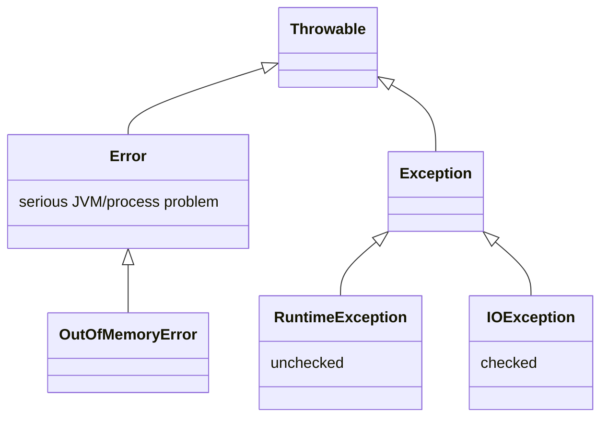
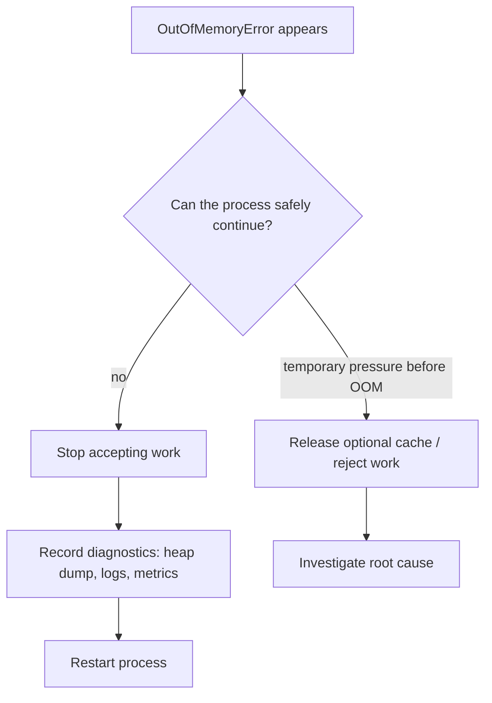

# Exceptions and OutOfMemoryError

## Intuition

Java puts all abnormal outcomes under `Throwable`, but not all of them mean the same thing. Think of a post office: some problems are normal service issues, like a missing form; some are bad addresses written by the sender; and some mean the building has no power. Java uses different branches for those cases.

- `Exception` is for failures application code may reasonably handle. A checked `IOException` is like a post-office clerk asking for a required receipt: the compiler forces the caller to either handle it or declare it.
- `RuntimeException` is an unchecked `Exception`. It usually means a programming bug or invalid input contract, like sending a parcel with no address label. The compiler does not force every caller to mention it.
- `Error` is for serious JVM or process-level problems. `OutOfMemoryError` means the JVM could not allocate memory; it is closer to the whole kitchen running out of gas than to one recipe failing.

For the base mechanics of throwing, catching, `finally`, and checked versus unchecked types, review [Exceptions in Java and Their Types](topic:exception-basics). Cleanup patterns are covered in [Resource Exception Handling](topic:resource-exception-handling), and the `finally` keyword is compared in [final vs finally vs finalize](topic:final-finally-finalize).

## What Happens When Something Is Thrown

When code executes `throw`, the current method stops its normal path. The JVM walks up the call stack looking for the first matching `catch`; every frame that does not match is removed. It is like a package complaint moving from one post-office window to the supervisor: each desk either handles it or passes it upward.

`finally` runs while the stack is being unwound, even if the method does not catch the problem. Use it for cleanup that must happen, such as closing resources. In kitchen terms, even when an order is cancelled, someone still turns off the stove.

`catch (Exception)` catches checked exceptions and `RuntimeException` subtypes, but it does not catch `Error`. `catch (Throwable)` would catch both, but using it inside ordinary business logic is like putting the city fire alarm button on every kitchen timer: it hides the difference between a burnt toast and a building emergency.

## What If Memory Runs Out?

`OutOfMemoryError` most often means the Java heap cannot satisfy a new allocation, but memory pressure can also involve metaspace, direct buffers, native memory, or thread stacks. The related memory layout is explained in [How Java Memory Is Organized: Stack vs Heap](topic:jvm-memory-areas), [JVM Heap Generations](topic:heap-generations), and [StackOverflowError](topic:stackoverflow-error).

The important interview point is policy: do not treat `OutOfMemoryError` as a recoverable business exception. Once the JVM cannot allocate memory, logging, error handlers, JSON serialization, and even cleanup may also need memory. It is like a restaurant trying to print apology coupons after the power has failed; the response must be simple and already prepared.

A service may have a top-level boundary that catches `Throwable` only to record minimal diagnostics, stop accepting work, and let the process exit or be restarted by orchestration. It should not swallow the error and continue as if the JVM is healthy. Before an actual OOM, bounded caches, backpressure, smaller batches, and request rejection are valid pressure valves; after OOM, prefer fail-fast plus diagnosis.

Good production preparation includes `-XX:+HeapDumpOnOutOfMemoryError`, memory metrics, container memory limits that match JVM settings, alerts, and restart policy. Then investigate whether the cause was a leak, a traffic spike, too-large batches, too-small heap, direct memory, metaspace, or too many threads. The focused topics [Memory Leaks in Java](topic:memory-leaks), [Diagnosing Memory Growth and Leaks in Production](topic:diagnosing-memory-leaks), and [Configuring the Garbage Collector](topic:gc-configuration) go deeper.

## 60-Second Interview Answer

`Throwable` has two main branches: `Exception` and `Error`. Checked exceptions are `Exception` subtypes outside `RuntimeException`; the compiler forces callers to handle or declare them. Unchecked exceptions are `RuntimeException` subtypes and usually represent programming mistakes or invalid input contracts. `Error` is different: it signals serious JVM or process problems. `OutOfMemoryError` is an `Error`, so `catch (Exception)` will not catch it.

If a Java program runs out of memory, I would not try to continue normal business logic. I would make sure the service has memory metrics, heap dumps on OOM, logs, and a restart policy. At a top-level boundary, catching `Throwable` can be acceptable only to do minimal cleanup or diagnostics and then terminate. Before OOM happens, I can reduce pressure by bounding caches, rejecting work, applying backpressure, shrinking batches, or tuning the heap and GC. Afterward, I investigate whether it was a leak, load spike, bad sizing, direct memory, metaspace, or too many threads.

## Common Misconceptions

- "All exceptions are the same." They are not. A checked `IOException`, an unchecked `NullPointerException`, and an `OutOfMemoryError` are different signals, like a missing kitchen ingredient, a broken recipe card, and a gas outage.
- "`catch (Exception)` catches everything." It does not catch `Error`; `OutOfMemoryError` can pass right through it like an emergency vehicle ignoring a normal traffic checkpoint.
- "We can catch OutOfMemoryError and keep going." Sometimes specialized code can free a preallocated reserve or optional cache, but general application code should assume the process is unreliable and fail fast.
- "`System.gc()` fixes memory problems." It is only a request to the JVM and does not free reachable objects. If a cache or static list still holds references, GC is like a cleaner who cannot throw away boxes that still have reservation tags.
- "Increasing `-Xmx` always solves OOM." More heap can buy time, but it can hide leaks or increase pause cost. Find the cause and size memory deliberately.
