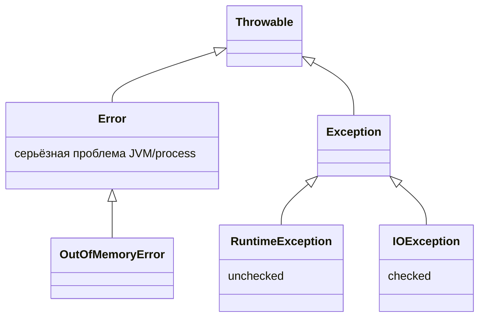
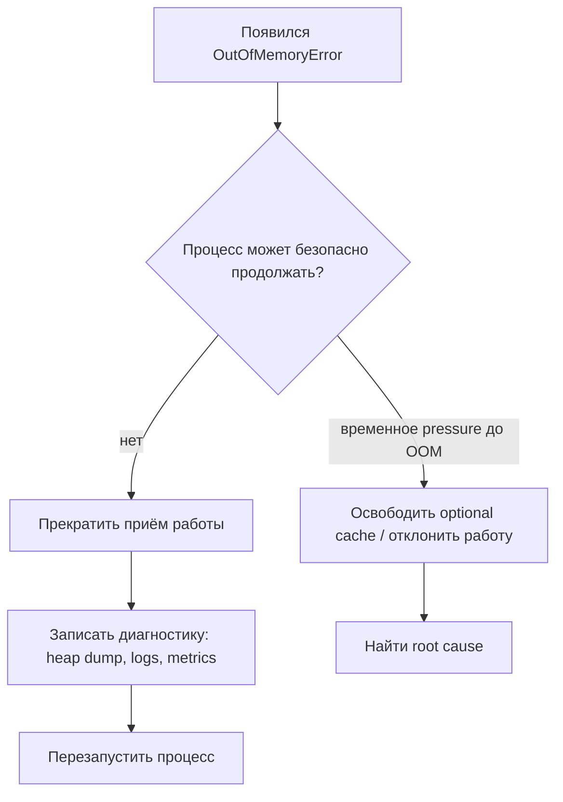

# Исключения и OutOfMemoryError

## Интуиция

Java помещает все abnormal outcomes под `Throwable`, но они означают разные вещи. Представь почту: часть проблем обычные сервисные ситуации, например не хватает бланка; часть — плохой адрес от отправителя; а часть означает, что в здании отключилось электричество. Java разводит такие случаи по разным веткам.

- `Exception` нужен для сбоев, которые прикладной код может разумно обработать. Checked `IOException` похож на почтового сотрудника, который требует обязательную квитанцию: компилятор заставляет вызывающий код либо обработать его, либо объявить.
- `RuntimeException` — это unchecked `Exception`. Обычно он означает баг или нарушение входного контракта, как посылка без адресной наклейки. Компилятор не заставляет каждого вызывающего упоминать его.
- `Error` нужен для серьёзных проблем JVM или процесса. `OutOfMemoryError` означает, что JVM не смогла выделить память; это ближе к кухне, где закончился газ, чем к одному неудачному рецепту.

Базовую механику `throw`, `catch`, `finally` и checked/unchecked типов смотри в [Exceptions in Java and Their Types](topic:exception-basics). Паттерны cleanup описаны в [Resource Exception Handling](topic:resource-exception-handling), а ключевое слово `finally` сравнивается в [final vs finally vs finalize](topic:final-finally-finalize).

## Что происходит при throw

Когда код выполняет `throw`, текущий метод останавливает обычный путь. JVM идёт вверх по call stack и ищет первый подходящий `catch`; каждый неподходящий frame снимается. Это похоже на жалобу на почте: каждое окно либо решает вопрос, либо передаёт его выше к начальнику.

`finally` выполняется во время раскрутки стека, даже если метод не ловит проблему. Используй его для cleanup, который обязан произойти, например закрытия ресурсов. По кухонной аналогии: даже если заказ отменили, кто-то всё равно выключает плиту.

`catch (Exception)` ловит checked exceptions и подтипы `RuntimeException`, но не ловит `Error`. `catch (Throwable)` поймает оба вида, но использовать его внутри обычной бизнес-логики — как поставить кнопку городской пожарной тревоги на каждый кухонный таймер: она стирает разницу между подгоревшим тостом и чрезвычайной ситуацией во всём здании.

## Что делать, если память закончилась?

`OutOfMemoryError` чаще всего означает, что Java heap не смог выполнить новое выделение, но pressure может быть и в metaspace, direct buffers, native memory или thread stacks. Устройство памяти описано в [How Java Memory Is Organized: Stack vs Heap](topic:jvm-memory-areas), [JVM Heap Generations](topic:heap-generations) и [StackOverflowError](topic:stackoverflow-error).

Главный interview point — политика обработки: не относись к `OutOfMemoryError` как к recoverable бизнес-исключению. Когда JVM не может выделить память, logging, error handlers, JSON serialization и даже cleanup тоже могут потребовать память. Это как ресторан, который пытается напечатать извинительные купоны после отключения электричества: реакция должна быть простой и подготовленной заранее.

У сервиса может быть верхняя граница, которая ловит `Throwable` только для минимальной диагностики, остановки приёма работы и выхода из процесса или перезапуска orchestration-слоем. Она не должна проглатывать ошибку и продолжать, будто JVM здорова. До настоящего OOM полезны bounded caches, backpressure, smaller batches и request rejection; после OOM лучше fail-fast и диагностика.

Хорошая production-подготовка включает `-XX:+HeapDumpOnOutOfMemoryError`, memory metrics, container memory limits, согласованные с JVM-настройками, alerts и restart policy. Затем выясняют, была ли причина в leak, traffic spike, слишком больших batch, слишком маленьком heap, direct memory, metaspace или слишком большом числе threads. Глубже это раскрывают [Memory Leaks in Java](topic:memory-leaks), [Diagnosing Memory Growth and Leaks in Production](topic:diagnosing-memory-leaks) и [Configuring the Garbage Collector](topic:gc-configuration).

## Ответ за 60 секунд

У `Throwable` две основные ветки: `Exception` и `Error`. Checked exceptions — это подтипы `Exception` вне `RuntimeException`; компилятор заставляет вызывающий код обработать или объявить их. Unchecked exceptions — подтипы `RuntimeException`, обычно они показывают баги или нарушение входного контракта. `Error` отличается: он сигнализирует о серьёзных проблемах JVM или процесса. `OutOfMemoryError` — это `Error`, поэтому `catch (Exception)` его не поймает.

Если в Java-программе закончилась память, я бы не пытался продолжать обычную бизнес-логику. Я бы заранее настроил memory metrics, heap dumps on OOM, logs и restart policy. На верхней границе `catch (Throwable)` допустим только для минимального cleanup или диагностики, а затем процесс должен завершиться. До OOM можно снижать pressure через bounded caches, отказ от работы, backpressure, уменьшение batch или настройку heap и GC. После этого нужно выяснить, была ли причина в leak, load spike, плохом sizing, direct memory, metaspace или слишком большом числе threads.

## Частые заблуждения

- "Все exceptions одинаковые." Нет. Checked `IOException`, unchecked `NullPointerException` и `OutOfMemoryError` несут разные сигналы, как недостающий ингредиент на кухне, испорченная карточка рецепта и отключение газа.
- "`catch (Exception)` ловит всё." Он не ловит `Error`; `OutOfMemoryError` пройдёт через него, как машина экстренной службы через обычный дорожный пост.
- "Можно поймать OutOfMemoryError и работать дальше." Иногда специализированный код может освободить заранее выделенный reserve или optional cache, но обычный application code должен считать процесс ненадёжным и делать fail fast.
- "`System.gc()` исправляет проблемы с памятью." Это только запрос к JVM и он не освобождает reachable objects. Если cache или static list всё ещё держит references, GC похож на уборщика, который не может выбросить коробки с табличками брони.
- "Увеличить `-Xmx` всегда решает OOM." Больший heap может выиграть время, но способен скрыть leak или увеличить pause cost. Нужно найти причину и задавать размер памяти осознанно.
