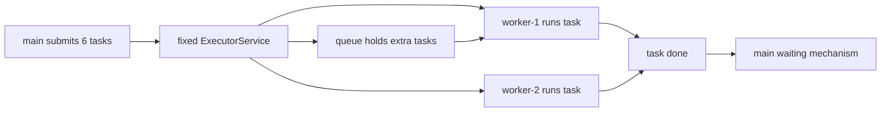
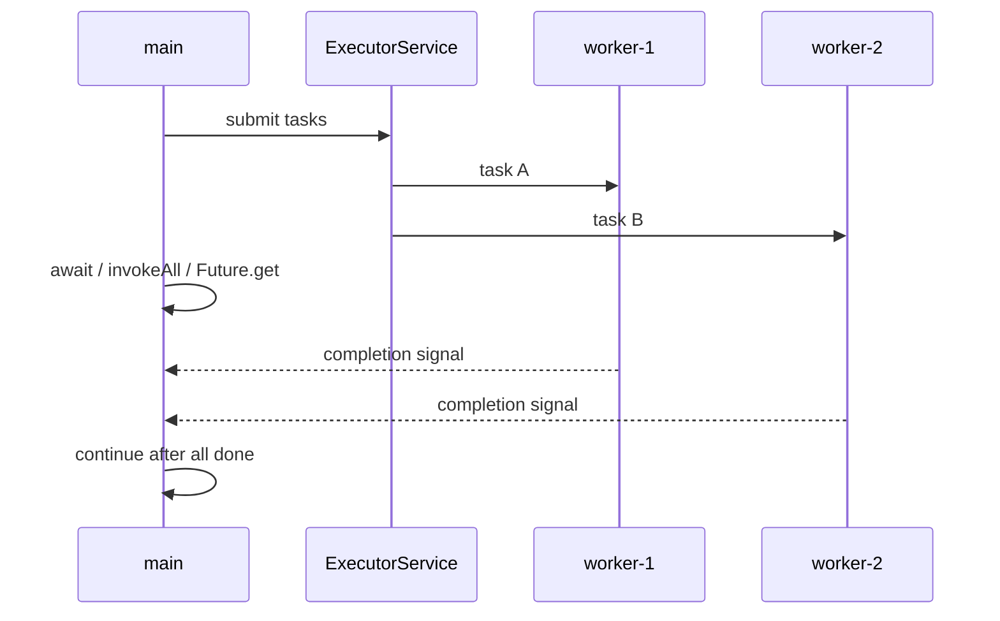

# ExecutorService: Run Many Tasks and Wait for All

When an interview asks how to run many tasks on a limited pool and wait for all
of them, the core answer is: use an `ExecutorService` with a fixed size, submit
the work, then use a clear waiting mechanism. The fixed pool is like a post
office with only three service windows: a hundred customers can arrive, but only
three are served at once and the rest wait in line.

This builds on [Java Thread Pool](topic:java-thread-pool) and
[Thread vs ThreadPool](topic:thread-vs-threadpool): a pool limits concurrency and
reuses workers. That avoids creating one `Thread` per task, which can waste memory
and increase [context switching](topic:context-switch). In real life, it is like a
kitchen keeping a fixed number of cooks instead of hiring a new cook for every
ticket.



## Three Common Ways To Wait

`CountDownLatch` is useful when tasks can signal completion themselves. Create
`new CountDownLatch(taskCount)`, submit tasks, call `countDown()` in each task's
`finally` block, and call `await()` in `main`. The latch is like a delivery board
with one checkbox per courier: the manager leaves only when every box is checked.

```java
ExecutorService pool = Executors.newFixedThreadPool(4);
CountDownLatch done = new CountDownLatch(items.size());

for (Item item : items) {
    pool.submit(() -> {
        try {
            process(item);
        } finally {
            done.countDown();
        }
    });
}

done.await();
pool.shutdown();
```

`invokeAll` is often the cleanest answer when you already have a collection of
`Callable<T>` and want to wait for all of them. It submits the callables and
returns a `List<Future<T>>` only after every task has completed, failed, or been
cancelled. It is like handing a stack of forms to the post office clerk and
waiting at the counter until the entire stack has a result.

`Future.get()` waits for one submitted task and returns its result. If you submit
many tasks manually, keep the returned `Future`s and call `get()` on each. This
is like collecting numbered receipts: each receipt can be checked, but checking
one too early makes you wait at that specific counter.



## 60-Second Interview Answer

I would create a bounded or fixed `ExecutorService`, submit the tasks, and choose
the waiting API based on the shape of the work. If each task just needs to signal
"done", I use `CountDownLatch` initialized with the task count and call
`countDown()` in `finally`, while `main` calls `await()`. If I have
`Callable<T>` tasks and need results, I prefer `invokeAll`, because it submits the
batch and returns only when all `Future`s are done. If tasks were submitted one by
one, I keep the returned `Future`s and call `get()` on each, optionally with a
timeout. After waiting, I call `shutdown()` so the executor stops accepting work
and its worker threads can finish.

## Production Relevance

Use a limited pool to protect CPU, database connections, remote services, and
memory. In a restaurant analogy, the kitchen does not let every order spawn a new
cook; it limits cooks and makes extra tickets wait so the kitchen stays stable.

Use `try/finally` around `countDown()`. If a task throws and never decrements the
latch, `await()` may wait forever. That is like one courier forgetting to mark a
delivery as done: the manager keeps waiting even though the route is over.

Prefer timeouts for production waits: `await(timeout, unit)`,
`invokeAll(tasks, timeout, unit)`, or `future.get(timeout, unit)`. A timeout is
the closing time on a service desk: after some point, the caller must stop waiting
and decide how to recover.

If shared mutable state is involved, waiting for tasks is not the same as making
their code thread-safe. You still need proper coordination, as in
[Avoiding Race Conditions](topic:race-condition-avoidance),
[Critical Section](topic:critical-section), or [Compare-And-Set](topic:compare-and-set).
Waiting is the end-of-day checklist; it does not make the cash registers update
the same balance safely.

## Common Misconceptions

`shutdown()` does not wait for tasks by itself. It stops new submissions; use
`awaitTermination`, a latch, `invokeAll`, or `Future.get` when `main` must wait.
It is like closing the post office door to new customers, not instantly knowing
every customer inside is finished.

`CountDownLatch` is one-shot. Once the count reaches zero, it cannot be reset. It
is like a tear-off checklist: after all boxes are torn off, you need a new sheet
for the next batch.

Calling `Future.get()` in submission order can reduce useful parallelism if you
submit one task, immediately wait for it, then submit the next. Submit the batch
first, then wait. It is like sending only one courier and waiting for them before
dispatching the next; the fleet never gets used.

`invokeAll` waits for all tasks, but failures are still inside the returned
`Future`s. You discover them when calling `get()`, usually as an
`ExecutionException`. That is like receiving every envelope back, then opening
one and finding an error note inside.

A fixed pool limits concurrency, not total work. Ten thousand queued tasks can
still consume memory. For backpressure and rejection policy details, review
[Java Thread Pool](topic:java-thread-pool). The queue is a waiting room: making
the room too large can hide overload until the building is full.
