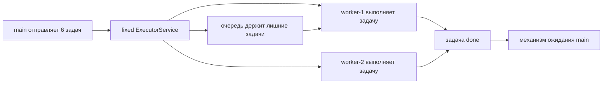
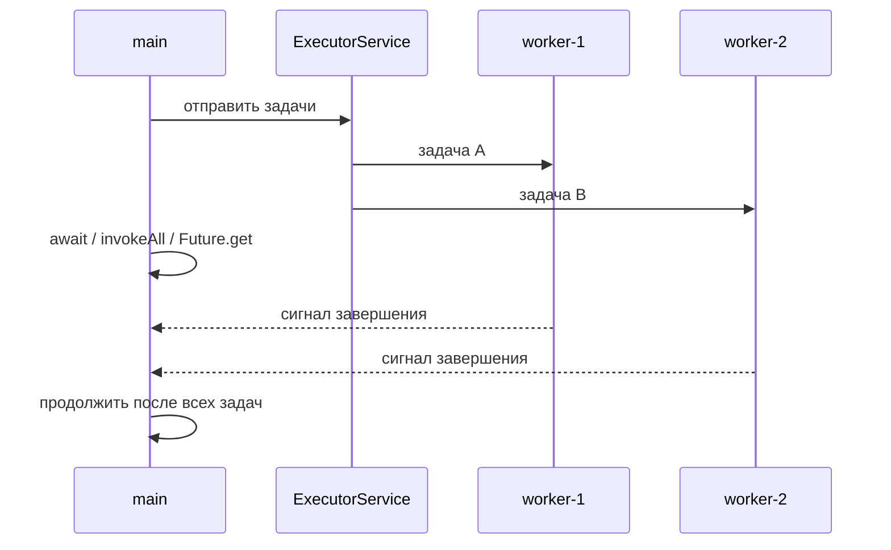

# ExecutorService: запустить много задач и дождаться всех

Когда на собеседовании спрашивают, как запустить много задач на ограниченном
pool и дождаться всех, главный ответ такой: использовать `ExecutorService` с
фиксированным размером, отправить работу и выбрать понятный механизм ожидания.
Fixed pool похож на почтовое отделение с тремя окнами: сто клиентов могут прийти,
но одновременно обслуживаются только трое, а остальные ждут в очереди.

Это опирается на темы [Java Thread Pool](topic:java-thread-pool) и
[Thread vs ThreadPool](topic:thread-vs-threadpool): pool ограничивает
параллелизм и переиспользует workers. Это не дает создавать отдельный `Thread`
на каждую задачу, что может тратить память и усиливать
[context switching](topic:context-switch). В быту это похоже на кухню, где
держат фиксированное число поваров, а не нанимают нового повара под каждый заказ.



## Три частых способа ждать

`CountDownLatch` удобен, когда задачи сами могут сообщить о завершении. Создайте
`new CountDownLatch(taskCount)`, отправьте задачи, вызывайте `countDown()` в
`finally` каждой задачи, а в `main` вызывайте `await()`. Latch похож на доску
доставок с одной галочкой на каждого курьера: менеджер уходит только когда все
галочки поставлены.

```java
ExecutorService pool = Executors.newFixedThreadPool(4);
CountDownLatch done = new CountDownLatch(items.size());

for (Item item : items) {
    pool.submit(() -> {
        try {
            process(item);
        } finally {
            done.countDown();
        }
    });
}

done.await();
pool.shutdown();
```

`invokeAll` часто самый чистый ответ, когда уже есть коллекция `Callable<T>` и
нужно дождаться всех результатов. Он отправляет callables и возвращает
`List<Future<T>>` только после того, как каждая задача завершилась, упала или
была отменена. Это как отдать стопку бланков сотруднику почты и ждать у окна,
пока у всей стопки не появится результат.

`Future.get()` ждет одну отправленную задачу и возвращает ее результат. Если вы
отправляете много задач вручную, сохраните возвращенные `Future` и вызовите
`get()` для каждой. Это похоже на сбор номерных квитанций: каждую квитанцию
можно проверить, но если проверить слишком рано, придется ждать у конкретного
окна.



## Ответ за 60 секунд

Я бы создал bounded или fixed `ExecutorService`, отправил задачи и выбрал API
ожидания по форме работы. Если каждой задаче нужно только сообщить «готово», я
использую `CountDownLatch` со счетчиком по числу задач и вызываю `countDown()` в
`finally`, а `main` вызывает `await()`. Если у меня есть задачи `Callable<T>` и
нужны результаты, я предпочту `invokeAll`, потому что он отправляет пачку и
возвращается только когда все `Future` стали done. Если задачи отправлялись по
одной, я сохраняю возвращенные `Future` и вызываю `get()` для каждой, при
необходимости с timeout. После ожидания я вызываю `shutdown()`, чтобы executor
перестал принимать работу и его worker threads могли завершиться.

## Практическая польза

Ограниченный pool защищает CPU, database connections, внешние сервисы и память. В
аналогии с рестораном кухня не позволяет каждому заказу создавать нового повара:
она ограничивает число поваров, а лишние заказы ждут, чтобы кухня оставалась
стабильной.

Используйте `try/finally` вокруг `countDown()`. Если задача упадет и не уменьшит
счетчик latch, `await()` может ждать вечно. Это как курьер, который забыл
отметить доставку выполненной: менеджер продолжает ждать, хотя маршрут уже
закончился.

В production лучше задавать timeouts: `await(timeout, unit)`,
`invokeAll(tasks, timeout, unit)` или `future.get(timeout, unit)`. Timeout похож
на время закрытия стойки обслуживания: в какой-то момент вызывающий код должен
перестать ждать и решить, как восстанавливаться.

Если есть общее изменяемое состояние, ожидание задач не делает их код
thread-safe. Все равно нужна правильная координация, как в темах
[Avoiding Race Conditions](topic:race-condition-avoidance),
[Critical Section](topic:critical-section) или [Compare-And-Set](topic:compare-and-set).
Ожидание похоже на вечерний чек-лист; оно не заставляет кассы безопасно обновлять
один и тот же баланс.

## Частые заблуждения

`shutdown()` сам по себе не ждет задачи. Он останавливает новые отправки; если
`main` должен ждать, используйте `awaitTermination`, latch, `invokeAll` или
`Future.get`. Это как закрыть дверь почты для новых клиентов, а не мгновенно
узнать, что все клиенты внутри уже обслужены.

`CountDownLatch` одноразовый. Когда счетчик дошел до нуля, его нельзя сбросить.
Это как отрывной чек-лист: когда все пункты оторваны, для следующей пачки нужен
новый лист.

Вызов `Future.get()` в порядке отправки может уменьшить полезный параллелизм,
если вы отправили одну задачу, сразу ждете ее, а потом отправляете следующую.
Сначала отправьте всю пачку, потом ждите. Это как отправлять одного курьера и
ждать его возвращения перед отправкой следующего: вся команда не используется.

`invokeAll` ждет все задачи, но ошибки все равно лежат внутри возвращенных
`Future`. Вы обнаружите их при вызове `get()`, обычно как `ExecutionException`.
Это как получить назад все конверты, а потом открыть один и найти внутри записку
об ошибке.

Fixed pool ограничивает параллелизм, но не общий объем работы. Десять тысяч задач
в очереди все еще могут съесть память. Backpressure и rejection policy подробно
разобраны в [Java Thread Pool](topic:java-thread-pool). Очередь похожа на зал
ожидания: слишком большой зал может скрывать перегрузку, пока здание не заполнится.
