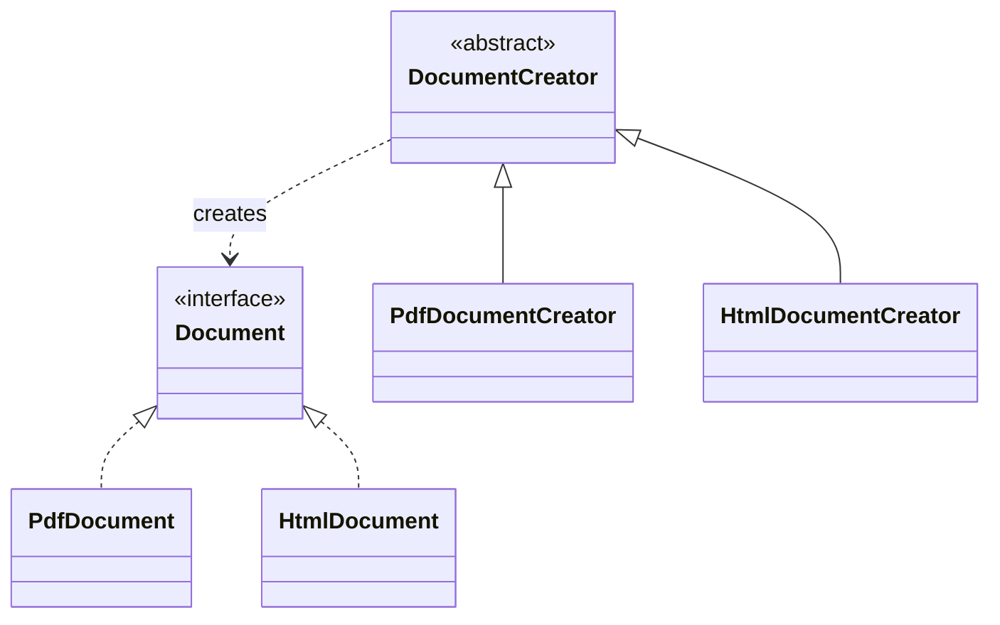
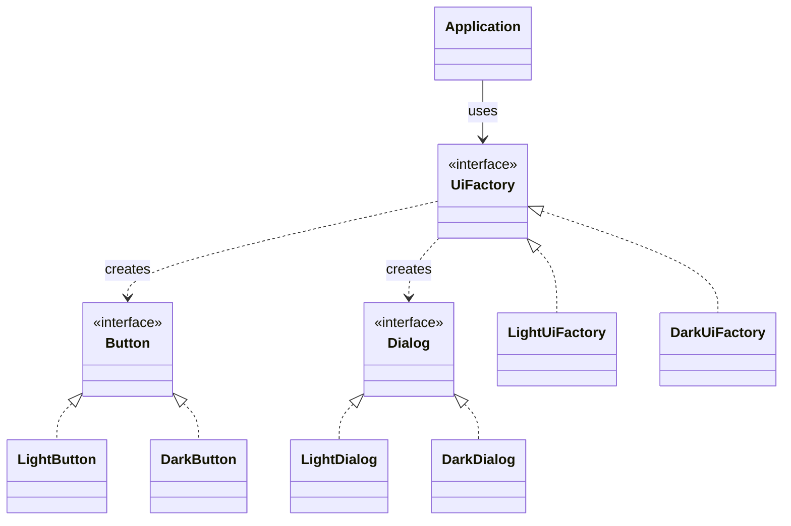

# Factory Method vs Abstract Factory

Both patterns hide `new` behind an abstraction, but they put the choice in
different places. Factory Method says: a base creator owns an operation, and a
subclass overrides one method to choose the concrete product. Think of a bakery
recipe card that says "prepare a pastry", while each branch chooses whether that
pastry is a croissant or a bun.

Abstract Factory says: the client receives one factory object that can build a
whole compatible family of products. Think of ordering a kitchen set from one
supplier: the cabinet doors, handles, and countertop are picked from the same
style line, so they fit together.

For a broader map of pattern families, start with [Design Patterns Overview](topic:design-patterns-overview).
The dependency idea is also close to [SOLID Principles](topic:solid-principles)
and the difference between an [interface and an abstract class](topic:interface-vs-abstract-class).

## Factory Method shape

Factory Method is usually one product hierarchy plus one creator hierarchy. The
base creator defines the workflow; concrete creators override the factory method.
In everyday terms, the post office counter follows the same shipping procedure,
but each service desk chooses the concrete label type it prints.

Key interview point: the subclass is the variation point. If you need another
`Document`, you often add another `DocumentCreator` subclass. Like adding a new
service window at the post office, the process stays the same, but that window
knows which label it produces.

## Abstract Factory shape

Abstract Factory is about multiple product hierarchies that must be chosen as a
set. The client depends on `UiFactory`, and a concrete factory returns matching
`Button` and `Dialog` implementations. Like choosing one kitchen supplier for a
whole set, the client does not mix random doors from one catalog with handles
from another.

Key interview point: the factory object is the variation point. If the app
switches from light theme to dark theme, it swaps the `UiFactory`; the rest of
the client code keeps asking for abstract `Button` and `Dialog`. Like changing
the whole kitchen supplier, every part changes together.

## 60-second interview answer

Factory Method is a creational pattern where a superclass defines a creation
method and subclasses override it to choose one concrete product. It is useful
when the creation decision belongs to subclasses or when the base workflow should
stay stable while the product varies.

Abstract Factory is a creational pattern where the client depends on a factory
interface that creates several related products. It is useful when products must
come from the same family, such as light and dark UI widgets, and the client must
not know concrete classes.

So the short difference is: Factory Method delegates creation of one product to
subclasses; Abstract Factory delegates creation of a family of related products
to a factory object.

## Production relevance

Use Factory Method when a framework or base class owns the algorithm but lets
subclasses supply a product. A parser framework might call `createTokenizer()`;
each parser subclass returns the tokenizer it needs. This is like a standard
traffic checkpoint where each lane chooses its own inspection tool.

Use Abstract Factory when consistency across related objects matters. UI themes,
cloud-provider clients, payment-provider adapters, and test doubles often fit:
the app receives one factory and asks it for related collaborators. This is like
a post office shift using one approved kit of stamps, labels, and scanners.

Both patterns support dependency inversion: code depends on interfaces instead of
concrete classes. That idea also appears in [OOP Principles](topic:oop-principles)
and [OOP Principles in Practice](topic:oop-principles-applied). The analogy is a
kitchen order form: the cook asks for "a pan", not for one exact brand and model.

## Common traps

- Trap: calling every static helper `Factory`. A real Factory Method has an
  overridable creation method; a real Abstract Factory creates a family through
  an interface. A kitchen label saying "factory" does not make a shelf into a
  working kitchen.
- Trap: saying Abstract Factory is just "many Factory Methods". It can contain
  several factory methods, but its purpose is family consistency. The supplier
  matters because all parts must match.
- Trap: using Abstract Factory for one object. If there is only one product
  hierarchy and no family consistency problem, Factory Method or a simple
  constructor may be enough. Do not order a whole kitchen supplier just to buy
  one spoon.
- Trap: making clients depend on concrete factories everywhere. Usually the
  concrete factory is chosen near composition time, and business code depends on
  the abstract factory. The post office manager chooses the kit; each counter
  worker just uses the tools.
