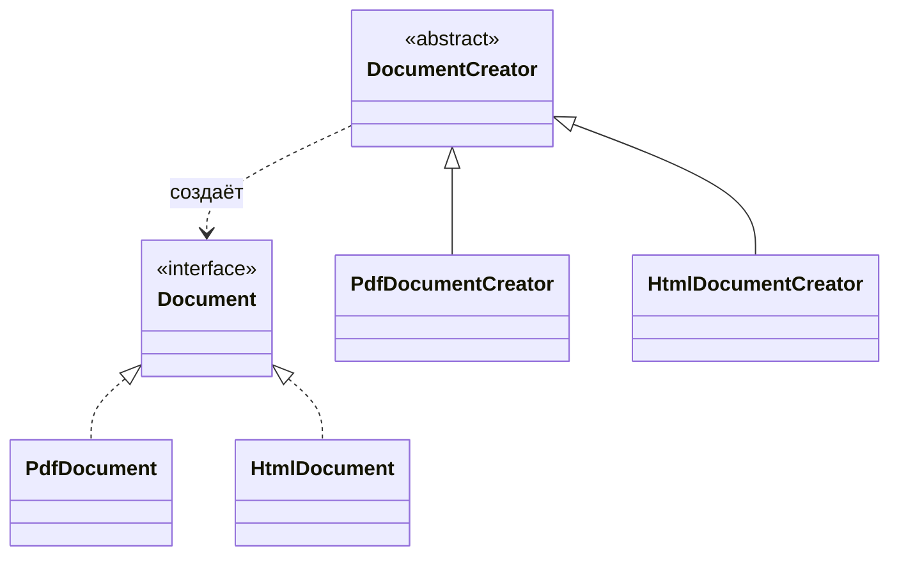
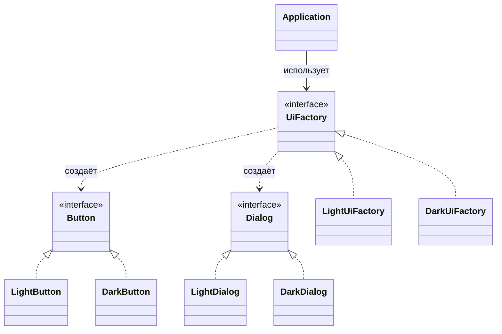

# Factory Method и Abstract Factory

Оба паттерна прячут `new` за абстракцией, но размещают выбор в разных местах.
Factory Method говорит: базовый creator владеет операцией, а подкласс
переопределяет один метод, чтобы выбрать конкретный продукт. Представь карточку
рецепта в пекарне: в ней написано «приготовить выпечку», а каждый филиал решает,
будет ли это круассан или булочка.

Abstract Factory говорит: client получает один объект-factory, который умеет
создавать целое совместимое семейство продуктов. Представь заказ кухонного
гарнитура у одного поставщика: дверцы, ручки и столешница берутся из одной
линейки, поэтому подходят друг к другу.

Для общей карты семейств паттернов начни с [обзора паттернов проектирования](topic:design-patterns-overview).
Идея зависимостей также близка к [SOLID Principles](topic:solid-principles) и
разнице между [interface и abstract class](topic:interface-vs-abstract-class).

## Форма Factory Method

Factory Method обычно состоит из одной иерархии продуктов и одной иерархии
creators. Базовый creator задаёт workflow, а конкретные creators переопределяют
factory method. В бытовом образе: стойка почты следует одной процедуре отправки,
но каждое окно выбирает, какой конкретный тип этикетки напечатать.

Ключевой пункт для собеседования: точка вариативности находится в подклассе.
Если нужен ещё один `Document`, часто добавляют ещё один подкласс
`DocumentCreator`. Это похоже на новое окно в почтовом отделении: процесс тот же,
но окно знает, какую этикетку оно выпускает.

## Форма Abstract Factory

Abstract Factory нужна для нескольких иерархий продуктов, которые должны
выбираться комплектом. Client зависит от `UiFactory`, а конкретная factory
возвращает подходящие друг другу реализации `Button` и `Dialog`. Как при выборе
одного поставщика кухни: client не смешивает случайные дверцы из одного каталога
с ручками из другого.

Ключевой пункт для собеседования: точка вариативности находится в объекте
factory. Если приложение переключается со светлой темы на тёмную, оно меняет
`UiFactory`; остальной client code продолжает просить абстрактные `Button` и
`Dialog`. Это похоже на смену всего поставщика кухни: все детали меняются вместе.

## Ответ на 60 секунд

Factory Method — это creational pattern, где superclass определяет creation
method, а subclasses переопределяют его, чтобы выбрать один concrete product.
Он полезен, когда решение о создании принадлежит subclasses или когда базовый
workflow должен оставаться стабильным, а product может меняться.

Abstract Factory — это creational pattern, где client зависит от factory
interface, который создаёт несколько related products. Он полезен, когда
products должны принадлежать одному семейству, например light и dark UI widgets,
а client не должен знать concrete classes.

Короткая разница такая: Factory Method делегирует создание одного product
subclasses; Abstract Factory делегирует создание семейства related products
объекту factory.

## Практическая польза

Используй Factory Method, когда framework или base class владеет алгоритмом, но
позволяет подклассам подставлять продукт. Например, parser framework может
вызывать `createTokenizer()`, а каждый подкласс parser возвращает нужный
tokenizer. Это похоже на стандартный дорожный контроль, где каждая полоса
выбирает свой инструмент проверки.

Используй Abstract Factory, когда важна согласованность связанных объектов.
Темы UI, клиенты cloud-provider, adapters платёжных провайдеров и test doubles
часто подходят: приложение получает одну factory и просит у неё связанных
collaborators. Это похоже на смену в почтовом отделении, которая использует один
утверждённый комплект марок, этикеток и сканеров.

Оба паттерна поддерживают dependency inversion: код зависит от interfaces, а не
от concrete classes. Та же идея есть в [OOP Principles](topic:oop-principles) и
[OOP Principles in Practice](topic:oop-principles-applied). Аналогия: кухонный
бланк заказа просит «сковороду», а не один конкретный бренд и модель.

## Частые ловушки

- Ловушка: называть любой static helper словом `Factory`. У настоящего
  Factory Method есть переопределяемый creation method; настоящая Abstract
  Factory создаёт семейство через interface. Табличка «factory» на кухонной
  полке не превращает полку в рабочую кухню.
- Ловушка: говорить, что Abstract Factory это просто «много Factory Methods».
  Внутри действительно может быть несколько factory methods, но цель паттерна в
  согласованности семейства. Поставщик важен, потому что все детали должны
  подходить друг к другу.
- Ловушка: применять Abstract Factory для одного объекта. Если есть только одна
  иерархия продуктов и нет проблемы согласованного семейства, Factory Method или
  простой constructor может быть достаточно. Не стоит заказывать целого
  поставщика кухни ради одной ложки.
- Ловушка: заставлять clients зависеть от concrete factories повсюду. Обычно
  concrete factory выбирается рядом с composition time, а business code зависит
  от abstract factory. Менеджер почты выбирает комплект; каждое окно просто
  пользуется инструментами.
