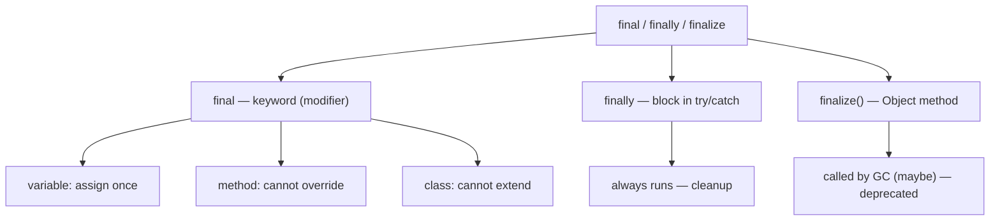
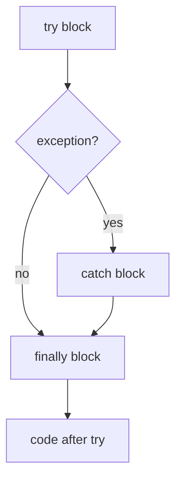

# final vs finally vs finalize

These three turn up together in interviews for one reason only: they *sound*
alike. Beyond the first four letters they have **nothing** to do with each other —
one is a keyword, one is a block, one is a method. It's like the streets *Main St*,
*Maine Ave* and *Maynard Rd*: the names rhyme, but they lead to three different
places.

## `final` — a keyword (compile-time)

`final` is a **modifier** the compiler enforces. It means "this cannot change",
and what *change* means depends on what you attach it to:

- **final variable** — you may assign it exactly once; reassignment is a compile
  error. Real life: a value written in **permanent ink** on a form — once it's
  filled in, you can't write over it.
- **final field** — set once in the declaration or constructor, then fixed for the
  object's life. This is the backbone of [immutable types](topic:string-immutability)
  like `String`. Real life: the **birth date printed on a passport** — issued once,
  never edited.
- **final method** — a subclass **cannot override** it, so its behaviour is locked.
  This is the opposite end of [overriding](topic:override-vs-overload). Real life: a
  recipe card stamped *"do not modify"* — you can use it, not rewrite it.
- **final class** — **cannot be extended** at all (e.g. `String`, `Integer`). Real
  life: a **sealed building** — you can't add new floors on top.

A key trap: making a *reference* `final` freezes the **reference**, not the object
it points to. `final List<String> xs = new ArrayList<>();` — you can't reassign
`xs`, but `xs.add("hi")` is perfectly legal. Real life: your house address is
fixed, but the furniture inside can still be rearranged.

## `finally` — a block (runtime)

`finally` is the third part of `try` / `catch` / `finally`. Its code **always
runs** after the `try` block finishes — whether it completed normally, threw an
exception, or even hit a `return`. It exists for **cleanup**: closing files,
releasing locks, returning connections. Real life: **locking up the shop at the end
of the day** — you do it no matter how the day went, busy or quiet, trouble or not.

It connects directly to [exception handling](topic:exception-basics). Two things
worth knowing:

- `finally` runs **even if `try` or `catch` does `return`** — the return value is
  computed, `finally` runs, then control actually leaves. If `finally` itself
  returns, it *overrides* the earlier return (a classic bug — don't return from
  `finally`).
- The rare cases where it does **not** run: the JVM is killed (`System.exit(0)`),
  the thread is forcibly stopped, or the machine loses power. Real life: the shop
  burns down before closing time — nobody locks up.

Modern code prefers **try-with-resources** over a manual `finally` for closing
`AutoCloseable` resources — the compiler generates the cleanup for you.

## `finalize()` — a method (garbage collection)

`finalize()` is a method on `java.lang.Object` that the **garbage collector** may
call *once*, just before it reclaims an object's memory. The idea was a last-chance
hook to release native resources. In practice it is **broken and deprecated** (since
Java 9, and slated for removal):

- No guarantee it ever runs, or *when* — it depends on if and when GC decides to
  collect the object. Real life: a **sticky note for the cleaning crew** that may
  never show up — you can't rely on the desk being cleared.
- It can **resurrect** the object, slows down garbage collection, and hides errors.

The correct replacements are **try-with-resources / `AutoCloseable`** for
deterministic cleanup, or `java.lang.ref.Cleaner` for a safety-net tied to
[GC](topic:heap-generations). Rule of thumb: **never write `finalize()`.**

## 60-second interview answer

> They're unrelated despite the similar names. **`final`** is a keyword: a final
> variable can be assigned only once, a final method can't be overridden, and a
> final class can't be extended — all checked at compile time. **`finally`** is a
> block after `try`/`catch` that always executes, used for cleanup like closing
> resources; it runs even when `try` returns, and is skipped only if the JVM exits.
> **`finalize()`** is a deprecated `Object` method the garbage collector *might*
> call before reclaiming an object — it's unreliable and you should never use it;
> prefer try-with-resources or `Cleaner` instead.

## Common misconceptions

- ❌ "They're related." — No. The shared prefix is a coincidence; they're a keyword,
  a block and a method respectively.
- ❌ "`final` makes the object immutable." — It freezes the *variable/reference*, not
  the object's contents. A `final` list can still be mutated.
- ❌ "`finally` always runs, no matter what." — Almost: `System.exit()`, a JVM crash,
  or `Thread.stop()` skip it.
- ❌ "`finalize()` is a reliable destructor." — It isn't called deterministically (or
  at all); use `AutoCloseable`/try-with-resources or `Cleaner`.
- ❌ "Returning from `finally` is fine." — It silently swallows exceptions and
  overrides the `try`/`catch` return value; avoid it.
