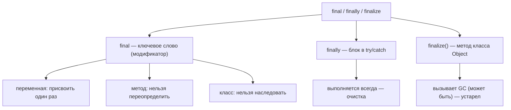
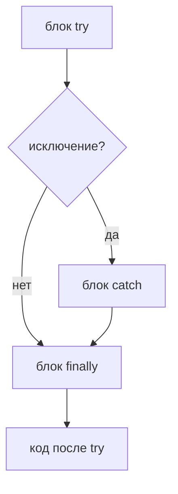

# final, finally и finalize

Эти три слова встречаются на собеседованиях вместе только по одной причине: они
**похоже звучат**. Кроме первых четырёх букв, между ними **нет ничего** общего —
одно это ключевое слово, другое — блок, третье — метод. Это как улицы *Main St*,
*Maine Ave* и *Maynard Rd*: названия созвучны, но ведут в три разных места.

## `final` — ключевое слово (на этапе компиляции)

`final` — это **модификатор**, который проверяет компилятор. Он означает «это
нельзя изменить», а что именно значит *изменить*, зависит от того, к чему он
применён:

- **final-переменная** — присвоить значение можно ровно один раз; повторное
  присваивание — ошибка компиляции. Из жизни: значение, вписанное в бланк
  **несмываемыми чернилами** — заполнил, и поверх уже не напишешь.
- **final-поле** — задаётся один раз в объявлении или конструкторе и фиксируется на
  всю жизнь объекта. Это основа [неизменяемых типов](topic:string-immutability)
  вроде `String`. Из жизни: **дата рождения в паспорте** — печатается один раз и не
  правится.
- **final-метод** — подкласс **не может его переопределить**, поэтому поведение
  зафиксировано. Это обратная сторона [переопределения](topic:override-vs-overload).
  Из жизни: рецептурная карточка с печатью *«не изменять»* — пользоваться можно,
  переписывать нельзя.
- **final-класс** — его вообще **нельзя наследовать** (например, `String`,
  `Integer`). Из жизни: **запечатанное здание** — новые этажи сверху не достроишь.

Важная ловушка: если сделать `final` *ссылку*, замораживается именно **ссылка**, а
не объект, на который она указывает. `final List<String> xs = new ArrayList<>();` —
переприсвоить `xs` нельзя, но `xs.add("hi")` совершенно законно. Из жизни: адрес
дома фиксирован, но мебель внутри можно переставлять.

## `finally` — блок (во время выполнения)

`finally` — это третья часть конструкции `try` / `catch` / `finally`. Его код
**выполняется всегда** после блока `try` — завершился ли тот нормально, бросил
исключение или даже наткнулся на `return`. Он нужен для **очистки**: закрыть файлы,
освободить блокировки, вернуть соединения. Из жизни: **закрытие магазина в конце
дня** — вы делаете это в любом случае, был день бойким или тихим, со скандалом или
без.

Он напрямую связан с [обработкой исключений](topic:exception-basics). Стоит знать
две вещи:

- `finally` выполняется **даже если в `try` или `catch` есть `return`** — значение
  для возврата вычисляется, затем отрабатывает `finally`, и только потом управление
  действительно уходит. Если же `finally` сам делает `return`, он *перекрывает*
  предыдущий возврат (классический баг — не делайте `return` в `finally`).
- Редкие случаи, когда он **не** выполняется: JVM убита (`System.exit(0)`), поток
  принудительно остановлен или пропало питание. Из жизни: магазин сгорел до
  закрытия — закрывать уже некому.

Современный код для закрытия ресурсов `AutoCloseable` предпочитает
**try-with-resources** вместо ручного `finally` — компилятор сам сгенерирует
очистку.

## `finalize()` — метод (сборка мусора)

`finalize()` — это метод класса `java.lang.Object`, который **сборщик мусора** может
вызвать *один раз*, прямо перед тем как освободить память объекта. Задумывался как
последний шанс освободить нативные ресурсы. На практике он **сломан и объявлен
устаревшим** (с Java 9, и его планируют удалить):

- Нет никакой гарантии, что он вообще выполнится и *когда* — это зависит от того,
  решит ли GC собрать объект и когда. Из жизни: **записка для уборщиков**, которые
  могут так и не прийти — нельзя рассчитывать, что стол приберут.
- Он может **воскресить** объект, замедляет сборку мусора и скрывает ошибки.

Правильная замена — **try-with-resources / `AutoCloseable`** для детерминированной
очистки или `java.lang.ref.Cleaner` как страховка, привязанная к
[сборке мусора](topic:heap-generations). Правило: **никогда не пишите
`finalize()`.**

## Ответ за 60 секунд

> Они не связаны, несмотря на похожие имена. **`final`** — ключевое слово:
> final-переменной можно присвоить значение лишь раз, final-метод нельзя
> переопределить, а final-класс нельзя наследовать — всё проверяется на этапе
> компиляции. **`finally`** — блок после `try`/`catch`, который выполняется всегда;
> используется для очистки, например закрытия ресурсов; он отрабатывает даже когда в
> `try` есть `return`, и пропускается только при выходе из JVM. **`finalize()`** —
> устаревший метод класса `Object`, который сборщик мусора *может* вызвать перед
> удалением объекта; он ненадёжен, и его не следует использовать — лучше
> try-with-resources или `Cleaner`.

## Частые заблуждения

- ❌ «Они связаны». — Нет. Общий префикс — случайность; это соответственно ключевое
  слово, блок и метод.
- ❌ «`final` делает объект неизменяемым». — Он замораживает *переменную/ссылку*, а не
  содержимое объекта. Final-список всё ещё можно изменять.
- ❌ «`finally` выполняется всегда, что бы ни случилось». — Почти: `System.exit()`,
  крах JVM или `Thread.stop()` его пропустят.
- ❌ «`finalize()` — надёжный деструктор». — Он не вызывается детерминированно (а то и
  вовсе); используйте `AutoCloseable`/try-with-resources или `Cleaner`.
- ❌ «`return` в `finally` — это нормально». — Он молча проглатывает исключения и
  перекрывает возвращаемое значение из `try`/`catch`; избегайте этого.
