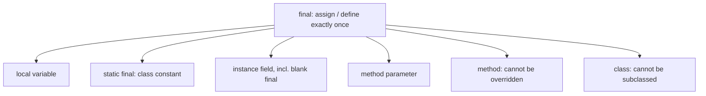
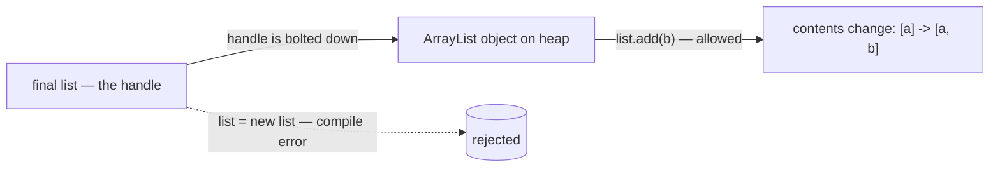

# The final Keyword and Where It Appears

## The intuition

Think of `final` as a **tube of permanent marker**. An ordinary variable is a
reusable **whiteboard label** — you can wipe it and write a new value any time. A
`final` variable is written **once in permanent marker**: the ink sets, and from
then on the label cannot be changed. The compiler is the strict supervisor who
refuses to hand you the eraser.

The precise meaning: `final` means **assign exactly once**. After the first
assignment, the **binding** — the link from a *name* to a *value* — is **locked**.
A second assignment is a **compile error**, caught before the program ever runs.

## Where final can appear

`final` is not one feature but the same rule applied in several places — like a
**"signed in permanent ink, do not alter"** stamp that fits on many different
documents:

- **Local variable** — `final int x = 10;`. Locked the moment it is assigned. Like
  writing the table number on a reserved-seating card in permanent marker.
- **`static final` constant** — `static final double PI = 3.14159;`. One shared
  value for the **whole class**, posted once. Like the opening hours engraved on a
  shop's front door: every customer reads the same plaque. By convention these are
  named `UPPER_SNAKE_CASE`.
- **Instance field**, including a **blank final** — `final int id;` declared with
  no value, then assigned **once in the constructor**. Like a luggage tag printed
  at home but filled in **once** at the check-in desk; after that the ink is set.
- **Method parameter** — `void f(final int n)`. The method may use `n` but may not
  re-bind the name inside the body — a parcel you must keep in its original
  labelled slot.
- **`final` method** — a method a subclass **cannot override**. Like a step in the
  company handbook stamped "do not modify": every department inherits it and must
  follow it as written.
- **`final` class** — a class that **cannot be subclassed** at all. Like a sealed
  appliance with no service hatch — you can use it, but you can't open it up and
  swap the internals. [`String`](topic:string-immutability) is the classic example.

This is a different "final" from the one in
[final vs finally vs finalize](topic:final-finally-finalize): there, `finally` is a
`try` block and `finalize` is an old GC hook. Same word, unrelated jobs.

## The number-one trap: final locks the binding, not the object

This is the question interviewers love. For a **reference** type, the variable
holds a **handle** to an object on the heap (see
[Where Reference Types Are Stored](topic:reference-types-storage)). `final` freezes
the **handle**, not the **object**.

Picture a **mailbox bolted to a wall**. `final` bolts the mailbox to *that* spot —
you can never move it to a different address. But the slot is still open: you can
drop new letters in and take old ones out. The **box (binding) is fixed; the
contents (object) still change.**

So with `final List<String> list = new ArrayList<>();`:

- `list.add("b")` — **allowed**. You mutated the object, not the binding.
- `list = new ArrayList<>();` — **compile error**. You tried to move the handle.

The takeaway for interviews: **`final` ≠ immutable.** A `final` reference to a
mutable object is still mutable. To get a truly **immutable** object you also need
the object's own fields to be `final` (or unmodifiable) — `final` on the variable
alone is not enough.

## final and immutability

Real immutability is a recipe, and `final` is **one ingredient, not the whole
dish** — like a tamper-evident seal that only helps if the jar underneath is also
solid. To make a class genuinely immutable you typically: make the class `final`
(no subclass can add mutable state), make every field `final` and `private`,
assign them once in the constructor, expose no setters, and defensively copy any
mutable objects you accept or return. That combination is what makes
[`String`](topic:string-immutability) safe to share freely between threads.

## Effectively final

Since Java 8 a variable can be **"effectively final"** — you *never* reassign it,
even though you didn't write the keyword. It's a label you happened to write only
once, so the supervisor treats it as if it were in permanent ink. This matters
because a **lambda or anonymous class** captures local variables **by value** (it
takes a snapshot); allowing reassignment would make the snapshot and the original
disagree. So the rule: variables used inside a lambda must be final or effectively
final.

## The 60-second interview answer

> `final` means **assign exactly once**; after that the **binding is locked** and
> any reassignment is a **compile error**. It appears in several contexts: a
> **local variable**, a **`static final` constant** (one shared, fixed value for
> the class), an **instance field** — including a **blank final** that must be
> assigned exactly once in the constructor — a **`final` parameter** (can't be
> re-bound in the method), a **`final` method** (can't be overridden), and a
> **`final` class** (can't be subclassed, like `String`). The classic trap: on a
> **reference**, `final` locks the handle, **not** the object — `final List` still
> lets you `add` to the list; you just can't repoint the variable. So `final` is
> not the same as immutable. Java 8 also added **effectively final**: a variable
> you never reassign, which is why lambdas can capture it.

## Common misconceptions and traps

- **"`final` makes the object immutable."** No — it locks the *binding*. A `final`
  reference to a mutable object (a `List`, an array, a mutable POJO) can still have
  its contents changed.
- **"A `final` field must be set where it's declared."** A **blank final** can be
  declared empty and assigned exactly once in the constructor (or an instance
  initializer). It just must be **definitely assigned** by the time construction
  ends.
- **"`final` is the same as `finally`/`finalize`."** Different things entirely —
  see [final vs finally vs finalize](topic:final-finally-finalize).
- **"`final` only goes on fields."** It also goes on local variables, parameters,
  methods, and classes.
- **"A `final` method can't be inherited."** It **is** inherited; it just can't be
  **overridden**. See [Overriding vs Overloading](topic:override-vs-overload).
- **"You must write `final` for a lambda to capture a variable."** Only
  **effectively final** is required — never reassigning it is enough.
- **"`static final` and `final` are the same."** `final` alone is per-instance and
  set once per object; `static final` is one shared constant for the whole class.
