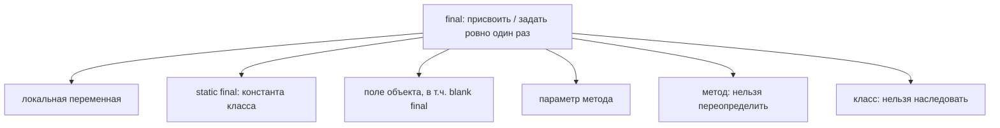
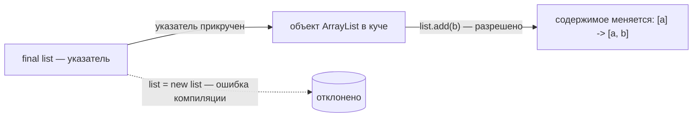

# Ключевое слово final и где оно встречается

## Интуиция

Думай о `final` как о **перманентном маркере**. Обычная переменная — это
**доска с наклейкой**, которую можно стереть и переписать в любой момент.
`final`-переменная пишется **один раз перманентным маркером**: чернила
застывают, и после этого наклейку уже не изменить. Компилятор — это строгий
надзиратель, который отказывается выдавать тебе ластик.

Точный смысл: `final` означает **присвоить ровно один раз**. После первого
присваивания **связь** — привязка *имени* к *значению* — **блокируется**. Второе
присваивание — это **ошибка компиляции**, пойманная ещё до запуска программы.

## Где может встречаться final

`final` — это не одна фича, а одно и то же правило, применённое в разных местах,
как штамп **«подписано перманентными чернилами, не изменять»**, который подходит
к множеству разных документов:

- **Локальная переменная** — `final int x = 10;`. Блокируется в момент
  присваивания. Как номер столика на карточке брони, написанный перманентным
  маркером.
- **Константа `static final`** — `static final double PI = 3.14159;`. Одно общее
  значение на **весь класс**, вывешенное один раз. Как часы работы, выгравированные
  на двери магазина: каждый покупатель читает одну и ту же табличку. По соглашению
  такие имена пишут в `UPPER_SNAKE_CASE`.
- **Поле объекта**, включая **blank final** — `final int id;` объявлено без
  значения, затем присвоено **один раз в конструкторе**. Как багажная бирка,
  напечатанная дома, но заполняемая **один раз** на стойке регистрации; после
  этого чернила застывают.
- **Параметр метода** — `void f(final int n)`. Метод может использовать `n`, но не
  может переназначить имя внутри тела — посылка, которую нужно держать в её
  исходном помеченном слоте.
- **`final`-метод** — метод, который подкласс **не может переопределить**. Как
  пункт корпоративного регламента со штампом «не изменять»: каждый отдел наследует
  его и обязан исполнять как написано.
- **`final`-класс** — класс, который **вообще нельзя наследовать**. Как
  запечатанный прибор без сервисного люка — пользоваться можно, а вскрыть и
  заменить внутренности нельзя. [`String`](topic:string-immutability) — классический
  пример.

Это не тот `final`, что в
[final vs finally vs finalize](topic:final-finally-finalize): там `finally` — это
блок `try`, а `finalize` — старый хук сборщика мусора. Слово то же, задачи разные.

## Ловушка номер один: final блокирует связь, а не объект

Это любимый вопрос интервьюеров. Для **ссылочного** типа переменная хранит
**указатель** на объект в куче (см.
[Где хранятся ссылочные типы](topic:reference-types-storage)). `final` замораживает
**указатель**, а не **объект**.

Представь **почтовый ящик, прикрученный к стене**. `final` прикручивает ящик к
*этому* месту — его уже не перенести по другому адресу. Но прорезь по-прежнему
открыта: можно бросать новые письма и забирать старые. **Ящик (связь)
зафиксирован; содержимое (объект) всё ещё меняется.**

Итак, с `final List<String> list = new ArrayList<>();`:

- `list.add("b")` — **разрешено**. Ты изменил объект, а не связь.
- `list = new ArrayList<>();` — **ошибка компиляции**. Ты попытался сдвинуть
  указатель.

Вывод для собеседования: **`final` ≠ immutable.** `final`-ссылка на изменяемый
объект всё равно изменяема. Чтобы получить по-настоящему **неизменяемый** объект,
нужно ещё, чтобы собственные поля объекта были `final` (или неизменяемыми) —
одного `final` на переменной недостаточно.

## final и неизменяемость

Настоящая неизменяемость — это рецепт, а `final` — **один ингредиент, а не всё
блюдо**, как пломба, которая помогает лишь если сама банка под ней прочная. Чтобы
сделать класс по-настоящему immutable, обычно: делают класс `final` (ни один
подкласс не добавит изменяемого состояния), делают каждое поле `final` и
`private`, присваивают их один раз в конструкторе, не дают сеттеров и защитно
копируют любые изменяемые объекты, которые принимают или возвращают. Именно это
сочетание позволяет [`String`](topic:string-immutability) свободно делиться между
потоками.

## Effectively final

Начиная с Java 8 переменная может быть **«effectively final»** — ты её *никогда*
не переприсваиваешь, хотя ключевое слово не написал. Это наклейка, которую ты по
случаю заполнил лишь однажды, поэтому надзиратель относится к ней так, будто она
сделана перманентными чернилами. Это важно, потому что **лямбда или анонимный
класс** захватывают локальные переменные **по значению** (делают снимок);
разрешённое переприсваивание привело бы к расхождению снимка и оригинала. Отсюда
правило: переменные, используемые внутри лямбды, должны быть final или effectively
final.

## Ответ за 60 секунд

> `final` означает **присвоить ровно один раз**; после этого **связь
> блокируется**, и любое переприсваивание — **ошибка компиляции**. Оно встречается
> в нескольких контекстах: **локальная переменная**, **константа `static final`**
> (одно общее фиксированное значение для класса), **поле объекта** — включая
> **blank final**, которое нужно присвоить ровно один раз в конструкторе, —
> **`final`-параметр** (нельзя переназначить в методе), **`final`-метод** (нельзя
> переопределить) и **`final`-класс** (нельзя наследовать, как `String`).
> Классическая ловушка: для **ссылки** `final` блокирует указатель, **а не**
> объект — в `final List` всё равно можно `add`-ить; просто нельзя переназначить
> переменную. Поэтому `final` — это не то же самое, что immutable. В Java 8 также
> появился **effectively final**: переменная, которую ты никогда не
> переприсваиваешь, — именно поэтому её могут захватывать лямбды.

## Частые заблуждения и ловушки

- **«`final` делает объект неизменяемым».** Нет — он блокирует *связь*.
  `final`-ссылка на изменяемый объект (`List`, массив, изменяемый POJO) всё равно
  позволяет менять содержимое.
- **«`final`-поле должно быть присвоено там, где объявлено».** **Blank final**
  можно объявить пустым и присвоить ровно один раз в конструкторе (или в
  инициализаторе экземпляра). Оно лишь должно быть **гарантированно присвоено** к
  концу конструирования.
- **«`final` — это то же, что `finally`/`finalize`».** Совершенно разные вещи —
  см. [final vs finally vs finalize](topic:final-finally-finalize).
- **«`final` ставится только на поля».** Оно ставится также на локальные
  переменные, параметры, методы и классы.
- **«`final`-метод нельзя унаследовать».** Он **наследуется**; его просто нельзя
  **переопределить**. См. [Переопределение и перегрузка](topic:override-vs-overload).
- **«Чтобы лямбда захватила переменную, нужно писать `final`».** Достаточно
  **effectively final** — просто не переприсваивай её.
- **«`static final` и `final` — одно и то же».** Один `final` — это «на каждый
  экземпляр», задаётся один раз на объект; `static final` — одна общая константа на
  весь класс.
