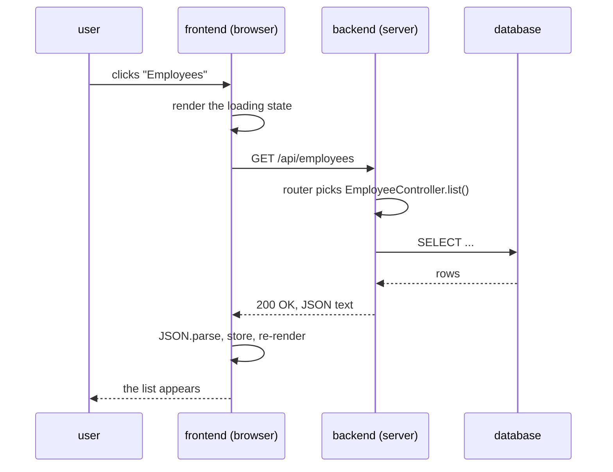
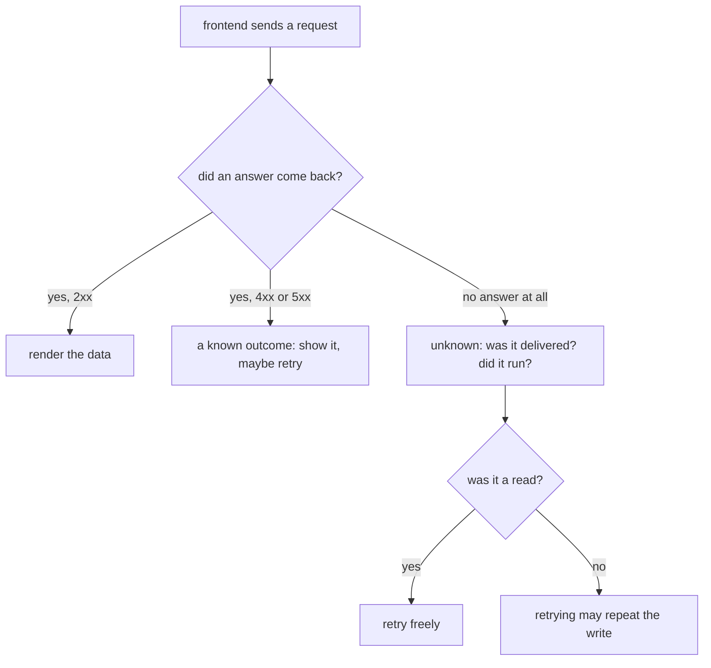

# How the Frontend and the Backend Talk

They are two separate programs. Different processes, usually different machines,
often different languages, and — this is the part everything else follows from —
**no shared memory**. The browser has the screen and no data; the server has the
data and no screen. Nothing connects them except messages sent over a network.

So the frontend can never *call* the backend. It can only **write a message,
send it, and wait**:

- a **request**: a method, a path, headers, and (sometimes) a body;
- a **response**: a status code, headers, and (usually) a body.

Both are text. Everything else in this topic — JSON, tokens, status codes,
loading spinners, retries — exists to make that one exchange workable.

## One round trip, in order



Read it as five facts:

1. **The frontend starts.** Nothing happens on the server until a request arrives.
2. **The request is text.** `GET /api/employees HTTP/1.1`, then headers such as
   `Accept: application/json` and `Authorization: Bearer …`, then a body for a
   write. A path is compared byte for byte — see
   [naming REST endpoints](topic:rest-endpoint-naming).
3. **The server routes it.** A framework maps method + path onto one handler
   method and turns the text into Java objects (`@RestController`,
   `@RequestMapping`, `@RequestBody` — see
   [Spring Boot starter web](topic:spring-boot-starter-web)).
4. **The answer is text too**, led by a status code.
5. **The frontend parses it** and re-renders. Only now does the user see anything.

## JSON is the shared type system

No object ever leaves the JVM. Jackson **serializes** the entity into characters;
the browser parses those characters into a **brand-new plain JavaScript object**
that has the same field names and no methods at all. The two are related only by
convention.

JSON has exactly six things: string, number, boolean, `null`, array, object.
Everything richer gets flattened on the way:

| On the server | On the wire | In the browser | The trap |
|---|---|---|---|
| `String name` | `"Ada Byron"` | `string` | — |
| `LocalDate hiredAt` | `"2024-03-01"` | `string` | JSON has no date type; it is a string until you parse it |
| `BigDecimal salary` | `1200.50` | `number` | JS numbers are doubles — send money as a string if exactness matters |
| `Employee manager` | `null` | `null` | `null` means "known to be empty"; a **missing** key means "the server never mentioned it" |
| `List<Skill> skills` | `[...]` | `Array` | a lazy collection has to be fetched before serialization, or it explodes — see [the N+1 problem](topic:hibernate-n-plus-one) |

This is why the same data is often shaped differently in each direction: the
list endpoint returns a small DTO, the item endpoint returns the full record, and
neither is "the entity" — the entity stays inside the server.

## Nobody remembers anything

HTTP is **stateless**: two requests from the same user have no connection to each
other, and the server keeps nothing between them. Signing in does not put a user
"into" the server. It gets you a **token** (or a cookie), and from then on the
frontend attaches it to *every single request*:

```
Authorization: Bearer eyJhbGciOi...
```

Leave it off once and that request is anonymous. Press F5 and the frontend's
whole memory is thrown away and re-fetched — while the server does not notice,
because it had nothing about you to lose. That is not a limitation to work
around; it is what lets any of ten instances answer the next call.

## The status code is the answer

The body is for humans and for detail; the **code is what programs act on**.

| Code | Means | What the frontend does |
|---|---|---|
| `200` / `201` / `204` | done | render the data, or the new id from `Location` |
| `400` | your request is wrong | show the field error from the body |
| `401` | I do not know who you are | drop the token, go to the login screen |
| `403` | I know you, and no | show "not allowed"; a retry never helps |
| `404` | no such thing | render an empty state, not a crash dialog |
| `409` | conflict with the current state | reload and let the user decide |
| `5xx` | I broke | offer a retry, back off |

A well-designed error body is **machine-readable** —
`{"errors":[{"field":"name","code":"required"}]}` — so the frontend can put the
message next to the right input, in its own language. An English sentence in a
`message` field is a fallback, not an interface.

Note that a `4xx` is a *successful conversation about a refusal*. The request
arrived, was understood, and was answered.

## The failure a local call cannot have



The right-hand branch is the one that separates network programming from method
calls. **No status code is not the same as a 500.** A 500 means the server got
your request and failed; silence means you do not know whether it got it at all.
The request may have been delivered, executed and committed, and only the answer
lost on the way back.

That is why a timed-out `POST` plus an impatient user equals two orders. The cure
is to make the retry recognisable — a client-generated `Idempotency-Key`, a
natural unique key, or a server-issued id reserved up front — so the second
attempt returns the first result instead of doing the work again. Worked through
in [avoiding duplicate sales](topic:duplicate-sale-prevention) and
[registering sales over an unreliable connection](topic:sales-api-unreliable-connection);
the timeout and fallback side of it is in
[service timeouts, fallbacks and circuit breakers](topic:service-timeouts-fallbacks).

Because the answer takes time, **every screen that talks to a backend has at
least three states**: loading, loaded, failed. Skipping the first gives a blank
flash; skipping the third gives a spinner that never stops.

## Only the client may start a conversation

A browser tab is not a server. It has no address to be called back on, and the
connection closes when a response finishes. So when the backend has news, its
options are:

| Approach | How it works | Cost |
|---|---|---|
| **Polling** | the client asks every N seconds | a full round trip per "nothing yet"; news is up to N seconds late |
| **Long polling** | the server holds the request open until something happens | fewer empty answers, a held connection per client |
| **SSE** | one long-lived HTTP stream, server to client only | simple, text, one direction |
| **WebSocket** | one connection upgraded once, then both directions | real-time, but the connection is now *state*: it belongs to one instance, needs reconnecting, and the load balancer must know |

Between two backends the same question is answered with queues instead — see
[synchronous vs asynchronous communication](topic:sync-vs-async-communication).

## The response shape is a contract

After a successful call **both sides hold data**: the server has the row, the
frontend has a copy it parsed. They agreed for one instant and then drifted
apart. Everything you do next — re-fetching after a write, optimistic updates,
cache invalidation — is about managing that gap.

And because the frontend is deployed separately, the JSON shape is a **published
contract**, not an implementation detail:

- **adding** a field is safe (unknown fields are ignored);
- **renaming or removing** one breaks a program you did not redeploy — and it
  breaks it *silently*, because reading a missing property in JavaScript is
  `undefined`, not an error. Green logs, 200 OK, "undefined" on the screen.

Which is why versioning (`/api/v1/...`), deprecation windows and published specs
exist; see [sharing API endpoints](topic:sharing-api-endpoints) and
[Employee API: Design](topic:employee-api-design).

Two more things sit on this boundary: the browser refuses to let a page read a
response from another origin unless the server allows it —
[CORS](topic:cors) — and in a system of many services the frontend usually talks
to one [API gateway](topic:api-gateway) rather than to each service.

## The 60-second interview answer

> They are separate processes with no shared memory, so they exchange HTTP
> messages. The frontend sends a request — method, path, headers, sometimes a
> JSON body — the server routes it to a handler, does the work, and answers with
> a status code, headers and usually a JSON body; the frontend parses that into
> its own objects and re-renders. Typically REST over HTTP with JSON, because
> JSON is the type system both sides share — which also means dates become
> strings and money should not be a float. HTTP is stateless, so identity travels
> in every request as a token or cookie, not as a server-side session. The status
> code is the machine-readable outcome: 2xx render, 400 show field errors, 401
> re-authenticate, 404 empty state, 5xx retry. Because the call is remote it is
> asynchronous — every screen needs loading and error states — and it can fail
> with no answer at all, which is different from a 500, so retrying a write needs
> an idempotency key. The server cannot call the browser, so push means polling,
> SSE or a WebSocket. And the response shape is a contract with a separately
> deployed program: add fields freely, rename them only with a version.

## Why it matters in production

- **"It works on my machine" is usually a boundary problem.** Wrong base URL,
  missing CORS header, a proxy stripping `Authorization`, a gateway timeout
  shorter than the handler. None of it shows up in unit tests on either side.
- **Silent contract breaks are the expensive ones.** A rename ships green,
  monitoring stays green, and users see `undefined` until someone screenshots it.
- **Retries create money bugs.** Duplicate orders and double charges are almost
  always a lost response plus an honest retry, not a bug in the handler.
- **Chatty screens cost latency, not CPU.** Ten sequential calls at 80 ms each is
  most of a second of nothing. Batch, parallelise, or give the screen an endpoint
  shaped for it.
- **Client-side validation is a convenience, never a rule.** The browser is
  fully controlled by whoever is sitting at it; every check that matters is
  repeated on the server.
- **Payload size is a real cost on mobile.** Sending the whole entity graph
  "just in case" is the most common reason a list screen is slow.

## Common misconceptions

- **"The frontend calls a backend method."** It sends text and hopes. There is no
  stack, no exception propagation, no shared object — a `500` is not a thrown
  exception reaching the browser, it is a status code the server chose to send.
- **"The server returns an object."** It returns characters. What the browser
  ends up with is a different object in a different runtime that happens to have
  the same field names, and no methods.
- **"`null` and a missing field are the same."** `{"phone": null}` says the value
  is known to be empty; `{}` says nothing about `phone` at all. Partial-update
  APIs live and die on this distinction — see [PUT vs PATCH](topic:put-vs-patch).
- **"An error means the call failed."** A `404` or a `400` is a completed round
  trip with a clear answer. The real failure is the one with no status code.
- **"A timeout means it did not happen."** It means you do not know. The write
  may well be committed.
- **"HTTP is slow because of the server."** Most of the wall clock on a typical
  screen is round trips, connection setup and payload size — not handler time.
- **"The session is on the server."** In a stateless API there is no session;
  there is a token the client re-sends. If your server *does* keep sessions, you
  have just made every instance non-interchangeable.
- **"Only the API needs to be secure, the frontend is ours."** Anything the page
  can send, `curl` can send too — with different values. Authorization is a
  server-side decision, always.
