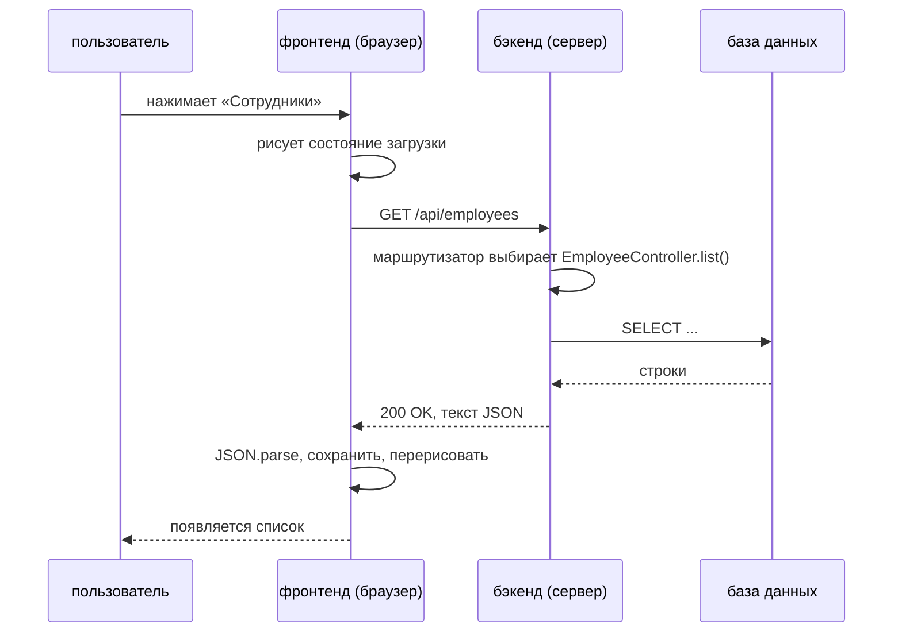
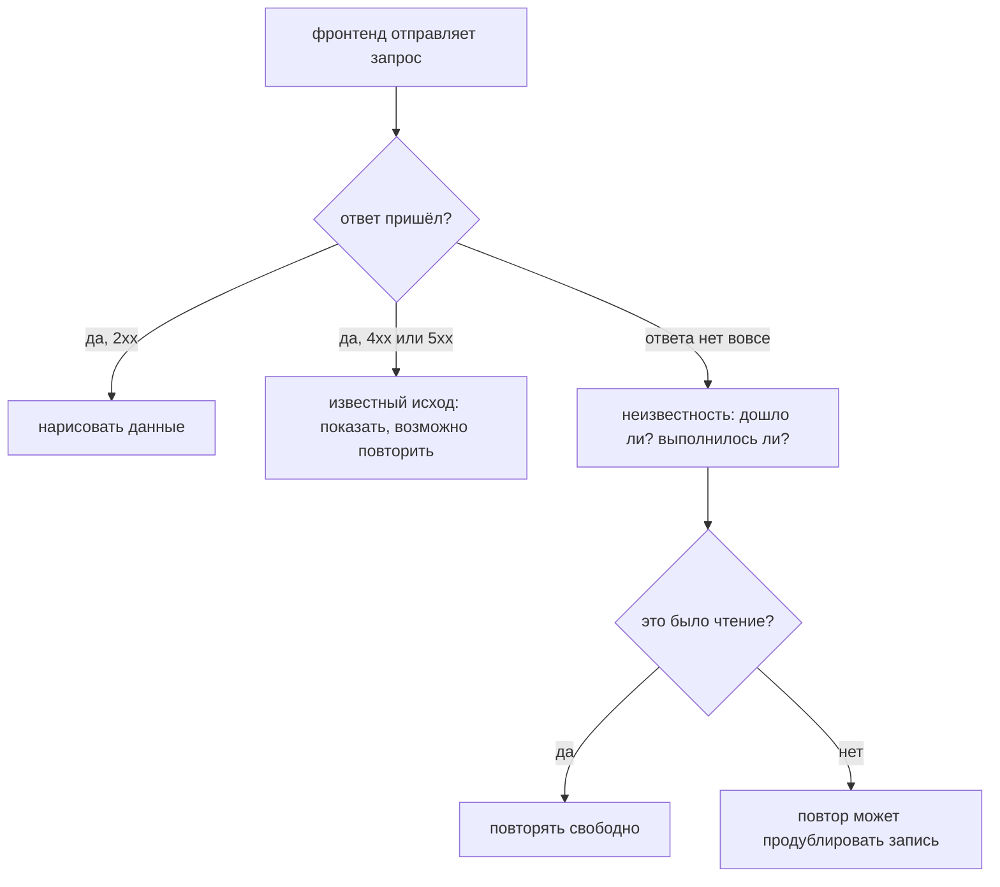

# Как взаимодействуют фронтенд и бэкенд

Это две отдельные программы. Разные процессы, обычно разные машины, часто разные
языки и — именно отсюда следует всё остальное — **никакой общей памяти**. У
браузера есть экран и нет данных; у сервера есть данные и нет экрана. Их не
связывает ничто, кроме сообщений, отправленных по сети.

Поэтому фронтенд не может *вызвать* бэкенд. Он может только **написать
сообщение, отправить его и ждать**:

- **запрос**: метод, путь, заголовки и (иногда) тело;
- **ответ**: код состояния, заголовки и (обычно) тело.

И то и другое — текст. Всё прочее в этой теме — JSON, токены, коды состояния,
индикаторы загрузки, повторы — существует для того, чтобы этот единственный
обмен был пригоден для работы.

## Один обмен, по порядку



Читайте это как пять фактов:

1. **Начинает фронтенд.** На сервере ничего не происходит, пока не придёт запрос.
2. **Запрос — это текст.** `GET /api/employees HTTP/1.1`, затем заголовки вроде
   `Accept: application/json` и `Authorization: Bearer …`, затем тело — для
   записи. Путь сравнивается побайтово — см.
   [именование REST-эндпоинтов](topic:rest-endpoint-naming).
3. **Сервер его маршрутизирует.** Фреймворк сопоставляет метод и путь с одним
   методом-обработчиком и превращает текст в объекты Java (`@RestController`,
   `@RequestMapping`, `@RequestBody` — см.
   [Spring Boot starter web](topic:spring-boot-starter-web)).
4. **Ответ — тоже текст**, и начинается он с кода состояния.
5. **Фронтенд его разбирает** и перерисовывает. Только теперь пользователь
   что-то видит.

## JSON — это общая система типов

Ни один объект никогда не покидает JVM. Jackson **сериализует** сущность в
символы; браузер разбирает эти символы в **совершенно новый обычный
JavaScript-объект** с теми же именами полей и вообще без методов. Связывает их
только договорённость.

В JSON есть ровно шесть вещей: строка, число, булево значение, `null`, массив,
объект. Всё, что богаче, по дороге сплющивается:

| На сервере | На проводе | В браузере | Ловушка |
|---|---|---|---|
| `String name` | `"Ada Byron"` | `string` | — |
| `LocalDate hiredAt` | `"2024-03-01"` | `string` | в JSON нет типа даты; это строка, пока её не разберут |
| `BigDecimal salary` | `1200.50` | `number` | числа в JS — это double; если важна точность, шлите деньги строкой |
| `Employee manager` | `null` | `null` | `null` означает «известно, что пусто»; **отсутствующий** ключ означает «сервер о нём не сказал» |
| `List<Skill> skills` | `[...]` | `Array` | ленивую коллекцию нужно загрузить до сериализации, иначе всё сломается — см. [проблему N+1](topic:hibernate-n-plus-one) |

Поэтому одни и те же данные часто имеют разную форму в разные стороны: эндпоинт
списка возвращает маленький DTO, эндпоинт элемента — полную запись, и ни то ни
другое не «сущность» — сущность остаётся внутри сервера.

## Никто ничего не помнит

HTTP **не хранит состояние**: два запроса от одного пользователя никак не связаны
друг с другом, и сервер между ними ничего не держит. Вход не помещает
пользователя «внутрь» сервера. Он даёт **токен** (или куку), и дальше фронтенд
прикрепляет его к *каждому запросу*:

```
Authorization: Bearer eyJhbGciOi...
```

Стоит один раз его не приложить — и этот запрос анонимен. Нажмите F5 — и вся
память фронтенда выбрасывается и запрашивается заново, а сервер этого не
замечает, потому что терять ему было нечего. Это не ограничение, которое надо
обходить: именно оно позволяет ответить на следующий вызов любому из десяти
экземпляров.

## Ответ — это код состояния

Тело нужно людям и для подробностей; **программы реагируют на код**.

| Код | Означает | Что делает фронтенд |
|---|---|---|
| `200` / `201` / `204` | готово | рисует данные или берёт новый id из `Location` |
| `400` | ваш запрос неверен | показывает ошибку поля из тела |
| `401` | я не знаю, кто вы | выбрасывает токен, уводит на экран входа |
| `403` | я вас знаю, и нет | показывает «нельзя»; повтор не поможет никогда |
| `404` | такой вещи нет | рисует пустое состояние, а не диалог падения |
| `409` | конфликт с текущим состоянием | перезагружает и даёт решить пользователю |
| `5xx` | я сломался | предлагает повтор, отступает по времени |

Хорошо спроектированное тело ошибки **машиночитаемо** —
`{"errors":[{"field":"name","code":"required"}]}`, — чтобы фронтенд показал
сообщение рядом с нужным полем и на своём языке. Фраза на английском в поле
`message` — это запасной вариант, а не интерфейс.

Заметьте: `4xx` — это *состоявшийся разговор об отказе*. Запрос дошёл, был понят
и получил ответ.

## Поломка, которой не бывает у локального вызова



Именно правая ветка отделяет сетевое программирование от вызовов методов.
**Отсутствие кода состояния — это не то же самое, что 500.** 500 означает, что
сервер получил ваш запрос и не справился; тишина означает, что вы не знаете,
получил ли он его вообще. Запрос мог дойти, выполниться и зафиксироваться, а
потеряться мог только ответ на обратном пути.

Поэтому `POST`, упавший по таймауту, плюс нетерпеливый пользователь равняются
двум заказам. Лечится это тем, чтобы повтор был опознаваемым — сгенерированный
клиентом `Idempotency-Key`, естественный уникальный ключ или заранее выданный
сервером идентификатор, — тогда вторая попытка вернёт результат первой, а не
сделает работу заново. Подробно разобрано в
[предотвращении дублей продаж](topic:duplicate-sale-prevention) и в
[регистрации продаж при ненадёжной связи](topic:sales-api-unreliable-connection);
сторона таймаутов и запасных сценариев — в
[таймаутах, fallback и circuit breaker](topic:service-timeouts-fallbacks).

Раз ответ занимает время, **у каждого экрана, который ходит в бэкенд, минимум
три состояния**: загружается, загружено, ошибка. Пропустите первое — получите
мигание пустотой; пропустите третье — получите вечный индикатор загрузки.

## Разговор может начать только клиент

Вкладка браузера — не сервер. У неё нет адреса, по которому можно перезвонить, а
соединение закрывается, когда ответ закончен. Поэтому, когда у бэкенда есть
новость, варианты у него такие:

| Подход | Как работает | Цена |
|---|---|---|
| **Опрос (polling)** | клиент спрашивает каждые N секунд | полный обмен на каждое «пока ничего»; новость опаздывает до N секунд |
| **Длинный опрос** | сервер держит запрос открытым, пока что-то не случится | меньше пустых ответов, но на каждого клиента удерживается соединение |
| **SSE** | один долгоживущий HTTP-поток, только от сервера к клиенту | просто, текстово, в одну сторону |
| **WebSocket** | одно соединение, один раз повышенное, дальше в обе стороны | реальное время, но соединение стало *состоянием*: оно принадлежит одному экземпляру, его надо переустанавливать, и о нём должен знать балансировщик |

Между двумя бэкендами тот же вопрос решается очередями — см.
[синхронное и асинхронное взаимодействие](topic:sync-vs-async-communication).

## Форма ответа — это контракт

После успешного вызова **данные есть у обеих сторон**: у сервера строка, у
фронтенда разобранная копия. Они совпали на одно мгновение, а затем разошлись.
Всё, что делается дальше, — перезапрос после записи, оптимистичные обновления,
инвалидация кеша — это управление этим расхождением.

А поскольку фронтенд деплоится отдельно, форма JSON — это **опубликованный
контракт**, а не деталь реализации:

- **добавить** поле безопасно (неизвестные поля игнорируются);
- **переименовать или удалить** — значит сломать программу, которую вы не
  передеплоивали, и сломать её *молча*: чтение отсутствующего свойства в
  JavaScript даёт `undefined`, а не ошибку. Зелёные логи, 200 OK и «undefined» на
  экране.

Ради этого и существуют версионирование (`/api/v1/...`), периоды устаревания и
опубликованные спецификации; см.
[как делиться эндпоинтами](topic:sharing-api-endpoints) и
[Employee API: проектирование](topic:employee-api-design).

На этой же границе стоят ещё две вещи: браузер не даёт странице прочитать ответ с
другого origin, пока сервер это не разрешит — [CORS](topic:cors), — а в системе
из многих сервисов фронтенд обычно обращается к одному
[API-шлюзу](topic:api-gateway), а не к каждому сервису по отдельности.

## Ответ на собеседовании за 60 секунд

> Это отдельные процессы без общей памяти, поэтому они обмениваются
> HTTP-сообщениями. Фронтенд отправляет запрос — метод, путь, заголовки, иногда
> тело JSON, — сервер маршрутизирует его к обработчику, делает работу и отвечает
> кодом состояния, заголовками и обычно телом JSON; фронтенд разбирает это в свои
> объекты и перерисовывает. Обычно это REST поверх HTTP с JSON, потому что JSON —
> это система типов, общая для обеих сторон, из чего следует, что даты становятся
> строками, а деньги не должны быть числом с плавающей точкой. HTTP не хранит
> состояние, поэтому личность едет в каждом запросе токеном или кукой, а не
> лежит серверной сессией. Код состояния — машиночитаемый исход: 2xx — рисуем,
> 400 — показываем ошибки полей, 401 — авторизуемся заново, 404 — пустое
> состояние, 5xx — повтор. Раз вызов удалённый, он асинхронный — каждому экрану
> нужны состояния загрузки и ошибки, — и он может завершиться вообще без ответа,
> а это не то же самое, что 500, поэтому повтору записи нужен ключ
> идемпотентности. Сервер не может позвонить в браузер, поэтому доставка от него
> — это опрос, SSE или WebSocket. И форма ответа — контракт с отдельно
> деплоящейся программой: поля добавляем свободно, переименовываем только с
> версией.

## Почему это важно в продакшене

- **«У меня работает» — это обычно проблема границы.** Не тот базовый URL,
  отсутствующий заголовок CORS, прокси, срезающий `Authorization`, таймаут шлюза
  короче времени работы обработчика. Ничего из этого не видно в модульных тестах
  ни с одной стороны.
- **Дорого обходятся именно тихие поломки контракта.** Переименование
  выкатывается зелёным, мониторинг остаётся зелёным, а пользователи видят
  `undefined`, пока кто-нибудь не пришлёт скриншот.
- **Повторы порождают денежные баги.** Дублирующиеся заказы и двойные списания
  почти всегда — это потерянный ответ плюс честный повтор, а не ошибка в
  обработчике.
- **«Болтливые» экраны стоят задержки, а не процессора.** Десять
  последовательных вызовов по 80 мс — это почти секунда ничего. Объединяйте,
  распараллеливайте или дайте экрану эндпоинт под его форму.
- **Проверки на клиенте — удобство, а не правило.** Браузер полностью
  контролируется тем, кто за ним сидит; каждая значимая проверка повторяется на
  сервере.
- **Размер полезной нагрузки — реальная цена на мобильном.** Отправка всего графа
  сущностей «на всякий случай» — самая частая причина медленного экрана списка.

## Частые заблуждения

- **«Фронтенд вызывает метод бэкенда».** Он отправляет текст и надеется. Нет ни
  стека, ни распространения исключений, ни общего объекта: `500` — это не
  брошенное исключение, долетевшее до браузера, а код состояния, который сервер
  решил отправить.
- **«Сервер возвращает объект».** Он возвращает символы. У браузера в итоге
  оказывается другой объект в другой среде выполнения, у которого просто те же
  имена полей и нет методов.
- **«`null` и отсутствующее поле — это одно и то же».** `{"phone": null}`
  говорит, что значение известно и оно пустое; `{}` не говорит про `phone`
  ничего. На этом различии держатся API частичного обновления — см.
  [PUT против PATCH](topic:put-vs-patch).
- **«Ошибка означает, что вызов не удался».** `404` или `400` — это состоявшийся
  обмен с ясным ответом. Настоящий сбой — тот, у которого нет кода состояния.
- **«Таймаут означает, что ничего не произошло».** Он означает, что вы не знаете.
  Запись вполне может быть зафиксирована.
- **«HTTP медленный из-за сервера».** Большую часть времени на типичном экране
  занимают обмены по сети, установка соединений и размер данных, а не работа
  обработчика.
- **«Сессия лежит на сервере».** В API без состояния сессии нет — есть токен,
  который клиент присылает снова и снова. А если ваш сервер сессии всё-таки
  держит, вы только что сделали экземпляры невзаимозаменяемыми.
- **«Защищать надо только API, фронтенд же наш».** Всё, что может отправить
  страница, может отправить и `curl` — с другими значениями. Авторизация всегда
  решается на сервере.
