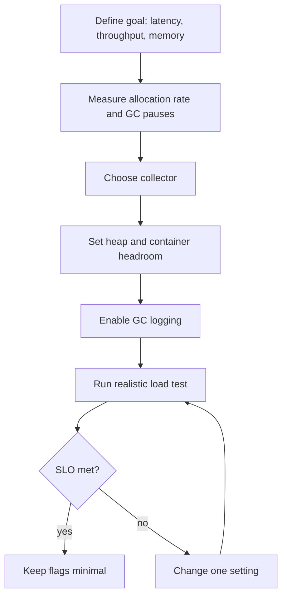
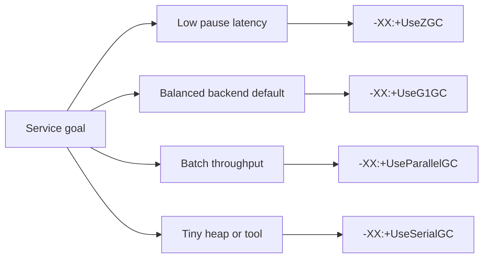

# Configuring the Garbage Collector

GC tuning is not a magic list of flags. It is a small production loop: define the
goal, choose a collector, set memory boundaries, observe real GC behavior, then
adjust one thing at a time. Think of it like organizing a busy kitchen: first
decide whether you care most about serving each table quickly, feeding the most
people per hour, or running with a tiny pantry. The answer changes the setup.

Before tuning, make sure you know the memory model. Objects live mostly on the
heap, while thread stacks, Metaspace, direct buffers, and native memory also need
room. See [JVM memory areas](topic:jvm-memory-areas) for the layout and
[JVM Heap Generations](topic:heap-generations) for why many collectors separate
short-lived and long-lived objects. In a kitchen analogy, the heap is the prep
counter, but the pantry, staff lockers, and delivery area also consume space.

## The tuning loop



1. **Define the goal.** GC cannot optimize everything at once. Low latency means
   short pauses; high throughput means the app spends more time doing work and
   less time collecting; low footprint means using less memory. Like a post
   office, you can optimize for short queues, maximum parcels per hour, or the
   smallest building, but not all three perfectly.
2. **Measure first.** Look at allocation rate, pause times, full GC frequency,
   heap after GC, and whether latency SLOs are missed. Guessing flags without
   logs is like changing traffic lights without watching the road.
3. **Choose the collector.** For Java 21 server apps, **G1** is the normal default
   choice. **ZGC** is for very low pause goals or large heaps. **Parallel GC**
   favors throughput over pause predictability. **Serial GC** is for tiny heaps or
   very small tools. In kitchen terms, G1 is a balanced shift manager, ZGC keeps
   service moving while cleanup happens, Parallel GC brings many cleaners at once
   and briefly blocks the room, and Serial GC is one cleaner for a small kiosk.
4. **Set memory boundaries.** Use `-Xms` and `-Xmx` for heap size, or container-aware
   percentages such as `-XX:InitialRAMPercentage` and `-XX:MaxRAMPercentage`.
   Leave headroom outside the heap for Metaspace, thread stacks, direct buffers,
   the JIT, and native code. A container limit is the size of the whole building;
   `-Xmx` is only the kitchen counter, not every room.
5. **Enable GC logging.** On Java 9+, start with
   `-Xlog:gc*:file=gc.log:time,uptime,level,tags`. The log tells you when GC ran,
   how long it paused, how much memory was reclaimed, and whether full GC or
   promotion pressure appears. It is the kitchen order board: without it, you only
   hear complaints after dinner is late.
6. **Tune one change at a time.** Change a collector, heap size, pause target, or
   one advanced flag, then rerun the same load. Multiple changes hide cause and
   effect, like changing the menu, staff, and oven temperature in the same service.

## Which collector to choose



- **G1 (`-XX:+UseG1GC`)** is a good default for most services. It splits the heap
  into regions and tries to meet a pause goal, commonly with
  `-XX:MaxGCPauseMillis=...`. The analogy is a restaurant cleaning one section at
  a time instead of closing the whole dining room.
- **ZGC (`-XX:+UseZGC`)** is for low-latency services where long pauses are worse
  than extra CPU or memory overhead. It does much of the work concurrently with
  the application. This is like cleaning tables while guests keep moving through
  the cafe.
- **Parallel GC (`-XX:+UseParallelGC`)** is useful for batch jobs where total work
  per hour matters more than individual pause spikes. It is the warehouse model:
  stop the belt, send a big crew, clear everything fast, then resume.
- **Serial GC (`-XX:+UseSerialGC`)** fits small heaps, command-line tools, tests,
  or constrained environments. It is one person cleaning a small food truck:
  simple and cheap, but not for a banquet hall.
- **Shenandoah (`-XX:+UseShenandoahGC`)** can also target low pauses when the JDK
  distribution supports it. Treat it like ZGC in the decision process: verify it
  exists in your runtime, then test it with your workload.

## Practical flags to know

Start small. A reasonable first production profile is often:

```text
-Xms512m -Xmx512m
-XX:+UseG1GC
-XX:MaxGCPauseMillis=200
-Xlog:gc*:file=gc.log:time,uptime,level,tags
```

The exact numbers are workload-specific. In a container, avoid setting `-Xmx` to
the full container limit. Leave space for non-heap memory. It is like reserving
room for dish storage, walkways, and staff, not only the stove.

Important knobs:

- `-Xms` sets the initial heap; `-Xmx` sets the maximum heap. Setting them equal
  can reduce resizing noise in stable services, but it also commits the capacity
  budget up front. Like opening the whole kitchen from the first order, it is
  predictable but not always economical.
- `-XX:MaxRAMPercentage` is often better in containers when the same image runs
  under different limits. It sizes the heap as part of the available container
  memory. Think of a catering team that scales the prep tables to the rented hall.
- `-XX:MaxGCPauseMillis` is a goal, not a contract. G1 uses it to decide how much
  work to do per pause, but a huge live set or allocation spike can still exceed
  it. A traffic department can aim for two-minute queues, but a stadium exit can
  still overwhelm the roads.
- `-XX:InitiatingHeapOccupancyPercent` can make G1 start concurrent marking
  earlier or later. Use it only when logs show marking starts too late or too
  early. It is deciding when the post office starts sorting tomorrow's mail,
  not a flag to touch blindly.
- `-XX:+UseStringDeduplication` with G1 can help workloads with many duplicate
  `String` objects, but it costs CPU. If allocation pressure comes from repeated
  string building, first check the code itself; [String concatenation](topic:string-concatenation)
  covers the common trap. It is better to stop printing duplicate labels than to
  hire someone to merge them afterward.

## What to read in GC logs

Look for patterns, not a single line:

- **Frequent young GC with small pauses** can be normal for allocation-heavy code.
  It is like clearing small trays from the counter often.
- **Full GC events** in a service are a warning. They often mean the old generation
  is filling, promotion is too high, or the heap is too small. That is the kitchen
  closing for a deep clean during dinner.
- **Heap after GC keeps growing** may indicate a memory leak or an intentionally
  growing cache. If weak, soft, or phantom references are involved, review
  [Reference Types and a Memory-Sensitive Cache](topic:reference-types-cache).
  This is like storage shelves that never get emptier after each cleanup.
- **Promotion pressure** means too many objects survive young collections and move
  to old. The cause can be undersized young regions, bursty allocation, or objects
  living slightly longer than expected. It resembles moving temporary boxes from
  the front desk into long-term storage because the waiting area is too small.
- **High allocation rate** is often a code or data-shape problem, not only a GC
  problem. If the kitchen creates ten disposable containers for every sandwich,
  choosing a better cleaner will not fix the purchasing policy.

## 60-second interview answer

> I do not start by copying random GC flags. First I define the goal: latency,
> throughput, or memory footprint. Then I measure allocation rate, pauses, full
> GC frequency, and heap-after-GC under realistic load. For most Java 21 services
> I start with G1, set a sensible heap with `-Xms`/`-Xmx` or container RAM
> percentages, leave non-heap headroom, and enable unified GC logging with
> `-Xlog:gc*:file=gc.log:time,uptime,level,tags`. If pauses are the main problem,
> I test G1 pause goals or ZGC; if throughput is the priority, Parallel GC can be
> better. I change one setting at a time and validate with the same workload.
> `-XX:MaxGCPauseMillis` is a target, not a guarantee, and increasing `-Xmx` is
> not a fix for leaks.

## Production relevance

- GC settings are part of the service SLO. A payment API usually cares about
  tail latency; an offline report job may care about total throughput. Like
  traffic planning, a side street and a freight highway need different rules.
- Container deployments need explicit memory thinking. The JVM can respect cgroup
  limits, but the heap must not consume every megabyte. The building still needs
  corridors, storage, and utilities.
- Observability beats folklore. Keep GC logs, application latency metrics, and
  allocation profiles together. A kitchen manager checks orders, wait times, and
  stock levels before moving equipment.
- Tuning cannot compensate for unlimited retention. If references stay reachable,
  GC must keep the objects. Review object reachability with
  [reference storage](topic:reference-types-storage) and heap layout before
  blaming the collector. A cleaner cannot throw away boxes that the owner keeps
  labeling as important.

## Common traps & misconceptions

- **"Use the newest collector and you are done."** Collector choice helps only if
  it matches the workload. A fast courier is wasted if the post office keeps
  mislabeling parcels.
- **"More heap always means better performance."** More heap can reduce GC
  frequency, but it can also increase memory cost and make some collections larger.
  A bigger pantry delays cleanup, but the eventual cleanup may take longer.
- **"`System.gc()` forces cleanup."** It is only a request and is often disabled or
  harmful in services. Pressing the emergency cleaning bell after every order
  slows the restaurant down.
- **"`-XX:MaxGCPauseMillis=50` guarantees 50 ms pauses."** It is a tuning goal.
  The JVM can miss it when the live set is too large or allocation is too bursty.
  A posted speed target does not remove traffic jams.
- **"GC tuning fixes memory leaks."** If objects remain reachable from maps,
  caches, static fields, threads, or queues, the collector is correct to keep
  them. The trash crew cannot remove a box still marked for delivery.
- **"Copying a long flag list from another service is professional tuning."**
  Flags are workload-specific. Copying a bakery kitchen layout into a post office
  creates confusion, not expertise.
