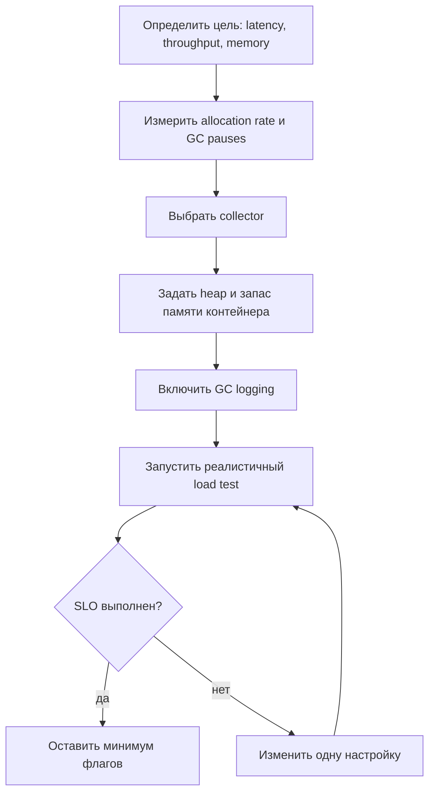
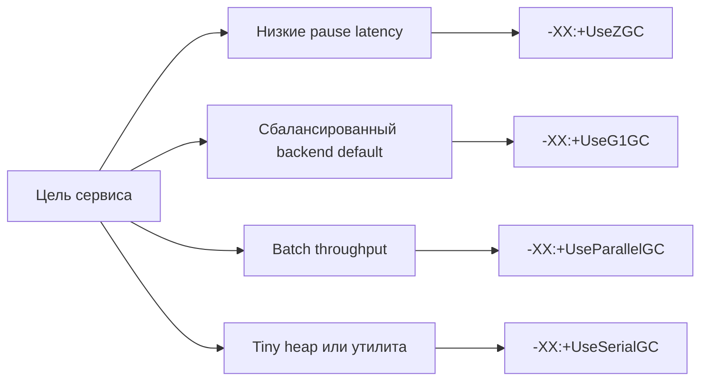

# Настройка сборщика мусора

Настройка GC - это не магический список флагов. Это небольшой производственный
цикл: определить цель, выбрать сборщик, задать границы памяти, посмотреть реальное
поведение GC и затем менять по одной настройке за раз. Представьте загруженную
кухню: сначала нужно понять, важнее ли быстро обслуживать каждый столик, готовить
максимум блюд в час или работать с маленькой кладовой. От ответа зависит вся
организация.

Перед настройкой нужно понимать модель памяти. Объекты в основном живут в heap,
но thread stacks, Metaspace, direct buffers и native memory тоже требуют места.
Схему областей см. в [областях памяти JVM](topic:jvm-memory-areas), а причину
разделения short-lived и long-lived объектов - в теме
[Поколения кучи JVM](topic:heap-generations). В кухонной аналогии heap - это
рабочая поверхность, но кладовая, шкафчики персонала и зона доставки тоже занимают
пространство.

## Цикл настройки



1. **Определите цель.** GC не может идеально оптимизировать всё сразу. Low latency
   означает короткие паузы; high throughput - больше времени на работу приложения
   и меньше на сборку; low footprint - меньший расход памяти. Как на почте: можно
   оптимизировать короткие очереди, максимум посылок в час или самое маленькое
   помещение, но не всё идеально одновременно.
2. **Сначала измеряйте.** Смотрите allocation rate, pause times, частоту full GC,
   heap after GC и нарушения latency SLO. Подбирать флаги без логов - как менять
   светофоры, не глядя на дорогу.
3. **Выберите collector.** Для Java 21 server apps обычный выбор по умолчанию -
   **G1**. **ZGC** подходит для очень низких целей по паузам или больших heap.
   **Parallel GC** предпочитает throughput предсказуемости пауз. **Serial GC** -
   для tiny heap или маленьких утилит. На кухне G1 похож на сбалансированного
   менеджера смены, ZGC убирает так, чтобы обслуживание продолжалось, Parallel GC
   приводит большую бригаду и ненадолго закрывает зал, а Serial GC - один уборщик
   для маленького киоска.
4. **Задайте границы памяти.** Используйте `-Xms` и `-Xmx` для размера heap или
   container-aware проценты вроде `-XX:InitialRAMPercentage` и
   `-XX:MaxRAMPercentage`. Оставьте запас вне heap для Metaspace, thread stacks,
   direct buffers, JIT и native code. Лимит контейнера - это размер всего здания;
   `-Xmx` - только кухонная поверхность, а не все комнаты.
5. **Включите GC logging.** В Java 9+ начните с
   `-Xlog:gc*:file=gc.log:time,uptime,level,tags`. Лог показывает, когда запускался
   GC, сколько длилась пауза, сколько памяти освободилось и есть ли full GC или
   promotion pressure. Это кухонное табло заказов: без него вы слышите жалобы
   только когда ужин уже опоздал.
6. **Меняйте по одной настройке.** Измените collector, heap size, pause target или
   один advanced flag и заново запустите ту же нагрузку. Несколько изменений
   скрывают причину и следствие, как одновременная смена меню, персонала и
   температуры духовки.

## Как выбрать collector



- **G1 (`-XX:+UseG1GC`)** - хороший default для большинства сервисов. Он делит
  heap на регионы и пытается уложиться в pause goal, часто через
  `-XX:MaxGCPauseMillis=...`. Аналогия: ресторан убирает один сектор за раз, а не
  закрывает весь зал.
- **ZGC (`-XX:+UseZGC`)** подходит low-latency сервисам, где длинные паузы хуже,
  чем дополнительный CPU или memory overhead. Он делает большую часть работы
  concurrently с приложением. Это как протирать столы, пока гости продолжают
  двигаться по кафе.
- **Parallel GC (`-XX:+UseParallelGC`)** полезен для batch jobs, где общий объём
  работы в час важнее отдельных всплесков пауз. Это складская модель: остановить
  ленту, вывести большую бригаду, быстро всё очистить и продолжить.
- **Serial GC (`-XX:+UseSerialGC`)** подходит small heaps, command-line tools,
  tests или ограниченным окружениям. Это один человек, убирающий маленький
  фудтрак: просто и дёшево, но не для банкетного зала.
- **Shenandoah (`-XX:+UseShenandoahGC`)** тоже может целиться в low pauses, если
  JDK distribution его поддерживает. В выборе относитесь к нему как к ZGC:
  проверьте, что он есть в runtime, затем тестируйте на своей нагрузке.

## Практичные флаги

Начинайте с малого. Разумный первый production profile часто выглядит так:

```text
-Xms512m -Xmx512m
-XX:+UseG1GC
-XX:MaxGCPauseMillis=200
-Xlog:gc*:file=gc.log:time,uptime,level,tags
```

Точные числа зависят от workload. В контейнере не задавайте `-Xmx` равным всему
container limit. Оставьте место для non-heap memory. Это как зарезервировать место
для хранения посуды, проходов и персонала, а не только для плиты.

Важные настройки:

- `-Xms` задаёт initial heap; `-Xmx` задаёт maximum heap. Равные значения могут
  убрать шум от resizing в стабильных сервисах, но сразу резервируют бюджет
  ёмкости. Как открыть всю кухню с первого заказа: предсказуемо, но не всегда
  экономно.
- `-XX:MaxRAMPercentage` часто удобнее в контейнерах, когда один и тот же image
  запускается с разными лимитами. Он задаёт heap как долю доступной контейнерной
  памяти. Это похоже на кейтеринг, который масштабирует рабочие столы под
  арендованный зал.
- `-XX:MaxGCPauseMillis` - цель, а не контракт. G1 использует её, чтобы решить,
  сколько работы делать за паузу, но огромный live set или allocation spike всё
  равно могут её превысить. Дорожная служба может целиться в двухминутные очереди,
  но выход со стадиона всё равно перегрузит дороги.
- `-XX:InitiatingHeapOccupancyPercent` может заставить G1 начинать concurrent
  marking раньше или позже. Используйте его только когда логи показывают, что
  marking начинается слишком поздно или слишком рано. Это решение, когда почта
  начинает сортировать завтрашние письма, а не флаг для слепого перебора.
- `-XX:+UseStringDeduplication` вместе с G1 может помочь workloads с множеством
  одинаковых объектов `String`, но стоит CPU. Если allocation pressure возникает
  из-за повторной сборки строк, сначала проверьте сам код; тема
  [конкатенации строк](topic:string-concatenation) разбирает частую ловушку.
  Лучше перестать печатать одинаковые ярлыки, чем нанимать человека, который
  потом будет их объединять.

## Что читать в GC logs

Ищите паттерны, а не одну строку:

- **Частый young GC с маленькими паузами** может быть нормой для allocation-heavy
  кода. Это как часто убирать маленькие подносы с рабочей поверхности.
- **Full GC events** в сервисе - предупреждение. Часто это значит, что old
  generation заполняется, promotion слишком высок или heap слишком мал. Это как
  закрыть кухню на генеральную уборку прямо во время ужина.
- **Heap after GC продолжает расти** - возможный memory leak или намеренно растущий
  cache. Если используются weak, soft или phantom references, посмотрите
  [Reference Types and a Memory-Sensitive Cache](topic:reference-types-cache).
  Это похоже на полки склада, которые после каждой уборки не становятся пустее.
- **Promotion pressure** означает, что слишком много объектов переживают young
  collections и переходят в old. Причина может быть в маленьких young regions,
  всплесках allocation или объектах, которые живут чуть дольше ожидаемого. Это
  как переносить временные коробки со стойки в долгосрочное хранение, потому что
  зона ожидания слишком мала.
- **Высокий allocation rate** часто является проблемой кода или формы данных, а
  не только GC. Если кухня создаёт десять одноразовых контейнеров для каждого
  сэндвича, выбор лучшего уборщика не исправит политику закупок.

## Ответ за 60 секунд

> Я не начинаю с копирования случайных GC-флагов. Сначала определяю цель:
> latency, throughput или memory footprint. Затем под реалистичной нагрузкой
> измеряю allocation rate, паузы, частоту full GC и heap-after-GC. Для большинства
> Java 21 сервисов я начинаю с G1, задаю разумный heap через `-Xms`/`-Xmx` или
> проценты от container RAM, оставляю запас для non-heap памяти и включаю unified
> GC logging через `-Xlog:gc*:file=gc.log:time,uptime,level,tags`. Если главная
> проблема - паузы, проверяю pause goals у G1 или ZGC; если приоритет - throughput,
> Parallel GC может быть лучше. Я меняю одну настройку за раз и проверяю той же
> нагрузкой. `-XX:MaxGCPauseMillis` - цель, а не гарантия, и увеличение `-Xmx` не
> лечит leaks.

## Зачем это в production

- GC settings являются частью service SLO. Payment API обычно важна tail latency;
  offline report job может быть важнее total throughput. Как в планировании
  движения: боковой улице и грузовой магистрали нужны разные правила.
- Container deployments требуют явного мышления о памяти. JVM умеет учитывать
  cgroup limits, но heap не должен занимать каждый мегабайт. В здании всё ещё
  нужны коридоры, склад и инженерные системы.
- Observability сильнее фольклора. Держите рядом GC logs, application latency
  metrics и allocation profiles. Управляющий кухней смотрит заказы, время
  ожидания и запасы перед перестановкой оборудования.
- Tuning не компенсирует бесконечное удержание объектов. Если references остаются
  reachable, GC обязан хранить объекты. Разберите достижимость объектов через
  [хранение ссылок](topic:reference-types-storage) и layout heap до того, как
  винить collector. Уборщик не может выбросить коробку, если владелец всё ещё
  помечает её как важную.

## Типичные ловушки и заблуждения

- **"Поставьте самый новый collector, и всё готово."** Выбор collector помогает
  только когда он соответствует workload. Быстрый курьер бесполезен, если почта
  постоянно путает ярлыки на посылках.
- **"Больше heap всегда значит лучше performance."** Больший heap может снизить
  частоту GC, но также повысить стоимость памяти и сделать некоторые collections
  крупнее. Большая кладовая откладывает уборку, но сама уборка может стать дольше.
- **"`System.gc()` принудительно чистит память."** Это только request, и в сервисах
  он часто отключён или вреден. Нажимать тревожную кнопку уборки после каждого
  заказа - значит тормозить ресторан.
- **"`-XX:MaxGCPauseMillis=50` гарантирует паузы 50 ms."** Это tuning goal. JVM
  может не уложиться, если live set слишком большой или allocation слишком
  всплесковый. Целевая скорость на знаке не убирает пробки.
- **"GC tuning исправляет memory leaks."** Если объекты остаются reachable из
  maps, caches, static fields, threads или queues, collector правильно сохраняет
  их. Бригада уборки не может убрать коробку, которая всё ещё помечена к доставке.
- **"Скопировать длинный список флагов из другого сервиса - это профессиональная
  tuning."** Флаги зависят от workload. Копирование планировки кухни пекарни в
  почтовое отделение создаёт путаницу, а не экспертизу.
