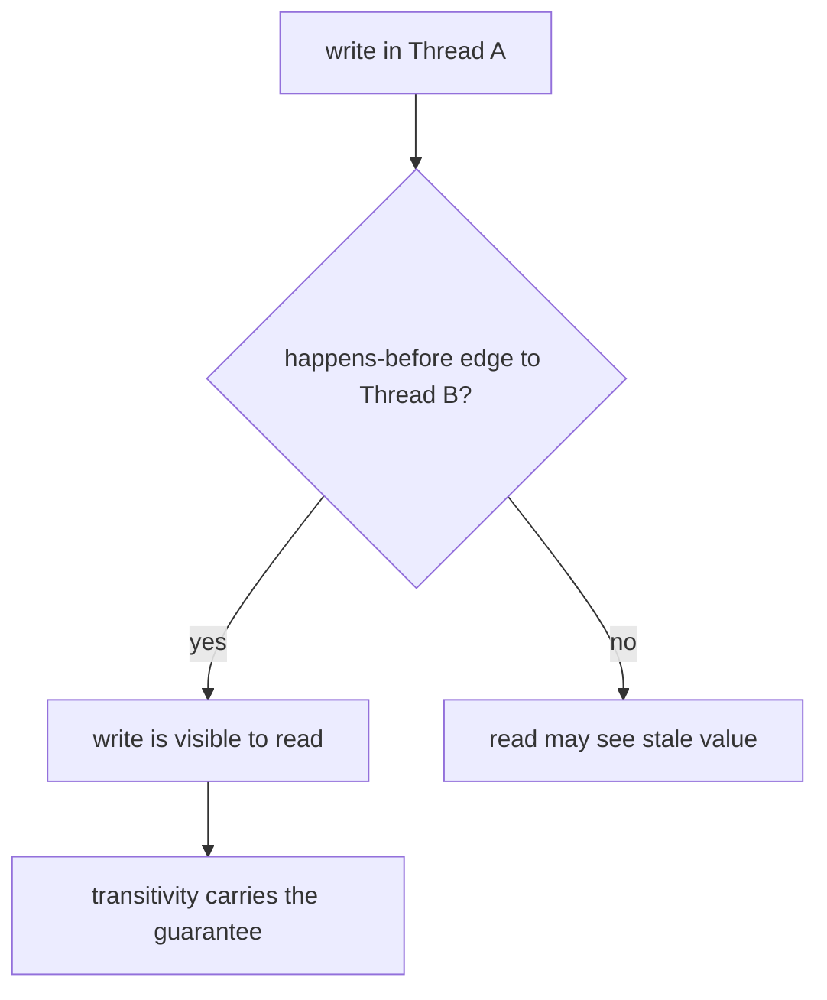
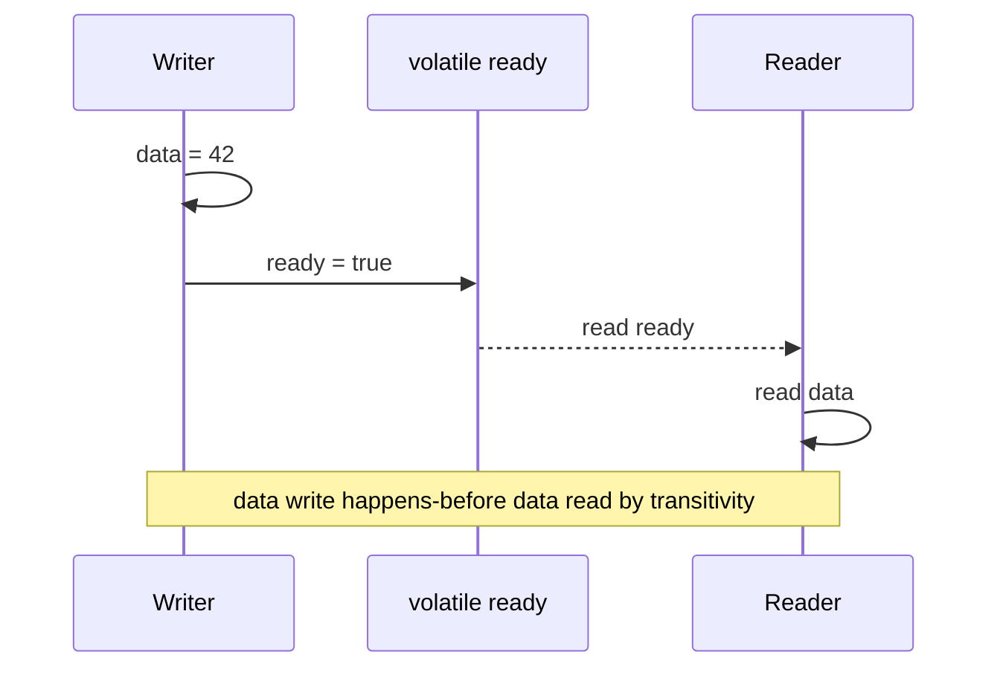

# Happens-Before in Java

## Intuition

`happens-before` is the Java Memory Model's formal rule for safe visibility between threads. If action A happens-before action B, then B must be able to see the effects of A, and the JVM cannot reorder A after B in a way that breaks that guarantee. Think of a post office receipt: once the parcel is stamped and handed over through the official window, the next clerk can trust that the parcel exists and has the recorded contents.

Without a happens-before edge, two threads may still appear to run in a friendly order on your machine, but Java does not promise that one thread will see the other's latest write. It is like a kitchen note left on a private clipboard: another cook might notice it, or might keep working from an older prep sheet.

## The Core Rules

Inside one thread, program order creates happens-before: earlier actions happen-before later actions in that same thread. This is like a recipe card: step 2 assumes step 1 already happened at the same cooking station.

A `volatile` write happens-before every later read of the same `volatile` variable. This is the rule behind many publication patterns and is covered more narrowly in [volatile](topic:volatile). It is like raising a traffic signal after updating the road sign: the next driver who checks that signal must also see the sign update that came before it.

An `unlock` of a monitor happens-before a later `lock` of the same monitor. The phrase "same monitor" matters; using a different lock does not connect the actions. It is like two clerks using the same locked mailbox: the next clerk who opens that mailbox sees what the previous clerk placed there. A different mailbox gives no such promise. This is the memory side of a [Critical Section](topic:critical-section).

A call to `Thread.start()` happens-before any action in the started thread. Setup done before `start()` is visible to the new worker. It is like handing a prep list to a cook before opening the kitchen door.

All actions in a thread happen-before another thread successfully returns from `join()` on it. After `join()`, the waiting thread can trust the finished worker's results. It is like waiting at the pickup counter until the parcel is officially marked delivered.

Happens-before is transitive: if A happens-before B, and B happens-before C, then A happens-before C. This is why a plain write before a volatile write can become visible after a volatile read. It is like a chain of signed delivery receipts: each handoff carries the earlier proof forward.

## What It Does Not Mean

Happens-before is not the same as wall-clock time. Action A can happen-before action B even if the CPU scheduling story is complicated, because the rule is about the visibility contract, not a stopwatch. Traffic lights are similar: the legal right-of-way is the rule that matters, not which car's engine started first.

Happens-before is also not atomicity. A `volatile int count` can make writes visible, but `count++` is still read, add, write. For atomic updates you usually need synchronization, locks, or primitives such as [Compare-And-Set](topic:compare-and-set). In kitchen terms, seeing the latest order ticket does not stop two cooks from both taking the same last plate unless the plate pickup is protected.

If two threads access the same mutable state, at least one access is a write, and there is no happens-before edge, you have a data race. The result can be stale reads, lost updates, or behavior that changes when the JVM, CPU, or load changes. For broader race-avoidance tactics, see [Avoiding Race Conditions](topic:race-condition-avoidance). It is like two delivery clerks editing separate copies of the route sheet and hoping the final route is consistent.

## Production Relevance

Happens-before is the reason `synchronized`, `volatile`, `Thread.start()`, and `Thread.join()` are not just coordination tools but visibility tools. In production, a missing edge can look like a rare cache bug: a shutdown flag is ignored, a worker sees a half-published object, or a result looks empty after a task "obviously" finished. It is like a restaurant pass where plates move fast: without the official ticket handoff, someone eventually serves yesterday's order.

It also explains why thread-pool and task APIs are designed around explicit handoffs. The high-level API hides the lower-level edges, but the same memory model is underneath. Review [Java Multithreading](topic:java-multithreading) and [Stopping a Started Thread](topic:stopping-a-thread) when you need the lifecycle side. It is like a courier company: the tracking system may hide the stamps, but the stamps are still what make the delivery trustworthy.

## 60-Second Interview Answer

> `happens-before` is a formal ordering relationship in the Java Memory Model. If action A happens-before action B, then all effects of A are visible to B, and the JVM must preserve that ordering for the purposes of inter-thread visibility. The main sources are program order within one thread, `volatile` write to later read of the same variable, monitor `unlock` to later `lock` of the same monitor, `Thread.start()`, successful `Thread.join()`, and transitivity. Without a happens-before relationship around shared mutable state, a read may see stale data and the program has a data race. It is not the same as real time, and it does not automatically make compound operations atomic.

## Common Misconceptions

- **"If thread A ran first, thread B must see its write."** No. Scheduling order is not a visibility guarantee. Like seeing a cook enter the kitchen first does not prove the next cook got the updated recipe card.
- **"`Thread.sleep()` or `yield()` creates happens-before."** No. They may affect timing, but they do not publish memory. Like waiting at a traffic light does not file a delivery receipt.
- **"Any synchronized block is enough."** No. The unlock and lock must use the same monitor. Like two post-office boxes with different keys, opening one does not reveal what was placed in the other.
- **"`volatile` makes everything thread-safe."** No. It gives visibility and ordering for that variable, not atomic compound updates. Like a visible ticket board does not make two clerks update the same ticket safely.
- **"Happens-before means physical execution happened earlier."** Not exactly. It is a formal rule the JVM must respect for visibility, even when hardware and compiler reorder independent work. Like a traffic rule defines who may go next, even if engines start in another order.
