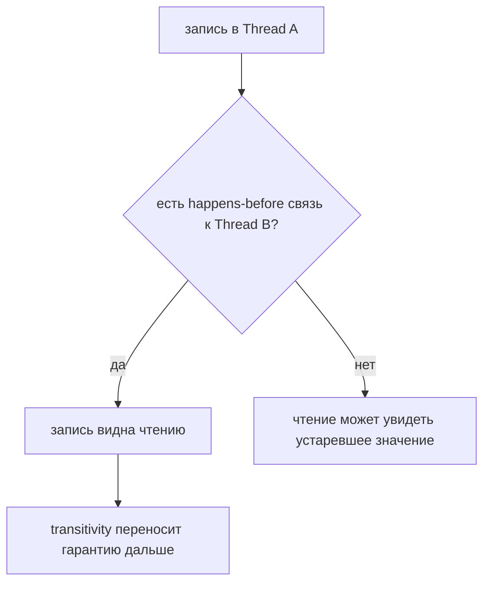
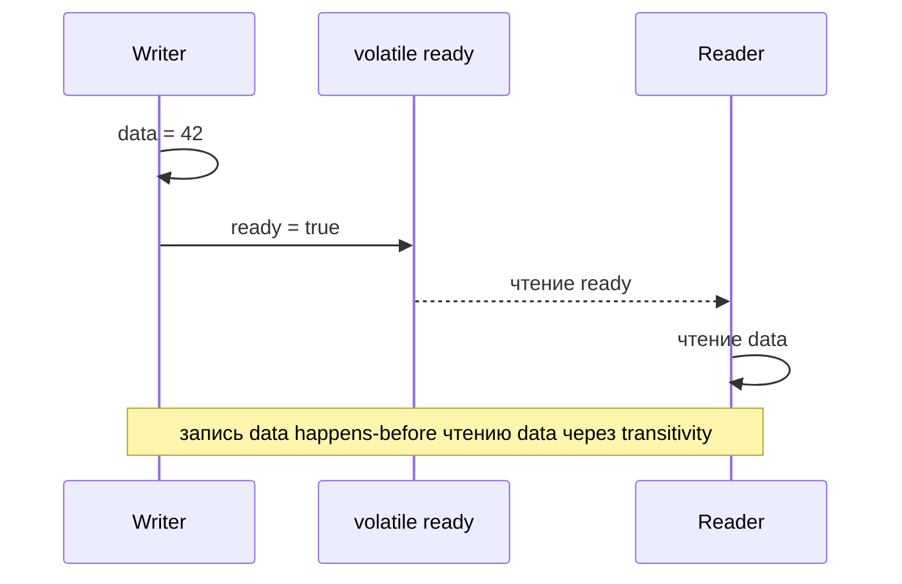

# Happens-Before в Java

## Интуиция

`happens-before` - это формальное правило Java Memory Model для безопасной visibility между threads. Если действие A happens-before действию B, то B обязан иметь возможность увидеть эффекты A, а JVM не может переупорядочить A после B так, чтобы сломать эту гарантию. Представь квитанцию на почте: когда посылку проштамповали и передали через официальное окно, следующий clerk может доверять, что посылка существует и её содержимое записано.

Без happens-before связи два threads могут выглядеть так, будто выполняются в удобном порядке на твоей машине, но Java не обещает, что один thread увидит последнюю запись другого. Это как записка на личном планшете на кухне: другой повар может её заметить, а может продолжить работать по старому листу подготовки.

## Основные Правила

Внутри одного thread program order создаёт happens-before: более ранние действия happen-before более поздним действиям в том же thread. Это как карточка рецепта: шаг 2 предполагает, что шаг 1 уже выполнен на той же кухонной станции.

Запись в `volatile` happens-before каждому более позднему чтению той же `volatile` переменной. На этом основаны многие publication patterns, а подробнее это разобрано в теме [volatile](topic:volatile). Это как поднять дорожный сигнал после обновления знака: следующий водитель, который проверит сигнал, должен увидеть и обновление знака, сделанное до него.

`unlock` monitor happens-before более позднему `lock` того же monitor. Фраза "того же monitor" критична; другой lock не связывает действия. Это как два clerk используют один и тот же запертый почтовый ящик: следующий clerk, открывший этот ящик, видит то, что положил предыдущий. Другой ящик такой гарантии не даёт. Это сторона памяти у [Critical Section](topic:critical-section).

Вызов `Thread.start()` happens-before любому действию в запущенном thread. Подготовка, сделанная до `start()`, видна новому worker. Это как передать повару список подготовки до того, как открыть дверь кухни.

Все действия в thread happen-before тому, что другой thread успешно вернулся из `join()` по нему. После `join()` ожидающий thread может доверять результатам завершённого worker. Это как ждать у стойки выдачи, пока посылку официально не отметят доставленной.

Happens-before транзитивен: если A happens-before B, а B happens-before C, то A happens-before C. Поэтому обычная запись перед volatile-записью может стать видимой после volatile-чтения. Это как цепочка подписанных квитанций доставки: каждая передача несёт предыдущие доказательства дальше.

## Что Это Не Означает

Happens-before не равен времени на часах. Действие A может happen-before действию B, даже если история CPU scheduling сложнее, потому что правило говорит о visibility contract, а не о секундомере. Со светофорами похоже: важно правило приоритета, а не то, у какой машины двигатель завёлся первым.

Happens-before также не равен atomicity. `volatile int count` может сделать записи видимыми, но `count++` всё равно состоит из read, add, write. Для atomic updates обычно нужны synchronization, locks или примитивы вроде [Compare-And-Set](topic:compare-and-set). На кухне это так: видеть последний order ticket не мешает двум поварам взять одну последнюю тарелку, если место выдачи тарелок не защищено.

Если два threads обращаются к одному mutable state, хотя бы одно обращение является write, и между ними нет happens-before связи, возникает data race. Результатом могут быть stale reads, lost updates или поведение, которое меняется от JVM, CPU или нагрузки. Более широкие способы защиты смотри в [Avoiding Race Conditions](topic:race-condition-avoidance). Это как два clerk редактируют разные копии маршрутного листа и надеются, что итоговый маршрут будет согласованным.

## Значение В Production

Happens-before объясняет, почему `synchronized`, `volatile`, `Thread.start()` и `Thread.join()` являются не только инструментами coordination, но и инструментами visibility. В production пропущенная связь может выглядеть как редкий cache bug: shutdown flag игнорируется, worker видит наполовину опубликованный object, или result пустой после задачи, которая "очевидно" завершилась. Это как ресторанная раздача, где тарелки движутся быстро: без официальной передачи ticket кто-нибудь однажды подаст вчерашний заказ.

Это также объясняет, почему thread-pool и task APIs построены вокруг явных handoff. Высокоуровневый API прячет низкоуровневые связи, но под ним работает та же memory model. Когда нужна lifecycle-сторона, повтори [Java Multithreading](topic:java-multithreading) и [Stopping a Started Thread](topic:stopping-a-thread). Это как courier company: tracking system может прятать штампы, но именно штампы делают доставку надёжной.

## Ответ За 60 Секунд

> `happens-before` - это формальное отношение порядка в Java Memory Model. Если действие A happens-before действию B, то все эффекты A видимы для B, а JVM должна сохранить этот порядок с точки зрения inter-thread visibility. Основные источники: program order внутри одного thread, `volatile` write перед более поздним read той же переменной, monitor `unlock` перед более поздним `lock` того же monitor, `Thread.start()`, успешный `Thread.join()` и transitivity. Без happens-before вокруг shared mutable state чтение может увидеть stale data, а в программе появляется data race. Это не то же самое, что реальное время, и это не делает compound operations автоматически atomic.

## Частые Заблуждения

- **"Если thread A выполнился первым, thread B обязан увидеть его запись."** Нет. Порядок scheduling не является visibility guarantee. Как то, что повар первым вошёл на кухню, не доказывает, что следующий повар получил обновлённую карточку рецепта.
- **"`Thread.sleep()` или `yield()` создаёт happens-before."** Нет. Они могут влиять на timing, но не публикуют memory. Как ожидание на светофоре не оформляет квитанцию доставки.
- **"Любой synchronized block достаточно."** Нет. Unlock и lock должны использовать тот же monitor. Как два почтовых ящика с разными ключами: открытие одного не показывает, что положили в другой.
- **"`volatile` делает всё thread-safe."** Нет. Он даёт visibility и ordering для этой переменной, но не atomic compound updates. Как видимое табло заявок не делает обновление одной заявки двумя clerk безопасным.
- **"Happens-before означает, что физическое выполнение произошло раньше."** Не совсем. Это формальное правило, которое JVM должна соблюдать для visibility, даже когда hardware и compiler переупорядочивают независимую работу. Как правило движения определяет, кто может ехать следующим, даже если двигатели завелись в другом порядке.
