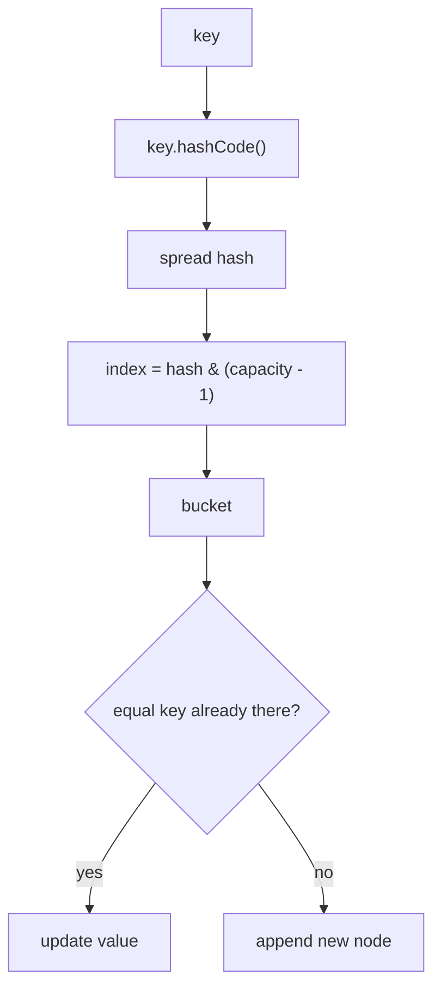
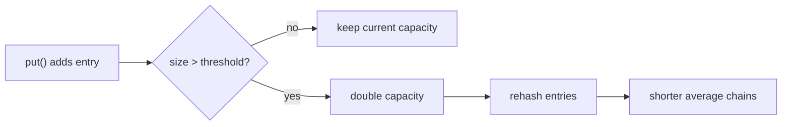

# HashMap: Basics and Java Implementation

> **Teaching model.** The examples use `VisualHashMap`, a small learning model
> that emits trace events for the visual panel. It shows the same ideas an
> interviewer cares about - `hashCode`, buckets, `equals`, collisions and
> resize - but it is not the full JDK implementation. For the deeper version,
> open [HashMap Internals](topic:hashmap).

## What HashMap Is

`HashMap<K, V>` stores values by key: give it a key, and it can usually find the
value in O(1) average time. In daily code it is the standard choice for lookup
tables, caches, grouping, counters and indexes.

Analogy: it is like a post office wall with numbered mailboxes. The key is the
address on a parcel, and the value is the parcel stored behind that address.

Internally, a `HashMap` is built from two simple ideas:

- an array of buckets, similar to the array side of [ArrayList vs LinkedList](topic:arraylist-vs-linkedlist);
- a small chain inside a bucket when several keys land in the same place.

Analogy: the post office has numbered shelves, and each shelf can hold a short
stack of parcels if several addresses are routed there.

## How put() Works

When you call `put(key, value)`, Java asks the key for `hashCode()`, spreads the
hash, and converts it to a bucket index. Real `HashMap` keeps capacity as a power
of two, so it can use `hash & (capacity - 1)` instead of a slower modulo.

Analogy: a postal clerk reads the address, applies a sorting rule, and sends the
parcel to mailbox number 0, 1, 2 and so on.

Then the map checks the bucket:

- if the bucket is empty, it stores a new node;
- if a node with an equal key already exists, it replaces the value;
- if different keys are already there, it appends a new node to the chain.

Analogy: an empty mailbox gets the first parcel; the same address replaces the
old delivery note; a different address in the same mailbox joins the stack.

## How get() Works

`get(key)` repeats the same route: compute hash, find bucket, then compare keys
inside that bucket with `equals()`. If it finds an equal key, it returns the
value. If the bucket is empty or the chain has no equal key, it returns `null`.

Analogy: the clerk does not scan the whole post office. They go straight to the
expected mailbox and check only the parcels stacked there.

## Collisions

A collision means two different keys choose the same bucket. This is normal.
`hashCode()` does not have to be unique; it only needs to spread keys well enough
that chains stay short.

Analogy: two streets can be assigned to the same delivery shelf. That is fine if
the shelf has only a few parcels.

In modern Java, a very long collision chain can become a red-black tree once the
chain is long enough and the table is large enough. That protects worst-case
lookup from becoming a long linear scan. The examples keep the simpler chain so
the first mental model is visible.

Analogy: if one shelf becomes too crowded, the post office replaces the stack
with a sorted mini-catalog so the clerk can search faster.

## Resize and Load Factor

The important numbers are:

- `capacity` - number of buckets, 16 by default;
- `loadFactor` - default 0.75;
- `threshold` - `capacity * loadFactor`, so 16 * 0.75 = 12.

When `size` becomes greater than `threshold`, the map resizes. It creates a
larger bucket array, normally double the old capacity, and moves entries into
their new bucket positions.

Analogy: when more than 12 parcels are squeezed onto 16 shelves, the post office
installs a larger wall of shelves and re-sorts the parcels.

Resize is the reason average `put` is still considered O(1): most inserts are
cheap, but an occasional insert pays for rehashing. The cost is spread across
many operations.

Analogy: most parcels go onto a shelf instantly; once in a while everyone helps
move to a bigger shelf wall.

## The Key Contract

HashMap depends on two key rules:

- if `a.equals(b)` is true, then `a.hashCode() == b.hashCode()` must also be true;
- the fields used by `equals()` and `hashCode()` must not change while the key is
  inside the map.

Analogy: if a parcel is filed under one address, the address label must not be
rewritten while the parcel sits on the shelf.

This is why `String` is a safe key: it is immutable. See [String Immutability](topic:string-immutability)
for the same idea in more detail. Custom mutable keys can be valid only if the
fields used by `equals()` and `hashCode()` stay stable while the object is a key.

Analogy: a laminated address card is fine; a pencil-written label that changes
after filing causes lost mail.

## Production Relevance

Use `HashMap` when you need fast lookup and do not need ordering or thread-safety.
Use `LinkedHashMap` when iteration order matters, `TreeMap` when sorted keys
matter, and `ConcurrentHashMap` when multiple threads update the map.

Analogy: a plain post office shelf is fastest for direct pickup. If you need
parcels in arrival order, sorted by street, or handled by many clerks at once,
you need a different shelf system.

## 60-Second Interview Answer

`HashMap` is a key-value data structure backed by an array of buckets. For
`put()` and `get()`, it takes the key's `hashCode()`, spreads it, and maps it to a
bucket index, usually with `hash & (capacity - 1)`. Inside the bucket it uses
`equals()` to find an existing key. Different keys can collide in the same bucket;
they are stored in a chain, and in real Java long chains can become trees. The
map resizes when `size` passes `capacity * loadFactor`, usually 0.75, to keep
chains short and average operations near O(1). Keys must have stable and
consistent `equals()` and `hashCode()`. `HashMap` does not guarantee iteration
order and is not thread-safe.

## Common Misconceptions

- Trap: `hashCode()` must be unique. Reality: collisions are expected and handled.
- Trap: collision means overwrite. Reality: only an equal key overwrites; a
  different key is stored next to it.
- Trap: `equals()` alone is enough. Reality: `equals()` and `hashCode()` are a
  pair for hash-based collections.
- Trap: changing a key object is harmless. Reality: changing fields used by
  `hashCode()` can make the entry unreachable.
- Trap: `HashMap` keeps insertion order. Reality: plain `HashMap` has no order
  guarantee.
- Trap: `HashMap` is safe for concurrent writes. Reality: use `ConcurrentHashMap`
  or external synchronization.
