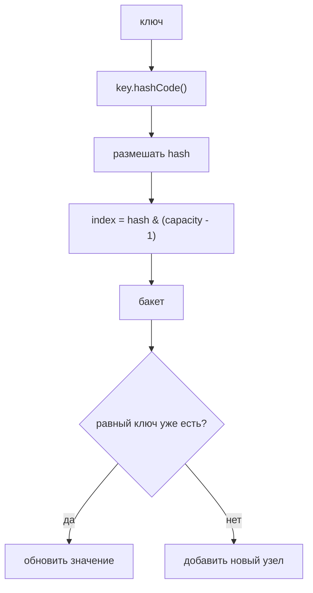
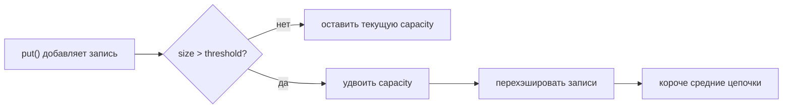

# HashMap: основы и реализация в Java

> **Учебная модель.** Примеры используют `VisualHashMap` - небольшую учебную
> модель, которая выдаёт trace-события для визуальной панели. Она показывает те
> же идеи, о которых спрашивает интервьюер: `hashCode`, бакеты, `equals`,
> коллизии и resize, - но это не полная реализация JDK. Более глубокая версия
> есть в [HashMap Internals](topic:hashmap).

## Что такое HashMap

`HashMap<K, V>` хранит значения по ключу: ты даёшь ключ, и обычно значение
находится за O(1) в среднем. В обычном коде это стандартный выбор для таблиц
поиска, кэшей, группировок, счётчиков и индексов.

Аналогия: это как стена с пронумерованными ячейками на почте. Ключ - адрес на
посылке, а значение - посылка, которая лежит за этим адресом.

Внутри `HashMap` построен из двух простых идей:

- массив бакетов, похожий на массивную часть из [ArrayList vs LinkedList](topic:arraylist-vs-linkedlist);
- короткая цепочка внутри бакета, если несколько ключей попали в одно место.

Аналогия: на почте есть пронумерованные полки, и каждая полка может держать
небольшую стопку посылок, если туда направили несколько адресов.

## Как работает put()

Когда ты вызываешь `put(key, value)`, Java просит у ключа `hashCode()`,
размешивает hash и превращает его в индекс бакета. Настоящий `HashMap` держит
capacity степенью двойки, поэтому может использовать `hash & (capacity - 1)`
вместо более медленного деления по модулю.

Аналогия: почтовый сотрудник читает адрес, применяет правило сортировки и
отправляет посылку в ячейку номер 0, 1, 2 и так далее.

Затем мапа проверяет бакет:

- если бакет пуст, она сохраняет новый узел;
- если узел с равным ключом уже есть, она заменяет значение;
- если там уже лежат другие ключи, она добавляет новый узел в цепочку.

Аналогия: пустая ячейка получает первую посылку; тот же адрес заменяет старую
записку о доставке; другой адрес в той же ячейке добавляется в стопку.

## Как работает get()

`get(key)` повторяет тот же маршрут: вычисляет hash, находит бакет, а затем
сравнивает ключи внутри бакета через `equals()`. Если найден равный ключ,
возвращается значение. Если бакет пуст или в цепочке нет равного ключа,
возвращается `null`.

Аналогия: сотрудник не обходит всю почту. Он сразу идёт к ожидаемой ячейке и
проверяет только посылки, которые лежат там.

## Коллизии

Коллизия означает, что два разных ключа выбрали один бакет. Это нормально.
`hashCode()` не обязан быть уникальным; он должен достаточно хорошо распределять
ключи, чтобы цепочки оставались короткими.

Аналогия: две улицы могут попасть на одну полку доставки. Это нормально, если на
полке всего несколько посылок.

В современной Java очень длинная цепочка коллизий может стать красно-чёрным
деревом, когда цепочка достаточно длинная и таблица достаточно большая. Это
защищает худший случай поиска от длинного линейного прохода. В примерах оставлена
простая цепочка, чтобы первая ментальная модель была видна.

Аналогия: если одна полка слишком переполнена, почта заменяет стопку
отсортированным мини-каталогом, чтобы сотрудник искал быстрее.

## Resize и load factor

Важные числа:

- `capacity` - число бакетов, по умолчанию 16;
- `loadFactor` - по умолчанию 0.75;
- `threshold` - `capacity * loadFactor`, то есть 16 * 0.75 = 12.

Когда `size` становится больше `threshold`, мапа выполняет resize. Она создаёт
больший массив бакетов, обычно в два раза больше старого, и переносит записи в
их новые позиции бакетов.

Аналогия: когда больше 12 посылок втиснуты в 16 полок, почта ставит большую
стену полок и заново сортирует посылки.

Resize - причина, почему средний `put` всё равно считается O(1): большинство
вставок дешёвые, но редкая вставка платит за перехэширование. Стоимость
размазывается по многим операциям.

Аналогия: большинство посылок сразу попадают на полку; иногда вся команда
помогает переехать на большую стену полок.

## Контракт ключа

HashMap зависит от двух правил для ключей:

- если `a.equals(b)` истинно, то `a.hashCode() == b.hashCode()` тоже должно быть истинно;
- поля, которые используются в `equals()` и `hashCode()`, не должны меняться,
  пока ключ находится в мапе.

Аналогия: если посылку положили по одному адресу, адресную наклейку нельзя
переписывать, пока посылка лежит на полке.

Поэтому `String` - безопасный ключ: он immutable. Подробнее эта идея разобрана в
[String Immutability](topic:string-immutability). Пользовательские изменяемые
ключи допустимы только если поля, используемые в `equals()` и `hashCode()`,
остаются стабильными, пока объект является ключом.

Аналогия: ламинированная адресная карточка подходит; карандашная надпись,
которую меняют после раскладки, приводит к потерянной посылке.

## Зачем это в продакшене

Используй `HashMap`, когда нужен быстрый поиск и не нужны порядок или
потокобезопасность. Используй `LinkedHashMap`, когда важен порядок обхода,
`TreeMap`, когда нужны отсортированные ключи, и `ConcurrentHashMap`, когда
несколько потоков обновляют мапу.

Аналогия: простая почтовая полка быстрее всего для прямого получения. Если нужны
посылки в порядке прихода, сортировка по улице или работа многих сотрудников
одновременно, нужна другая система полок.

## Ответ на собеседовании за 60 секунд

`HashMap` - это структура данных ключ-значение на основе массива бакетов. Для
`put()` и `get()` она берёт `hashCode()` ключа, размешивает его и превращает в
индекс бакета, обычно через `hash & (capacity - 1)`. Внутри бакета она использует
`equals()`, чтобы найти существующий ключ. Разные ключи могут столкнуться в одном
бакете; они хранятся в цепочке, а в настоящей Java длинные цепочки могут стать
деревьями. Мапа выполняет resize, когда `size` превышает `capacity * loadFactor`,
обычно 0.75, чтобы цепочки оставались короткими, а средние операции были близки к
O(1). У ключей должны быть стабильные и согласованные `equals()` и `hashCode()`.
`HashMap` не гарантирует порядок обхода и не является потокобезопасным.

## Частые заблуждения

- Ловушка: `hashCode()` должен быть уникальным. Реальность: коллизии ожидаемы и
  обрабатываются.
- Ловушка: коллизия означает перезапись. Реальность: перезаписывает только
  равный ключ; другой ключ хранится рядом.
- Ловушка: одного `equals()` достаточно. Реальность: `equals()` и `hashCode()` -
  пара для hash-based коллекций.
- Ловушка: менять объект-ключ безопасно. Реальность: изменение полей, участвующих
  в `hashCode()`, может сделать запись недоступной.
- Ловушка: `HashMap` сохраняет порядок вставки. Реальность: обычный `HashMap` не
  даёт гарантии порядка.
- Ловушка: `HashMap` безопасен для конкурентных записей. Реальность: используй
  `ConcurrentHashMap` или внешнюю синхронизацию.
