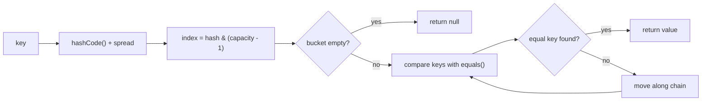
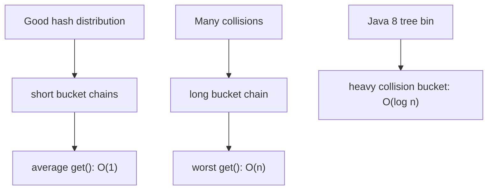

# HashMap Lookup Speed

When an interviewer asks "What is the lookup speed of HashMap?", the short answer is: average `O(1)`, worst case `O(n)`, and in modern Java a heavily collided treeified bucket can be searched in `O(log n)`. The useful answer also explains why.

Think of a busy post office. A `HashMap` does not walk every parcel shelf. It prints a shelf number from the key, goes to that shelf, and checks only the parcels on that shelf.

## What get() Actually Does

`get(key)` first asks the key for `hashCode()`, spreads the hash bits, and computes a bucket index, typically with `hash & (capacity - 1)`. This is like turning a delivery address into a sorting shelf number at the post office.

Then `HashMap` looks only inside that bucket. If the bucket is empty, the answer is immediately `null`; if it contains entries, `HashMap` compares keys with `equals()`. This is like opening one shelf and reading the labels on the few parcels stored there.

That is why the average case is `O(1)`: with a good hash distribution and a reasonable load factor, each bucket chain stays short. It is like a kitchen with many labeled drawers: finding the spoon is fast because each drawer holds only a small handful of tools.

## Average, Worst, And Java 8

Average `O(1)` does not mean "magic constant time in every situation". It means the expected number of entries in the target bucket is small. In traffic terms, most cars are spread across many lanes, so one lane does not become a parking lot.

If many different keys land in the same bucket, lookup must compare against more entries in that bucket. In the old linked-list model, a bucket with `n` collided entries gives worst-case `O(n)`. That is like all post-office parcels being dumped onto one shelf: you are back to searching through the pile.

Since Java 8, a long collision chain can become a red-black tree when the bin is large enough and the table is already sufficiently big. Then searching that one bucket is closer to `O(log n)` instead of `O(n)`. The important interview wording is still: average `O(1)`, pathological collisions worse; Java 8 reduces the worst collision impact with tree bins.

For the full storage mechanics, see [HashMap internals](topic:hashmap). If you need the beginner version first, start with [HashMap basics](topic:hashmap-basics).

## 60-Second Interview Answer

`HashMap.get()` is average `O(1)` because it computes a hash, maps it to a bucket index, and checks only that bucket. The answer relies on a good `hashCode()` distribution, a sensible load factor, and enough capacity to keep bucket chains short. If many keys collide into the same bucket, lookup can degrade to `O(n)` in a linked chain. Since Java 8, large collision bins can be treeified, so lookup in that bin can be `O(log n)` under the tree-bin conditions. Resize is mostly a `put()` cost; after rehashing, later `get()` calls again compute the target bucket directly.

## Production Relevance

Caches, request maps, deduplication sets, and indexes often depend on `HashMap` lookup being fast. In a warehouse analogy, the whole system stays quick because labels send workers to the right shelf instead of making them scan the whole building.

Bad key design hurts production behavior. If `hashCode()` returns the same value for many keys, one bucket becomes crowded. If a key is mutable and its hash-relevant fields change after insertion, `get()` may search the wrong bucket. That is like changing the parcel label after it was shelved: the parcel is still there, but the clerk is sent to another shelf.

Capacity and load factor matter when maps grow. More buckets cost memory, but keep shelves less crowded; too few buckets save space but create longer searches. This is the same trade-off as adding more checkout counters in a store: more counters take space, but reduce lines.

## Common Misconceptions

- "`HashMap.get()` is always `O(1)`." No. It is average `O(1)` under normal hash distribution. A badly crowded bucket can be slower, like one traffic lane carrying the whole city.
- "Collisions mean data is lost." No. Collided entries are stored in the same bucket and distinguished with `equals()`. It is like multiple parcels on one shelf with different names on the labels.
- "Resize makes every later lookup slow." No. Resize is paid during growth, mainly on `put()`. After entries are redistributed, lookup again uses the new bucket array directly.
- "Any object is a safe key." Only if `equals()` and `hashCode()` are stable and consistent while the object is in the map. A key that changes its hash is like moving the address sign after the delivery.
- "Tree bins mean worst case no longer matters." Tree bins reduce the damage from long collision chains, but you should still design good keys. You do not build a post office assuming every parcel arrives for the same shelf.
