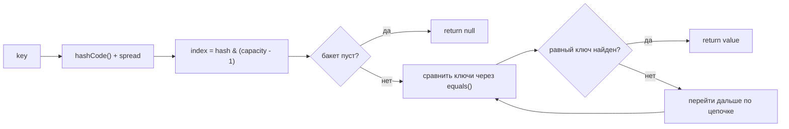
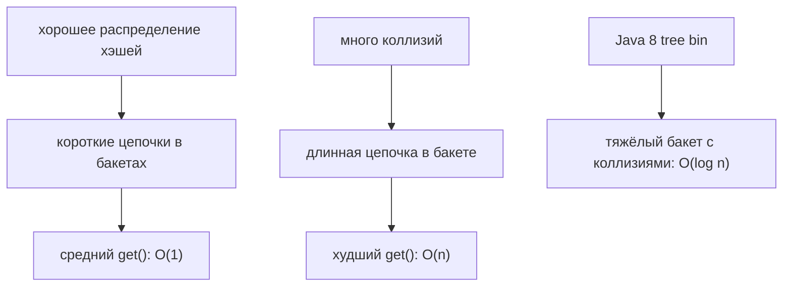

# Скорость выборки в HashMap

Когда на собеседовании спрашивают «Какая скорость выборки у HashMap?», короткий ответ такой: в среднем `O(1)`, в худшем случае `O(n)`, а в современной Java сильно перегруженный treeified bucket может искаться за `O(log n)`. Полезный ответ ещё объясняет почему.

Представь загруженное почтовое отделение. `HashMap` не проходит по каждой полке с посылками. Он получает номер полки из ключа, идёт к этой полке и проверяет только посылки на ней.

## Что На Самом Деле Делает get()

`get(key)` сначала вызывает у ключа `hashCode()`, перемешивает биты хэша и вычисляет индекс бакета, обычно через `hash & (capacity - 1)`. Это похоже на то, как адрес доставки превращают в номер сортировочной полки на почте.

Затем `HashMap` смотрит только внутрь этого бакета. Если бакет пустой, ответ сразу `null`; если в нём есть записи, `HashMap` сравнивает ключи через `equals()`. Это как открыть одну полку и прочитать ярлыки на нескольких посылках, которые лежат именно там.

Поэтому средний случай — `O(1)`: при хорошем распределении хэшей и разумном load factor цепочки в бакетах остаются короткими. Это как кухня с множеством подписанных ящиков: найти ложку быстро, потому что в каждом ящике лежит немного предметов.

## Средний Случай, Худший Случай И Java 8

Среднее `O(1)` не означает «магическое постоянное время всегда». Это означает, что ожидаемое число записей в нужном бакете маленькое. В дорожной аналогии машины распределены по многим полосам, поэтому одна полоса не превращается в парковку.

Если много разных ключей попадают в один бакет, поиск должен сравнивать больше записей внутри этого бакета. В старой модели со связным списком бакет с `n` коллизиями даёт худший случай `O(n)`. Это как если все посылки на почте свалили на одну полку: снова приходится перебирать кучу.

Начиная с Java 8 длинная цепочка коллизий может превратиться в red-black tree, когда бакет достаточно большой и сама таблица уже достаточно велика. Тогда поиск внутри такого бакета ближе к `O(log n)` вместо `O(n)`. Важная формулировка для собеседования остаётся такой: в среднем `O(1)`, патологические коллизии хуже; Java 8 снижает ущерб от худших коллизий через tree bins.

Подробные механики хранения смотри в [устройстве HashMap](topic:hashmap). Если сначала нужна базовая версия, начни с [основ HashMap](topic:hashmap-basics).

## Ответ За 60 Секунд

`HashMap.get()` в среднем работает за `O(1)`, потому что вычисляет хэш, превращает его в индекс бакета и проверяет только этот бакет. Этот ответ опирается на хорошее распределение `hashCode()`, разумный load factor и достаточную capacity, чтобы цепочки в бакетах оставались короткими. Если много ключей сталкиваются в одном бакете, поиск может ухудшиться до `O(n)` в связной цепочке. Начиная с Java 8 большие collision bins могут превращаться в дерево, поэтому поиск в таком бакете может быть `O(log n)` при выполнении условий tree-bin. Resize в основном является стоимостью `put()`; после перераспределения последующие `get()` снова напрямую вычисляют нужный бакет.

## Практическая Значимость

Кэши, карты запросов, дедупликация и индексы часто рассчитывают на быстрый поиск в `HashMap`. В аналогии со складом вся система остаётся быстрой, потому что ярлыки отправляют работников к нужной полке, а не заставляют обходить всё здание.

Плохой дизайн ключей вредит production-поведению. Если `hashCode()` возвращает одно и то же значение для многих ключей, один бакет переполняется. Если ключ изменяемый и его поля, влияющие на хэш, меняются после вставки, `get()` может искать не в том бакете. Это как изменить ярлык посылки после того, как её положили на полку: посылка всё ещё там, но сотрудника отправили к другой полке.

Capacity и load factor важны, когда мапа растёт. Больше бакетов требует больше памяти, но делает полки менее забитыми; слишком мало бакетов экономит место, но удлиняет поиск. Это тот же компромисс, что и с дополнительными кассами в магазине: кассы занимают место, зато уменьшают очереди.

## Частые Заблуждения

- «`HashMap.get()` всегда `O(1)`». Нет. Это среднее `O(1)` при нормальном распределении хэшей. Сильно забитый бакет может быть медленнее, как одна дорожная полоса, через которую едет весь город.
- «Коллизии означают потерю данных». Нет. Записи с коллизией хранятся в одном бакете и различаются через `equals()`. Это как несколько посылок на одной полке с разными именами на ярлыках.
- «Resize делает все последующие выборки медленными». Нет. Resize оплачивается при росте, в основном на `put()`. После перераспределения записей поиск снова напрямую использует новый массив бакетов.
- «Любой объект безопасен как ключ». Только если `equals()` и `hashCode()` стабильны и согласованы, пока объект находится в мапе. Ключ, меняющий хэш, похож на адресную табличку, которую переставили после доставки.
- «Tree bins означают, что худший случай больше не важен». Tree bins уменьшают ущерб от длинных цепочек коллизий, но хорошие ключи всё равно нужны. Почту не проектируют так, будто все посылки всегда приходят на одну полку.
