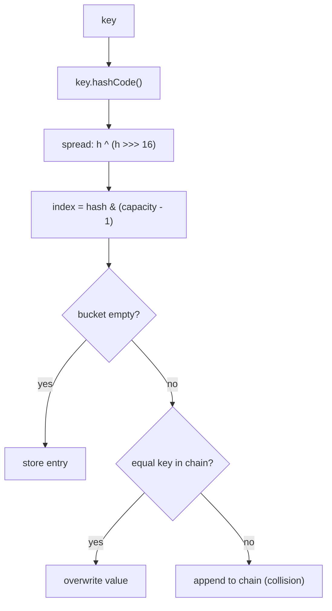
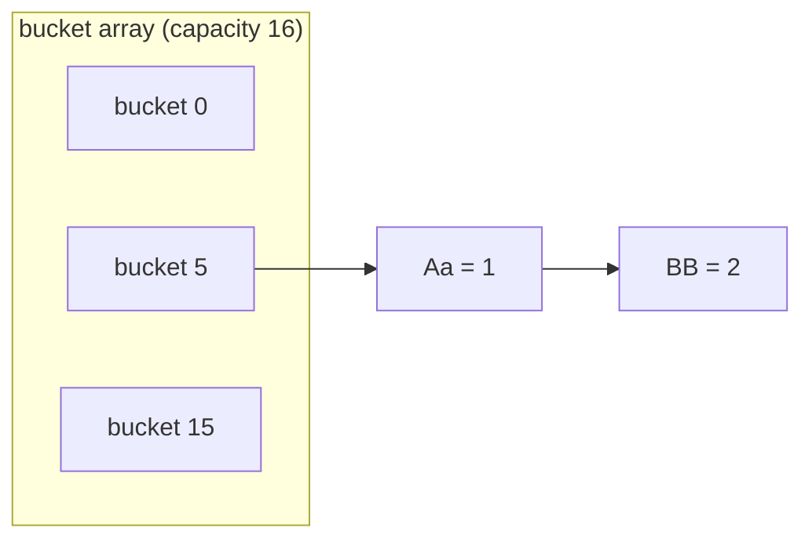
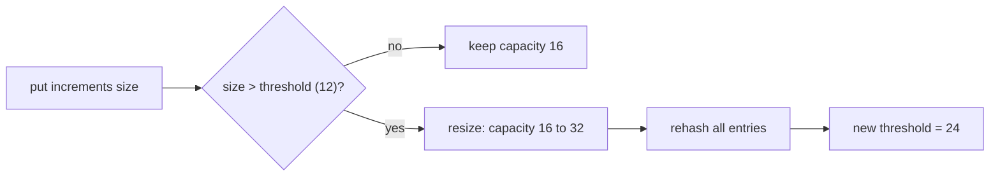

# HashMap Internals

> **Teaching model.** The runnable code uses `VisualHashMap`, a learning model
> that reproduces the ideas an interviewer asks about — hashing, bucket index,
> collisions, load factor and resize — and emits trace events the panel on the
> right replays. It is **not** the JDK `HashMap` (e.g. it does not treeify long
> chains into a red-black tree). The *behaviour you reason about* is the same.

## The mental model

A `HashMap` is an **array of buckets**. To store a key:

1. Take `key.hashCode()`.
2. **Spread** it so high bits affect the low bits: `h ^ (h >>> 16)`.
3. Turn it into a bucket index with `hash & (capacity - 1)` (a fast `mod` because
   capacity is always a power of two).
4. Put the entry in that bucket. If the bucket already has entries, this is a
   **collision** and the entry joins the bucket's chain (separate chaining).

`get(key)` repeats steps 1–3 to find the bucket, then walks the chain comparing
with `equals()`.

## Collisions

Different keys can land in the same bucket. Java's `"Aa"` and `"BB"` both have
`hashCode() == 2112`, so they always collide. Collisions are normal and cheap
until chains get long; the real `HashMap` converts a bucket to a red-black tree
once a chain passes 8 entries (with capacity ≥ 64) to keep lookups O(log n).

Keys `"Aa"` and `"BB"` both hash to `2112`, so they share a bucket and chain:

## Load factor and resize

- **capacity** — number of buckets (starts at 16, always a power of two).
- **load factor** — 0.75 by default.
- **threshold** = capacity × load factor (16 × 0.75 = 12).

When `size` exceeds the threshold, the map **resizes**: capacity doubles and
every entry is rehashed into the larger array. This keeps chains short so
average `get`/`put` stay ~O(1).

## The equals / hashCode contract

Keys must honour the contract:

- If `a.equals(b)` then `a.hashCode() == b.hashCode()`.
- `hashCode()` must be **stable** while the key is in the map.

Break it and the map breaks:

- **Mutable key** — change a field that `hashCode()` depends on after inserting,
  and `get()` looks in the wrong bucket and returns `null`.
- **equals without hashCode** — two "equal" keys with different hashes land in
  different buckets, so you get duplicates / failed lookups.

## Interview answer (60 seconds)

> A `HashMap` is an array of buckets. It spreads the key's `hashCode`, masks it
> with `capacity - 1` to pick a bucket, and stores the entry there. Colliding
> keys chain in the same bucket (and turn into a balanced tree once a chain is
> long). It keeps `size / capacity` under the load factor (0.75) by doubling
> capacity and rehashing, so operations stay roughly O(1). Keys must have a
> stable, consistent `equals`/`hashCode`; a mutable key or a missing `hashCode`
> silently breaks lookups. It is not thread-safe — use `ConcurrentHashMap`.

## Common misconceptions

- ❌ "HashMap keeps keys sorted." — No; iteration order is unspecified.
- ❌ "hashCode must be unique." — No; collisions are expected and handled.
- ❌ "A collision overwrites the old value." — No; only an *equal* key overwrites.
- ❌ "equals is enough; hashCode is optional." — No; both are required.
- ❌ "HashMap is fine across threads." — No; concurrent writes can corrupt it.
