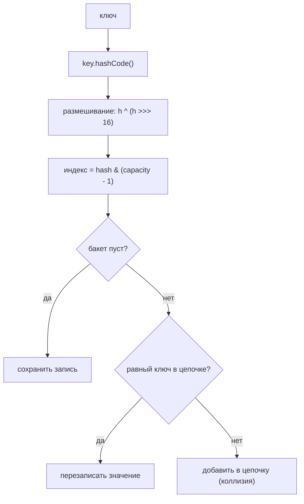
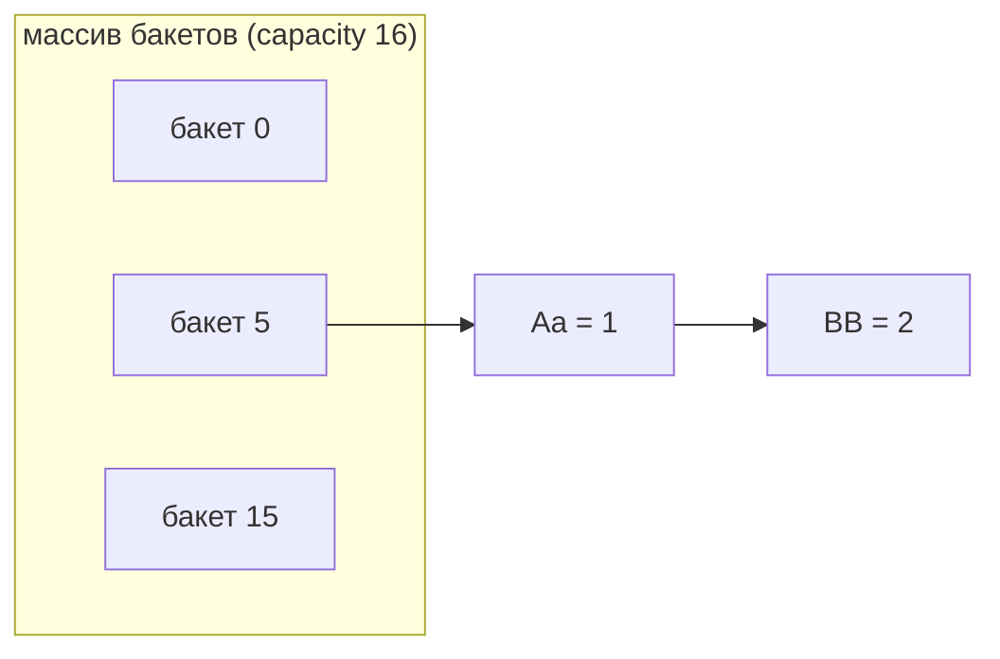
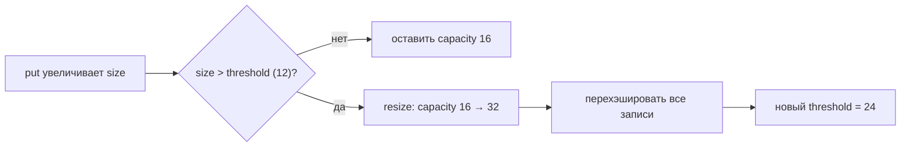

# Устройство HashMap

> **Учебная модель.** Запускаемый код использует `VisualHashMap` — учебную модель,
> которая воспроизводит идеи, о которых спрашивают на собеседовании: хэширование,
> индекс бакета, коллизии, коэффициент загрузки и resize, — и порождает события,
> которые проигрывает панель справа. Это **не** JDK-`HashMap` (например, длинные
> цепочки не превращаются в красно-чёрное дерево). Но *поведение, о котором ты
> рассуждаешь*, такое же.

## Ментальная модель

`HashMap` — это **массив бакетов**. Чтобы сохранить ключ:

1. Берём `key.hashCode()`.
2. **Размешиваем** его, чтобы старшие биты влияли на младшие: `h ^ (h >>> 16)`.
3. Превращаем в индекс бакета через `hash & (capacity - 1)` (быстрый `mod`, потому
   что capacity всегда степень двойки).
4. Кладём запись в этот бакет. Если в бакете уже есть записи — это **коллизия**, и
   запись добавляется в цепочку бакета (separate chaining).

`get(key)` повторяет шаги 1–3, находит бакет и проходит цепочку, сравнивая по `equals()`.

## Коллизии

Разные ключи могут попасть в один бакет. У `"Aa"` и `"BB"` в Java одинаковый
`hashCode() == 2112`, поэтому они всегда сталкиваются. Коллизии — это нормально и
дёшево, пока цепочки короткие; настоящий `HashMap` превращает бакет в красно-чёрное
дерево, когда цепочка превышает 8 элементов (при capacity ≥ 64), чтобы поиск оставался
O(log n).

У ключей `"Aa"` и `"BB"` одинаковый хэш `2112`, поэтому они делят один бакет и образуют цепочку:

## Коэффициент загрузки и resize

- **capacity** — число бакетов (начинается с 16, всегда степень двойки).
- **load factor** — по умолчанию 0.75.
- **threshold** = capacity × load factor (16 × 0.75 = 12).

Когда `size` превышает порог, мапа выполняет **resize**: capacity удваивается, и все
записи перехэшируются в больший массив. Это сохраняет цепочки короткими, так что
средние `get`/`put` остаются ~O(1).

## Контракт equals / hashCode

Ключи должны соблюдать контракт:

- Если `a.equals(b)`, то `a.hashCode() == b.hashCode()`.
- `hashCode()` должен быть **стабильным**, пока ключ находится в мапе.

Нарушь это — и мапа ломается:

- **Изменяемый ключ** — измени поле, от которого зависит `hashCode()`, после вставки,
  и `get()` заглянет не в тот бакет и вернёт `null`.
- **equals без hashCode** — два «равных» ключа с разными хэшами попадут в разные
  бакеты, и ты получишь дубликаты / неудачный поиск.

## Ответ на собеседовании (за 60 секунд)

> `HashMap` — это массив бакетов. Он размешивает `hashCode` ключа, накладывает
> маску `capacity - 1`, чтобы выбрать бакет, и кладёт туда запись. Сталкивающиеся
> ключи образуют цепочку в одном бакете (а при длинной цепочке — сбалансированное
> дерево). Он держит `size / capacity` ниже коэффициента загрузки (0.75), удваивая
> capacity и перехэшируя, поэтому операции остаются примерно O(1). У ключей должны
> быть стабильные и согласованные `equals`/`hashCode`; изменяемый ключ или
> отсутствующий `hashCode` молча ломают поиск. Он не потокобезопасен — используй
> `ConcurrentHashMap`.

## Частые заблуждения

- ❌ «HashMap хранит ключи отсортированными.» — Нет; порядок обхода не определён.
- ❌ «hashCode должен быть уникальным.» — Нет; коллизии ожидаемы и обрабатываются.
- ❌ «Коллизия перезаписывает старое значение.» — Нет; перезаписывает только *равный* ключ.
- ❌ «equals достаточно, hashCode не обязателен.» — Нет; нужны оба.
- ❌ «HashMap нормально работает между потоками.» — Нет; конкурентная запись портит его.
