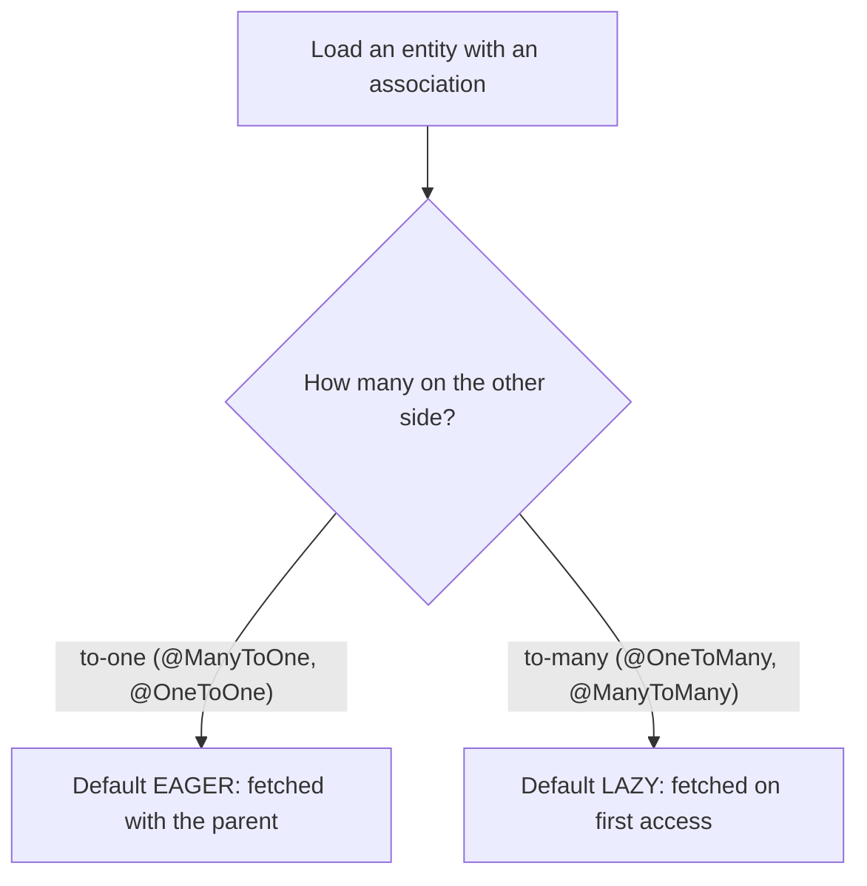
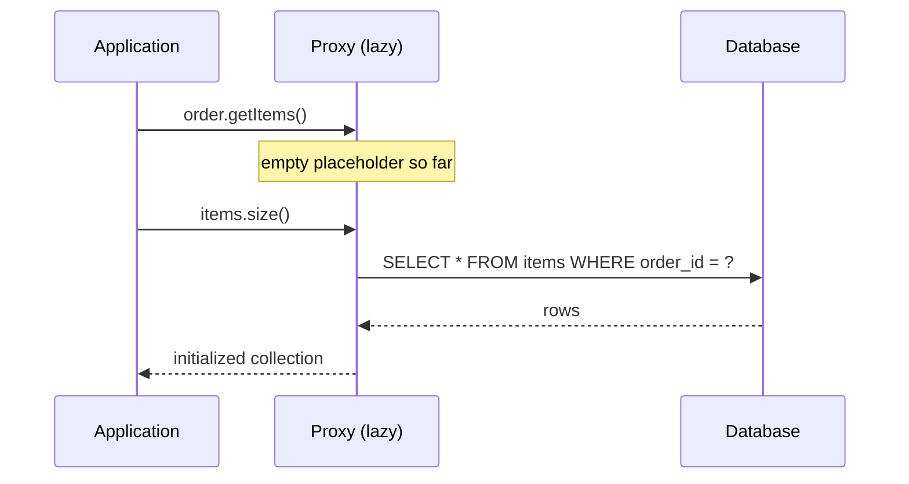
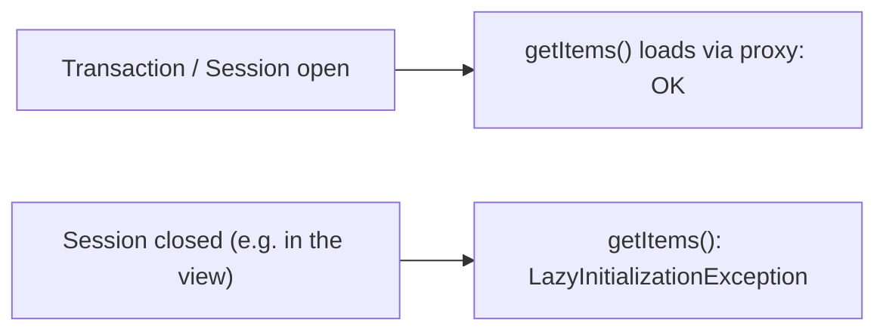

# Default Entity Loading Strategy

When you load an entity that points at other entities, Hibernate has to decide
**when** to pull those related rows from the database: right now, together with the
parent (**EAGER**), or later, only if you actually touch them (**LAZY**).

Think of ordering at a restaurant. The waiter can bring your side dish *with* the
main course whether you wanted it or not (EAGER), or leave a note "side available
on request" and fetch it only when you ask (LAZY). EAGER means more on the tray up
front; LAZY means fewer trips unless you need more.

## The default depends on the association's cardinality

JPA — and therefore Hibernate — does **not** use one global default. The default
fetch type is decided per annotation, by how many rows could be on the other end:

| Association | Default fetch | Intuition |
|-------------|---------------|-----------|
| `@ManyToOne` | **EAGER** | one related row — cheap to grab now |
| `@OneToOne`  | **EAGER** | one related row — cheap to grab now |
| `@OneToMany` | **LAZY**  | could be thousands of rows — don't drag them along |
| `@ManyToMany`| **LAZY**  | could be thousands of rows — don't drag them along |

The rule of thumb: **to-one is EAGER, to-many is LAZY.** The reasoning is a
delivery one — a parcel with a single attached item is fine to deliver together,
but you would never load an entire warehouse onto the van just because someone
ordered one box.

## How LAZY actually works: the proxy

LAZY does not fetch nothing — it hands you a **proxy**: a stand-in object that
looks like the real association but holds no data yet. The first time you call a
method on it, the proxy quietly runs a `SELECT` to fill itself. This is exactly the
[Proxy pattern](topic:design-patterns-overview) — a placeholder that controls
access to the real thing, just like a parcel-tracking slip: it represents the
package and triggers the actual retrieval only when you open it.

For collections, Hibernate gives you a lazy `PersistentBag`/`PersistentSet`; for a
single `@ManyToOne`/`@OneToOne` it can give you a subclass proxy of the entity.

## Why the defaults bite you

The EAGER-by-default on to-one is a classic trap.

- **The N+1 problem.** Load 100 orders, each with an EAGER `@ManyToOne` customer,
  and a naive query becomes 1 query for the orders + 100 extra for the customers.
  It is like a courier doing a separate trip for every single envelope instead of
  loading them all on one truck.
- **EAGER is not negotiable per query.** Marked EAGER on the mapping, the
  association is fetched on *every* load of that entity, even the screens that
  never show it — extra weight on every tray, forever.
- **`LazyInitializationException`.** If you access a LAZY association *after* the
  persistence context (Session) is closed, Hibernate has no open connection to run
  the `SELECT`, so it throws. It is like going back to the post office to claim
  your parcel after closing time — the counter that could fetch it is shut.

This is why the session boundary matters so much; the same proxy/boundary thinking
shows up in [how @Transactional works](topic:spring-transactional-proxy).

## The recommended practice

Most teams treat the defaults as something to override:

- **Make associations LAZY**, including to-one — add `fetch = FetchType.LAZY` to
  `@ManyToOne`/`@OneToOne`. Order minimal, then ask for sides explicitly.
- **Fetch what a use case needs explicitly** with a `JOIN FETCH` query or an
  **EntityGraph**, so each screen loads exactly its data in one query — like
  pre-packing one box with exactly the items this customer ordered.
- **Keep the session open long enough** for the work, or map to a DTO so nothing
  lazy escapes the transaction.

## 60-second interview answer

> JPA's default fetch strategy is decided per association by cardinality, not one
> global setting. To-one associations — `@ManyToOne` and `@OneToOne` — are **EAGER**
> by default, so the related entity is loaded together with its parent. To-many
> associations — `@OneToMany` and `@ManyToMany` — are **LAZY** by default, so the
> collection is loaded only on first access, through a proxy that runs a `SELECT`
> when touched. In practice the EAGER default on to-one causes N+1 queries and
> always-on fetching, so the common recommendation is to make everything `LAZY` and
> fetch what each use case needs explicitly with `JOIN FETCH` or an entity graph. The
> catch with LAZY is the `LazyInitializationException` if you touch the association
> after the session is closed.

## Common misconceptions

- ❌ "Everything is LAZY by default." — Only to-many is. `@ManyToOne` and
  `@OneToOne` default to **EAGER**.
- ❌ "LAZY means the data is never loaded." — It is loaded on first access, as long
  as the session is still open.
- ❌ "EAGER is faster." — EAGER often triggers N+1 and loads data you don't need;
  it is not a performance setting, it is a *when* setting.
- ❌ "You can't change the default." — You can: set `fetch = FetchType.LAZY` (or
  `EAGER`) on the annotation. The default is just what applies if you say nothing.
- ❌ "`JOIN FETCH` changes the mapping default." — It only changes fetching for that
  one query; the mapping's declared fetch type still applies elsewhere.
