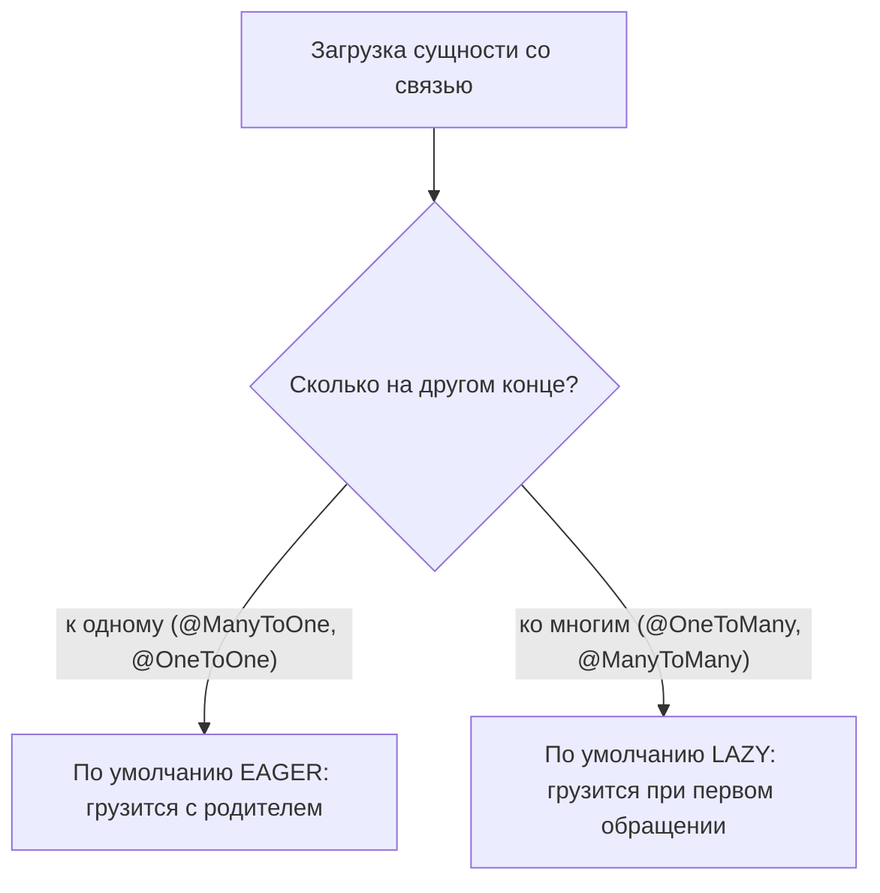
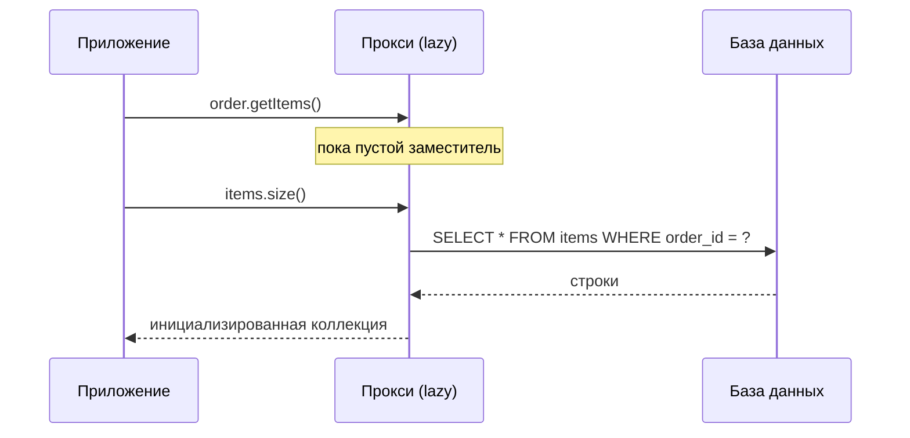
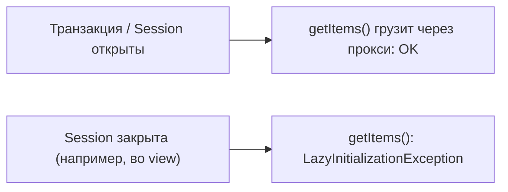

# Стратегия загрузки сущностей по умолчанию

Когда вы загружаете сущность, которая ссылается на другие сущности, Hibernate
должен решить, **когда** доставать связанные строки из базы: прямо сейчас, вместе с
родителем (**EAGER**), или позже, только если вы реально к ним обратитесь
(**LAZY**).

Представьте заказ в ресторане. Официант может принести гарнир *вместе* с основным
блюдом, хотели вы того или нет (EAGER), либо оставить пометку «гарнир по запросу» и
принести его только когда вы попросите (LAZY). EAGER — больше всего сразу на
подносе; LAZY — меньше походов, пока вам не понадобится добавка.

## Значение по умолчанию зависит от кардинальности связи

JPA — а значит и Hibernate — **не** использует один глобальный режим. Стратегия по
умолчанию решается для каждой аннотации в зависимости от того, сколько строк может
быть на другом конце связи:

| Связь | По умолчанию | Интуиция |
|-------|--------------|----------|
| `@ManyToOne` | **EAGER** | одна связанная строка — дёшево взять сразу |
| `@OneToOne`  | **EAGER** | одна связанная строка — дёшево взять сразу |
| `@OneToMany` | **LAZY**  | могут быть тысячи строк — не тащим их с собой |
| `@ManyToMany`| **LAZY**  | могут быть тысячи строк — не тащим их с собой |

Правило: **«к одному» — EAGER, «ко многим» — LAZY.** Логика как у доставки: посылку
с одним вложением нормально привезти вместе, но вы никогда не загрузите целый склад
в фургон только потому, что кто-то заказал одну коробку.

## Как на самом деле работает LAZY: прокси

LAZY не грузит «ничего» — он отдаёт вам **прокси**: объект-заместитель, который
выглядит как настоящая связь, но пока не содержит данных. При первом же вызове
метода прокси тихо выполняет `SELECT` и наполняет себя. Это в точности
[паттерн Proxy](topic:design-patterns-overview) — заместитель, контролирующий
доступ к настоящему объекту, как квитанция на посылку: она представляет посылку и
запускает реальную выдачу только когда вы её «открываете».

Для коллекций Hibernate отдаёт ленивые `PersistentBag`/`PersistentSet`; для
одиночной `@ManyToOne`/`@OneToOne` — прокси-наследник самой сущности.

## Чем опасны значения по умолчанию

EAGER по умолчанию для связей «к одному» — классическая ловушка.

- **Проблема N+1.** Загрузите 100 заказов, у каждого EAGER `@ManyToOne` на клиента —
  и наивный запрос превращается в 1 запрос за заказами + 100 лишних за клиентами.
  Это как курьер, делающий отдельную поездку за каждым конвертом, вместо того чтобы
  загрузить все в один грузовик.
- **EAGER нельзя отключить для конкретного запроса.** Если связь помечена EAGER в
  маппинге, она грузится при *каждой* загрузке этой сущности, даже на экранах, где
  она вообще не нужна — лишний вес на подносе всегда.
- **`LazyInitializationException`.** Если обратиться к LAZY-связи *после* того, как
  контекст персистентности (Session) закрыт, у Hibernate нет открытого соединения,
  чтобы выполнить `SELECT`, и он бросает исключение. Это как прийти на почту за
  посылкой после закрытия — окошко, которое могло её выдать, уже не работает.

Поэтому граница сессии так важна; то же мышление про прокси и границы возникает в
теме [как работает @Transactional](topic:spring-transactional-proxy).

## Рекомендуемая практика

Большинство команд воспринимают значения по умолчанию как то, что нужно
переопределить:

- **Делайте связи LAZY**, включая «к одному» — добавляйте `fetch = FetchType.LAZY`
  к `@ManyToOne`/`@OneToOne`. Заказывайте минимум, а гарнир просите явно.
- **Явно загружайте то, что нужно сценарию** — запросом с `JOIN FETCH` или через
  **EntityGraph**, чтобы каждый экран грузил ровно свои данные одним запросом — как
  заранее собрать одну коробку именно с теми товарами, что заказал клиент.
- **Держите сессию открытой ровно столько**, сколько нужно для работы, либо
  отображайте в DTO, чтобы ничего ленивого не «утекло» за пределы транзакции.

## Ответ за 60 секунд

> Стратегия загрузки по умолчанию в JPA задаётся для каждой связи по
> кардинальности, а не одной глобальной настройкой. Связи «к одному» — `@ManyToOne`
> и `@OneToOne` — по умолчанию **EAGER**, поэтому связанная сущность грузится вместе
> с родителем. Связи «ко многим» — `@OneToMany` и `@ManyToMany` — по умолчанию
> **LAZY**, поэтому коллекция грузится только при первом обращении, через прокси,
> который выполняет `SELECT`, когда к нему обращаются. На практике EAGER по
> умолчанию для «к одному» вызывает N+1 и постоянную загрузку, поэтому обычно
> рекомендуют делать всё `LAZY` и явно догружать нужное через `JOIN FETCH` или
> entity graph. Обратная сторона LAZY — `LazyInitializationException`, если
> обратиться к связи после закрытия сессии.

## Частые заблуждения

- ❌ «По умолчанию всё LAZY». — Только «ко многим». `@ManyToOne` и `@OneToOne` по
  умолчанию **EAGER**.
- ❌ «LAZY значит, что данные не загрузятся никогда». — Они грузятся при первом
  обращении, пока сессия ещё открыта.
- ❌ «EAGER быстрее». — EAGER часто вызывает N+1 и грузит ненужные данные; это не
  настройка производительности, а настройка *когда* грузить.
- ❌ «Значение по умолчанию нельзя изменить». — Можно: укажите
  `fetch = FetchType.LAZY` (или `EAGER`) в аннотации. По умолчанию — это лишь то,
  что применяется, если вы ничего не указали.
- ❌ «`JOIN FETCH` меняет значение по умолчанию в маппинге». — Он меняет загрузку
  только для этого одного запроса; объявленный в маппинге fetch type продолжает
  действовать в остальных местах.
