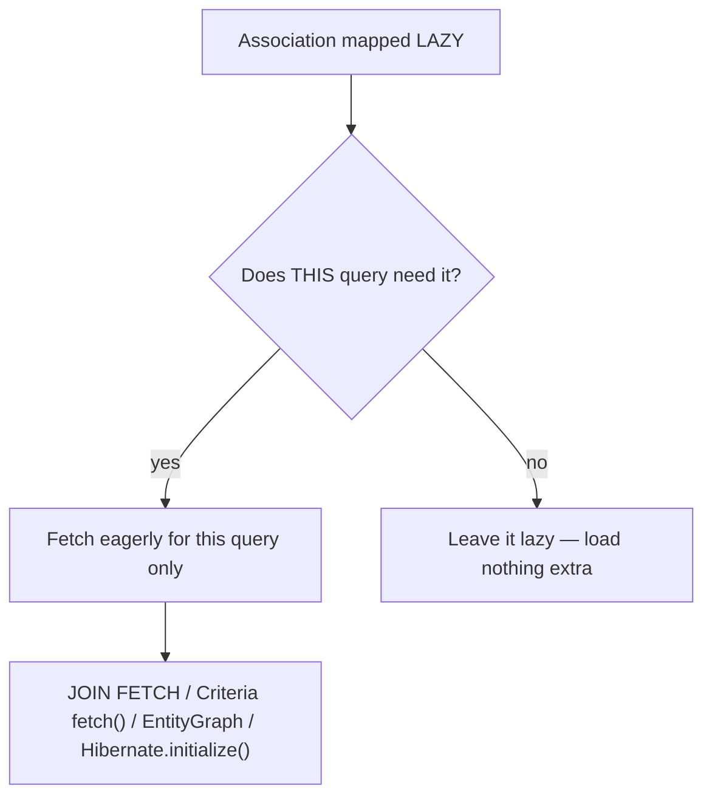
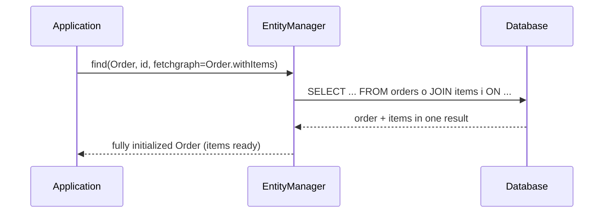

# Eager Fetching for a Single Query

The recommended mapping makes associations **LAZY** — see
[Default Entity Loading Strategy](topic:hibernate-default-fetch-strategy). That keeps
every load lean, but now you have the opposite need: *this one screen* really does
need the parent **and** its associations in one go. The answer is **per-query eager
fetching** — you ask for the related data when you run the query, without touching
the mapping.

Think of a warehouse where every box ships **LAZY** by default: the courier brings
just the box you ordered. But for one big order you call ahead and say "pack the
box *and* its accessories on the same pallet." You did not change the warehouse's
standing policy — you gave a special instruction *for this one delivery*.

## Why not just flip the mapping to EAGER?

Because EAGER on the mapping is **forever and everywhere**: every load of that
entity drags the association along, even the screens that never show it, and it
tends to cause N+1 queries. Query-time fetching is **opt-in per use case** — the
list screen stays lean, the detail screen fetches more. It is the difference
between a restaurant that *always* brings every side dish (EAGER mapping) and one
where you order sides *only when this table wants them* (per-query fetch).



## Option 1: JOIN FETCH (JPQL / HQL)

The most direct tool. In a query, `JOIN FETCH` tells Hibernate to load the
association **in the same SQL** as the root entity, initializing it immediately:

```java
List<Order> orders = em.createQuery("""
        SELECT o FROM Order o
        JOIN FETCH o.items
        WHERE o.status = :s
        """, Order.class)
    .setParameter("s", Status.PAID)
    .getResultList();
```

This emits a single `SELECT` with a SQL join, so `o.getItems()` is already filled —
no second trip, no `LazyInitializationException`. It is the pre-packed pallet: the
box and its accessories arrive together on one truck. Use `LEFT JOIN FETCH` if you
still want parents that have no children. Note that a normal `JOIN` (without
`FETCH`) only filters — it does **not** initialize the association.

## Option 2: Criteria API fetch()

The same idea, built dynamically when the query is assembled in code rather than as
a string. `root.fetch(...)` is the Criteria equivalent of `JOIN FETCH`:

```java
CriteriaQuery<Order> cq = cb.createQuery(Order.class);
Root<Order> root = cq.select(cq.from(Order.class));
root.fetch("items", JoinType.LEFT);
```

Same pallet, assembled on a conveyor instead of written on a paper order — handy
when filters and fetches are decided at runtime.

## Option 3: JPA Entity Graphs

An **entity graph** declares *which attributes to load* and is attached to an
otherwise normal `find` or query — so the same finder can be lean on one call and
rich on another. Define it once and reuse it:

```java
@NamedEntityGraph(
    name = "Order.withItems",
    attributeNodes = @NamedAttributeNode("items"))
@Entity class Order { /* ... */ }

EntityGraph<?> graph = em.getEntityGraph("Order.withItems");
Order o = em.find(Order.class, id,
    Map.of("jakarta.persistence.fetchgraph", graph));
```

Spring Data exposes the same thing with `@EntityGraph` on a repository method.
A graph is a **packing list** clipped to one order: "for this pickup, also include
items." Two hint keys control how the list is read:

- **`jakarta.persistence.fetchgraph`** — load *only* the listed attributes eagerly;
  everything else is treated as LAZY for this query.
- **`jakarta.persistence.loadgraph`** — load the listed attributes eagerly *in
  addition* to whatever the mapping already fetches EAGER.



## Option 4: Hibernate.initialize() — last resort

If you already hold a lazy entity inside an open session, you can force its
association to load with `Hibernate.initialize(order.getItems())`. This still runs a
**separate** `SELECT` (it does not fold into the first query), so it is more of a
"fetch it before the session closes" safety move than an N+1 fix. It is going back
to the counter while it is still open to collect the side parcel — fine once, but
do not build a loop of these.

## The traps

- **`MultipleBagFetchException`.** You cannot `JOIN FETCH` **two** `List`
  collections in one query — Hibernate cannot build the cartesian product safely.
  Fix: fetch them in separate queries, use `Set` instead of `List`, or
  `hibernate.default_batch_fetch_size`. One pallet cannot hold two unbounded piles.
- **Pagination + JOIN FETCH a collection.** When you fetch a collection, the SQL
  join multiplies rows, so `setMaxResults` would paginate *rows*, not parent
  entities. Hibernate falls back to paginating **in memory** (and warns) — load IDs
  first, then fetch, or use a batch size. You cannot count pallets by counting
  loose items.
- **Duplicate parents.** A collection `JOIN FETCH` repeats the parent once per
  child row; add `DISTINCT` (or use a `Set`) to collapse them.
- **A plain `JOIN` is not a `JOIN FETCH`.** Only `FETCH` initializes the
  association; a bare join just constrains the rows.

## 60-second interview answer

> When associations are LAZY, I keep the mapping as-is and fetch eagerly **per
> query**. The most common tool is `JOIN FETCH` in JPQL/HQL, which loads the
> association in the same SQL as the root entity so it comes back initialized; the
> Criteria API equivalent is `root.fetch(...)`. For reusable, declarative control I
> use a JPA **entity graph** — `@NamedEntityGraph`/`@EntityGraph` plus the
> `jakarta.persistence.fetchgraph` or `loadgraph` hint — attached to a `find` or
> query. As a last resort inside an open session I can call
> `Hibernate.initialize(...)`. The point is that fetching is decided **at query
> time**, so I avoid the always-on EAGER mapping while solving N+1 and
> `LazyInitializationException` exactly where I need the data. The traps to mention
> are `MultipleBagFetchException` when fetching two bags and the in-memory
> pagination problem when you `JOIN FETCH` a collection.

## Common misconceptions

- ❌ "To fetch eagerly I must set `FetchType.EAGER` on the mapping." — No; that is
  global and forever. `JOIN FETCH`, `fetch()`, and entity graphs fetch eagerly for
  **one query** only.
- ❌ "A normal `JOIN` initializes the association." — Only `JOIN FETCH` does; a plain
  `JOIN` just filters rows.
- ❌ "`fetchgraph` and `loadgraph` are the same." — `fetchgraph` makes everything not
  listed LAZY for that query; `loadgraph` adds the listed attributes on top of the
  mapping's EAGER ones.
- ❌ "`JOIN FETCH` changes the mapping." — It only affects that one query; everywhere
  else the declared fetch type still applies.
- ❌ "I can `JOIN FETCH` several `List` collections at once." — That throws
  `MultipleBagFetchException`; fetch them separately or use `Set`.
- ❌ "`Hibernate.initialize()` avoids the extra query." — It still runs a separate
  `SELECT`; only `JOIN FETCH`/`fetch()` fold the data into one statement.
