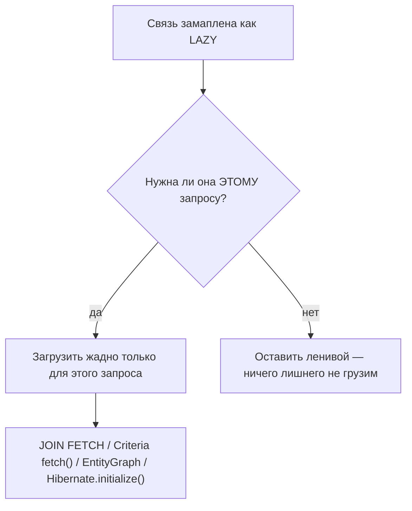
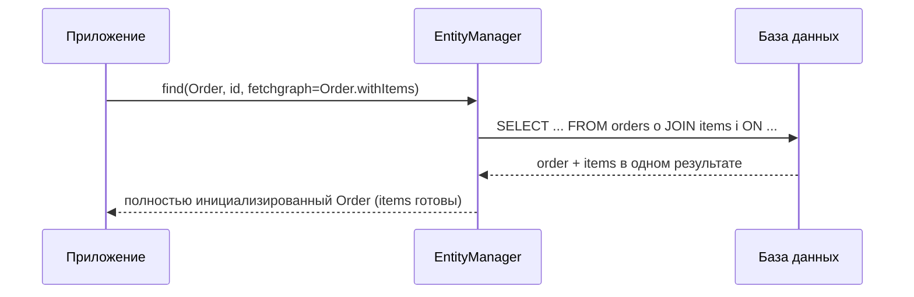

# EAGER-загрузка для одного запроса

Рекомендуемый маппинг делает связи **LAZY** — см.
[Стратегия загрузки сущностей по умолчанию](topic:hibernate-default-fetch-strategy).
Это держит каждую загрузку лёгкой, но возникает обратная потребность: *именно этому
экрану* действительно нужны и родитель, **и** его связи за один проход. Ответ —
**жадная загрузка на уровне запроса**: вы запрашиваете связанные данные при
выполнении запроса, не трогая маппинг.

Представьте склад, где каждая коробка по умолчанию отгружается **LAZY**: курьер
привозит только заказанную коробку. Но для одного крупного заказа вы заранее
звоните и говорите: «упакуйте коробку *и* её аксессуары на один поддон». Вы не
меняли постоянную политику склада — вы дали особую инструкцию *для этой одной
доставки*.

## Почему не просто переключить маппинг на EAGER?

Потому что EAGER в маппинге — это **навсегда и везде**: каждая загрузка этой
сущности тянет связь за собой, даже на экранах, где она никогда не показывается, и
обычно это приводит к проблеме N+1. Загрузка на уровне запроса включается **по
требованию для каждого сценария** — список остаётся лёгким, экран детали загружает
больше. Это разница между рестораном, который *всегда* приносит все гарниры (EAGER
в маппинге), и тем, где гарниры заказывают *только когда этот столик их хочет*
(fetch на уровне запроса).



## Вариант 1: JOIN FETCH (JPQL / HQL)

Самый прямой инструмент. В запросе `JOIN FETCH` говорит Hibernate загрузить связь
**в том же SQL**, что и корневую сущность, сразу её инициализируя:

```java
List<Order> orders = em.createQuery("""
        SELECT o FROM Order o
        JOIN FETCH o.items
        WHERE o.status = :s
        """, Order.class)
    .setParameter("s", Status.PAID)
    .getResultList();
```

Это порождает один `SELECT` с SQL-джойном, поэтому `o.getItems()` уже заполнен — без
второго похода и без `LazyInitializationException`. Это и есть заранее собранный
поддон: коробка и её аксессуары приезжают вместе на одной машине. Используйте
`LEFT JOIN FETCH`, если хотите получить и родителей без детей. Учтите, что обычный
`JOIN` (без `FETCH`) только фильтрует — он **не** инициализирует связь.

## Вариант 2: Criteria API fetch()

Та же идея, но собирается динамически в коде, а не строкой. `root.fetch(...)` — это
эквивалент `JOIN FETCH` в Criteria:

```java
CriteriaQuery<Order> cq = cb.createQuery(Order.class);
Root<Order> root = cq.select(cq.from(Order.class));
root.fetch("items", JoinType.LEFT);
```

Тот же поддон, только собранный на конвейере, а не написанный на бумажном заказе —
удобно, когда фильтры и загрузки определяются во время выполнения.

## Вариант 3: графы сущностей JPA (Entity Graphs)

**Граф сущности** объявляет, *какие атрибуты загрузить*, и прикрепляется к обычному
`find` или запросу — так один и тот же finder может быть лёгким в одном вызове и
богатым в другом. Объявите один раз и переиспользуйте:

```java
@NamedEntityGraph(
    name = "Order.withItems",
    attributeNodes = @NamedAttributeNode("items"))
@Entity class Order { /* ... */ }

EntityGraph<?> graph = em.getEntityGraph("Order.withItems");
Order o = em.find(Order.class, id,
    Map.of("jakarta.persistence.fetchgraph", graph));
```

Spring Data предоставляет то же самое через `@EntityGraph` на методе репозитория.
Граф — это **упаковочный лист**, прикреплённый к одному заказу: «для этой выдачи
вложи ещё и товары». Двумя ключами-хинтами управляется чтение этого листа:

- **`jakarta.persistence.fetchgraph`** — загрузить жадно *только* перечисленные
  атрибуты; всё остальное для этого запроса считается LAZY.
- **`jakarta.persistence.loadgraph`** — загрузить перечисленные атрибуты жадно *в
  дополнение* к тому, что маппинг уже грузит как EAGER.



## Вариант 4: Hibernate.initialize() — крайнее средство

Если у вас уже есть ленивая сущность внутри открытой сессии, можно принудительно
загрузить её связь через `Hibernate.initialize(order.getItems())`. Это всё равно
выполняет **отдельный** `SELECT` (он не сворачивается в первый запрос), поэтому это
скорее приём «загрузи до закрытия сессии», чем способ устранить N+1. Это как
вернуться к открытому ещё окну, чтобы забрать дополнительную посылку — нормально
один раз, но не стройте на этом цикл.

## Ловушки

- **`MultipleBagFetchException`.** Нельзя сделать `JOIN FETCH` **двух** коллекций
  `List` в одном запросе — Hibernate не может безопасно построить декартово
  произведение. Решение: загрузить их отдельными запросами, использовать `Set`
  вместо `List` или `hibernate.default_batch_fetch_size`. Один поддон не вместит две
  неограниченные кучи.
- **Пагинация + JOIN FETCH коллекции.** Когда вы фетчите коллекцию, SQL-джойн
  размножает строки, поэтому `setMaxResults` пагинировал бы *строки*, а не
  родительские сущности. Hibernate переходит на пагинацию **в памяти** (и
  предупреждает) — загрузите сначала ID, потом фетчите, или используйте batch size.
  Нельзя посчитать поддоны, считая отдельные предметы.
- **Дубликаты родителей.** `JOIN FETCH` коллекции повторяет родителя по разу на
  каждую дочернюю строку; добавьте `DISTINCT` (или используйте `Set`), чтобы их
  схлопнуть.
- **Обычный `JOIN` — это не `JOIN FETCH`.** Только `FETCH` инициализирует связь;
  голый джойн лишь ограничивает строки.

## Ответ за 60 секунд

> Когда связи LAZY, я оставляю маппинг как есть и загружаю жадно **на уровне
> запроса**. Самый частый инструмент — `JOIN FETCH` в JPQL/HQL, который загружает
> связь в том же SQL, что и корневую сущность, поэтому она возвращается уже
> инициализированной; эквивалент в Criteria API — `root.fetch(...)`. Для
> переиспользуемого декларативного контроля я использую **граф сущности** JPA —
> `@NamedEntityGraph`/`@EntityGraph` плюс хинт `jakarta.persistence.fetchgraph` или
> `loadgraph` — прикреплённый к `find` или запросу. Как крайнее средство внутри
> открытой сессии можно вызвать `Hibernate.initialize(...)`. Суть в том, что
> загрузка решается **во время запроса**, поэтому я избегаю постоянного EAGER в
> маппинге, решая N+1 и `LazyInitializationException` именно там, где мне нужны
> данные. Из ловушек стоит упомянуть `MultipleBagFetchException` при фетче двух
> коллекций и проблему пагинации в памяти при `JOIN FETCH` коллекции.

## Распространённые заблуждения

- ❌ «Чтобы загрузить жадно, надо поставить `FetchType.EAGER` в маппинге.» — Нет; это
  глобально и навсегда. `JOIN FETCH`, `fetch()` и графы сущностей грузят жадно
  только для **одного запроса**.
- ❌ «Обычный `JOIN` инициализирует связь.» — Только `JOIN FETCH`; голый `JOIN` лишь
  фильтрует строки.
- ❌ «`fetchgraph` и `loadgraph` — одно и то же.» — `fetchgraph` делает всё
  неперечисленное LAZY для этого запроса; `loadgraph` добавляет перечисленные
  атрибуты поверх EAGER из маппинга.
- ❌ «`JOIN FETCH` меняет маппинг.» — Он влияет только на этот один запрос; в остальных
  местах действует объявленная стратегия загрузки.
- ❌ «Можно сделать `JOIN FETCH` нескольких коллекций `List` сразу.» — Это бросит
  `MultipleBagFetchException`; фетчите их по отдельности или используйте `Set`.
- ❌ «`Hibernate.initialize()` избавляет от лишнего запроса.» — Он всё равно выполняет
  отдельный `SELECT`; только `JOIN FETCH`/`fetch()` сворачивают данные в один
  оператор.
