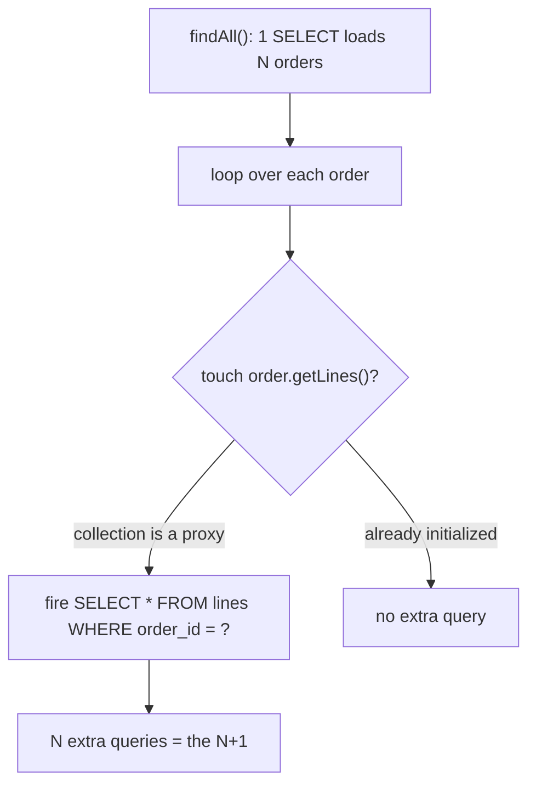
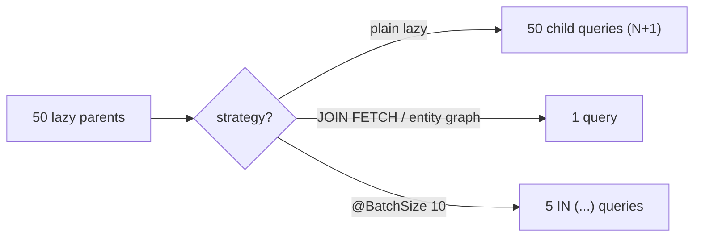

# The N+1 Select Problem

The **N+1 problem** is the single most common performance bug in JPA/Hibernate
code. It happens when you load a list of **N** entities with **one** query, and
then, for each of those N entities, Hibernate silently fires **one more** query to
load an associated collection or reference. One query to get the list, plus N
queries to fill in the details: **1 + N** round trips where **1** or **2** would do.

Picture a busy kitchen. The waiter brings back a list of **10 tables** that ordered
dessert (that is your **1** query). But then, for *each* table, the waiter walks all
the way to the kitchen again to ask "what dessert did table 4 want?", "what did
table 5 want?"… ten separate trips (that is the **N**). The food was ready; the
waiter just refused to carry it all at once. The database is fast — it is the **11
round trips across the room** that kill you.

## Where the "1" and the "N" come from

Associations are [LAZY by default](topic:hibernate-default-fetch-strategy) for
collections. When you run `SELECT o FROM Order o`, Hibernate loads the orders and
leaves each `order.getLines()` as an uninitialized **proxy** — an empty box with a
label. The moment your code *touches* that collection (a loop, a `.size()`, mapping
to a DTO), the proxy has to go fetch its real contents, and that is a brand-new
`SELECT ... WHERE order_id = ?`. Do it inside a loop over N orders and you get N of
them.

```java
List<Order> orders = repo.findAll();          // 1 query: SELECT * FROM orders
for (Order o : orders) {
    total += o.getLines().size();             // +1 query EACH time -> N queries
}
```



It is easy to miss because **each individual query is fast and correct**. The code
works, tests pass on 3 rows, and then production has 5,000 orders and the endpoint
does 5,001 queries. Like a recipe that is fine for a dinner party but collapses when
the restaurant seats five hundred.

## How to detect it

- Turn on SQL logging (`hibernate.show_sql`, or better `org.hibernate.SQL` +
  `p6spy` / `datasource-proxy`) and watch for **the same SELECT repeating with
  different ids**. That repetition is the smell — the same waiter trip, over and
  over.
- Count statements per request in a test with a query-counting tool (e.g.
  Hypersistence Utils' `SQLStatementCountValidator`). Assert "this endpoint runs ≤ 2
  queries" so an N+1 regression fails the build.
- These are ordinary [prepared statements](topic:prepared-statements) reused with
  different parameters — cheap individually, ruinous in bulk.

## Fix 1 — JOIN FETCH (fetch the pallet in one trip)

Ask for the association **in the same query** as the root. `JOIN FETCH` folds the
children into one SQL join, so the collections come back already initialized:

```java
SELECT o FROM Order o JOIN FETCH o.lines WHERE o.status = :s
```

1 + N collapses to **1**. This is the waiter finally loading every dessert onto one
tray and making a single trip. Use `LEFT JOIN FETCH` to keep parents that have no
children, and remember a plain `JOIN` (without `FETCH`) only filters — it does not
initialize anything. See
[Eager Fetching for a Single Query](topic:hibernate-eager-for-one-query) for the
full toolbox.

## Fix 2 — Entity graph (a packing list for this trip)

A JPA **entity graph** declares *which associations to pull* for a specific query,
without editing the mapping. Spring Data exposes it as `@EntityGraph` on a
repository method:

```java
@EntityGraph(attributePaths = "lines")
List<Order> findByStatus(Status status);
```

Same single-query result as `JOIN FETCH`, but declarative and reusable — a packing
list clipped to *this* order that says "also bring the lines," while every other
finder stays lean. One screen orders the full tray; the list screen still travels
light.

## Fix 3 — Batch size (fewer trips, not one trip)

Sometimes you *want* lazy loading but not N separate queries.
`@BatchSize(size = n)` (or the global `hibernate.default_batch_fetch_size`) keeps
the collections lazy but tells Hibernate to initialize them in **groups**: instead
of one `WHERE order_id = ?` per parent, it issues
`WHERE order_id IN (?, ?, ..., ?)` for up to `n` parents at a time.

```java
@BatchSize(size = 10)
@OneToMany(mappedBy = "order")
private List<Line> lines;
```

With 50 orders and batch size 10, the children load in **⌈50/10⌉ = 5** queries
instead of 50. That is the waiter grabbing desserts **ten plates at a time** — not a
single tray, but five trips instead of fifty. Batch size is the safety net that
turns any stray N+1 into an N/n, and it sidesteps the collection-fetch pagination
trap that `JOIN FETCH` hits.



## The traps

- **EAGER is not the fix.** Marking the association `FetchType.EAGER` just moves the
  N+1 earlier and makes it *always on* — every load drags the children, even screens
  that never show them. Keep the mapping LAZY and fetch per query. It is the
  restaurant that force-feeds every side dish to every table.
- **`MultipleBagFetchException`.** You cannot `JOIN FETCH` **two** `List`
  collections at once (the cartesian product is unsafe). Fix: fetch one per query,
  use `Set`, or lean on batch size. One tray cannot balance two unbounded piles.
- **JOIN FETCH + pagination.** Fetching a collection multiplies rows, so
  `setMaxResults` paginates *rows*, not parents; Hibernate warns and paginates **in
  memory**. Load IDs first (or use a batch size) when you need paging.
- **Duplicate parents.** A collection `JOIN FETCH` repeats the parent once per child
  row — add `DISTINCT` or use a `Set` to collapse them.
- **N+1 hides on `@ManyToOne` too.** Not just collections — a lazy single-valued
  reference read in a loop is exactly the same bug.

## 60-second interview answer

> The N+1 problem is when one query loads N entities and then, because their
> associations are LAZY, touching each one triggers a separate SELECT — so you run
> 1 + N queries instead of 1 or 2. It usually shows up as a loop over a result list
> that reads a lazy collection or `@ManyToOne`. I detect it by logging SQL and
> watching the same statement repeat, or by asserting a query count in a test. The
> primary fix is fetching the association **per query**: `JOIN FETCH` in JPQL, or a
> JPA **entity graph** (`@EntityGraph`) — both fold the data into a single query. If
> I still want lazy loading, I set a **batch size** (`@BatchSize` /
> `default_batch_fetch_size`) so children load as `IN (...)` groups, turning N
> queries into ⌈N/size⌉. I avoid `FetchType.EAGER` on the mapping, because that just
> makes the problem global and permanent. Watch for `MultipleBagFetchException` and
> the in-memory pagination trap when JOIN-fetching collections.

## Common misconceptions

- ❌ "Making the association EAGER fixes N+1." — It makes it *permanent and global*;
  fetch per query instead and keep the mapping LAZY.
- ❌ "N+1 only affects collections." — A lazy `@ManyToOne` read in a loop causes the
  same 1 + N.
- ❌ "A plain `JOIN` initializes the collection." — Only `JOIN FETCH` does; a bare
  join just filters rows.
- ❌ "Batch size removes the extra queries." — It *reduces* them to ⌈N/size⌉; only
  `JOIN FETCH` / entity graph get you to a single query.
- ❌ "It is a database problem." — The database is fine; the cost is the number of
  round trips your application chooses to make.
- ❌ "You can JOIN FETCH any number of collections." — Two `List` fetches throw
  `MultipleBagFetchException`.
