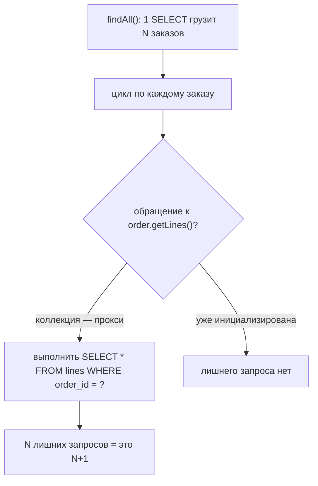
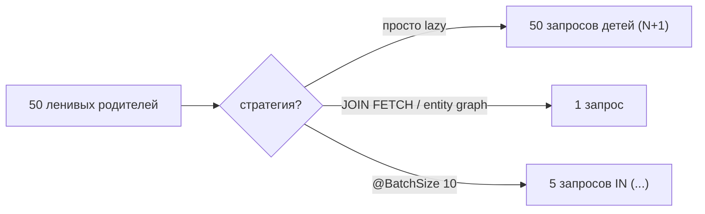

# Проблема N+1 запросов

**Проблема N+1** — самый частый баг производительности в коде на JPA/Hibernate.
Она возникает, когда вы загружаете список из **N** сущностей **одним** запросом, а
затем для каждой из этих N сущностей Hibernate незаметно выполняет **ещё один**
запрос, чтобы подгрузить связанную коллекцию или ссылку. Один запрос — получить
список, плюс N запросов — заполнить детали: **1 + N** обращений к базе там, где
хватило бы **1** или **2**.

Представьте загруженную кухню. Официант приносит список из **10 столиков**, которые
заказали десерт (это ваш **1** запрос). Но потом для *каждого* столика официант
снова идёт через весь зал на кухню и спрашивает: «какой десерт хотел столик 4?»,
«а столик 5?»… десять отдельных походов (это **N**). Еда была готова — официант
просто отказался унести всё за раз. База быстрая; убивают именно **11 походов через
зал**.

## Откуда берутся «1» и «N»

Коллекции по умолчанию [загружаются лениво (LAZY)](topic:hibernate-default-fetch-strategy).
Когда вы выполняете `SELECT o FROM Order o`, Hibernate загружает заказы и оставляет
каждый `order.getLines()` неинициализированным **прокси** — пустой коробкой с
этикеткой. Как только код *обращается* к этой коллекции (цикл, `.size()`,
маппинг в DTO), прокси вынужден пойти за реальным содержимым, а это совершенно новый
`SELECT ... WHERE order_id = ?`. Сделайте это в цикле по N заказам — и получите N
таких запросов.

```java
List<Order> orders = repo.findAll();          // 1 запрос: SELECT * FROM orders
for (Order o : orders) {
    total += o.getLines().size();             // +1 запрос КАЖДЫЙ раз -> N запросов
}
```



Это легко упустить, потому что **каждый отдельный запрос быстрый и корректный**. Код
работает, тесты на 3 строках проходят, а в проде 5000 заказов — и эндпойнт делает
5001 запрос. Как рецепт, который хорош для ужина на четверых, но рушится, когда в
ресторане пятьсот гостей.

## Как это обнаружить

- Включите логирование SQL (`hibernate.show_sql`, а лучше `org.hibernate.SQL` +
  `p6spy` / `datasource-proxy`) и следите за **повторением одного и того же SELECT
  с разными id**. Это повторение и есть запах — тот же поход официанта раз за разом.
- Считайте количество запросов на запрос в тесте инструментом подсчёта (например,
  `SQLStatementCountValidator` из Hypersistence Utils). Утверждайте «этот эндпойнт
  выполняет ≤ 2 запросов», чтобы регрессия N+1 роняла сборку.
- Это обычные [prepared statements](topic:prepared-statements), переиспользуемые с
  разными параметрами — по отдельности дёшевы, массово разорительны.

## Решение 1 — JOIN FETCH (привезти паллету за один рейс)

Запросите связь **в том же запросе**, что и корень. `JOIN FETCH` сворачивает детей
в один SQL-джойн, поэтому коллекции возвращаются уже инициализированными:

```java
SELECT o FROM Order o JOIN FETCH o.lines WHERE o.status = :s
```

1 + N сворачивается в **1**. Это официант, который наконец грузит все десерты на
один поднос и идёт один раз. Используйте `LEFT JOIN FETCH`, чтобы сохранить
родителей без детей, и помните: простой `JOIN` (без `FETCH`) только фильтрует —
он ничего не инициализирует. Полный набор инструментов — в
[Eager-загрузке для одного запроса](topic:hibernate-eager-for-one-query).

## Решение 2 — Entity graph (упаковочный лист для этого рейса)

**Entity graph** в JPA объявляет, *какие связи подтянуть* для конкретного запроса,
не меняя маппинг. Spring Data выставляет его как `@EntityGraph` на методе
репозитория:

```java
@EntityGraph(attributePaths = "lines")
List<Order> findByStatus(Status status);
```

Тот же результат за один запрос, что и у `JOIN FETCH`, но декларативно и
переиспользуемо — упаковочный лист, приколотый к *этому* заказу, который говорит
«привези ещё и строки», пока остальные finder'ы остаются лёгкими. Один экран
заказывает полный поднос; экран со списком по-прежнему идёт налегке.

## Решение 3 — Batch size (меньше рейсов, а не один рейс)

Иногда ленивая загрузка *нужна*, но не N отдельными запросами.
`@BatchSize(size = n)` (или глобальный `hibernate.default_batch_fetch_size`)
сохраняет ленивость коллекций, но велит Hibernate инициализировать их **группами**:
вместо одного `WHERE order_id = ?` на каждого родителя он выполняет
`WHERE order_id IN (?, ?, ..., ?)` сразу для до `n` родителей.

```java
@BatchSize(size = 10)
@OneToMany(mappedBy = "order")
private List<Line> lines;
```

При 50 заказах и batch size 10 дети загружаются за **⌈50/10⌉ = 5** запросов вместо
50. Это официант, который берёт десерты **по десять тарелок за раз** — не один
поднос, но пять рейсов вместо пятидесяти. Batch size — это страховочная сетка,
превращающая любой случайный N+1 в N/n, и он обходит проблему пагинации при
fetch коллекции, на которую натыкается `JOIN FETCH`.



## Ловушки

- **EAGER — не решение.** Пометка связи `FetchType.EAGER` просто сдвигает N+1 раньше
  и делает его *постоянным*: каждая загрузка тянет детей, даже на экранах, которые их
  никогда не показывают. Оставьте маппинг LAZY и грузите по запросу. Это ресторан,
  который силой подаёт все гарниры каждому столику.
- **`MultipleBagFetchException`.** Нельзя сделать `JOIN FETCH` **двух** коллекций
  `List` сразу (декартово произведение небезопасно). Решение: подтягивать по одной за
  запрос, использовать `Set` или опереться на batch size. Один поднос не удержит две
  бесконечные кучи.
- **JOIN FETCH + пагинация.** Fetch коллекции размножает строки, поэтому
  `setMaxResults` пагинирует *строки*, а не родителей; Hibernate предупреждает и
  пагинирует **в памяти**. Сначала загрузите id (или используйте batch size), когда
  нужна пагинация.
- **Дубликаты родителей.** `JOIN FETCH` коллекции повторяет родителя по разу на
  каждую строку ребёнка — добавьте `DISTINCT` или используйте `Set`, чтобы их
  схлопнуть.
- **N+1 прячется и на `@ManyToOne`.** Не только коллекции — ленивая одиночная ссылка,
  читаемая в цикле, — ровно тот же баг.

## Ответ за 60 секунд

> Проблема N+1 — это когда один запрос грузит N сущностей, а затем, поскольку их
> связи ленивые, обращение к каждой запускает отдельный SELECT — и вы выполняете
> 1 + N запросов вместо 1 или 2. Обычно это цикл по списку результатов, который
> читает ленивую коллекцию или `@ManyToOne`. Обнаруживаю через логирование SQL и
> повтор одного и того же запроса, либо утверждением количества запросов в тесте.
> Основное решение — грузить связь **по запросу**: `JOIN FETCH` в JPQL или entity
> graph (`@EntityGraph`) — оба сворачивают данные в один запрос. Если ленивая
> загрузка всё же нужна, задаю **batch size** (`@BatchSize` /
> `default_batch_fetch_size`), чтобы дети грузились группами `IN (...)`, превращая N
> запросов в ⌈N/size⌉. Избегаю `FetchType.EAGER` на маппинге, потому что это делает
> проблему глобальной и постоянной. Слежу за `MultipleBagFetchException` и ловушкой
> пагинации в памяти при JOIN-fetch коллекций.

## Частые заблуждения

- ❌ «EAGER на связи чинит N+1.» — Он делает его *постоянным и глобальным*; грузите
  по запросу и держите маппинг LAZY.
- ❌ «N+1 касается только коллекций.» — Ленивый `@ManyToOne`, читаемый в цикле, даёт
  тот же 1 + N.
- ❌ «Простой `JOIN` инициализирует коллекцию.» — Только `JOIN FETCH`; голый join лишь
  фильтрует строки.
- ❌ «Batch size убирает лишние запросы.» — Он *сокращает* их до ⌈N/size⌉; к одному
  запросу приводят только `JOIN FETCH` / entity graph.
- ❌ «Это проблема базы данных.» — С базой всё в порядке; цена — число обращений,
  которое приложение решает сделать.
- ❌ «Можно JOIN FETCH любое число коллекций.» — Два fetch'а `List` бросают
  `MultipleBagFetchException`.
