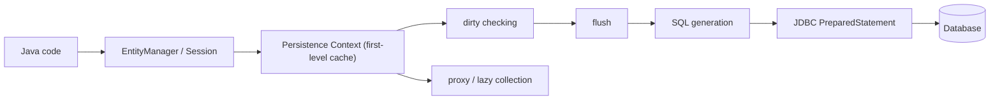
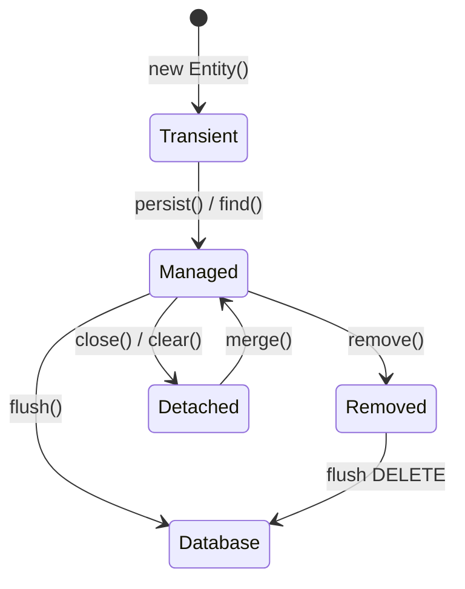

# Hibernate Under the Hood

Hibernate is not just a tool that copies fields from an object into columns. It is an ORM engine and a JPA provider: JPA defines the standard contracts and annotations, while Hibernate implements them and adds its own runtime machinery. In a post office analogy, mapping is the address label on a parcel; Hibernate also runs the counter, sorting room, delivery schedule, tracking tickets, and exception handling when a parcel cannot be delivered.

Manual JDBC or RowMapper-style mapping usually means you write SQL, bind parameters, read a `ResultSet`, create objects, decide when to update them, and manage repeated reads yourself. Hibernate starts from entity metadata and then manages object identity, state transitions, SQL generation, `flush`, lazy loading, optimistic locking, caches, and transaction integration. In a kitchen analogy, manual mapping is writing every cooking step on a paper ticket; Hibernate is the kitchen management system that remembers orders, ingredients, timing, and what must be sent to the stove.

## What lives inside Hibernate

**Metadata and mapping model.** Hibernate reads annotations or XML and builds runtime metadata for entities, identifiers, columns, associations, converters, inheritance, and SQL dialect rules. The mapping tells Hibernate what table and column shape to use, but the metadata also drives loading, persisting, cascades, and generated SQL. Think of it as the recipe binder in a restaurant: it says not only which ingredients exist, but also how they are prepared and which station handles them.

**`EntityManager` / `Session`.** The main working object is a unit-of-work boundary. It tracks entities loaded or persisted during that scope and coordinates writes with the database connection and transaction. It is not thread-safe. Like a service window at a post office, one clerk keeps the paperwork for the current customer; two unrelated customers should not use the same stack of forms at once.

**Persistence Context and first-level cache.** Inside one `Session`, Hibernate keeps one managed Java object for a given database row identity. If you load `User#10` twice in the same context, you get the same object reference. This is more than a cache: it is an identity map plus state manager. Like a cloakroom ticket, one ticket number points to one coat; the clerk does not create a second coat just because you ask twice.

**Entity states.** An entity can be transient, managed, detached, or removed. Hibernate only automatically tracks managed entities. A detached object is just a regular Java object until it is merged or reloaded. Like a library book, a managed entity is still checked out under the librarian's system; a detached copy is in your backpack and the library cannot see your notes until you bring it back.

**Dirty checking and `flush`.** Hibernate compares managed entity state to a snapshot, or uses bytecode enhancement, and at `flush` time turns changes into `INSERT`, `UPDATE`, and `DELETE` statements. `save`, `persist`, or changing a field does not always mean SQL is executed immediately. It is like a waiter editing an order pad during dinner and sending the final set of kitchen tickets at the right checkpoint, not after every word the customer says.

**SQL generation and JDBC.** Hibernate still talks to the database through JDBC, usually with [prepared statements](topic:prepared-statements). It builds SQL from JPQL, Criteria, entity operations, dialect rules, and mapping metadata, then hydrates rows back into entities. It does not make SQL disappear: [database indexes](topic:database-indexes), cardinality, locks, and the database [query plan](topic:query-plan) still decide performance. The traffic analogy is simple: Hibernate prints the route sheet, but the city roads and traffic lights still determine how fast the truck arrives.

**Lazy loading and proxies.** For lazy associations, Hibernate can put a proxy object or lazy collection in the entity and load the real data when accessed. This is why fetch defaults matter and why N+1 queries happen; see the focused topics on the [default fetch strategy](topic:hibernate-default-fetch-strategy) and [eager fetching for one query](topic:hibernate-eager-for-one-query). A proxy is like a pickup slip at a warehouse counter: it looks like access to the item, but the item is fetched only when you actually ask for it.

**Transactions and concurrency.** Hibernate participates in JDBC, JTA, or Spring-managed transactions. With Spring, the transaction boundary is usually applied by a [Spring `@Transactional` proxy](topic:spring-transactional-proxy). Hibernate normally flushes before commit, relies on database [ACID](topic:acid-principles) guarantees, and can use optimistic locking with `@Version` to detect conflicting edits. Like a cashier closing one receipt, the important point is not just what was ordered, but what gets finalized together.

**Caches, batching, and events.** The first-level cache is always present inside the `Session`; the second-level cache and query cache are optional and must be chosen carefully. Hibernate can batch statements, order inserts and updates, generate identifiers, fire lifecycle callbacks, run interceptors/listeners, apply filters, and support multi-tenancy. Think of this as warehouse optimization: one shelf for today's open order, optional shared shelves for common items, and batch delivery when several packages go to the same area.

## 60-second interview answer

Hibernate is an ORM and a JPA provider. Mapping fields to columns is only the visible part. Under the hood it builds entity metadata, keeps a Persistence Context with identity and entity states, tracks managed objects with dirty checking, generates SQL, flushes changes at transaction boundaries, supports lazy loading through proxies, and integrates with JDBC, JTA, or Spring transactions. It also has optional second-level caching, query caching, batching, cascades, lifecycle callbacks, optimistic locking, dialect support, and a query engine for JPQL and Criteria. Compared with manual mapping, Hibernate takes over the unit-of-work and object-state management, but it does not remove the need to understand SQL, indexes, transactions, fetch plans, and database behavior.

## Production relevance

In real services, Hibernate can reduce boilerplate and keep domain code readable, but it can also hide expensive database access until runtime. A small object navigation like `order.getItems().size()` may become a query, and a loop may become N+1 queries. Like opening many small envelopes at a post office instead of one sorted package, the work is correct but slow.

Fetch planning is a production skill, not a decoration. Use lazy defaults deliberately, fetch what the use case needs with joins, entity graphs, projections, or tailored queries, and check generated SQL. In traffic terms, do not send a delivery truck through every side street when one planned route would do.

Transaction boundaries matter. A lazy proxy accessed after the `Session` is closed can throw `LazyInitializationException`; a long `Session` can retain too many managed objects; a missing `@Version` can allow lost updates depending on the use case. Like a restaurant shift, there is a time to keep tickets open and a time to close them cleanly.

Caching should be measured. The second-level cache can help read-heavy reference data, but it can hurt frequently changing data or distributed systems with invalidation costs. It is like storing popular items near the counter: excellent for predictable demand, risky for items whose labels change every minute.

## Common misconceptions

**"Hibernate is just mapping."** Mapping is only one layer. The more important runtime pieces are the Persistence Context, unit of work, dirty checking, SQL generation, fetch plans, transaction integration, and caching. The address label matters, but the post office is much larger than the label.

**"Hibernate means I do not need SQL."** Hibernate generates SQL, but the database executes it. You still need to understand joins, indexes, plans, isolation, and locks. The kitchen management system can print a ticket, but someone still needs to know how the stove works.

**"`persist` immediately inserts a row."** It may schedule the insert and execute it on `flush`, before a query, or before commit depending on flush mode and identifier strategy. The waiter can write an order now and send it to the kitchen at the checkpoint.

**"Lazy is always better" or "EAGER is always safer."** Lazy loading avoids unnecessary work but can create N+1 queries or fail outside the session. EAGER loading can overfetch and make unrelated queries expensive. It is like choosing between pickup-on-demand and loading the whole truck: the right answer depends on the route.

**"The second-level cache fixes performance."** It can reduce repeated reads for stable data, but it adds invalidation, memory, and consistency trade-offs. A shared pantry helps only when the ingredients are stable and everyone follows the same labels.

**"`Session` is just a DAO helper."** It is a stateful unit-of-work object and should not be shared across threads. One clerk should not mix paperwork from different customers.
