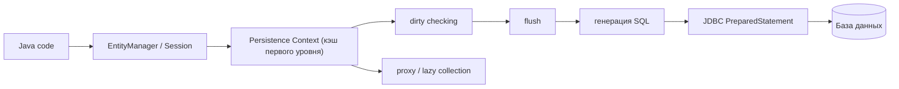
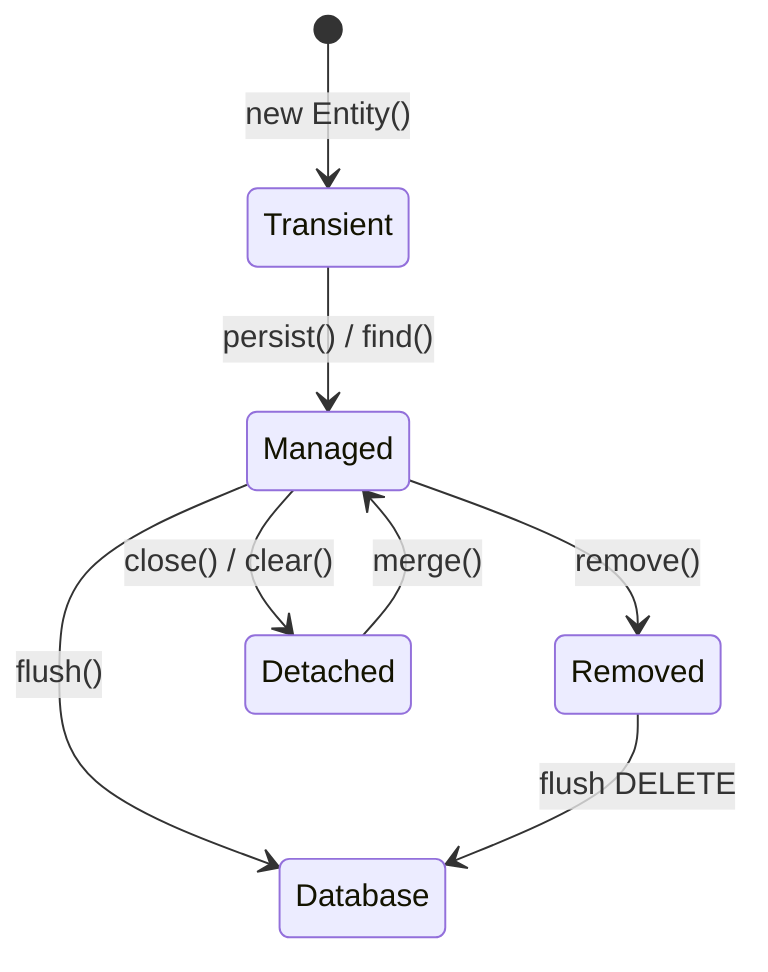

# Hibernate под капотом

Hibernate — это не просто инструмент, который копирует поля объекта в колонки. Это ORM-движок и JPA provider: JPA задаёт стандартные контракты и аннотации, а Hibernate реализует их и добавляет свою runtime-механику. Если сравнить с почтой, маппинг — это адресная наклейка на посылке; Hibernate ещё управляет стойкой приёма, сортировкой, расписанием доставки, трекингом и обработкой проблем, когда посылку нельзя доставить.

Ручной маппинг через JDBC или RowMapper обычно означает, что вы сами пишете SQL, привязываете параметры, читаете `ResultSet`, создаёте объекты, решаете, когда их обновлять, и сами управляете повторными чтениями. Hibernate начинает с метаданных Entity, а потом управляет identity объектов, переходами состояний, генерацией SQL, `flush`, lazy loading, optimistic locking, кэшами и интеграцией с транзакциями. В кухонной аналогии ручной маппинг — это записывать каждый шаг готовки на бумажном заказе; Hibernate — система управления кухней, которая помнит заказы, ингредиенты, время и что нужно отправить на плиту.

## Что находится внутри Hibernate

**Метаданные и модель маппинга.** Hibernate читает аннотации или XML и строит runtime-метаданные для Entity, идентификаторов, колонок, связей, converters, inheritance и правил SQL dialect. Маппинг говорит Hibernate, какие таблицы и колонки использовать, но эти метаданные также управляют загрузкой, сохранением, cascades и сгенерированным SQL. Это как папка рецептов в ресторане: она описывает не только ингредиенты, но и как их готовить и какая станция за них отвечает.

**`EntityManager` / `Session`.** Главный рабочий объект — граница unit of work. Он отслеживает Entity, загруженные или сохранённые в этом scope, и координирует записи с database connection и transaction. Он не thread-safe. Как окно обслуживания на почте: один сотрудник ведёт документы текущего клиента; двум разным клиентам не стоит одновременно пользоваться одной стопкой бланков.

**Persistence Context и кэш первого уровня.** Внутри одного `Session` Hibernate хранит один managed Java-объект для одной строки базы данных с конкретной identity. Если дважды загрузить `User#10` в одном контексте, вы получите ту же ссылку на объект. Это больше, чем кэш: это identity map плюс менеджер состояний. Как номерок в гардеробе: один номер указывает на одно пальто; сотрудник не создаёт второе пальто только потому, что вы спросили два раза.

**Состояния Entity.** Entity может быть transient, managed, detached или removed. Hibernate автоматически отслеживает только managed Entity. Detached object — обычный Java-объект, пока его не merge или не загрузят заново. Как библиотечная книга: managed Entity всё ещё учитывается в системе библиотекаря; detached copy лежит у вас в рюкзаке, и библиотека не видит ваши пометки, пока вы не принесёте её обратно.

**Dirty checking и `flush`.** Hibernate сравнивает состояние managed Entity со snapshot или использует bytecode enhancement, а во время `flush` превращает изменения в `INSERT`, `UPDATE` и `DELETE`. `save`, `persist` или изменение поля не всегда означают немедленное выполнение SQL. Это как официант, который редактирует блокнот заказа во время ужина и отправляет итоговые кухонные талоны в нужной контрольной точке, а не после каждого слова клиента.

**Генерация SQL и JDBC.** Hibernate всё равно общается с базой через JDBC, обычно через [prepared statements](topic:prepared-statements). Он строит SQL из JPQL, Criteria, операций с Entity, правил dialect и метаданных маппинга, а потом собирает Entity из строк результата. SQL не исчезает: [индексы базы данных](topic:database-indexes), cardinality, locks и [query plan](topic:query-plan) базы всё ещё определяют производительность. Дорожная аналогия простая: Hibernate печатает маршрутный лист, но дороги и светофоры города всё равно решают, как быстро приедет грузовик.

**Lazy loading и proxies.** Для lazy-связей Hibernate может положить в Entity proxy object или lazy collection и загрузить реальные данные при обращении. Поэтому важны fetch defaults и поэтому возникают N+1 queries; см. отдельные темы про [default fetch strategy](topic:hibernate-default-fetch-strategy) и [eager fetching for one query](topic:hibernate-eager-for-one-query). Proxy похож на талон выдачи на складе: он выглядит как доступ к вещи, но сама вещь приносится только тогда, когда вы реально её запросили.

**Транзакции и concurrency.** Hibernate участвует в JDBC, JTA или Spring-managed transactions. В Spring граница транзакции обычно применяется через [Spring `@Transactional` proxy](topic:spring-transactional-proxy). Hibernate обычно делает flush перед commit, опирается на гарантии базы [ACID](topic:acid-principles) и может использовать optimistic locking через `@Version`, чтобы обнаруживать конфликтующие изменения. Как кассир, который закрывает один чек: важно не только то, что заказали, но и что финализируется вместе.

**Кэши, batching и события.** Кэш первого уровня всегда есть внутри `Session`; second-level cache и query cache опциональны, и их нужно выбирать осторожно. Hibernate может batch statements, упорядочивать inserts и updates, генерировать identifiers, вызывать lifecycle callbacks, запускать interceptors/listeners, применять filters и поддерживать multi-tenancy. Это похоже на оптимизацию склада: одна полка для сегодняшнего открытого заказа, опциональные общие полки для популярных товаров и пакетная доставка, когда несколько посылок едут в один район.

## Ответ за 60 секунд

Hibernate — это ORM и JPA provider. Маппинг полей на колонки — только видимая часть. Под капотом он строит метаданные Entity, держит Persistence Context с identity и состояниями Entity, отслеживает managed objects через dirty checking, генерирует SQL, делает flush изменений на границах транзакций, поддерживает lazy loading через proxies и интегрируется с JDBC, JTA или Spring transactions. Ещё у него есть опциональный second-level cache, query cache, batching, cascades, lifecycle callbacks, optimistic locking, dialect support и query engine для JPQL и Criteria. В сравнении с ручным маппингом Hibernate берёт на себя unit of work и управление состоянием объектов, но не отменяет необходимость понимать SQL, индексы, транзакции, fetch plans и поведение базы данных.

## Значение в production

В реальных сервисах Hibernate уменьшает boilerplate и помогает держать domain code читаемым, но он также может спрятать дорогой доступ к базе до runtime. Маленькое обращение вроде `order.getItems().size()` может стать запросом, а цикл — N+1 queries. Это как открывать на почте много маленьких конвертов вместо одной отсортированной посылки: работа корректная, но медленная.

Fetch planning — это production-навык, а не украшение. Используйте lazy defaults осознанно, загружайте то, что нужно конкретному use case, через joins, entity graphs, projections или специальные queries, и проверяйте generated SQL. В дорожных терминах: не отправляйте грузовик по всем переулкам, если можно заранее построить один нормальный маршрут.

Границы транзакций важны. Lazy proxy, к которому обратились после закрытия `Session`, может выбросить `LazyInitializationException`; слишком длинный `Session` может удерживать слишком много managed objects; отсутствие `@Version` может позволить lost updates в зависимости от use case. Как в ресторанной смене: есть время держать заказы открытыми и есть время закрывать их чисто.

Кэширование нужно измерять. Second-level cache может помочь read-heavy reference data, но может навредить часто меняющимся данным или распределённым системам с дорогой invalidation. Это как хранить популярные товары рядом со стойкой: отлично для предсказуемого спроса, рискованно для товаров, у которых ярлыки меняются каждую минуту.

## Частые заблуждения

**«Hibernate — это просто маппинг».** Маппинг — только один слой. Более важные runtime-части — Persistence Context, unit of work, dirty checking, генерация SQL, fetch plans, интеграция с транзакциями и кэширование. Адресная наклейка важна, но почта намного больше наклейки.

**«С Hibernate не нужно знать SQL».** Hibernate генерирует SQL, но выполняет его база данных. Всё равно нужно понимать joins, indexes, plans, isolation и locks. Система управления кухней может напечатать заказ, но кто-то всё равно должен знать, как работает плита.

**«`persist` сразу вставляет строку».** Он может запланировать insert и выполнить его на `flush`, перед query или перед commit в зависимости от flush mode и identifier strategy. Официант может записать заказ сейчас, а отправить его на кухню в контрольной точке.

**«Lazy всегда лучше» или «EAGER всегда безопаснее».** Lazy loading избегает лишней работы, но может создать N+1 queries или сломаться вне session. EAGER loading может загрузить слишком много и сделать несвязанные queries дорогими. Это как выбирать между выдачей по требованию и загрузкой всего грузовика: правильный ответ зависит от маршрута.

**«Second-level cache исправит performance».** Он может сократить повторные чтения стабильных данных, но добавляет invalidation, memory и consistency trade-offs. Общая кладовая помогает только тогда, когда ингредиенты стабильны и все используют одни и те же ярлыки.

**«`Session` — просто DAO helper».** Это stateful unit-of-work object, и его нельзя шарить между threads. Один сотрудник не должен смешивать документы разных клиентов.
