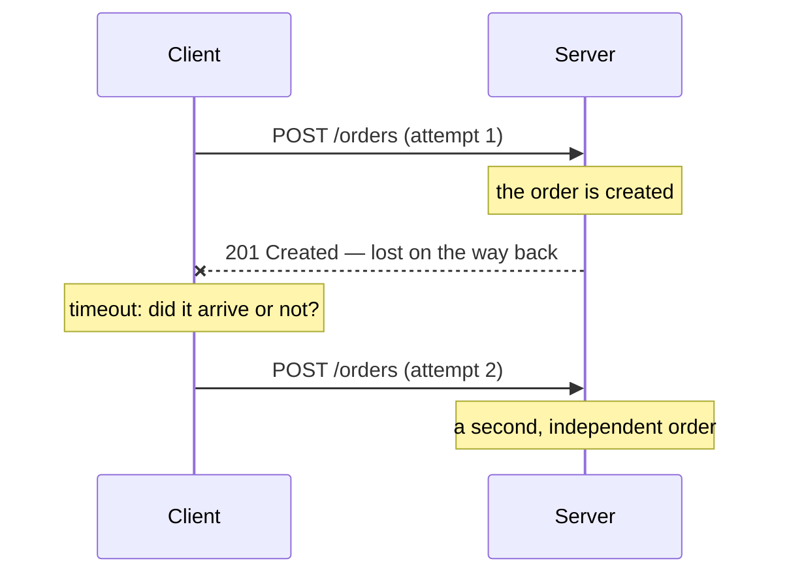
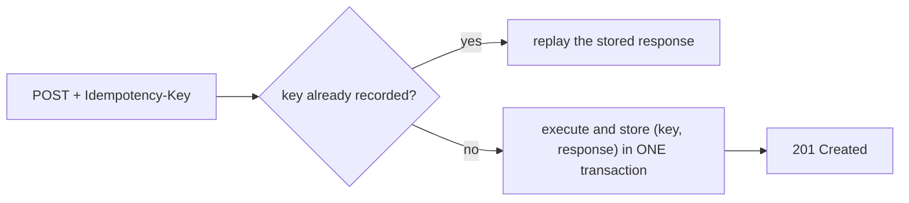
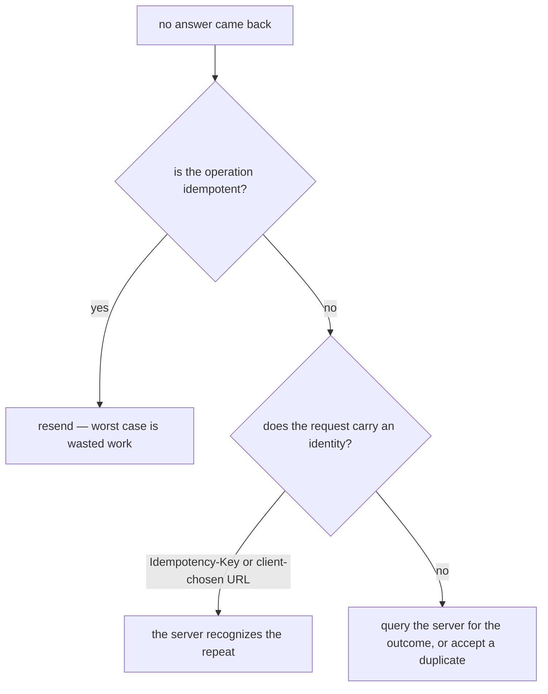

# Idempotency

An operation is **idempotent** when performing it N times leaves the system in
the same state as performing it once.

That is the whole definition, and every trap in this topic comes from a sentence
people add to it that is not there:

- it does **not** say the responses are identical;
- it does **not** say nothing happens on the server;
- it does **not** say the operation is read-only — that is *safe*, a different
  promise.

`f(f(x)) = f(x)`. "Set the status to `paid`" is idempotent. "Add 1 to the
quantity" is not.

## Why anyone cares: the ambiguous timeout

Idempotency looks like pedantry until you notice that networks fail **in the
middle**. A client that does not get an answer cannot tell which half failed:



"My request never arrived" and "the answer was lost" look **exactly the same**
from the client. It has two options, and both are bad unless the operation is
idempotent: resend and risk doing the work twice, or give up and risk losing the
work entirely.

Idempotency makes the first option boring. That is its entire job.

## Which HTTP methods are idempotent

| Method | Safe | Idempotent |
|---|---|---|
| `GET` | yes | **yes** |
| `HEAD` | yes | **yes** |
| `OPTIONS` | yes | **yes** |
| `TRACE` | yes | **yes** |
| `PUT` | no | **yes** |
| `DELETE` | no | **yes** |
| `POST` | no | no |
| `PATCH` | no | **not guaranteed** |

Two rules make this table easy to reconstruct in an interview instead of
memorising it:

1. **Safe implies idempotent.** A method that is not supposed to change anything
   trivially leaves the same state after N calls — doing nothing twice is doing
   nothing. So `GET`, `HEAD`, `OPTIONS` and `TRACE` are in.
2. **Everything else depends on whether the request names an absolute outcome.**
   `PUT` carries the target state ("let this URL hold exactly this"), `DELETE`
   names an end state ("this URL has nothing"). Both describe *where you want to
   be*, so repeating them is a no-op. `POST` means "create a subordinate
   resource under this collection" — it describes an *action*, and the second
   action creates a second thing.

`PATCH` is the interesting one. HTTP does not promise idempotency for it because
a patch document may be either:

```json
{ "status": "paid" }                                  // absolute → idempotent
[{ "op": "add", "path": "/tags/-", "value": "vip" }]  // relative → not
```

Same method, opposite behaviour, decided by the body. Most PATCH endpoints in
the wild *are* idempotent — but "is" is not "must", and intermediaries may not
assume it. See [PUT vs PATCH](topic:put-vs-patch) for what the two bodies mean,
and [HTTP and its methods](topic:http-methods) for the rest of the method
contract.

## Idempotent does not mean "the same response"

The classic exchange:

```
DELETE /orders/2  →  204 No Content
DELETE /orders/2  →  404 Not Found
```

Different status codes — and `DELETE` is still perfectly idempotent, because the
*state* after the second call is identical to the state after the first:
`/orders/2` is gone either way. Some APIs answer `204` both times to make retry
logic simpler; that is a style choice, not a correctness one.

The same goes for `ETag`s, timestamps and `Location` headers. Idempotency is a
statement about the **state you end up in**, not about the bytes that come back.

## The method does not enforce anything

This is the point that separates a memorised answer from an understood one.

HTTP's classification is a **contract you promise to keep**. It tells caches,
proxies, browsers, service meshes and client libraries what they may do on their
own — a proxy is allowed to retry an idempotent request after a timeout, and it
will. Nothing validates that your handler deserves it:

- `GET /orders/1/cancel` is a `GET`, so a link prefetcher will follow it and
  cancel orders nobody clicked.
- A `PUT` that sends "your order has shipped" on every call stores the same
  representation and mails the customer twice.

The second one is the trap worth remembering: **idempotency covers every
observable effect**, not only the row in your table. Mails, webhooks, payment
captures, messages published to a broker, downstream calls to other services —
if a repeat fires them again, the endpoint is not idempotent no matter which
verb it is spelled with.

## Making a non-idempotent operation retry-safe

You cannot make "create an order" idempotent by choosing a nicer verb. You make
it idempotent by giving the **intent an identity**, so the server can recognize
the second copy of it. Two ways:

**1. Let the client choose the URL** and use `PUT`. If the client generates a
UUID and sends `PUT /orders/8f3c-…`, the second attempt overwrites the first
with the same representation. Free idempotency, at the cost of the client
inventing ids.

**2. An idempotency key.** The client generates a key *per intent*, sends it in
a header (`Idempotency-Key`), and repeats the same key on every retry of that
intent:



The details that make it actually work:

- **The key identifies the intent, not the payload.** Two genuinely different
  orders with identical bodies must carry different keys — deduplicating by a
  hash of the body silently drops the second real order.
- **The record and the work must commit together.** If the key row is written in
  its own transaction and the business write fails afterwards, the retry is
  deduplicated against something that does not exist.
- **A `UNIQUE` constraint, not a `SELECT` then `INSERT`.** Two retries can arrive
  concurrently and both pass the check before either writes. The database has to
  arbitrate the race — see [avoiding duplicate sales](topic:duplicate-sale-prevention).
- **Store the response, not just the key**, so the replay can answer the same
  thing the client missed the first time.
- **Decide the retention window** (Stripe keeps keys 24 hours) and what to do
  when the same key arrives with a *different* body — `409`/`422` is the usual
  answer, because that is a client bug.

The full server-side treatment, including how each guard fails, is in
[registering sales over an unreliable connection](topic:sales-api-unreliable-connection).

## Retrying safely



Retries also need backoff and a budget, or a slow service gets a retry storm on
top of its original problem — see
[timeouts, fallbacks and circuit breakers](topic:service-timeouts-fallbacks).

## The 60-second interview answer

> An operation is idempotent when N identical calls leave the system in the same
> state as one call. It matters because a timeout is ambiguous: the client cannot
> tell whether the request was lost or the response was, and its only recovery is
> to send the request again. In HTTP, `GET`, `HEAD`, `OPTIONS` and `TRACE` are
> safe, and safe implies idempotent; `PUT` and `DELETE` are idempotent but not
> safe, because both name an end state rather than an action; `POST` is not
> idempotent, because it asks for something new to be created each time; and
> `PATCH` is not guaranteed, because its body can be relative — "add 1" applied
> twice adds twice. Idempotent does not mean the responses match: the second
> `DELETE` answering `404` after the first answered `204` is still idempotent.
> And the classification is a contract the handler has to keep — a `PUT` that
> e-mails the customer on every call has broken it. When an operation genuinely
> is not idempotent, I make it retry-safe by giving the intent an identity: an
> `Idempotency-Key` stored under a unique constraint in the same transaction as
> the write, whose stored response is replayed on a repeat.

## Why it matters in production

- **Everything in the path retries by itself.** Load balancers and reverse
  proxies (nginx's `proxy_next_upstream`, Envoy's retry policy) retry idempotent
  methods by default; HTTP client libraries do too. You are not choosing whether
  retries happen, only whether they are safe.
- **Message consumers get at-least-once delivery.** Brokers redeliver after a
  consumer crashes or an ack is lost, so every consumer must be idempotent —
  usually via a processed-message table, i.e. the [inbox
  pattern](topic:inbox-pattern). Same problem, different transport; see
  [Kafka vs RabbitMQ](topic:kafka-vs-rabbitmq).
- **Payments and orders.** This is where the duplicate is expensive enough that
  every serious API (Stripe, PayPal, Adyen) exposes an idempotency key.
- **Declarative infrastructure is idempotency as a design principle.** A
  Kubernetes reconcile loop, a Terraform apply and an Ansible playbook all
  describe a target state so that running them again is a no-op.
- **Mobile and flaky clients.** Trains, lifts, tunnels — a mobile app *will*
  send you the same request twice. Handling it is cheaper than a support ticket
  about a double charge.

## Common misconceptions

- **"Idempotent means the response is identical."** It means the resulting state
  is. `204` then `404` from two `DELETE`s is textbook idempotency.
- **"Idempotent means nothing happens the second time."** The server may do
  plenty of work — write the same row, bump `updated_at`, log an audit entry. The
  observable state just has to end up the same.
- **"Idempotent means read-only."** That is *safe*. `PUT` and `DELETE` change
  state and are still idempotent.
- **"POST can never be idempotent."** HTTP does not *guarantee* it, which is
  different. An endpoint with an idempotency key is idempotent in practice, and
  that is exactly how payment APIs work.
- **"PATCH is idempotent because it is an update."** Not guaranteed. `{"status":
  "paid"}` is; "append this tag" or "add 1 to qty" is not.
- **"My handler is idempotent because the SQL is an UPDATE."** Only if that is
  everything it does. The mail, the webhook and the Kafka message are part of the
  operation.
- **"Idempotency protects me from concurrency."** It does not. Two identical
  requests processed *at the same time* can both pass a check-then-insert; you
  need a unique constraint or a lock — see
  [optimistic vs pessimistic locking](topic:optimistic-vs-pessimistic-locking).
- **"I'll just retry everything."** A retried non-idempotent write is a duplicate
  charge, and a retry with no budget is a self-inflicted outage. Retry what you
  can prove is safe, and return a clear, typed error for the rest — see
  [managing errors and error codes](topic:api-error-handling).
