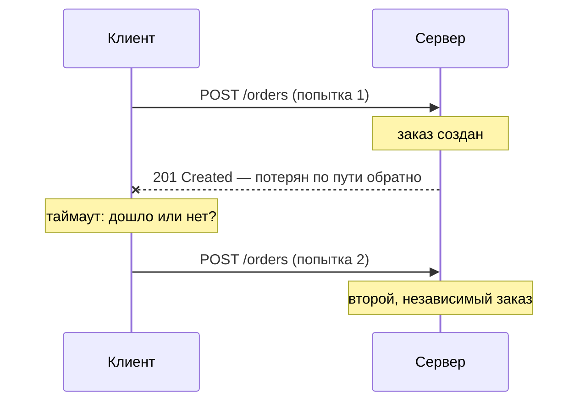
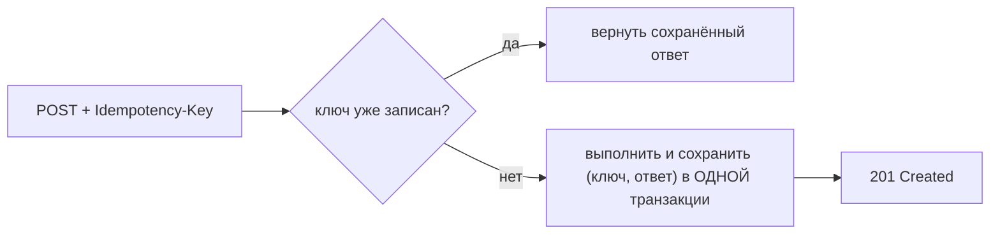
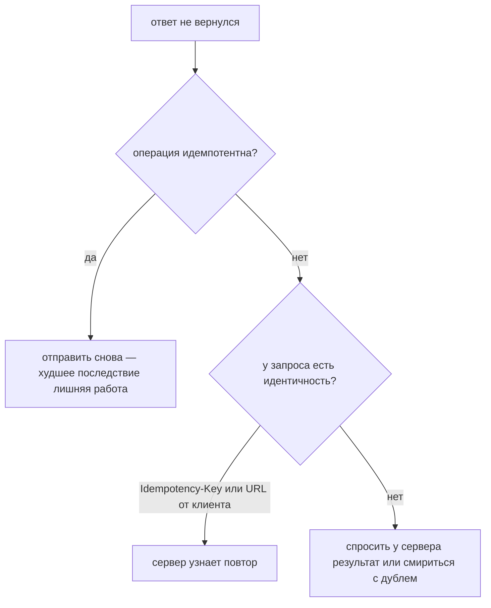

# Идемпотентность

Операция **идемпотентна**, если её выполнение N раз оставляет систему в том же
состоянии, что и выполнение один раз.

Это всё определение целиком, и каждая ловушка в этой теме растёт из фразы,
которую к нему дописывают, хотя её там нет:

- оно **не** говорит, что ответы совпадают;
- оно **не** говорит, что на сервере ничего не происходит;
- оно **не** говорит, что операция только читает, — это *безопасность*, другое
  обещание.

`f(f(x)) = f(x)`. «Поставить статус `paid`» идемпотентно. «Прибавить 1 к
количеству» — нет.

## Зачем это нужно: неоднозначный таймаут

Идемпотентность выглядит занудством ровно до момента, когда замечаешь, что сеть
рвётся **посередине**. Клиент, не получивший ответа, не знает, какая половина
не сработала:



«Мой запрос не дошёл» и «ответ потерялся» выглядят со стороны клиента
**совершенно одинаково**. У него есть два варианта, и оба плохи, если операция
не идемпотентна: повторить и рискнуть сделать работу дважды или сдаться и
рискнуть потерять её совсем.

Идемпотентность делает первый вариант скучным. В этом вся её работа.

## Какие HTTP-методы идемпотентны

| Метод | Безопасный | Идемпотентный |
|---|---|---|
| `GET` | да | **да** |
| `HEAD` | да | **да** |
| `OPTIONS` | да | **да** |
| `TRACE` | да | **да** |
| `PUT` | нет | **да** |
| `DELETE` | нет | **да** |
| `POST` | нет | нет |
| `PATCH` | нет | **не гарантируется** |

Два правила позволяют восстановить эту таблицу на собеседовании, а не заучивать
её:

1. **Безопасный — значит идемпотентный.** Метод, который не должен ничего
   менять, тривиально оставляет то же состояние после N вызовов: ничего не
   сделать дважды — это ничего не сделать. Так в таблицу попадают `GET`, `HEAD`,
   `OPTIONS` и `TRACE`.
2. **Всё остальное зависит от того, называет ли запрос абсолютный результат.**
   `PUT` несёт конечное состояние («пусть по этому URL лежит именно это»),
   `DELETE` называет конечное состояние («по этому URL ничего нет»). Оба
   описывают, *где мы хотим оказаться*, поэтому повтор ничего не меняет. `POST`
   означает «создай подчинённый ресурс в этой коллекции» — он описывает
   *действие*, а второе действие создаёт вторую вещь.

Самый интересный — `PATCH`. HTTP не обещает для него идемпотентности, потому
что документ-патч может быть любым из двух:

```json
{ "status": "paid" }                                  // абсолютный → идемпотентен
[{ "op": "add", "path": "/tags/-", "value": "vip" }]  // относительный → нет
```

Один метод, противоположное поведение, и решает тело запроса. Большинство
реальных PATCH-эндпоинтов идемпотентны — но «есть» не то же самое, что
«обязано», и посредники не вправе на это рассчитывать. Смотри
[PUT против PATCH](topic:put-vs-patch) про смысл этих двух тел и
[HTTP и его методы](topic:http-methods) про остальной контракт методов.

## Идемпотентный ≠ «тот же ответ»

Классический обмен:

```
DELETE /orders/2  →  204 No Content
DELETE /orders/2  →  404 Not Found
```

Коды разные — а `DELETE` по-прежнему безупречно идемпотентен, потому что
*состояние* после второго вызова совпадает с состоянием после первого: ресурса
`/orders/2` нет в обоих случаях. Некоторые API отвечают `204` оба раза, чтобы
логика повторов была проще; это вопрос стиля, а не корректности.

То же касается `ETag`, отметок времени и заголовка `Location`. Идемпотентность —
утверждение об **итоговом состоянии**, а не о байтах, которые пришли в ответ.

## Метод ничего не обеспечивает

Именно этот пункт отличает выученный ответ от понятого.

Классификация HTTP — это **контракт, который вы обещаете соблюдать**. Она
сообщает кэшам, прокси, браузерам, service mesh и клиентским библиотекам, что
им разрешено делать самостоятельно: прокси вправе повторить идемпотентный запрос
после таймаута — и повторит. Никто не проверяет, что ваш обработчик этого
заслуживает:

- `GET /orders/1/cancel` — это `GET`, поэтому предзагрузчик ссылок по нему
  перейдёт и отменит заказы, по которым никто не кликал.
- `PUT`, отправляющий «ваш заказ отправлен» при каждом вызове, сохранит то же
  представление и напишет клиенту дважды.

Второй случай стоит запомнить: **идемпотентность охватывает все наблюдаемые
эффекты**, а не только строку в вашей таблице. Письма, вебхуки, списания,
сообщения в брокер, вызовы соседних сервисов — если повтор запускает их снова,
эндпоинт не идемпотентен, каким бы глаголом он ни назывался.

## Как сделать неидемпотентную операцию безопасной для повтора

Сделать «создание заказа» идемпотентным выбором более красивого глагола нельзя.
Это делается, когда у **намерения появляется идентичность**, по которой сервер
узнаёт его вторую копию. Два способа:

**1. Пусть URL выбирает клиент** — и тогда `PUT`. Если клиент сам генерирует
UUID и шлёт `PUT /orders/8f3c-…`, вторая попытка перезапишет первую тем же
представлением. Идемпотентность даром — ценой того, что идентификаторы
придумывает клиент.

**2. Ключ идемпотентности.** Клиент генерирует ключ *на намерение*, отправляет
его в заголовке (`Idempotency-Key`) и повторяет тот же ключ при каждом ретрае
этого намерения:



Детали, без которых это не работает:

- **Ключ идентифицирует намерение, а не полезную нагрузку.** Два по-настоящему
  разных заказа с одинаковыми телами обязаны нести разные ключи: дедупликация по
  хэшу тела молча потеряет второй настоящий заказ.
- **Запись ключа и сама работа должны коммититься вместе.** Если строка ключа
  записана в собственной транзакции, а бизнес-запись потом упала, повтор будет
  отсечён по тому, чего не существует.
- **Ограничение `UNIQUE`, а не `SELECT` с последующим `INSERT`.** Два ретрая
  могут прийти одновременно и оба пройти проверку до того, как кто-то запишет.
  Гонку должна разрешать база — смотри
  [как избежать дублей продаж](topic:duplicate-sale-prevention).
- **Хранить ответ, а не только ключ**, чтобы повтор мог отдать ровно то, что
  клиент не увидел в первый раз.
- **Определить окно хранения** (Stripe держит ключи 24 часа) и решить, что
  делать, если тот же ключ пришёл с *другим* телом: обычный ответ — `409`/`422`,
  потому что это ошибка клиента.

Полный серверный разбор, включая то, как ломается каждая защита, — в теме
[регистрация продаж по ненадёжной связи](topic:sales-api-unreliable-connection).

## Как повторять безопасно



Повторам нужны ещё backoff и бюджет, иначе к исходной проблеме медленного
сервиса добавится шторм ретраев — смотри
[таймауты, fallback-и и circuit breaker](topic:service-timeouts-fallbacks).

## Ответ на собеседовании за 60 секунд

> Операция идемпотентна, когда N одинаковых вызовов оставляют систему в том же
> состоянии, что и один вызов. Это важно, потому что таймаут неоднозначен:
> клиент не знает, потерялся ли запрос или ответ, и единственное восстановление
> для него — отправить запрос снова. В HTTP `GET`, `HEAD`, `OPTIONS` и `TRACE`
> безопасны, а безопасный автоматически идемпотентен; `PUT` и `DELETE`
> идемпотентны, но не безопасны, потому что оба называют конечное состояние, а
> не действие; `POST` неидемпотентен, потому что каждый раз просит создать
> что-то новое; для `PATCH` идемпотентность не гарантируется, потому что его
> тело может быть относительным — «прибавь 1», применённое дважды, прибавит
> дважды. Идемпотентность не означает совпадения ответов: второй `DELETE`,
> отвечающий `404` после `204`, всё равно идемпотентен. И эта классификация —
> контракт, который обязан соблюдать обработчик: `PUT`, отправляющий письмо при
> каждом вызове, его уже нарушил. Когда операция действительно неидемпотентна,
> я делаю её безопасной для повтора, давая намерению идентичность:
> `Idempotency-Key` под уникальным ограничением, записанный в той же транзакции,
> что и сама работа, а сохранённый ответ повторяется при дубле.

## Почему это важно в продакшене

- **Всё, что стоит на пути, повторяет запросы само.** Балансировщики и обратные
  прокси (`proxy_next_upstream` в nginx, retry policy в Envoy) по умолчанию
  повторяют идемпотентные методы; клиентские HTTP-библиотеки тоже. Вы не
  выбираете, будут ли ретраи, — вы выбираете, безопасны ли они.
- **Потребители сообщений получают доставку at-least-once.** Брокер
  перевыдаёт сообщение после падения потребителя или потери ack, поэтому каждый
  потребитель обязан быть идемпотентным — обычно через таблицу обработанных
  сообщений, то есть [паттерн Inbox](topic:inbox-pattern). Та же проблема,
  другой транспорт; смотри [Kafka против RabbitMQ](topic:kafka-vs-rabbitmq).
- **Платежи и заказы.** Здесь дубль стоит достаточно дорого, чтобы каждый
  серьёзный API (Stripe, PayPal, Adyen) предоставлял ключ идемпотентности.
- **Декларативная инфраструктура — это идемпотентность как принцип
  проектирования.** Цикл сверки в Kubernetes, `terraform apply` и playbook
  Ansible описывают желаемое состояние именно для того, чтобы повторный запуск
  ничего не менял.
- **Мобильные и нестабильные клиенты.** Электрички, лифты, тоннели — мобильное
  приложение *обязательно* пришлёт вам один и тот же запрос дважды. Обработать
  это дешевле, чем разбирать обращение о двойном списании.

## Частые заблуждения

- **«Идемпотентный — значит одинаковый ответ».** Значит одинаковое итоговое
  состояние. `204`, а затем `404` от двух `DELETE` — хрестоматийная
  идемпотентность.
- **«Идемпотентный — значит во второй раз ничего не происходит».** Сервер может
  проделать немало работы: записать ту же строку, обновить `updated_at`,
  добавить запись в аудит. Совпасть должно наблюдаемое состояние.
- **«Идемпотентный — значит только для чтения».** Это *безопасный*. `PUT` и
  `DELETE` меняют состояние и при этом идемпотентны.
- **«POST не может быть идемпотентным».** HTTP этого не *гарантирует* — это не
  то же самое. Эндпоинт с ключом идемпотентности идемпотентен на практике, и
  именно так устроены платёжные API.
- **«PATCH идемпотентен, ведь это обновление».** Не гарантируется. `{"status":
  "paid"}` — да; «добавь этот тег» или «прибавь 1 к qty» — нет.
- **«Мой обработчик идемпотентен, потому что там `UPDATE`».** Только если это
  всё, что он делает. Письмо, вебхук и сообщение в Kafka — тоже часть операции.
- **«Идемпотентность защищает меня от конкурентности».** Нет. Два одинаковых
  запроса, обрабатываемых *одновременно*, могут оба пройти проверку перед
  вставкой; нужны уникальное ограничение или блокировка — смотри
  [оптимистичные и пессимистичные блокировки](topic:optimistic-vs-pessimistic-locking).
- **«Да я просто буду повторять всё подряд».** Повтор неидемпотентной записи —
  это двойное списание, а ретрай без бюджета — авария, устроенная своими руками.
  Повторяйте то, безопасность чего можете доказать, а для остального возвращайте
  понятную типизированную ошибку — смотри
  [управление ошибками и кодами ошибок](topic:api-error-handling).
