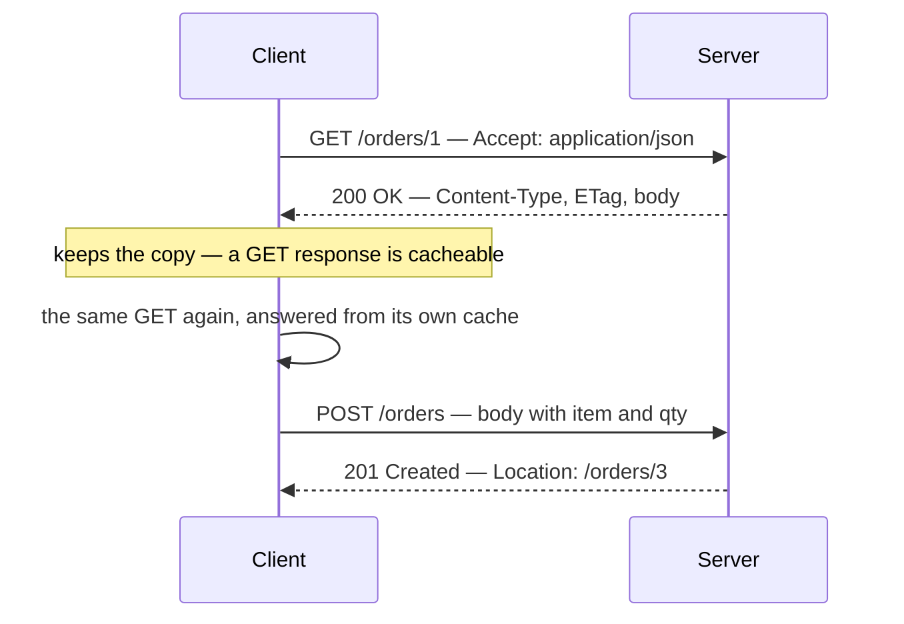
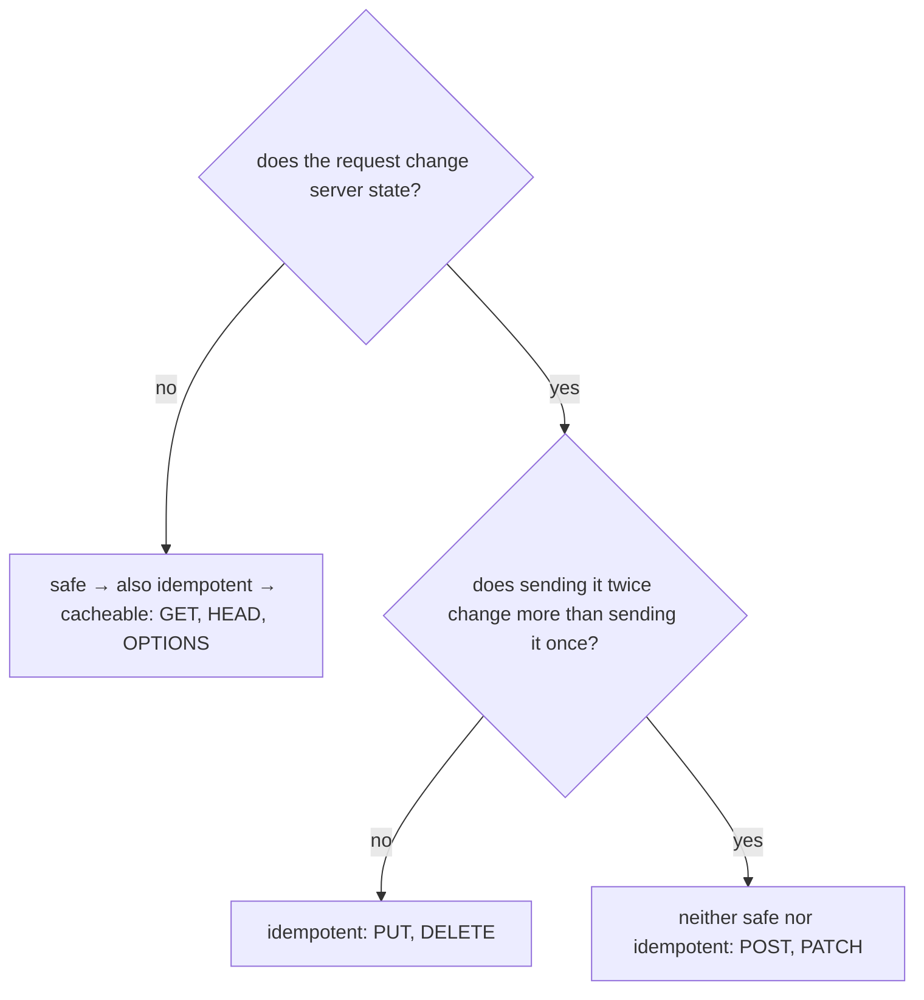
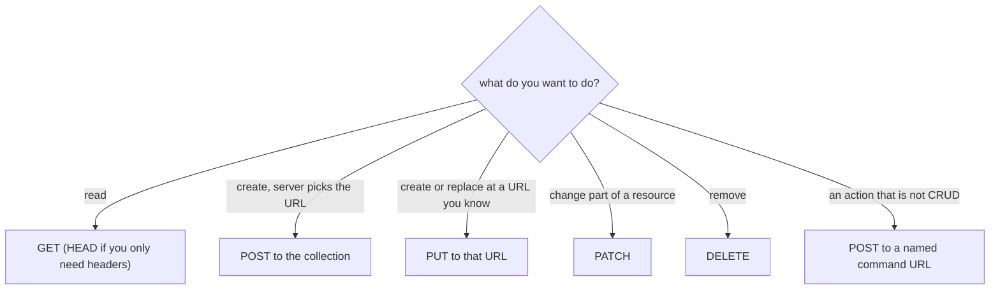

# HTTP and its methods

HTTP is the request/response protocol the web runs on. A client opens a
connection (TCP, almost always wrapped in TLS — that is the S in HTTPS), sends
**one request**, and reads **one response**. Then the server forgets everything:
HTTP is **stateless**, so each request has to carry on its own everything the
server needs to answer it — which is why authentication travels in a header or a
cookie on *every* call, not once at the start. How that plays out between a
browser and a service is covered in
[how the frontend and the backend talk](topic:frontend-backend-interaction).

## One exchange

A **request** is a method, a target (the path plus query), headers, and
optionally a body. A **response** is a status line, headers, and optionally a
body. That is all — the same envelope for every method.

Status codes come in classes: `1xx` informational, `2xx` success, `3xx`
redirection, `4xx` the client's mistake, `5xx` the server's. Which code to
return when is its own subject —
see [managing errors and error codes](topic:api-error-handling).

## The methods

| Method | Means | Body sent | Typical success |
|---|---|---|---|
| `GET` | send me the representation of this URL | no | `200 OK` |
| `HEAD` | the same, headers only | no | `200 OK`, no body |
| `POST` | process this body under this URL (usually: create) | yes | `201 Created` + `Location` |
| `PUT` | let this URL hold exactly this representation | yes | `200 OK` / `201 Created` |
| `PATCH` | apply this change to the resource | yes | `200 OK` |
| `DELETE` | remove the resource at this URL | rarely | `204 No Content` |
| `OPTIONS` | what does this URL support? | no | `204` + `Allow` |
| `TRACE` | echo the request back (debugging; usually disabled) | no | `200 OK` |
| `CONNECT` | open a tunnel through a proxy (used for HTTPS) | no | `200 OK` |

`GET` and `POST` are the two a browser form can produce, which is the historic
reason so many APIs use nothing else. The rest are perfectly ordinary and
supported everywhere except in plain HTML forms.

Two pairs are worth separating carefully:

- **POST vs PUT for creation.** With `POST /orders` the *server* invents the URL
  and returns it in `Location`. With `PUT /orders/9` the *client* names the URL,
  which is only possible when the client can produce an identifier the server
  will accept. That single difference is why POST is the default for "create"
  and PUT is the default for "replace" or "upsert at a known id".
- **PUT vs PATCH for changes.** PUT carries the whole representation, PATCH only
  the change — with real consequences for the fields you leave out. That is a
  topic of its own: [PUT vs PATCH](topic:put-vs-patch).

`OPTIONS` looks academic until you open a browser's network tab: a cross-origin
request that is not a simple form triggers an automatic `OPTIONS` first, the
[preflight request](topic:preflight-requests), and the server answers it with
[CORS](topic:cors) headers.

## What actually separates the methods

Every method travels the same way. What differs is the **promise** each one
makes to everyone on the path — browsers, proxies, CDNs, gateways, retry logic:

- **Safe** — the request is not supposed to change server state. `GET`, `HEAD`,
  `OPTIONS`. Nothing enforces this; a handler can write to the database on a
  GET, and the protocol will not stop it. It will just be *wrong*, because
  everything downstream is allowed to repeat a safe request whenever it likes.
- **Idempotent** — N identical requests leave the same state as one. `GET`,
  `HEAD`, `OPTIONS`, `PUT`, `DELETE`. It is a statement about the resulting
  **state**, not about the response: the first `DELETE` may answer `204` and the
  second `404`, and the method is still idempotent, because the resource is
  equally gone either way.
- **Cacheable** — the response may be stored and reused. `GET` and `HEAD` are by
  default; the others only with explicit freshness headers, which in practice
  means "no".

Two clarifications people trip on. Idempotent is **not** the same as safe: a
`DELETE` changes the world, it just does not change it *again* on the second
call. And `PATCH` is not *forbidden* from being idempotent — `{"status":"paid"}`
repeats harmlessly — but HTTP does not *promise* it, so no intermediary may
assume it.

## Why the promises matter in production

- **Retries.** A request that times out leaves the client not knowing whether it
  arrived. `GET`, `PUT` and `DELETE` can simply be sent again. `POST` cannot —
  repeat it and you have two orders. The standard fix is an idempotency key
  (`Idempotency-Key: <uuid>`) that the server records, so the second call returns
  the first result instead of doing the work twice; see
  [avoiding duplicate sales](topic:duplicate-sale-prevention) and
  [registering sales over an unreliable connection](topic:sales-api-unreliable-connection).
- **Caching and prefetch.** Browsers prefetch links, proxies and CDNs cache `GET`
  responses, and crawlers follow every link they see. All of that is legal
  *because* GET is safe — so a `GET /orders/1/cancel` will eventually be fired by
  a machine nobody asked.
- **Gateways and load balancers** often retry idempotent methods automatically on
  a 5xx or a connection error, and refuse to retry POST. Your method choice
  silently configures infrastructure you do not control.
- **Debuggability.** `405 Method Not Allowed` (with an `Allow` header) means the
  URL exists but the method does not apply; `404` means there is no such URL;
  `501 Not Implemented` means the server does not support the method at all.
  Returning the right one saves the caller an afternoon.

## Choosing one

The last branch matters more than it looks. "Cancel an order", "approve a
request" or "recalculate a report" are not field edits; a `POST /orders/1/cancel`
is honest about writing and needs no pretending. Naming these URLs is covered in
[naming REST endpoints](topic:rest-endpoint-naming),
[designing endpoints in a REST controller](topic:rest-controller-endpoint-design)
and [Employee API: commands](topic:employee-api-commands).

## The 60-second interview answer

> HTTP is a stateless text-based request/response protocol: the client sends a
> method, a path, headers and optionally a body; the server answers with a status
> line, headers and optionally a body, and remembers nothing between requests.
> The methods are `GET` (read), `HEAD` (read the headers only), `POST` (create or
> process, the server picks the URL), `PUT` (put exactly this representation at
> this URL), `PATCH` (apply a partial change), `DELETE` (remove), `OPTIONS` (ask
> what a URL supports; browsers use it for CORS preflight), plus `TRACE` and
> `CONNECT`, which application code does not use. They differ by the promises
> they make: `GET`, `HEAD` and `OPTIONS` are safe — they must not change server
> state, which is what makes caching and prefetch possible; those three plus
> `PUT` and `DELETE` are idempotent — N identical calls end in the same state as
> one, so a client can retry them after a timeout; `POST` and `PATCH` are
> neither, so retrying a POST needs an idempotency key. Only `GET` and `HEAD`
> responses are cacheable by default. In practice the choice matters because
> proxies, CDNs, browsers and gateways act on those promises without asking.

## Common misconceptions

- **"GET puts parameters in the URL, POST puts them in the body — that is the
  difference."** That is a consequence, not the difference. The difference is
  that GET promises to change nothing and may be repeated by anyone; POST
  promises nothing and may not.
- **"A GET cannot have a body."** It may syntactically, but no one is required to
  read it — proxies drop it and caches ignore it. Put your parameters in the
  query string; if the query is too big for a URL, use POST for a search endpoint
  and accept that its response is not cacheable.
- **"Idempotent means you get the same response."** It means the same resulting
  state. `DELETE` answering `204` then `404` is textbook-correct.
- **"POST is not idempotent, so it is unreliable."** It is precisely defined; it
  just does not promise repetition. Make *your* endpoint idempotent with a key
  when clients may retry.
- **"Safe means secure."** Safe means "does not change server state". It says
  nothing about authorization or encryption — see
  [designing a security scheme for your endpoints](topic:endpoint-security-design).
- **"PATCH is just PUT for small updates."** The method tells the server how to
  read the body: PUT replaces, PATCH merges. A partial PUT deletes the fields you
  left out.
- **"HTTP/2 and HTTP/3 changed the methods."** They changed the framing and
  transport (binary frames, multiplexing, QUIC over UDP). The methods, headers
  and status codes mean exactly the same thing.
- **"A REST API needs all the methods."** It needs the ones its resources support.
  `405` with an `Allow` header is a perfectly good answer to the rest.
