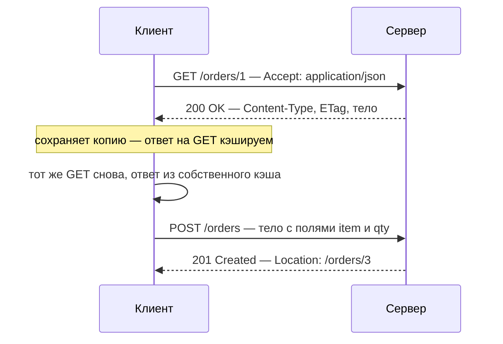
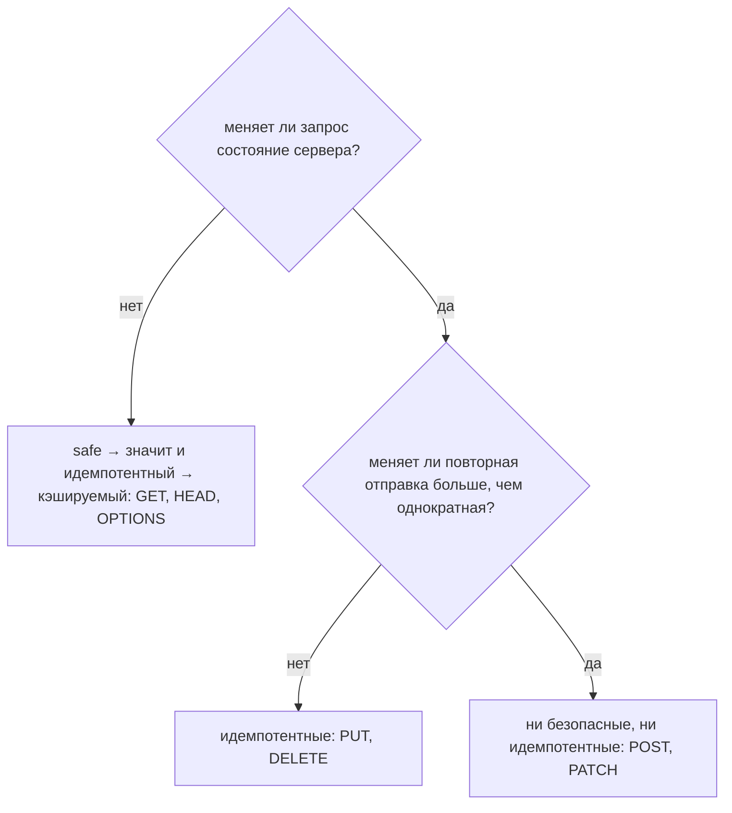
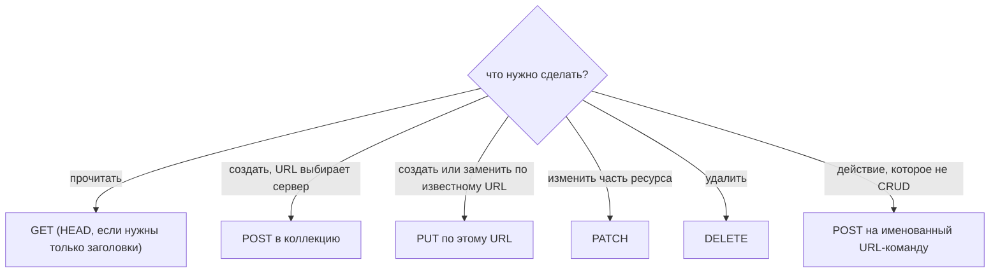

# HTTP и его методы

HTTP — это протокол «запрос-ответ», на котором работает веб. Клиент открывает
соединение (TCP, почти всегда обёрнутый в TLS — это и есть буква S в HTTPS),
отправляет **один запрос** и читает **один ответ**. После этого сервер забывает
всё: HTTP **не хранит состояние**, поэтому каждый запрос обязан сам нести всё,
что нужно серверу для ответа, — именно поэтому аутентификация едет в заголовке
или cookie в *каждом* вызове, а не один раз в начале. Как это выглядит между
браузером и сервисом, разбирается в теме
[как фронтенд и бэкенд общаются](topic:frontend-backend-interaction).

## Один обмен

**Запрос** — это метод, цель (путь и строка запроса), заголовки и, возможно,
тело. **Ответ** — это строка статуса, заголовки и, возможно, тело. И всё —
конверт одинаков для любого метода.

Коды состояния делятся на классы: `1xx` информационные, `2xx` успех, `3xx`
перенаправление, `4xx` ошибка клиента, `5xx` ошибка сервера. Какой код когда
возвращать — отдельная тема:
[управление ошибками и кодами ошибок](topic:api-error-handling).

## Методы

| Метод | Означает | Тело в запросе | Типичный успех |
|---|---|---|---|
| `GET` | отдай представление этого URL | нет | `200 OK` |
| `HEAD` | то же самое, только заголовки | нет | `200 OK`, без тела |
| `POST` | обработай это тело под этим URL (обычно: создай) | да | `201 Created` + `Location` |
| `PUT` | пусть по этому URL лежит именно такое представление | да | `200 OK` / `201 Created` |
| `PATCH` | примени это изменение к ресурсу | да | `200 OK` |
| `DELETE` | удали ресурс по этому URL | редко | `204 No Content` |
| `OPTIONS` | что поддерживает этот URL? | нет | `204` + `Allow` |
| `TRACE` | верни запрос эхом (отладка; обычно отключён) | нет | `200 OK` |
| `CONNECT` | открой туннель через прокси (используется для HTTPS) | нет | `200 OK` |

`GET` и `POST` — те два метода, которые может породить браузерная форма, и это
историческая причина, по которой столько API не используют больше ничего.
Остальные совершенно обычны и поддерживаются везде, кроме обычных HTML-форм.

Две пары стоит развести особенно аккуратно:

- **POST против PUT при создании.** При `POST /orders` URL придумывает *сервер*
  и возвращает его в `Location`. При `PUT /orders/9` URL называет *клиент*, а это
  возможно только тогда, когда клиент может породить идентификатор, который
  сервер примет. Именно из-за этой разницы POST — метод по умолчанию для
  «создать», а PUT — для «заменить» или «upsert по известному id».
- **PUT против PATCH при изменении.** PUT несёт представление целиком, PATCH —
  только изменение, и это имеет вполне реальные последствия для полей, которые вы
  не указали. Об этом есть отдельная тема:
  [PUT против PATCH](topic:put-vs-patch).

`OPTIONS` выглядит академично ровно до того момента, как вы откроете вкладку сети
в браузере: кросс-origin запрос, не похожий на простую форму, автоматически
порождает сначала `OPTIONS` — [preflight-запрос](topic:preflight-requests), — и
сервер отвечает на него заголовками [CORS](topic:cors).

## Что на самом деле различает методы

По проводу все методы идут одинаково. Различается **обещание**, которое каждый из
них даёт всем на пути: браузерам, прокси, CDN, шлюзам, логике повторов.

- **Безопасный (safe)** — запрос не должен менять состояние сервера. `GET`,
  `HEAD`, `OPTIONS`. Никто это не проверяет: обработчик вполне может писать в базу
  на GET, и протокол его не остановит. Просто это будет *неправильно*, потому что
  всё, что стоит на пути, вправе повторить безопасный запрос когда захочет.
- **Идемпотентный** — N одинаковых запросов оставляют то же состояние, что и
  один. `GET`, `HEAD`, `OPTIONS`, `PUT`, `DELETE`. Это утверждение про итоговое
  **состояние**, а не про ответ: первый `DELETE` может ответить `204`, а второй —
  `404`, и метод всё равно идемпотентен, потому что ресурса нет в обоих случаях
  одинаково.
- **Кэшируемый** — ответ можно сохранить и переиспользовать. У `GET` и `HEAD` это
  так по умолчанию; у остальных — только с явными заголовками свежести, что на
  практике означает «нет».

Два уточнения, на которых спотыкаются. Идемпотентный — это **не** то же самое,
что безопасный: `DELETE` меняет мир, он просто не меняет его *ещё раз* при втором
вызове. И `PATCH` не *запрещено* быть идемпотентным — `{"status":"paid"}`
повторяется безвредно, — но HTTP этого не *обещает*, поэтому ни один посредник не
вправе на это рассчитывать.

## Почему эти обещания важны в продакшене

- **Повторы.** Запрос, упавший по таймауту, оставляет клиента в неведении:
  дошёл он или нет. `GET`, `PUT` и `DELETE` можно просто отправить снова. `POST` —
  нельзя: повторите, и у вас два заказа. Стандартное решение — ключ
  идемпотентности (`Idempotency-Key: <uuid>`), который сервер запоминает, чтобы
  второй вызов вернул результат первого, а не сделал работу дважды; см.
  [как избежать дублей продаж](topic:duplicate-sale-prevention) и
  [регистрацию продаж по ненадёжной связи](topic:sales-api-unreliable-connection).
- **Кэширование и предзагрузка.** Браузеры заранее подгружают ссылки, прокси и
  CDN кэшируют ответы на `GET`, а поисковые роботы переходят по каждой найденной
  ссылке. Всё это законно *именно потому*, что GET безопасен, — а значит,
  `GET /orders/1/cancel` рано или поздно выполнит машина, которую никто не просил.
- **Шлюзы и балансировщики** часто сами повторяют идемпотентные методы при 5xx или
  обрыве соединения и отказываются повторять POST. Ваш выбор метода молча
  настраивает инфраструктуру, которой вы не управляете.
- **Отлаживаемость.** `405 Method Not Allowed` (с заголовком `Allow`) означает,
  что URL есть, но метод к нему неприменим; `404` — что такого URL нет;
  `501 Not Implemented` — что сервер вообще не поддерживает такой метод. Правильный
  код экономит вызывающей стороне полдня.

## Как выбрать

Последняя ветка важнее, чем кажется. «Отменить заказ», «согласовать заявку» или
«пересчитать отчёт» — это не редактирование полей; `POST /orders/1/cancel` честно
признаётся, что пишет, и притворяться ему не нужно. Про именование таких URL — в
темах [именование REST-эндпоинтов](topic:rest-endpoint-naming),
[проектирование эндпоинтов в REST-контроллере](topic:rest-controller-endpoint-design)
и [Employee API: команды](topic:employee-api-commands).

## Ответ на собеседовании за 60 секунд

> HTTP — это текстовый протокол «запрос-ответ» без состояния: клиент отправляет
> метод, путь, заголовки и, возможно, тело; сервер отвечает строкой статуса,
> заголовками и, возможно, телом и ничего не помнит между запросами. Методы:
> `GET` (чтение), `HEAD` (чтение только заголовков), `POST` (создать или
> обработать, URL выбирает сервер), `PUT` (положить по этому URL именно такое
> представление), `PATCH` (применить частичное изменение), `DELETE` (удалить),
> `OPTIONS` (спросить, что поддерживает URL; браузеры используют его для
> CORS-preflight), плюс `TRACE` и `CONNECT`, которые прикладной код не использует.
> Различаются они обещаниями: `GET`, `HEAD` и `OPTIONS` безопасны — они не должны
> менять состояние сервера, и именно это делает возможными кэширование и
> предзагрузку; эти три плюс `PUT` и `DELETE` идемпотентны — N одинаковых вызовов
> дают то же состояние, что и один, поэтому клиент может повторить их после
> таймаута; `POST` и `PATCH` не дают ни того, ни другого, поэтому повтору POST
> нужен ключ идемпотентности. По умолчанию кэшируемы только ответы на `GET` и
> `HEAD`. На практике выбор важен потому, что прокси, CDN, браузеры и шлюзы
> действуют по этим обещаниям, ни у кого не спрашивая.

## Частые заблуждения

- **«GET передаёт параметры в URL, POST — в теле, вот и вся разница».** Это
  следствие, а не разница. Разница в том, что GET обещает ничего не менять и его
  вправе повторить кто угодно, а POST не обещает ничего, и повторять его нельзя.
- **«У GET не может быть тела».** Синтаксически может, но читать его никто не
  обязан: прокси его выбрасывают, кэши игнорируют. Кладите параметры в строку
  запроса; если запрос не влезает в URL, сделайте поиск через POST и смиритесь с
  тем, что его ответ не кэшируется.
- **«Идемпотентность — это когда получаешь тот же ответ».** Это когда получаешь то
  же итоговое состояние. `DELETE`, ответивший `204`, а затем `404`, — образцово
  корректен.
- **«POST не идемпотентен, значит, он ненадёжен».** Он строго определён, просто не
  обещает повторяемости. Сделайте *свой* эндпоинт идемпотентным через ключ, если
  клиенты могут повторять запрос.
- **«Безопасный значит защищённый».** Безопасный значит «не меняет состояние
  сервера». Про авторизацию и шифрование это не говорит ничего — см.
  [проектирование схемы безопасности эндпоинтов](topic:endpoint-security-design).
- **«PATCH — это просто PUT для маленьких обновлений».** Метод говорит серверу,
  как читать тело: PUT заменяет, PATCH сливает. Частичный PUT удаляет поля,
  которые вы не указали.
- **«HTTP/2 и HTTP/3 изменили методы».** Они изменили формат кадров и транспорт
  (бинарные фреймы, мультиплексирование, QUIC поверх UDP). Методы, заголовки и
  коды состояния означают ровно то же самое.
- **«REST API нужны все методы».** Ему нужны те, которые поддерживают его ресурсы.
  `405` с заголовком `Allow` — вполне достойный ответ на все остальные.
