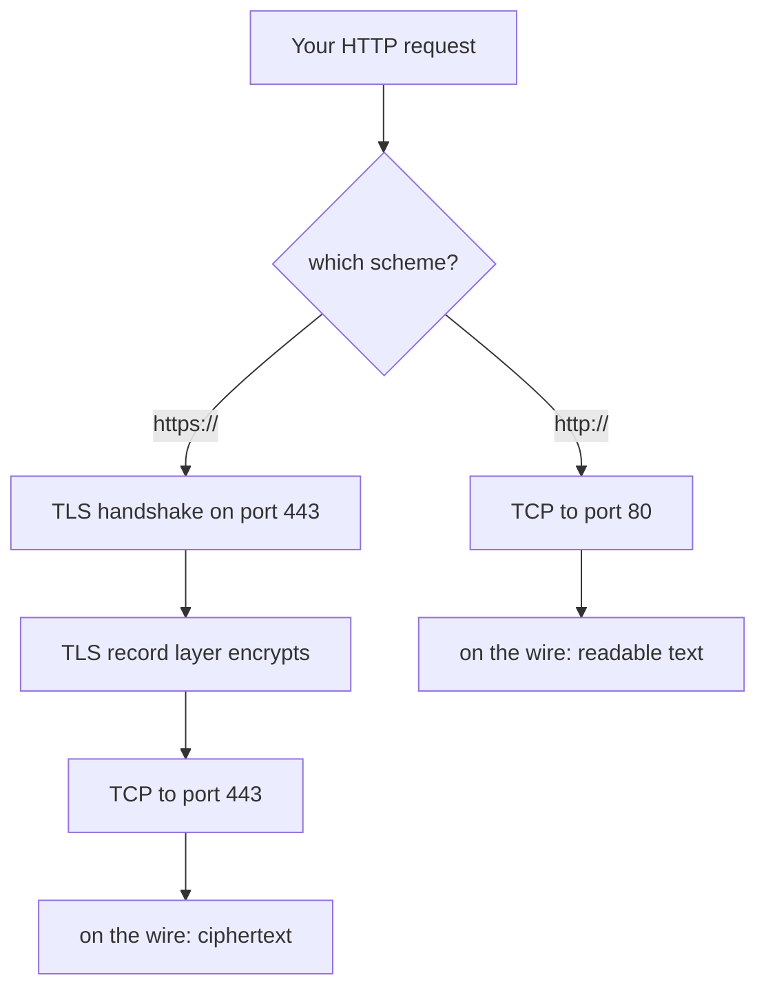
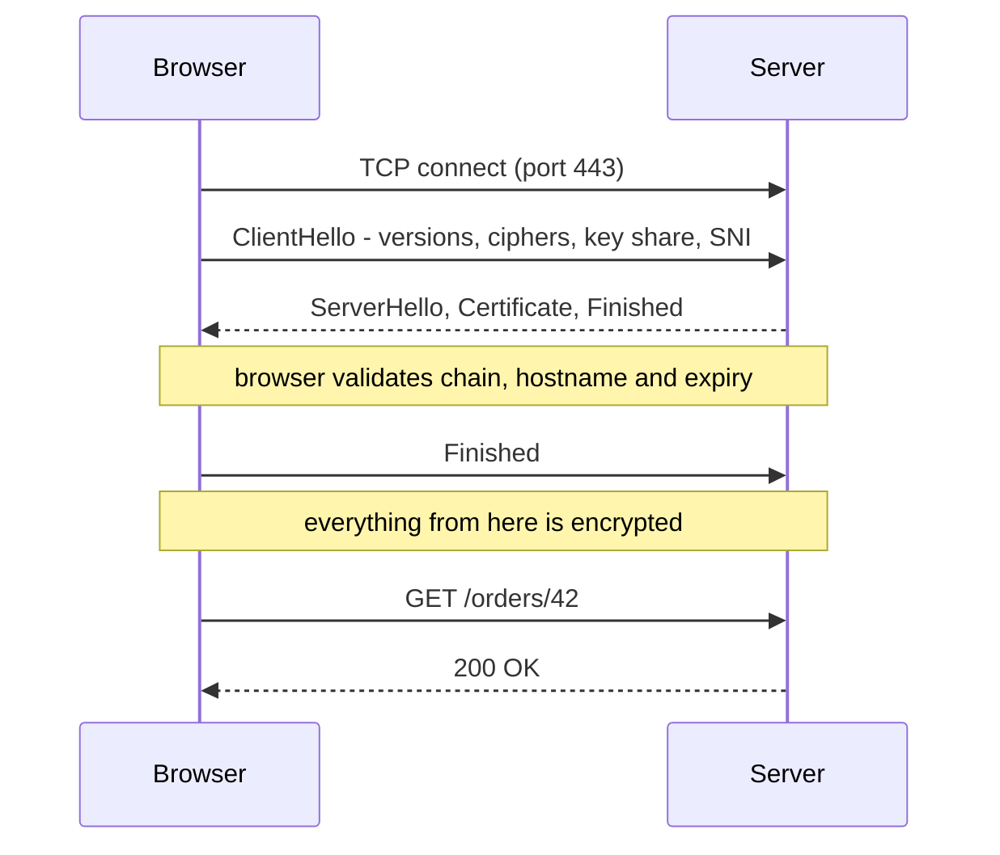
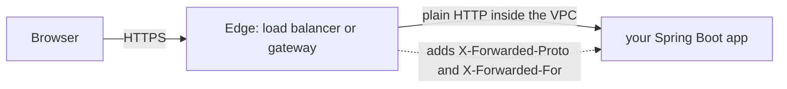

# HTTP vs HTTPS

**HTTPS is HTTP.** Same methods, same status codes, same headers, same
request/response shape — everything in [HTTP and its methods](topic:http-methods)
applies unchanged. The only difference is what the bytes travel inside.

Plain HTTP writes its text straight onto a TCP connection. HTTPS first performs a
**TLS handshake** and then writes exactly the same text into the encrypted tunnel
TLS built. The `S` stands for one extra layer, not for a redesigned protocol.

## What TLS actually adds

Three guarantees, and it is worth naming them separately because interviewers ask
which one is missing in a given scenario.

| Guarantee | What it means | What it stops |
|---|---|---|
| **Confidentiality** | The payload is encrypted with a key only the two endpoints have | Reading your session cookie on café Wi-Fi |
| **Integrity** | Every record is authenticated; tampering breaks the check | An ISP injecting ads, a proxy rewriting your JS |
| **Authentication** | The server presents a certificate for the hostname you asked for | A machine on the path pretending to be `bank.example` |

Authentication is the one people forget, and it is what makes the other two worth
anything. Encrypting a conversation with an attacker is not security — it just
means nobody else can watch you being robbed. That is precisely why a self-signed
certificate is *not* "the same security": you get confidentiality and integrity
against a passive eavesdropper, but no proof of who is on the other end, so an
active man-in-the-middle walks straight through.

Note what is **not** on that list: TLS says nothing about who *you* are (unless
you deploy mutual TLS), nothing about whether the server is well-behaved, and
nothing about the safety of the application logic behind it.

## The handshake

Under TLS 1.3 that costs **one extra round trip** on top of TCP, and zero on a
resumed session. TLS 1.2 needed two. Combined with AES-NI hardware instructions,
the "HTTPS is slow" folklore is a decade out of date — the symmetric encryption
itself is close to free, and what remains is handshake latency you amortise with
connection reuse and session resumption.

The browser's validation step is the interesting part. It checks that the
certificate chains up to a **certificate authority** in its trust store, that the
hostname in the URL matches a name in the certificate, that the certificate is
within its validity dates, and that it has not been revoked (OCSP stapling being
the practical mechanism). Any one of those failing produces the interstitial
warning page.

## What is encrypted — and what is not

This is the highest-value detail in the whole topic, because it is where the
"HTTPS hides everything" assumption breaks.

**Encrypted:** the request line (so the path *and* the query string), every
header, cookies, the request body, the status line, response headers, the
response body.

**Visible to anyone on the path:** the destination IP address and port, the size
and timing of the traffic, the DNS lookup that resolved the hostname (unless
DNS-over-HTTPS is in use), and the hostname in the TLS **SNI** field of the
ClientHello — SNI is sent before the tunnel exists, so an observer generally
learns *which site* you visited even though they cannot see *what you did there*.
Encrypted Client Hello is the fix, and is far from universally deployed.

So `https://shop.example/search?q=secret` hides `secret` from the network — but
not from the server's access log, the browser history, the `Referer` header sent
to third parties, or any proxy that terminates TLS. **Secrets belong in headers
or bodies, never in a URL**, and that reasoning is independent of HTTPS.

## Where the encryption stops

In production, TLS almost never runs all the way to your application process.

The edge — a load balancer, CDN, ingress controller or
[API gateway](topic:api-gateway) — terminates TLS, and traffic continues inward
in the clear. Consequences you should be able to state:

- Your app sees an **HTTP** request and, unless configured otherwise, generates
  `http://` absolute URLs in redirects and `Location` headers, producing a
  redirect loop or a mixed-content error. `X-Forwarded-Proto` plus
  `server.forward-headers-strategy` is the fix.
- The client IP is the load balancer's until you read `X-Forwarded-For`.
- "We use HTTPS" is not a claim about internal traffic. Encrypting
  service-to-service calls is a separate decision — mutual TLS or a service mesh,
  and part of any real
  [endpoint security scheme](topic:endpoint-security-design).
- Anything that terminates TLS can read everything. That is exactly how corporate
  inspection proxies work, and why they must install their own root CA on the
  machine.

## Why HTTPS became mandatory rather than optional

- Browsers mark plain HTTP pages **Not secure**, and increasingly block or
  upgrade them outright.
- **Mixed content**: an HTTPS page loading an HTTP script or stylesheet is
  blocked, because one injected script undoes the whole page's protection.
- **Secure contexts**: Service Workers, `getUserMedia`, geolocation, WebCrypto,
  the Notifications API and HTTP/2 and HTTP/3 in practice are all unavailable
  over plain HTTP.
- Cookies marked `Secure` are never sent over HTTP at all, and `SameSite=None`
  requires `Secure`.
- Certificates are free and automated (ACME / Let's Encrypt), so the old cost
  argument is gone.

## The http → https redirect, and its hole

The standard setup answers port 80 with `301` to the `https://` URL. That works,
but the *first* request already left the browser in the clear and an active
attacker can intercept it and never redirect you at all (SSL stripping).

**HSTS** closes it: `Strict-Transport-Security` tells the browser to convert every
future request to this host into HTTPS *before* sending it. The remaining gap is
the very first visit ever, which the browser **preload list** covers.

## The 60-second interview answer

> HTTPS is HTTP running inside TLS, on port 443 instead of 80. The protocol
> itself — methods, headers, status codes — is identical; TLS wraps it and adds
> confidentiality, integrity and authentication of the server via a certificate
> that a trusted CA signed for that hostname. The client and server negotiate keys
> in a handshake, one extra round trip under TLS 1.3, and everything after it is
> encrypted: the path, the query string, headers, cookies and both bodies. What
> stays visible is the destination IP and port, traffic timing and size, the DNS
> lookup, and the hostname in SNI. HTTPS is effectively mandatory now — browsers
> flag HTTP as insecure, block mixed content, and gate features like Service
> Workers behind secure contexts. Two things I would flag in practice: TLS
> usually terminates at the load balancer, so internal traffic is plaintext
> unless you add mTLS, and the app needs `X-Forwarded-Proto` to know it was an
> HTTPS request; and HTTPS secures the channel only — authentication,
> authorization, XSS and CSRF are still entirely your problem.

## Why it matters in production

- **Certificate expiry is a top outage cause.** Automate renewal and alert on
  days-remaining; a manual yearly renewal will eventually be missed.
- **Protocol and cipher configuration ages.** SSL 2.0/3.0 and TLS 1.0/1.1 are
  disabled everywhere; compliance scans check this, and old clients on old TLS
  versions are the usual reason a "working" API suddenly cannot be reached.
- **`https://` and `http://` are different origins.** Same host, same port — it
  does not matter, the scheme differs, so [CORS](topic:cors) applies between
  them. This surprises people migrating a site scheme by scheme.
- **HTTPS changes nothing about caching semantics** but does prevent
  intermediary caches from seeing your traffic, so shared CDN caching has to be
  explicitly arranged rather than accidental.
- **Local development** runs on plain HTTP; `localhost` is treated as a secure
  context so most browser features still work, which is why a bug only appears
  once deployed. See [how the frontend and the backend talk](topic:frontend-backend-interaction).

## Common misconceptions

- **"The padlock means the site is safe."** It means the connection is private
  and the certificate matches the domain in the address bar. Phishing sites get
  free certificates too — HTTPS says *you are really talking to this domain*, not
  *this domain is honest*.
- **"HTTPS is HTTP + SSL."** SSL is the dead ancestor; every version of it is
  broken and disabled. The protocol is TLS 1.2 or 1.3. The word "SSL" survives
  only in product names like "SSL certificate".
- **"The URL is encrypted, so query parameters are safe."** Encrypted on the
  wire, yes. Still written to server logs, browser history, the `Referer` header
  and any TLS-terminating proxy.
- **"HTTPS protects against SQL injection / XSS / CSRF."** Different layer
  entirely. TLS secures transport; those are application vulnerabilities that
  work identically over an encrypted channel.
- **"HTTPS end-to-end means encrypted all the way to my service."** It is
  encrypted to whatever terminates TLS — usually the load balancer.
- **"HTTPS is slow, so we only use it for the login page."** Mixed HTTP/HTTPS is
  strictly worse: the session cookie leaks on the HTTP pages, which hands over the
  logged-in session anyway. And modern TLS costs a round trip, not throughput.
- **"HTTPS makes my cookies secure."** Only if you set the `Secure` flag (and
  `HttpOnly`, and a sensible `SameSite`). Without `Secure`, a single HTTP request
  to the domain leaks the cookie.
- **"A self-signed certificate gives the same encryption."** Same cipher, no
  identity — which is the guarantee that makes the encryption meaningful. And
  teaching users to click through certificate warnings is its own vulnerability.
- **"HTTPS hides which sites I visit."** DNS and SNI generally reveal the
  hostname; only the content is hidden.
- **"We terminate TLS at the CDN, so we are done."** The CDN sees plaintext, and
  the hop from CDN to origin is a separate decision you have to make explicitly.
