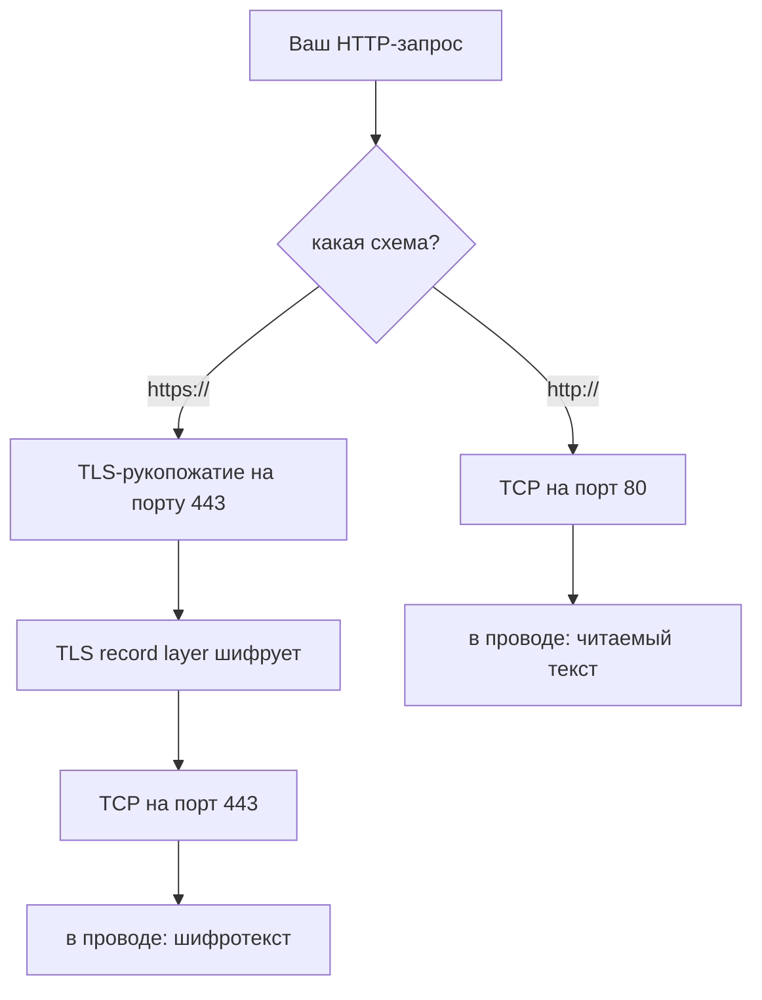
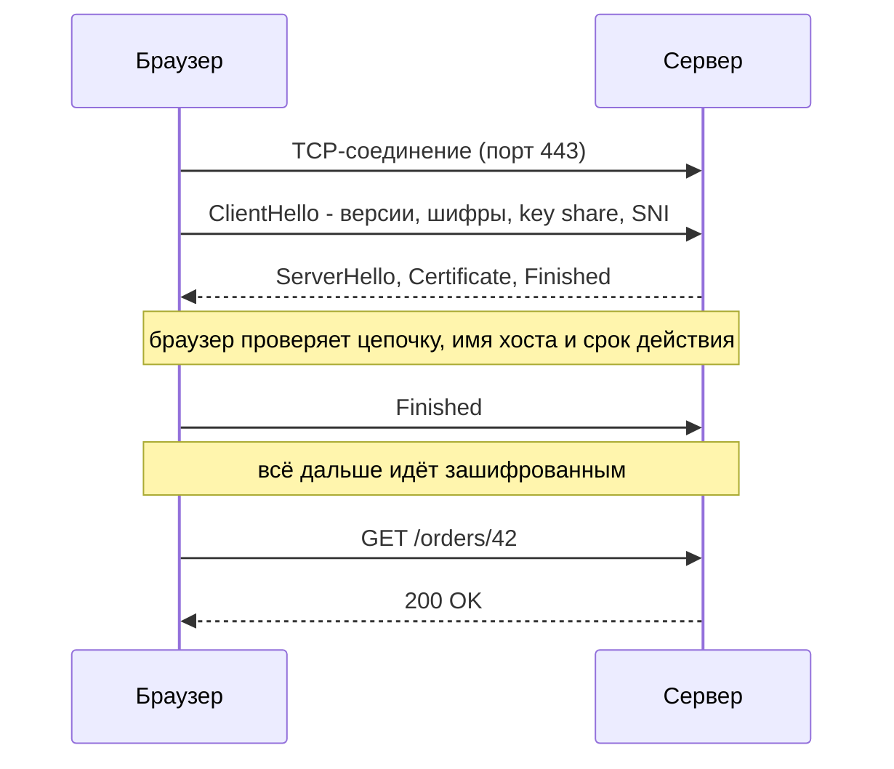
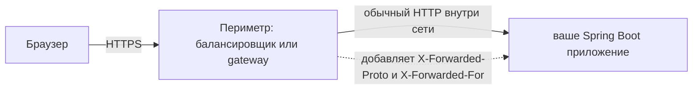

# HTTP против HTTPS

**HTTPS — это HTTP.** Те же методы, те же коды статуса, те же заголовки, та же
форма «запрос — ответ»: всё из темы
[HTTP и его методы](topic:http-methods) применимо без изменений. Отличается
только то, внутри чего эти байты едут.

Обычный HTTP пишет свой текст прямо в TCP-соединение. HTTPS сначала выполняет
**TLS-рукопожатие**, а затем пишет ровно тот же текст в построенный TLS
шифрованный туннель. Буква `S` означает один дополнительный слой, а не
переработанный протокол.

## Что именно добавляет TLS

Три гарантии, и их стоит называть по отдельности: на собеседовании часто
спрашивают, какой из них не хватает в конкретном сценарии.

| Гарантия | Что означает | Что предотвращает |
|---|---|---|
| **Конфиденциальность** | Полезная нагрузка зашифрована ключом, который есть только у двух сторон | Чтение вашей сессионной куки в Wi-Fi кофейни |
| **Целостность** | Каждая запись аутентифицирована; подмена ломает проверку | Провайдер вставляет рекламу, прокси переписывает ваш JS |
| **Аутентификация** | Сервер предъявляет сертификат на тот хост, который вы запросили | Машина на пути притворяется `bank.example` |

Про аутентификацию забывают чаще всего, а именно она делает остальные две
осмысленными. Шифровать разговор со злоумышленником — это не безопасность: это
лишь означает, что никто посторонний не увидит, как вас обворовывают. Именно
поэтому самоподписанный сертификат — это *не* «та же самая защита»: вы получаете
конфиденциальность и целостность против пассивного слушателя, но никакого
доказательства, кто на другом конце, — и активный man-in-the-middle проходит
насквозь.

Обратите внимание, чего в этом списке **нет**: TLS ничего не говорит о том, кто
такой *вы* (если не разворачивать mutual TLS), ничего о том, добросовестен ли
сервер, и ничего о безопасности прикладной логики за ним.

## Рукопожатие

В TLS 1.3 это стоит **одного лишнего round trip** сверх TCP и нуля при
возобновлении сессии. В TLS 1.2 нужно было два. Вместе с аппаратными
инструкциями AES-NI фольклор «HTTPS тормозит» отстал лет на десять: само
симметричное шифрование почти бесплатно, а остаётся задержка рукопожатия,
которая амортизируется переиспользованием соединений и возобновлением сессий.

Самое интересное здесь — шаг проверки в браузере. Он проверяет, что сертификат
выстраивается в цепочку до **удостоверяющего центра** (CA) из его хранилища
доверия, что имя хоста из URL совпадает с именем в сертификате, что сертификат
не просрочен и что он не отозван (на практике механизм — OCSP stapling). Провал
любой из проверок даёт ту самую страницу-предупреждение.

## Что зашифровано, а что нет

Это самая ценная деталь всей темы, потому что именно здесь ломается
предположение «HTTPS скрывает всё».

**Зашифровано:** строка запроса (то есть путь *и* query-строка), все заголовки,
куки, тело запроса, строка статуса, заголовки ответа, тело ответа.

**Видно любому на пути:** IP-адрес назначения и порт, объём и тайминг трафика,
DNS-запрос, разрешивший имя хоста (если не используется DNS-over-HTTPS), и имя
хоста в поле **SNI** внутри ClientHello — SNI отправляется до того, как туннель
существует, поэтому наблюдатель обычно узнаёт, *на какой сайт* вы зашли, хотя и
не видит, *что вы там делали*. Лечится это через Encrypted Client Hello, который
развёрнут далеко не везде.

Так что `https://shop.example/search?q=secret` прячет `secret` от сети — но не от
лога доступа сервера, истории браузера, заголовка `Referer`, уходящего третьим
сторонам, и не от любого прокси, который терминирует TLS. **Секретам место в
заголовках или теле, но никогда не в URL**, и это рассуждение не зависит от
HTTPS.

## Где шифрование заканчивается

В продакшене TLS почти никогда не доходит до самого процесса вашего приложения.

Периметр — балансировщик, CDN, ingress-контроллер или
[API gateway](topic:api-gateway) — терминирует TLS, и дальше внутрь трафик идёт
в открытом виде. Следствия, которые стоит уметь назвать:

- Ваше приложение видит **HTTP**-запрос и, если его не настроить, генерирует
  абсолютные URL с `http://` в редиректах и заголовке `Location`, что даёт цикл
  редиректов или ошибку mixed content. Лечится `X-Forwarded-Proto` и
  `server.forward-headers-strategy`.
- IP клиента — это IP балансировщика, пока вы не прочитаете `X-Forwarded-For`.
- «У нас HTTPS» — это не утверждение о внутреннем трафике. Шифрование вызовов
  между сервисами — отдельное решение: mutual TLS или service mesh, часть любой
  настоящей [схемы безопасности эндпоинтов](topic:endpoint-security-design).
- Всё, что терминирует TLS, читает всё. Ровно так работают корпоративные прокси
  с инспекцией трафика — и именно поэтому им приходится ставить на машину свой
  корневой CA.

## Почему HTTPS стал обязательным, а не опциональным

- Браузеры помечают страницы на обычном HTTP как **Not secure** и всё чаще
  блокируют или принудительно апгрейдят их.
- **Mixed content**: HTTPS-страница, загружающая скрипт или стиль по HTTP,
  блокируется — один внедрённый скрипт обнуляет защиту всей страницы.
- **Secure contexts**: Service Workers, `getUserMedia`, геолокация, WebCrypto,
  Notifications API, а на практике и HTTP/2 с HTTP/3 недоступны по обычному
  HTTP.
- Куки с флагом `Secure` вообще никогда не уходят по HTTP, а `SameSite=None`
  требует `Secure`.
- Сертификаты бесплатны и автоматизированы (ACME / Let's Encrypt), так что
  старый аргумент про стоимость исчез.

## Редирект http → https и его дыра

Стандартная схема: порт 80 отвечает `301` на `https://`-адрес. Это работает, но
*первый* запрос уже ушёл из браузера в открытом виде, и активный атакующий может
его перехватить и не редиректить вас вовсе (SSL stripping).

Закрывает это **HSTS**: заголовок `Strict-Transport-Security` велит браузеру
превращать все будущие запросы к этому хосту в HTTPS *до* отправки. Остаётся
щель самого первого в жизни визита, и её закрывает **preload-список** браузера.

## Ответ на собеседовании за 60 секунд

> HTTPS — это HTTP, работающий внутри TLS, на порту 443 вместо 80. Сам протокол
> — методы, заголовки, коды статуса — идентичен; TLS оборачивает его и добавляет
> конфиденциальность, целостность и аутентификацию сервера через сертификат,
> который доверенный CA подписал на это имя хоста. Клиент и сервер согласуют
> ключи в рукопожатии — один лишний round trip в TLS 1.3, — и всё после него
> зашифровано: путь, query-строка, заголовки, куки и оба тела. Видимыми остаются
> IP и порт назначения, тайминг и объём трафика, DNS-запрос и имя хоста в SNI.
> Сейчас HTTPS фактически обязателен: браузеры помечают HTTP как небезопасный,
> блокируют mixed content и прячут возможности вроде Service Workers за secure
> contexts. Два момента, которые я бы отметил на практике: TLS обычно
> терминируется на балансировщике, поэтому внутренний трафик идёт открытым,
> пока не добавишь mTLS, а приложению нужен `X-Forwarded-Proto`, чтобы понять,
> что запрос был по HTTPS; и HTTPS защищает только канал — аутентификация,
> авторизация, XSS и CSRF по-прежнему полностью ваша забота.

## Почему это важно в продакшене

- **Просроченный сертификат — одна из главных причин аварий.** Автоматизируйте
  продление и алертите по числу оставшихся дней; ручное ежегодное продление
  рано или поздно пропустят.
- **Конфигурация протоколов и шифров устаревает.** SSL 2.0/3.0 и TLS 1.0/1.1
  отключены везде; это проверяют сканеры соответствия, а старые клиенты на
  старых версиях TLS — обычная причина, почему «работавший» API вдруг стал
  недоступен.
- **`https://` и `http://` — это разные origin.** Тот же хост, тот же порт —
  неважно: схема различается, значит между ними действует
  [CORS](topic:cors). Это удивляет тех, кто мигрирует сайт по схеме.
- **HTTPS ничего не меняет в семантике кэширования**, но мешает промежуточным
  кэшам видеть ваш трафик, поэтому общее кэширование на CDN приходится
  настраивать явно, а не получать случайно.
- **Локальная разработка** идёт по обычному HTTP; `localhost` считается secure
  context, поэтому большинство браузерных возможностей работает — и именно
  поэтому баг вылезает только после деплоя. См.
  [как общаются фронтенд и бэкенд](topic:frontend-backend-interaction).

## Частые заблуждения

- **«Замочек означает, что сайт безопасен».** Он означает, что соединение
  приватно и сертификат соответствует домену в адресной строке. Фишинговые сайты
  тоже получают бесплатные сертификаты: HTTPS говорит *вы действительно
  разговариваете с этим доменом*, а не *этот домен честный*.
- **«HTTPS — это HTTP + SSL».** SSL — мёртвый предок; все его версии сломаны и
  отключены. Протокол — TLS 1.2 или 1.3. Слово «SSL» выжило только в названиях
  продуктов вроде «SSL-сертификат».
- **«URL зашифрован, значит query-параметры в безопасности».** В проводе — да. И
  всё равно попадают в логи сервера, историю браузера, заголовок `Referer` и в
  любой прокси, терминирующий TLS.
- **«HTTPS защищает от SQL-инъекций / XSS / CSRF».** Совершенно другой уровень.
  TLS защищает транспорт, а это уязвимости приложения, которые одинаково
  работают и по шифрованному каналу.
- **«HTTPS end-to-end — значит шифрование доходит до моего сервиса».** Оно
  доходит до того, кто терминирует TLS, а это обычно балансировщик.
- **«HTTPS медленный, поэтому используем его только на странице логина».**
  Смесь HTTP и HTTPS строго хуже: сессионная кука утечёт на HTTP-страницах, а
  это и есть выдача залогиненной сессии. И современный TLS стоит одного round
  trip, а не пропускной способности.
- **«HTTPS делает мои куки безопасными».** Только если вы поставили флаг
  `Secure` (а также `HttpOnly` и разумный `SameSite`). Без `Secure` один
  HTTP-запрос к домену сливает куку.
- **«Самоподписанный сертификат даёт такое же шифрование».** Тот же шифр, но нет
  идентичности — а это и есть гарантия, которая делает шифрование осмысленным.
  Плюс приучать пользователей прокликивать предупреждения о сертификате — сама
  по себе уязвимость.
- **«HTTPS скрывает, какие сайты я посещаю».** DNS и SNI обычно раскрывают имя
  хоста; скрыто только содержимое.
- **«Мы терминируем TLS на CDN, значит всё готово».** CDN видит открытый текст,
  а участок от CDN до origin — отдельное решение, которое нужно принять явно.
