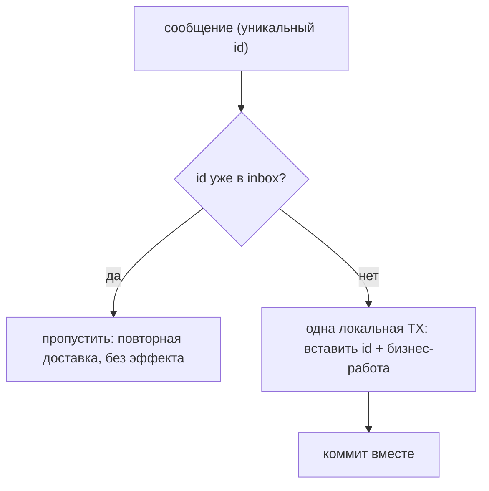
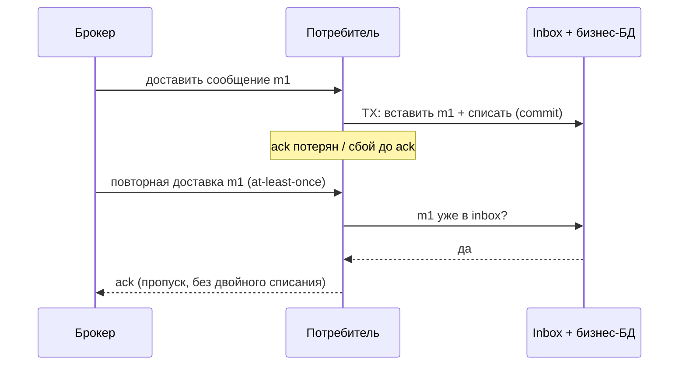
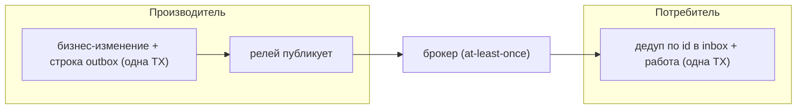

# Паттерн Inbox

> **Обучающая модель.** Запускаемый код использует `VisualInbox` — учебную
> модель, которая воспроизводит идею, о которой спрашивает интервьюер:
> идемпотентный потребитель, дедуплицирующий повторно доставленные сообщения по
> **таблице inbox**, — и выдаёт трейс-события, которые проигрывает панель справа.
> Конкретный сценарий — **платёжный потребитель**: каждое сообщение несёт эффект
> (`amount` для списания). *Поведение, о котором вы рассуждаете* — это реальный
> паттерн.

## Какую проблему он решает

Брокеры сообщений (Kafka, RabbitMQ, SQS, …) почти никогда не дают
**exactly-once** доставку. Практическая гарантия — **at-least-once**: если
потребитель упал после выполнения работы, но *до* подтверждения сообщения, или
ack потерян, или произошёл ребаланс группы, брокер **доставит то же сообщение
повторно**.

Наивный потребитель применяет побочный эффект каждый раз, когда видит сообщение.
При at-least-once это означает **двойные списания, дублирующиеся заказы, двойные
письма**. Паттерн Inbox делает потребителя **идемпотентным**, чтобы повторно
доставленное сообщение было no-op.

## Ментальная модель

Держите **таблицу inbox** в *той же базе данных*, что и бизнес-данные. У каждого
входящего сообщения есть стабильный **уникальный id сообщения**. Для каждого
сообщения, в **одной локальной транзакции**:

1. **Проверка на дубль** — этот id уже есть в таблице inbox?
2. Если **да** → это повторная доставка (at-least-once). Пропускаем; эффект не
   применяем.
3. Если **нет** → вставляем id в inbox **и** делаем бизнес-работу, затем коммит.
   Настоящий страж — это ограничение `UNIQUE` на id.

Поскольку запись дедупликации и бизнес-запись живут в **одной ACID-транзакции**,
они коммитятся или откатываются вместе. Именно это превращает доставку
at-least-once в обработку **effectively-once**.

## Почему одна транзакция обязательна

Если записать id в одной транзакции, а работу сделать в другой, падение между
ними ломает вас в обе стороны:

- Работа закоммитилась, запись id — нет → следующая повторная доставка сделает
  работу **снова**.
- Запись id закоммитилась, работа — нет → сообщение помечено как обработанное, но
  эффект **так и не произошёл** (тихая потеря).

Та же БД, та же транзакция, атомарно. (Если побочный эффект — во внешней системе,
которую нельзя включить в транзакцию, нужна другая тактика: сделать сам
нижестоящий вызов идемпотентным, используя id сообщения как ключ.)

## Ключ идемпотентности — это id сообщения, а не payload

Дедуплицируйте по **стабильному уникальному id**, который проставляет
производитель. Два по-настоящему разных события могут нести одинаковое тело
(клиент действительно купил тот же товар дважды) — дедуп по payload молча
отбросил бы вторую реальную покупку. И наоборот, одно и то же логическое
сообщение должно сохранять **тот же id** при повторных доставках, поэтому id
назначает производитель, а не потребитель.

## Inbox против Outbox

Это две половины надёжного обмена сообщениями, и они часто идут вместе:

- **Outbox** (сторона производителя) — записать бизнес-изменение и событие
  «к отправке» в одну транзакцию БД, затем релей публикует событие. Решает
  «опубликовать ровно тогда, когда БД закоммитилась».
- **Inbox** (сторона потребителя) — дедуплицировать входящие сообщения, чтобы
  at-least-once обрабатывалось effectively-once. Решает «применить эффект каждого
  сообщения один раз».

## Как не дать таблице расти бесконечно

Inbox растёт с каждым новым сообщением, поэтому старые id вычищают по
**политике ретенции**. Ловушка: окно ретенции должно быть **больше
максимальной задержки повторной доставки** у брокера. Очистите слишком рано — и
поздний дубликат забытого id будет выглядеть совершенно новым и обработается
второй раз.

## Ответ на собеседовании (60 секунд)

> Брокеры дают доставку at-least-once, поэтому одно и то же сообщение может прийти
> несколько раз, и наивный потребитель применил бы эффект дважды. Паттерн Inbox
> делает потребителя идемпотентным: вы держите таблицу inbox с id обработанных
> сообщений и для каждого сообщения в одной локальной транзакции проверяете,
> есть ли уже этот id — если есть, пропускаете, иначе записываете id и делаете
> бизнес-работу вместе и коммитите. Поскольку запись дедупликации и работа в одной
> транзакции, at-least-once становится effectively-once. Ключ — это стабильный id
> сообщения от производителя, а не payload, а старые id чистят по окну ретенции,
> которое больше задержки повторной доставки. Это потребительский аналог паттерна
> [Outbox](topic:outbox-pattern).

## Частые заблуждения

- ❌ «Он даёт настоящую доставку exactly-once.» — Нет. Доставка всё равно
  at-least-once; inbox даёт effectively-once *обработку*. Сквозная доставка
  exactly-once невозможна в ненадёжной сети (проблема двух генералов).
- ❌ «Дедуп по телу сообщения.» — Используйте стабильный уникальный id. Одинаковые
  payload могут быть разными законными событиями.
- ❌ «Записывать id и делать работу в разных транзакциях.» — Падение между ними
  либо переобработает, либо тихо потеряет эффект. Они должны быть атомарны.
- ❌ «Таблицу inbox можно хранить вечно, очистка неважна.» — Она растёт
  неограниченно; но слишком агрессивная очистка приведёт к переобработке поздних
  дубликатов. Окно должно превышать максимальную задержку повторной доставки.
- ❌ «Если работа естественно идемпотентна, inbox всё равно нужен.» — Не всегда;
  если применить эффект дважды действительно безвредно (например, идемпотентный
  `SET`), дедупликация может быть вовсе не нужна. Inbox важен, когда эффект *не*
  идемпотентен.
- ❌ «Inbox и Outbox — это одно и то же.» — Outbox — это надёжная публикация на
  стороне производителя; Inbox — идемпотентная обработка на стороне потребителя.
