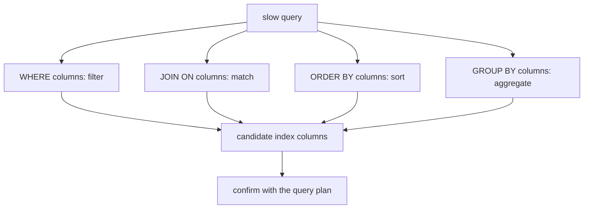
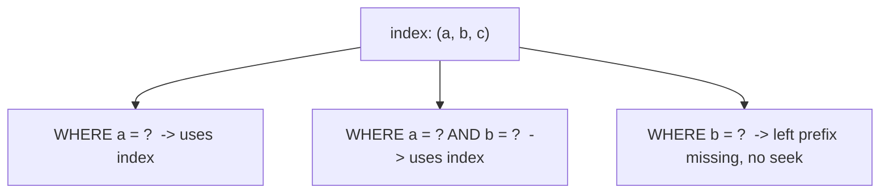

# Which Indexes to Add to Optimize Queries

## Intuition: design from the query, not the table

The mistake beginners make is staring at a table and asking "which columns deserve an index?" The right question is the opposite: **look at the actual queries that are slow, and build an index that matches the shape of each one.** An index is not a property of a table; it is a tool for a specific lookup.

Think of a busy restaurant kitchen. You do not pre-sort every ingredient in the pantry "just in case." You watch which dishes are ordered most, then arrange the station so those dishes are fast to plate. The orders (queries) decide how you lay out the station (indexes), not the other way around. For the broader theory of how an index works, see [Database Indexes](topic:database-indexes); this topic is about *choosing* them.

So the first step is to read a query and extract the columns that appear in four places:

- **`WHERE`** — the filter columns (which rows do we keep?)
- **`JOIN ... ON`** — the columns that match two tables
- **`ORDER BY`** — the columns that define the output order
- **`GROUP BY`** — the columns the rows are aggregated by

These are exactly the [fields that matter in a query](topic:database-query-fields). Everything else in the `SELECT` list is just data to return, not a reason to index.

## The column-order recipe: equality, then sort, then range

When several columns belong in one composite index, the order is not arbitrary. A good rule of thumb is **equality columns first, then the column you sort by, then range columns last** (often abbreviated E-S-R).

- **Equality** (`tenant_id = ?`, `status = ?`) — these pin the index to one narrow slice.
- **Sort** (`ORDER BY created_at`) — once the equality columns are fixed, the remaining keys are already in sorted order, so the database reads them in order and skips a separate sort step.
- **Range** (`created_at >= ?`, `price BETWEEN ...`) — a range "opens up" the index; any column after a range column can no longer be used for seeking, only for filtering.

For `WHERE tenant_id = ? AND status = ? ORDER BY created_at` the right index is `(tenant_id, status, created_at)`: the two equalities jump straight to the matching block, and `created_at` is already sorted inside that block, so `ORDER BY` is free.

This is like a post office sorting mail: first by country, then by city, then by street, and within a street the letters are already in house-number order. Once you know the country and city (the equalities), the street shelf hands you the houses in order without re-sorting.

## Selectivity: index columns that actually narrow the search

An index only earns its keep if it cuts the candidate rows down to a small fraction. That fraction is **selectivity**. A column like `email` is highly selective — one value points at basically one row. A column like `is_active`, where 95% of rows are `true`, is poorly selective: the database would still have to fetch almost everything, so the optimizer often ignores such an index and scans instead.

Imagine a parking garage sign. "Level 3, Row F, Spot 12" sends you straight to your car. A sign that just says "cars this way" on a road full of cars separates nothing. Index the signs that genuinely split the crowd.

A practical consequence: put the **most selective equality column first** when several are equally eligible, so the index narrows fastest.

## Leftmost prefix: one composite index serves many queries

A composite index `(a, b, c)` is usable for queries that constrain a **leftmost prefix** of its columns: `a`, or `a, b`, or `a, b, c` — but not `b` alone, and not `c` alone. The keys are sorted left to right, so you cannot jump to a middle column without fixing the ones before it.

This is the phone book rule: a book sorted by last name then first name is great for "Ivanov" and for "Ivanov, Anna", but useless if all you know is the first name "Anna". One well-ordered composite index can therefore replace several single-column indexes — design the order so the common queries hit a prefix.

## Covering indexes: answer without touching the table

If an index contains **every column a query needs** — both the filter columns and the columns in the `SELECT` list — the database can answer from the index alone and never visit the table row. That is a **covering index**, and it removes the second hop that a [non-clustered index](topic:clustered-vs-nonclustered-indexes) normally pays.

For `SELECT created_at, total FROM orders WHERE customer_id = ? ORDER BY created_at`, an index on `(customer_id, created_at, total)` covers it: `customer_id` seeks, `created_at` sorts, and `total` is carried along so no table lookup is needed.

It is like a parcel pickup slip that already prints the shelf, the recipient, and the weight: the clerk answers your question from the slip without opening the box. Covering is powerful but costs width — wider index keys mean more storage and slower writes, so cover deliberately, not by default.

## Special-purpose indexes

- **Join columns / foreign keys.** A foreign key used in a `JOIN` usually deserves an index on the child side, or every join probes the table linearly. This matters most in join-heavy schemas like a [many-to-many model](topic:sql-many-to-many).
- **Partial (filtered) index.** Index only the rows you query: `WHERE status = 'OPEN'` on a table that is 99% closed. The index stays tiny and fast. Like a "today's specials" board that lists only the few dishes that matter right now.
- **Expression / functional index.** If you filter on `LOWER(email)`, a plain index on `email` will not be used — index the expression itself. The shelf has to be sorted the same way you ask for things.

## 60-second interview answer

Start from the queries, not the table. For each slow query, find the columns in `WHERE`, `JOIN`, `ORDER BY`, and `GROUP BY`. Build a composite index ordering the columns as equality first, then the sort column, then ranges (E-S-R), so the index both seeks to the right rows and returns them already sorted. Put the most selective columns early; low-selectivity columns like a boolean rarely help. Composite indexes are usable only on a leftmost prefix, so one good index can serve several queries. Add a covering index when the query is hot and you want to avoid the table lookup. Don't over-index — every index slows writes and uses storage — and always confirm with the [query plan](topic:query-plan) that the index is actually used, because the optimizer may still scan when a query returns most of the table.

## Production relevance

The real workflow is a loop, not a one-time guess: find the slow query (from logs or an APM), read its [execution plan](topic:query-execution-plan), add the narrowest index that turns a sequential scan into an index scan, then measure again. Index design pairs naturally with [prepared statements](topic:prepared-statements), since stable, parameterized query shapes are exactly what you tune indexes for.

It is like adding clear signage to a parking garage one problem area at a time: you watch where drivers circle, add a sign there, and check that the circling stops — you do not paper every wall with signs. Note also that an index points to *candidate* rows; in an [MVCC](topic:mvcc) database the engine still checks whether each row version is visible to the transaction, so an index narrows the search but does not replace visibility rules.

## Common misconceptions

- **"Index every column in the `WHERE` clause separately."** Several single-column indexes are usually worse than one well-ordered composite index; the database can seek through composite keys in one pass instead of combining bitmaps. A phone book sorted two ways at once beats two separate lists.
- **"Column order in a composite index doesn't matter."** It is the whole game. `(a, b)` and `(b, a)` serve completely different queries because only the leftmost prefix is seekable.
- **"More indexes always means faster."** Faster reads, slower writes. Every `INSERT`/`UPDATE`/`DELETE` must update each affected index, and the optimizer spends longer choosing among many indexes. A kitchen with a checklist per ingredient spends its night updating checklists.
- **"If the index exists, the database will use it."** Not when the query returns most of the table, or the column is poorly selective, or you filtered on an expression the index doesn't match. Check the plan, don't assume.
- **"Indexing the `SELECT` columns speeds things up."** Only filter/join/sort/group columns drive the seek; `SELECT`-only columns matter solely for *covering*, never for finding rows.
