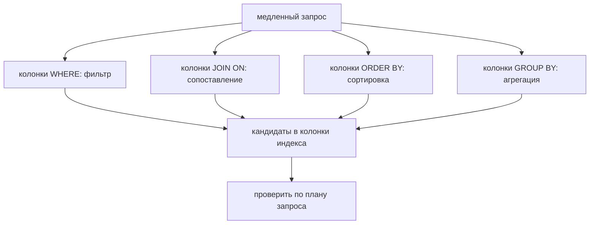
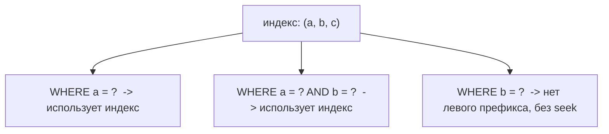

# Какие индексы нужны для оптимизации запросов

## Интуиция: проектируй от запроса, а не от таблицы

Главная ошибка новичков — смотреть на таблицу и спрашивать «каким колонкам нужен индекс?». Правильный вопрос обратный: **посмотри на конкретные медленные запросы и построй индекс под форму каждого из них.** Индекс — это не свойство таблицы, а инструмент для конкретного поиска.

Представь загруженную кухню ресторана. Ты не раскладываешь заранее каждый ингредиент в кладовке «на всякий случай». Ты смотришь, какие блюда заказывают чаще, и расставляешь рабочую станцию так, чтобы именно их было быстро собирать. Заказы (запросы) решают, как разложить станцию (индексы), а не наоборот. Общую теорию того, как устроен индекс, смотри в теме [Индексы в базе данных](topic:database-indexes); здесь речь именно о том, как их *выбирать*.

Поэтому первый шаг — прочитать запрос и выписать колонки, которые встречаются в четырёх местах:

- **`WHERE`** — колонки фильтра (какие строки оставляем?)
- **`JOIN ... ON`** — колонки, по которым сопоставляются две таблицы
- **`ORDER BY`** — колонки, задающие порядок вывода
- **`GROUP BY`** — колонки, по которым строки агрегируются

Это и есть [поля, которые важны в запросе](topic:database-query-fields). Всё остальное в списке `SELECT` — это просто данные для возврата, а не повод для индекса.

## Рецепт порядка колонок: равенство, затем сортировка, затем диапазон

Когда несколько колонок входят в один составной индекс, их порядок не произволен. Хорошее правило: **сначала колонки равенства, затем колонка сортировки, затем диапазоны** (часто сокращают как E-S-R: Equality, Sort, Range).

- **Равенство** (`tenant_id = ?`, `status = ?`) — оно «прибивает» индекс к одному узкому срезу.
- **Сортировка** (`ORDER BY created_at`) — после фиксации колонок равенства оставшиеся ключи уже идут по порядку, поэтому база читает их по порядку и пропускает отдельный шаг сортировки.
- **Диапазон** (`created_at >= ?`, `price BETWEEN ...`) — диапазон «раскрывает» индекс; любая колонка после диапазонной уже не годится для поиска (seek), только для фильтрации.

Для `WHERE tenant_id = ? AND status = ? ORDER BY created_at` правильный индекс — `(tenant_id, status, created_at)`: два равенства сразу прыгают в нужный блок, а `created_at` внутри этого блока уже отсортирован, поэтому `ORDER BY` достаётся бесплатно.

Это как сортировка почты на почте: сначала по стране, потом по городу, потом по улице, а внутри улицы письма уже идут по номерам домов. Как только известны страна и город (равенства), полка с улицей выдаёт дома по порядку без пересортировки.

## Селективность: индексируй колонки, которые реально сужают поиск

Индекс оправдывает себя, только если он сокращает число кандидатов до малой доли строк. Эта доля — **селективность**. Колонка вроде `email` высокоселективна: одно значение указывает практически на одну строку. Колонка вроде `is_active`, где 95% строк — `true`, селективна плохо: базе всё равно пришлось бы доставать почти всё, поэтому оптимизатор часто игнорирует такой индекс и сканирует таблицу.

Представь указатель в парковке. «Уровень 3, ряд F, место 12» ведёт прямо к машине. Указатель «машины сюда» на дороге, полной машин, не разделяет ничего. Индексируй те указатели, которые действительно делят толпу.

Практический вывод: когда несколько колонок равенства одинаково подходят, ставь **самую селективную колонку равенства первой**, чтобы индекс сужал быстрее всего.

## Левый префикс: один составной индекс обслуживает много запросов

Составной индекс `(a, b, c)` пригоден для запросов, которые ограничивают **левый префикс** его колонок: `a`, или `a, b`, или `a, b, c` — но не `b` отдельно и не `c` отдельно. Ключи отсортированы слева направо, поэтому нельзя прыгнуть к средней колонке, не зафиксировав предыдущие.

Это правило телефонной книги: книга, отсортированная по фамилии, затем по имени, отлично подходит для «Иванов» и для «Иванов, Анна», но бесполезна, если известно только имя «Анна». Поэтому один хорошо упорядоченный составной индекс может заменить несколько одноколоночных — спроектируй порядок так, чтобы частые запросы попадали в префикс.

## Covering-индексы: ответить, не трогая таблицу

Если индекс содержит **все колонки, нужные запросу** — и колонки фильтра, и колонки из списка `SELECT`, — база может ответить из одного индекса и вообще не обращаться к строке таблицы. Это **covering-индекс**, и он убирает второй прыжок, который обычно платит [некластерный индекс](topic:clustered-vs-nonclustered-indexes).

Для `SELECT created_at, total FROM orders WHERE customer_id = ? ORDER BY created_at` индекс по `(customer_id, created_at, total)` его покрывает: `customer_id` ищет, `created_at` сортирует, а `total` несётся следом, так что обращение к таблице не нужно.

Это как квитанция на выдачу посылки, где уже напечатаны полка, получатель и вес: служащий отвечает на вопрос по квитанции, не вскрывая коробку. Covering мощен, но стоит ширины — более широкие ключи означают больше места и более медленную запись, поэтому покрывай осознанно, а не по умолчанию.

## Индексы специального назначения

- **Колонки джойна / внешние ключи.** Внешнему ключу, по которому идёт `JOIN`, обычно нужен индекс на стороне-потомке, иначе каждый джойн линейно прощупывает таблицу. Особенно это важно в схемах с обилием джойнов, например в [связи многие-ко-многим](topic:sql-many-to-many).
- **Частичный (filtered) индекс.** Индексируй только те строки, которые запрашиваешь: `WHERE status = 'OPEN'` на таблице, которая на 99% закрыта. Индекс остаётся крошечным и быстрым. Как доска «блюда дня», где перечислены только те немногие позиции, что важны прямо сейчас.
- **Индекс по выражению (functional).** Если фильтруешь по `LOWER(email)`, обычный индекс по `email` использован не будет — индексируй само выражение. Полка должна быть отсортирована так же, как ты спрашиваешь.

## Ответ за 60 секунд

Начинай от запросов, а не от таблицы. Для каждого медленного запроса найди колонки в `WHERE`, `JOIN`, `ORDER BY` и `GROUP BY`. Построй составной индекс, упорядочив колонки так: сначала равенство, затем колонка сортировки, затем диапазоны (E-S-R), чтобы индекс и находил нужные строки, и возвращал их уже отсортированными. Самые селективные колонки ставь раньше; низкоселективные, например boolean, помогают редко. Составной индекс пригоден только по левому префиксу, поэтому один хороший индекс может обслужить несколько запросов. Добавляй covering-индекс, когда запрос горячий и хочется избежать обращения к таблице. Не переусердствуй с индексами — каждый замедляет запись и занимает место — и всегда проверяй по [плану запроса](topic:query-plan), что индекс действительно используется, потому что оптимизатор может всё равно выбрать скан, если запрос возвращает большую часть таблицы.

## Практическая значимость

Реальный процесс — это цикл, а не разовая догадка: найди медленный запрос (по логам или APM), прочитай его [план выполнения](topic:query-execution-plan), добавь самый узкий индекс, который превращает последовательный скан в индексный, и снова замерь. Проектирование индексов естественно сочетается с [подготовленными выражениями](topic:prepared-statements), ведь стабильные параметризованные формы запросов — это ровно то, под что и тюнят индексы.

Это как добавлять понятные указатели в парковку по одной проблемной зоне за раз: смотришь, где водители кружат, ставишь там указатель и проверяешь, что кружение прекратилось — а не обклеиваешь указателями все стены. Заметь также, что индекс указывает на *кандидатные* строки; в [MVCC](topic:mvcc)-базе движок ещё проверяет, видима ли каждая версия строки транзакции, поэтому индекс сужает поиск, но не отменяет правила видимости.

## Частые заблуждения

- **«Индексируй каждую колонку из `WHERE` отдельно».** Несколько одноколоночных индексов обычно хуже одного хорошо упорядоченного составного; база проходит составные ключи за один проход, а не комбинирует битмапы. Телефонная книга, отсортированная сразу двумя способами, бьёт два отдельных списка.
- **«Порядок колонок в составном индексе не важен».** В нём вся суть. `(a, b)` и `(b, a)` обслуживают совершенно разные запросы, потому что искать (seek) можно только по левому префиксу.
- **«Больше индексов — всегда быстрее».** Быстрее чтение, медленнее запись. Каждый `INSERT`/`UPDATE`/`DELETE` должен обновить каждый затронутый индекс, а оптимизатор дольше выбирает среди множества индексов. Кухня с чек-листом на каждый ингредиент тратит вечер на обновление чек-листов.
- **«Если индекс есть, база его использует».** Не когда запрос возвращает большую часть таблицы, или колонка плохо селективна, или ты отфильтровал по выражению, под которое индекс не подходит. Проверяй план, а не предполагай.
- **«Индексирование колонок из `SELECT` ускоряет запрос».** Поиск (seek) ведут только колонки фильтра/джойна/сортировки/группировки; колонки только из `SELECT` важны исключительно для *covering*, но не для поиска строк.
