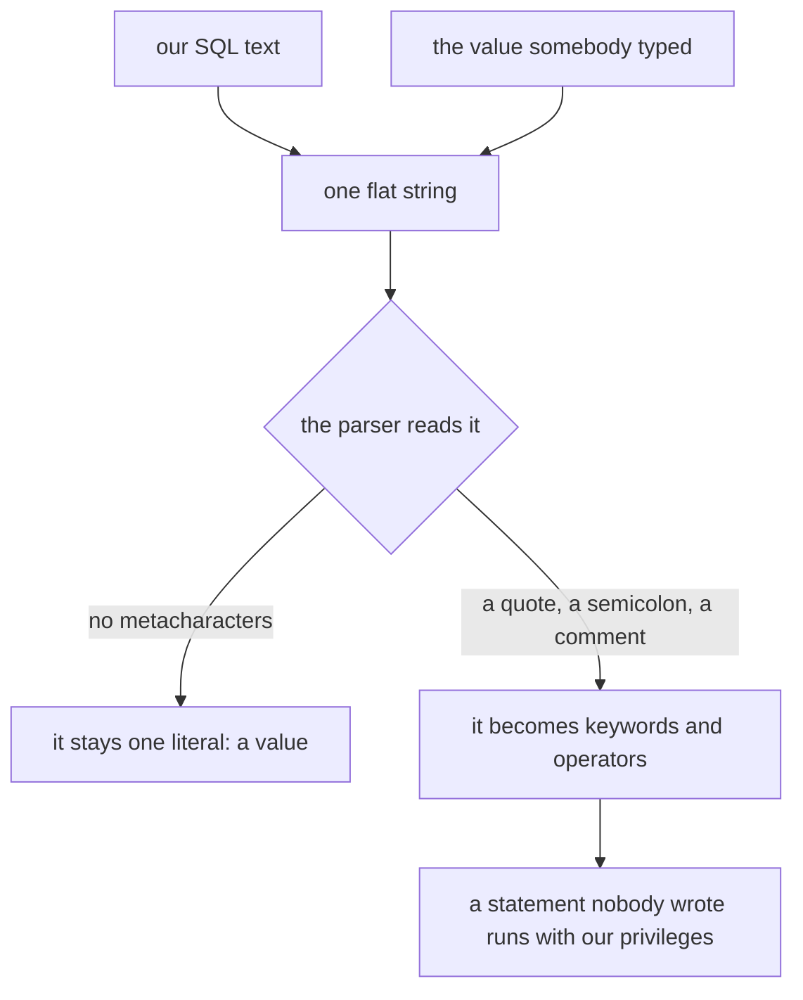
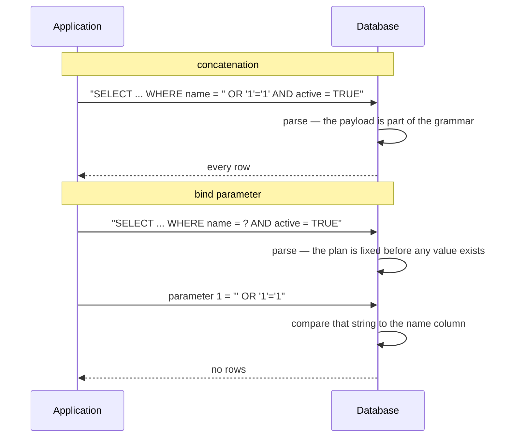
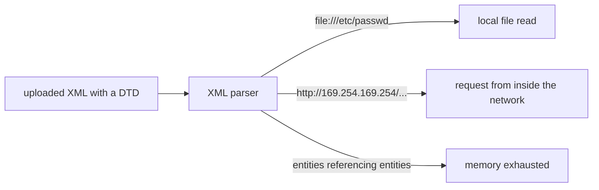

# Injection attacks: SQL injection and XXE

**An injection is what happens when a string somebody else typed is pasted into
a language that an interpreter is about to parse.** Your application builds one
flat string out of two things it knows to be different — its own instructions
and someone else's data — and hands it to a parser that has no way to tell the
halves apart. If the untrusted half contains characters that mean something to
*that* grammar, they are obeyed. Data has become code.

Every injection is that one sentence with a different parser plugged in: SQL
injection (the database's parser), XXE (an XML parser), command injection (a
shell), LDAP, XPath, template and expression-language injection. It has been in
the [OWASP Top Ten](topic:owasp-top-ten) for its entire existence, and it is the
same shape of bug as [XSS](topic:xss), where the parser happens to be a browser.



Notice where the information is lost. In the Java code, `sql` and `name` are two
different variables; after the `+`, that distinction exists nowhere. The parser
is not being careless — it is doing its job, which is to obey valid syntax, not
to guess who typed it.

## SQL injection, concretely

Take the query almost every first version looks like:

```java
String sql = "SELECT id, name, role FROM users WHERE name = '" + name + "' AND active = TRUE";
```

The value sits inside a quoted string literal, so the attacker's whole task is
to get out of that literal — one apostrophe does it. What they do next depends
on what they want:

| Input | What the database sees | What it achieves |
|---|---|---|
| `alice` | one literal | the intended query |
| `' OR '1'='1` | `OR` becomes a keyword | the `WHERE` stops filtering: every row |
| `admin'--` | `--` comments out the rest | the `AND active = TRUE` guard disappears — a locked account logs in |
| `' UNION SELECT id, number, holder FROM cards --` | a second `SELECT` | rows from a table this endpoint never mentions |
| `'; DROP TABLE users; --` | a second statement | a command of the attacker's choosing |

Three things are worth pulling out of that table:

- **it is an authentication bug as often as a data bug.** The `AND active =
  TRUE` check is still in the source code; it is simply no longer in the
  statement that runs;
- **no privilege was escalated.** The `UNION` works because the database account
  your application connects with can read that table. Injection gives an
  outsider exactly the rights your service already has, which is the argument
  for a least-privilege database user;
- **you do not need to see the output.** *Blind* injection extracts data one bit
  at a time from whether the page errors, or from how long it takes
  (`AND SLEEP(5)`). An endpoint that returns nothing but `200 OK` still leaks.

And note what does **not** help: [HTTPS](topic:http-vs-https) delivers the
payload perfectly encrypted, and every check in your
[endpoint security scheme](topic:endpoint-security-design) passes, because the
request really is from a legitimate, authenticated user.

## Why a prepared statement fixes it

The reason is structural, and it is worth saying precisely, because "it escapes
the input for you" is the wrong answer.

With a [prepared statement](topic:prepared-statements), the SQL text is a
constant containing a `?`. That text goes to the database **first** and is
parsed into a plan — a plan with a hole where the value goes. The value is sent
**afterwards**, through a different part of the protocol, tagged as a parameter
of an already-parsed statement.



So the guarantee is about **time and channel**, not about characters:

- **time** — the grammar is decided *before* the value exists, so no value can
  change it. (This is also why the [query plan](topic:query-plan) can be reused
  across calls: same text, same plan, different parameters.)
- **channel** — the value never enters the statement text, so there is no
  grammar for it to join. Nothing was escaped, nothing was filtered, nothing was
  rejected. A quote in the value is just a quote, stored and compared as a quote.

That is why binding is strictly better than escaping. Escaping is a rule about
one context (`'` inside a quoted literal), applied by code that has to remember
to apply it, correctly, every single time. Binding removes the context.

## When prepared statements do NOT prevent SQL injection

This is the half of the question interviewers actually care about. Placeholders
protect exactly one thing — *values inside an already-fixed statement* — so
every gap is somewhere that description does not hold.

**1. Anything that is not a value.** A `?` stands for a value, and the database
needs the *structure* to parse the statement at all. So you cannot bind a table
name, a column name, `ASC`/`DESC`, a whole `WHERE` fragment, or (in most
drivers) an `ORDER BY` clause. `ORDER BY ?` does not exist. When the sort column
comes from the request, that string really is concatenated, and the fix is an
**allowlist**: map the input to a constant you wrote yourself.

```java
// the input chooses a value; it never becomes one
private static final Map<String, String> SORTABLE =
        Map.of("id", "id", "name", "name", "role", "role");
String column = SORTABLE.getOrDefault(requested, "id");
String sql = "SELECT id, name, role FROM users ORDER BY " + column;
```

Note what the allowlist does *not* do: it does not escape, sanitise or repair
the input. An unknown value simply never reaches the statement.

**2. A "prepared" statement that was concatenated first.** This one survives
code review, because `prepareStatement` really is being called:

```java
// PreparedStatement, and completely vulnerable
conn.prepareStatement("SELECT ... WHERE name = '" + name + "' AND active = TRUE");
```

Order of operations decides everything. The `+` ran first, so the value is
already SQL text when the driver receives it, and a statement with no `?` in it
has no parameters to keep out. The protection is the placeholder, not the class
name — and the same trap exists one level up in JPA/Hibernate, where a
concatenated JPQL or native query is exactly as injectable as concatenated SQL.
See [Hibernate under the hood](topic:hibernate-under-the-hood): the ORM ends up
issuing SQL like anything else, and `setParameter` is what binds.

**3. Second-order injection.** The value is bound correctly on the way in and
lands in a column verbatim. A later query — a report, a batch job, an admin
screen — reads that row back and concatenates it. There is no user input
anywhere on that code path, and it is still an injection. "It came from our own
database" is not a security property; taint does not wear off in storage.

**4. Dynamic SQL built inside the database.** You bind the parameter perfectly,
and the stored procedure you hand it to does this:

```sql
EXECUTE IMMEDIATE 'SELECT * FROM users WHERE role = ''' || p_role || '''';
```

The binding did its job and then handed the value to code that undoes it. The
concatenation simply moved somewhere the driver cannot see. The same applies to
any server-side `EXEC`/`sp_executesql` on an assembled string.

**5. It is the wrong tool for a different parser.** A bind parameter is a
database protocol feature. It does nothing about XXE, command injection, LDAP
filters, NoSQL query documents or template expressions — each of those needs its
own parser configured or its own structured API.

Two smaller ones worth knowing: a bound value used in a `LIKE` pattern is still
a value, but `%` and `_` will act as wildcards (escape them for the `LIKE`
grammar if that matters); and some drivers *emulate* prepared statements
client-side, escaping the value instead of sending it separately — safe in
normal use, but it means the guarantee comes from the driver's escaping rules
rather than from the protocol.

## XXE: the same bug, in an XML parser

XXE — XML External Entity — is what happens when the untrusted *document* is
allowed to tell the parser what to do. XML lets a document declare its own DTD,
and a DTD can declare an entity that points at a resource:

```xml
<?xml version="1.0"?>
<!DOCTYPE invoice [
  <!ENTITY secret SYSTEM "file:///etc/passwd">
]>
<invoice>
  <total>&secret;</total>
</invoice>
```

A parser with DTD support switched on — historically the JAXP default — resolves
`&secret;` by *opening that resource*, as the application's OS user, from inside
the application's network, and substitutes the contents into the document. If
any of that document comes back in the response, so does the file.



Three outcomes from one feature:

- **file disclosure** — point the entity at a config file and it returns your
  database password. It is a read primitive over everything the process can see;
- **SSRF** — point it at a URL and the parser makes the request for you. Your
  firewall sees a call from a trusted host, because it is one — cloud metadata
  endpoints are the classic target;
- **denial of service** — the "billion laughs" attack, where entities only
  reference each other and each level multiplies the one below. A few hundred
  bytes expand to gigabytes.

The fix is not escaping and not binding. It is turning off a capability the
application never used:

```java
DocumentBuilderFactory f = DocumentBuilderFactory.newInstance();
f.setFeature("http://apache.org/xml/features/disallow-doctype-decl", true);
f.setXIncludeAware(false);
f.setExpandEntityReferences(false);
```

The same setting exists for `SAXParserFactory`, `XMLInputFactory`
(`SUPPORT_DTD`), `TransformerFactory` and `SchemaFactory` — and the hard part in
practice is not the setting, it is *finding every parser*. XML hides in SOAP
bodies, SAML assertions, SVG uploads, `.docx`/`.xlsx` files, RSS feeds, XML
sitemaps and configuration imports, and each library brings its own defaults.

## The 60-second interview answer

> An injection is untrusted data ending up in a string that some interpreter
> then parses, so the data becomes part of the grammar instead of staying a
> value. In SQL injection a quote closes the literal and the rest of the input
> is read as SQL — a tautology returns every row, a comment marker deletes the
> `AND active = TRUE` check so a locked account gets in, a `UNION` reads another
> table, and it runs with whatever rights the application's database user has.
> XXE is the same bug in an XML parser: the document declares an external
> entity, and the parser reads a local file or calls an internal URL on the
> attacker's behalf. Prepared statements fix SQL injection because the statement
> text is a constant that is parsed *before* the value exists, and the value
> travels beside the statement rather than inside it — it can never become
> grammar. They stop helping wherever that is not true: identifiers like
> `ORDER BY` or a table name, which have no placeholder and need an allowlist; a
> `prepareStatement` call on a string that was concatenated first; a value bound
> on write and concatenated by a later query; and dynamic SQL assembled inside a
> stored procedure. And they do nothing for XXE or command injection, which need
> their own parser locked down.

## Why it matters in production

- **default to parameters everywhere, so the exception is visible.** The value
  of "we always bind" is that the three places you cannot are easy to find and
  review. A codebase that binds sometimes has no such property.
- **run as a least-privileged database user.** Separate accounts per service, no
  DDL rights, no access to tables the service does not own. It does not prevent
  injection; it decides how bad one is.
- **turn off DTDs in every XML parser you own, centrally.** A shared, hardened
  factory beats a rule that every developer must remember.
- **do not return raw database errors.** A stack trace with the failing SQL in
  it is a map for the attacker; see
  [managing errors and error codes](topic:api-error-handling).
- **a WAF is a speed bump, not a fix.** It matches patterns; injection is
  produced by grammar, and grammar has infinitely many spellings.

## Common misconceptions

- **"We use PreparedStatement, so we are safe."** Only for the values it binds.
  Ask about `ORDER BY`, about the string handed to `prepareStatement`, and about
  what the stored procedures do with what you bound.
- **"Binding escapes the input."** It does not touch the input. It keeps the
  input out of the statement text, which is a stronger property — nothing has to
  be escaped correctly, because nothing is being escaped.
- **"An integer parameter is safe because there are no quotes."** There is no
  quote to *close* either. `1 OR 1=1` lands directly next to the operators.
- **"We use an ORM, so injection is impossible."** Only for generated queries.
  Concatenated JPQL, HQL and native queries are exactly as injectable.
- **"It came from our own database, so it is trusted."** That is second-order
  injection in one sentence.
- **"Input validation solves it."** Validation is worth doing and cannot be the
  main defence: whether a string is dangerous depends on which parser will read
  it, and the input layer does not know. `O'Brien` is a legal surname.
- **"XXE needs the response to echo the document."** Out-of-band variants send
  the data to the attacker's server from inside your network; blind XXE is still
  XXE.
- **"We only accept JSON, so XML parsing is not our problem."** Check the SOAP
  clients, the SAML integration, the SVG upload and the office-document import.
