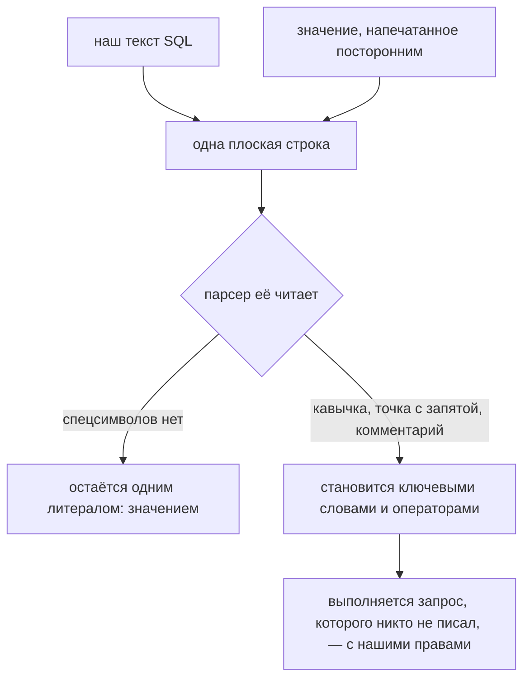
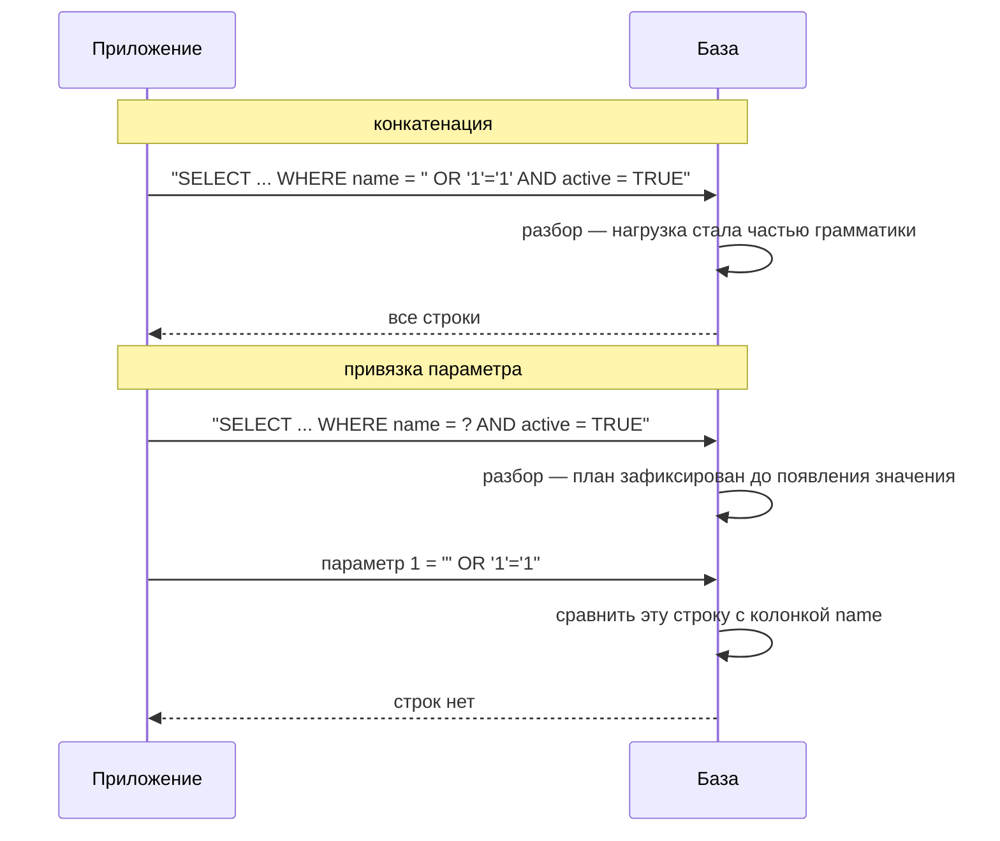
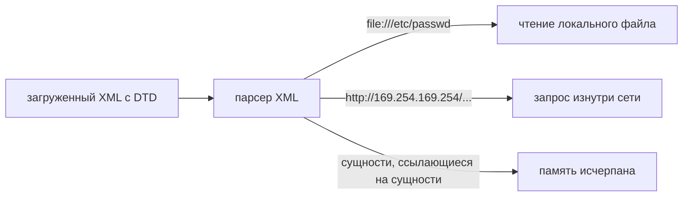

# Инъекции: SQL injection и XXE

**Инъекция — это то, что происходит, когда строку, напечатанную посторонним,
подставляют в язык, который вот-вот разберёт интерпретатор.** Приложение
собирает одну плоскую строку из двух вещей, о различии которых оно прекрасно
знает, — собственных инструкций и чужих данных — и отдаёт её парсеру, у которого
нет способа отличить одну половину от другой. Если в недоверенной половине есть
символы, что-то значащие для *этой* грамматики, им подчинятся. Данные стали
кодом.

Любая инъекция — это та же фраза, в которую подставили другой парсер: SQL
injection (парсер базы), XXE (парсер XML), командная инъекция (оболочка), LDAP,
XPath, инъекция в шаблоны и в языки выражений. Она входит в
[OWASP Top Ten](topic:owasp-top-ten) всё время существования этого списка и по
форме совпадает с [XSS](topic:xss), где парсером оказывается браузер.



Обратите внимание, где теряется информация. В Java-коде `sql` и `name` — две
разные переменные; после `+` этого различия нет уже нигде. Парсер не проявляет
небрежность — он делает свою работу, а она состоит в том, чтобы подчиняться
корректному синтаксису, а не гадать, кто его напечатал.

## SQL injection на конкретном примере

Возьмём запрос, на который похожа почти любая первая версия:

```java
String sql = "SELECT id, name, role FROM users WHERE name = '" + name + "' AND active = TRUE";
```

Значение находится внутри строкового литерала в кавычках, поэтому вся задача
злоумышленника — выбраться из этого литерала, а для этого хватает одного
апострофа. Что он сделает дальше — зависит от того, что ему нужно:

| Ввод | Что видит база | Чего это достигает |
|---|---|---|
| `alice` | один литерал | задуманный запрос |
| `' OR '1'='1` | `OR` становится ключевым словом | `WHERE` перестаёт фильтровать: все строки |
| `admin'--` | `--` закомментировал остаток | проверка `AND active = TRUE` исчезла — заблокированный аккаунт входит |
| `' UNION SELECT id, number, holder FROM cards --` | второй `SELECT` | строки из таблицы, которую этот эндпоинт не упоминает |
| `'; DROP TABLE users; --` | второй запрос | произвольная команда злоумышленника |

Из этой таблицы стоит вытащить три вещи:

- **это ошибка аутентификации не реже, чем ошибка доступа к данным.** Проверка
  `AND active = TRUE` по-прежнему есть в исходном коде — её просто больше нет в
  том запросе, который выполняется;
- **никаких прав никто не повышал.** `UNION` работает потому, что учётная запись
  базы, под которой подключается ваше приложение, эту таблицу читать может.
  Инъекция даёт постороннему ровно те права, что уже есть у вашего сервиса, — и
  это главный аргумент за пользователя базы с минимальными привилегиями;
- **видеть вывод необязательно.** *Слепая* инъекция вытаскивает данные по биту
  за раз — по тому, падает ли страница с ошибкой, или по времени ответа
  (`AND SLEEP(5)`). Эндпоинт, который возвращает только `200 OK`, всё равно
  отдаёт данные.

И заметьте, что **не** помогает: [HTTPS](topic:http-vs-https) доставит нагрузку в
идеально зашифрованном виде, а все проверки вашей
[схемы безопасности эндпоинтов](topic:endpoint-security-design) пройдут, потому
что запрос действительно от легитимного, аутентифицированного пользователя.

## Почему prepared statement это чинит

Причина структурная, и её стоит проговорить точно, потому что «он за вас
экранирует ввод» — неправильный ответ.

В [prepared statement](topic:prepared-statements) текст SQL является константой с
`?` внутри. Этот текст уходит в базу **первым** и разбирается в план — план с
дыркой на месте значения. Значение отправляется **потом**, другой частью
протокола, помеченное как параметр уже разобранного запроса.



То есть гарантия — про **время и канал**, а не про символы:

- **время** — грамматика определена *до* того, как появилось значение, поэтому
  никакое значение её уже не изменит. (По той же причине
  [план запроса](topic:query-plan) можно переиспользовать между вызовами: тот же
  текст, тот же план, другие параметры.)
- **канал** — значение вообще не попадает в текст запроса, и присоединяться к
  грамматике ему негде. Ничего не экранировали, ничего не фильтровали, ничего не
  отвергли. Кавычка в значении — просто кавычка, её так и сохранят и так и
  сравнят.

Поэтому привязка строго лучше экранирования. Экранирование — правило про один
контекст (`'` внутри литерала в кавычках), которое код обязан не забыть
применить, правильно, каждый раз. Привязка убирает сам контекст.

## Когда prepared statements НЕ предотвращают SQL injection

Именно эта половина вопроса и интересует интервьюера. Плейсхолдеры защищают
ровно одно — *значения внутри уже зафиксированного запроса*, — поэтому каждая
дыра находится там, где это описание не выполняется.

**1. Всё, что не является значением.** `?` обозначает значение, а *структуру*
базе нужно знать, чтобы вообще разобрать запрос. Поэтому нельзя привязать имя
таблицы, имя колонки, `ASC`/`DESC`, целый кусок `WHERE` или (в большинстве
драйверов) выражение `ORDER BY`. `ORDER BY ?` не бывает. Когда колонка сортировки
приходит из запроса, там действительно конкатенация, и чинится это **белым
списком**: отобразить ввод в константу, которую написали вы сами.

```java
// ввод выбирает значение, но значением не становится
private static final Map<String, String> SORTABLE =
        Map.of("id", "id", "name", "name", "role", "role");
String column = SORTABLE.getOrDefault(requested, "id");
String sql = "SELECT id, name, role FROM users ORDER BY " + column;
```

Заметьте, чего белый список *не* делает: он не экранирует, не очищает и не
исправляет ввод. Неизвестное значение просто не доходит до запроса.

**2. «Подготовленный» запрос, который сначала сконкатенировали.** Эта ловушка
переживает ревью, потому что `prepareStatement` действительно вызывается:

```java
// PreparedStatement — и полностью уязвимо
conn.prepareStatement("SELECT ... WHERE name = '" + name + "' AND active = TRUE");
```

Всё решает порядок операций. Сначала отработал `+`, поэтому к моменту, когда
драйвер получает запрос, значение уже является текстом SQL, а у запроса без `?`
нет параметров, которые можно было бы держать снаружи. Защиту даёт плейсхолдер,
а не имя класса — и та же ловушка есть слоем выше, в JPA/Hibernate, где
сконкатенированный JPQL или нативный запрос уязвим ровно так же, как
сконкатенированный SQL. См. [Hibernate под капотом](topic:hibernate-under-the-hood):
ORM в итоге отправляет SQL, как и всё остальное, а привязывает значения
`setParameter`.

**3. Инъекция второго порядка.** Значение корректно привязано на входе и
дословно попало в колонку. Более поздний запрос — отчёт, фоновая задача,
админский экран — читает эту строку обратно и склеивает её в SQL.
Пользовательского ввода на этом пути нет нигде, а инъекция есть. «Пришло из нашей
же базы» — не свойство безопасности; в хранилище пометка «недоверенное» не
выветривается.

**4. Динамический SQL, собранный внутри базы.** Вы идеально привязали параметр, а
хранимая процедура, которой вы его отдали, делает вот что:

```sql
EXECUTE IMMEDIATE 'SELECT * FROM users WHERE role = ''' || p_role || '''';
```

Привязка отработала и передала значение коду, который её отменяет. Конкатенация
просто переехала туда, где драйвер её не видит. То же относится к любому
серверному `EXEC`/`sp_executesql` над собранной строкой.

**5. Это инструмент не для того парсера.** Привязка параметра — возможность
протокола базы. Против XXE, командной инъекции, фильтров LDAP, документов
NoSQL-запросов и выражений шаблонизатора она не делает ничего: каждому из них
нужен свой настроенный парсер или свой структурный API.

Ещё два случая помельче, о которых полезно знать: привязанное значение внутри
шаблона `LIKE` остаётся значением, но `%` и `_` сработают как подстановочные
символы (если это важно — экранируйте их для грамматики `LIKE`); а некоторые
драйверы *эмулируют* prepared statements на стороне клиента, экранируя значение
вместо отдельной отправки — при обычной работе это безопасно, но гарантия тогда
опирается на правила экранирования драйвера, а не на протокол.

## XXE: та же ошибка, но в XML-парсере

XXE — XML External Entity — это то, что происходит, когда недоверенному
*документу* разрешают указывать парсеру, что делать. XML позволяет документу
объявить собственный DTD, а DTD может объявить сущность, указывающую на ресурс:

```xml
<?xml version="1.0"?>
<!DOCTYPE invoice [
  <!ENTITY secret SYSTEM "file:///etc/passwd">
]>
<invoice>
  <total>&secret;</total>
</invoice>
```

Парсер с включённой поддержкой DTD — исторически так было по умолчанию в JAXP —
раскрывает `&secret;`, то есть *открывает этот ресурс* под системным
пользователем приложения и изнутри его сети, и подставляет содержимое в документ.
Если хоть часть этого документа возвращается в ответе, вместе с ним возвращается
и файл.



Три исхода одной возможности:

- **раскрытие файлов** — направьте сущность на файл конфигурации, и вернётся
  пароль от базы. Это примитив чтения по всему, что видит процесс;
- **SSRF** — направьте её на URL, и парсер сделает запрос за вас. Ваш файрвол
  видит обращение с доверенного узла, потому что так и есть; классическая цель —
  метаданные облачной платформы;
- **отказ в обслуживании** — атака «миллиард смешков», где сущности ссылаются
  только друг на друга и каждый уровень умножает предыдущий. Несколько сотен байт
  разворачиваются в гигабайты.

Чинится это не экранированием и не привязкой, а отключением возможности, которой
приложение никогда не пользовалось:

```java
DocumentBuilderFactory f = DocumentBuilderFactory.newInstance();
f.setFeature("http://apache.org/xml/features/disallow-doctype-decl", true);
f.setXIncludeAware(false);
f.setExpandEntityReferences(false);
```

Та же настройка есть у `SAXParserFactory`, `XMLInputFactory` (`SUPPORT_DTD`),
`TransformerFactory` и `SchemaFactory` — и сложность на практике не в настройке, а
в том, чтобы *найти все парсеры*. XML прячется в телах SOAP, в утверждениях SAML,
в загруженных SVG, в файлах `.docx`/`.xlsx`, в RSS-лентах, в XML-картах сайта и в
импорте конфигураций, и у каждой библиотеки свои умолчания.

## Ответ на собеседовании за 60 секунд

> Инъекция — это когда недоверенные данные оказываются в строке, которую потом
> разбирает какой-то интерпретатор, и данные становятся частью грамматики вместо
> того, чтобы остаться значением. При SQL injection кавычка закрывает литерал, и
> остаток ввода читается как SQL: тавтология возвращает все строки, маркер
> комментария удаляет проверку `AND active = TRUE`, и заблокированный аккаунт
> входит, `UNION` читает другую таблицу, — и всё это с теми правами, что есть у
> пользователя базы, под которым работает приложение. XXE — та же ошибка в
> XML-парсере: документ объявляет внешнюю сущность, а парсер по поручению
> злоумышленника читает локальный файл или обращается на внутренний URL. Prepared
> statements чинят SQL injection потому, что текст запроса — константа, которая
> разбирается *до* появления значения, а значение едет рядом с запросом, а не
> внутри него, и стать грамматикой не может никогда. Помогать они перестают там,
> где это не так: идентификаторы вроде `ORDER BY` или имени таблицы, у которых нет
> плейсхолдера и нужен белый список; вызов `prepareStatement` над строкой, которую
> сначала склеили; значение, привязанное при записи и сконкатенированное более
> поздним запросом; и динамический SQL, собранный внутри хранимой процедуры. А
> против XXE и командной инъекции они не дают ничего — там нужно закрывать их
> собственный парсер.

## Почему это важно в продакшене

- **по умолчанию параметры везде, чтобы исключение бросалось в глаза.** Ценность
  правила «мы всегда привязываем» в том, что три места, где это невозможно, легко
  найти и отревьюить. У кодовой базы, которая привязывает иногда, такого свойства
  нет.
- **работайте под пользователем базы с минимальными правами.** Отдельные учётные
  записи на сервис, без прав DDL, без доступа к таблицам, которыми сервис не
  владеет. Инъекцию это не предотвращает — это определяет, насколько она страшна.
- **выключите DTD во всех своих XML-парсерах централизованно.** Общая
  преднастроенная фабрика надёжнее правила, которое должен помнить каждый
  разработчик.
- **не возвращайте сырые ошибки базы.** Стектрейс с упавшим SQL внутри — это
  карта для злоумышленника; см.
  [управление ошибками и кодами ошибок](topic:api-error-handling).
- **WAF — это лежачий полицейский, а не починка.** Он сопоставляет шаблоны, а
  инъекция порождается грамматикой, и у грамматики бесконечно много написаний.

## Частые заблуждения

- **«Мы используем PreparedStatement, значит, мы в безопасности».** Только для тех
  значений, которые он привязывает. Спросите про `ORDER BY`, про строку, которую
  передали в `prepareStatement`, и про то, что хранимые процедуры делают с тем,
  что вы привязали.
- **«Привязка экранирует ввод».** Она вообще не трогает ввод. Она держит ввод вне
  текста запроса, а это свойство сильнее: ничего не нужно экранировать правильно,
  потому что ничего не экранируется.
- **«Числовой параметр безопасен, там нет кавычек».** Там и *закрывать* нечего.
  `1 OR 1=1` попадает прямо к операторам.
- **«У нас ORM, инъекция невозможна».** Только для сгенерированных запросов.
  Сконкатенированные JPQL, HQL и нативные запросы уязвимы ровно так же.
- **«Это пришло из нашей же базы, значит, доверенное».** Это инъекция второго
  порядка, сформулированная одной фразой.
- **«Валидация ввода решает проблему».** Валидацию делать стоит, но основной
  защитой она быть не может: опасна строка или нет — зависит от того, какой парсер
  её прочитает, а слой ввода этого не знает. `O'Brien` — законная фамилия.
- **«Для XXE нужно, чтобы ответ возвращал документ».** Внеполосные варианты
  отправляют данные на сервер злоумышленника изнутри вашей сети; слепой XXE — тоже
  XXE.
- **«Мы принимаем только JSON, разбор XML не наша проблема».** Проверьте
  SOAP-клиентов, интеграцию с SAML, загрузку SVG и импорт офисных документов.
