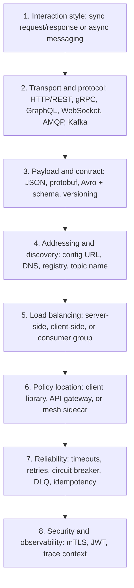
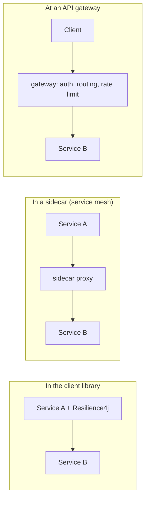
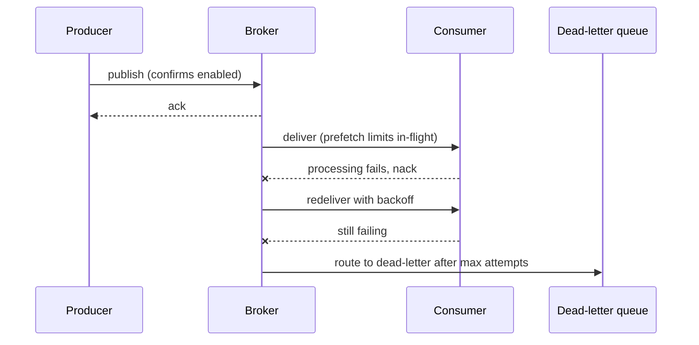

# Options for Configuring Inter-Service Communication

"What are the options?" is a question about the **menu**, not about one right answer. A weak answer is a flat list of buzzwords — "REST, gRPC, Kafka, done". A strong answer says that a single service-to-service call is configured on several **independent layers**, names the layer, gives the two or three real options on it, and says what decides between them.

The layers, from the business decision down to the wire:

Each layer is chosen separately. That independence is the point: you can run gRPC through a mesh with client-side discovery, or REST through a gateway with DNS, without the choices interfering.

## 1. Interaction style — the decision everything else inherits

Before any technology, decide whether the caller waits: synchronous request/response, an asynchronous one-way command, publish/subscribe of events, or a stream. This is covered in depth in [Types of Interaction Between Microservices](topic:microservice-interaction-types), and the criteria for choosing in [Choosing Sync or Async Service Communication](topic:service-communication-choice) and [Synchronous vs Asynchronous Communication](topic:sync-vs-async-communication).

It comes first because it prunes the rest of the menu: a broker has no "read timeout", and an HTTP client has no "consumer group".

## 2. Transport and protocol

For synchronous calls:

- **REST over HTTP/JSON** — the default. Universally supported, debuggable with `curl`, cache-friendly, works through every proxy. Costs: text parsing, no schema enforced by the wire format, no built-in streaming.
- **gRPC over HTTP/2 with protobuf** — a binary, schema-first RPC with generated clients, multiplexed connections and real streaming. Best for chatty internal service-to-service traffic and polyglot teams. Costs: not browser-native without a proxy, harder to inspect, tooling investment.
- **GraphQL** — one endpoint, the *caller* declares the shape it needs. Its real home is the edge (a BFF for varied clients), not service-to-service plumbing.
- **WebSocket / Server-Sent Events** — long-lived push channels for progress, tickers and notifications.

For asynchronous calls:

- **A queue/broker protocol such as AMQP (RabbitMQ)** — routing, per-message acknowledgement, dead-letter queues; the message disappears once handled.
- **A log such as Kafka** — a partitioned, replayable, ordered-per-partition log with consumer offsets. The difference matters a lot and is worth knowing cold: [Kafka vs RabbitMQ](topic:kafka-vs-rabbitmq).

And the unglamorous ones that still exist in real systems: JMS, SOAP over HTTP, and scheduled file/batch transfer for external integrations.

## 3. Payload format and contract

The wire format — JSON, protobuf, Avro, MessagePack, XML — is only half of it. The other half is the **contract artefact** and how it evolves:

- **OpenAPI/Swagger** for HTTP, **`.proto` files** for gRPC, **Avro/JSON Schema in a schema registry** for events.
- **Versioning strategy**: URL version (`/v2/orders`), media-type version, or additive-only evolution where you never remove or repurpose a field.
- **Verification**: consumer-driven contract tests, or a registry that rejects an incompatible schema at publish time.

Generated clients from a shared schema remove a whole class of bugs; a hand-written client against undocumented JSON creates them. The API-design side of this is in [Employee API: Design](topic:employee-api-design) and [REST and Separation of Concerns](topic:employee-api-rest-cqrs).

## 4. Addressing and discovery

How does the caller know *where* the callee is?

- **Static configuration** — a URL in `application.yml` or an environment variable. Fine for a handful of stable services, brittle at scale.
- **DNS / platform service** — in Kubernetes, `http://orders` resolves through a `Service`; the platform is the registry. Zero library code.
- **A service registry** — Eureka, Consul, Nacos: instances register themselves and the client resolves a logical name to a live instance list, with health checks removing dead ones.
- **Broker addressing** — for messaging there is no host at all: you configure an exchange/routing key or a topic name plus a consumer group. The broker is the only address either side needs.

## 5. Load balancing

- **Server-side** — a load balancer, ingress or Kubernetes `Service` sits in front; the client sends to one virtual address. Simple, language-agnostic, one extra hop.
- **Client-side** — the caller holds the instance list and picks one itself (Spring Cloud LoadBalancer). One fewer hop and locality-aware routing, but every client language needs the logic.
- **Broker-side** — with a work queue, competing consumers *are* the load balancing; with Kafka, partitions are assigned across a consumer group. You scale by adding consumers, bounded by partition count.

## 6. Where the policy lives — the architectural fork

Timeouts, retries, circuit breaking, mTLS and tracing have to be enforced somewhere. There are three homes, and picking one is the answer that separates a middle from a junior:

- **Client library** (Spring Cloud + Resilience4j, gRPC interceptors): full control, per-call granularity, no infrastructure to run — but the policy is duplicated in every service and every language, and changing a timeout means a redeploy.
- **Service mesh sidecar** (Istio/Linkerd/Envoy): policy is configuration outside the code, uniform across languages, mTLS and telemetry for free — but a real operational component to run and debug, and it cannot know business-level semantics.
- **API gateway / BFF**: the right place for *edge* concerns — authentication, rate limiting, routing, response aggregation. It is not a substitute for service-to-service policy, because internal calls never pass through it.

They are complements, not rivals: gateway at the edge, mesh or library between services.

## 7. Reliability settings

This is where "configuring communication" becomes literal — the values you actually put in a config file.

Synchronous:

- **Connect timeout and read/response timeout** — always set both. An unset read timeout is the classic way to hang every thread in a pool.
- **Retries**: how many, with exponential backoff and jitter, and only for idempotent operations or with an idempotency key. Naive retries turn a slow dependency into an outage.
- **Circuit breaker, bulkhead, rate limiter, fallback** — the failure-isolation layer, covered in [Service Timeouts, Fallbacks, and Circuit Breakers](topic:service-timeouts-fallbacks).
- **Connection pool size and keep-alive** — how much concurrency you are willing to aim at one dependency.

Asynchronous:

- **Acknowledgement mode** (auto vs manual), **prefetch/`max.poll.records`** — how much a consumer takes on at once.
- **Retry/backoff topic or queue, and a dead-letter destination** — where a poisoned message goes instead of blocking the partition.
- **Publisher confirms / `acks=all`**, plus the [Outbox pattern](topic:outbox-pattern) so a publish cannot be lost when the local commit succeeds.
- **Idempotent consumption** and deduplication — the [Inbox pattern](topic:inbox-pattern), because delivery is at-least-once.

## 8. Security and observability

- **Transport security**: TLS everywhere, **mTLS** between services when identity matters (a mesh gives it for free).
- **Authorization**: propagate the user's token, or use OAuth2 client credentials for a service identity; decide at the gateway whether the internal network is trusted or zero-trust.
- **Trace context**: propagate `traceparent`/correlation headers on every hop — including through the broker, in message headers — or distributed debugging becomes guesswork.
- **What you monitor differs by style**: latency and error rate for synchronous, queue depth and consumer lag for asynchronous.

## 9. What this looks like in Java and Spring

- **Synchronous clients**: `RestClient` (the modern synchronous client), `WebClient` (reactive/non-blocking), `RestTemplate` (legacy but everywhere), declarative HTTP interfaces (`@HttpExchange`), or OpenFeign. See [Spring Boot Starter Web and Custom Starters](topic:spring-boot-starter-web) for how these arrive on the classpath.
- **Messaging**: Spring AMQP (`RabbitTemplate` / `@RabbitListener`), Spring for Apache Kafka (`KafkaTemplate` / `@KafkaListener`), or Spring Cloud Stream to keep the code broker-agnostic.
- **Resilience**: Resilience4j annotations or a configured `ClientHttpRequestFactory` for timeouts.
- **Where the values live**: `application.yml` per profile, environment variables, a Kubernetes ConfigMap/Secret, or Spring Cloud Config for centrally managed, refreshable settings.

## 60-second interview answer

> I treat it as a stack of independent choices rather than one decision. First the **interaction style** — synchronous request/response or asynchronous messaging — because it prunes everything below. Then the **transport**: REST over HTTP/JSON as the default, gRPC with protobuf for high-volume internal calls, GraphQL at the edge, WebSocket or SSE for push, and AMQP or Kafka for messaging. Then the **contract**: OpenAPI, `.proto` or a schema registry, plus a versioning and compatibility strategy. Then **addressing** — a config URL, platform DNS, or a registry like Eureka or Consul — and where **load balancing** happens: server-side, client-side, or via competing consumers. Then the architectural fork: whether the reliability policy lives in a **client library**, in a **service mesh sidecar**, or at an **API gateway**. On top of that come the concrete settings I would actually configure — connect and read timeouts, retries with backoff and jitter for idempotent calls only, circuit breakers, connection pools; ack mode, prefetch, retry topic and dead-letter queue on the async side — plus mTLS, token propagation and trace context. In a Spring stack that is `RestClient`, `WebClient` or Feign for calls, Spring for Apache Kafka or Spring AMQP for messages, Resilience4j for the policy, and the values in `application.yml` or a config server.

## Production relevance

**Defaults are the actual configuration until someone changes them.** Most incidents traced back to "communication configuration" are an unset read timeout, an infinite retry, or a connection pool of 200 aimed at a service that can serve 20. Write the numbers down deliberately; do not inherit the library's defaults by accident.

**Consistency beats cleverness.** Three services using three HTTP clients with three retry philosophies is far more expensive to operate than one mediocre standard applied everywhere. This is the strongest practical argument for a mesh or a shared internal starter.

**Every option has an operational cost, and it is paid forever.** gRPC needs codegen in the build and a proxy for browsers. A registry is another thing to keep highly available. A mesh is another set of dashboards, upgrades and mysterious 503s. "Which option is best" is really "which cost is my team able to carry".

**Configuration is a deployment artefact.** Timeouts and retry counts should be per-environment and changeable without a code change — a config server, ConfigMap or environment variable — because you will need to tune them during an incident, not during a sprint.

## Common misconceptions

- **"Choosing a protocol is choosing an interaction style."** They are separate layers. You can do asynchronous request/reply over HTTP with a callback URL, and you can build a blocking pseudo-RPC over a broker. The protocol does not decide whether the caller waits.
- **"gRPC is simply faster, so it is the better option."** It is faster on the wire and stricter in its contract, but it costs codegen, proxies for browser clients, and worse ad-hoc debuggability. For a low-volume call between two teams, JSON over HTTP usually wins on total cost.
- **"A service mesh removes the need to think about timeouts and retries."** It moves *where* they are configured, not whether they are correct. A mesh happily retries a non-idempotent POST if you tell it to.
- **"An API gateway handles inter-service communication."** A gateway handles north-south (edge) traffic. Internal east-west calls do not go through it, so gateway timeouts and rate limits do not protect service-to-service calls.
- **"Retries make a call more reliable."** Only for idempotent operations, and only with backoff and a retry budget. Without those, retries amplify load exactly when the dependency is already struggling and turn a partial failure into a cascading one.
- **"Service discovery is only needed with microservices frameworks."** Kubernetes DNS is service discovery; you are already using it. The choice is which mechanism, not whether you need one.
- **"Async is configured once and then it just works."** Ack mode, prefetch, retry topics, dead-letter queues, consumer group ids and offset-reset policy are all configuration decisions with sharp edges — a wrong `auto.offset.reset` can silently skip or reprocess a day of data.
- **"Shared libraries are the safest way to standardise communication."** A shared client library couples every service to one language and one release cycle; upgrading it becomes an org-wide migration. That coupling risk is the same one discussed in [Why Microservices Are Used](topic:why-microservices).
