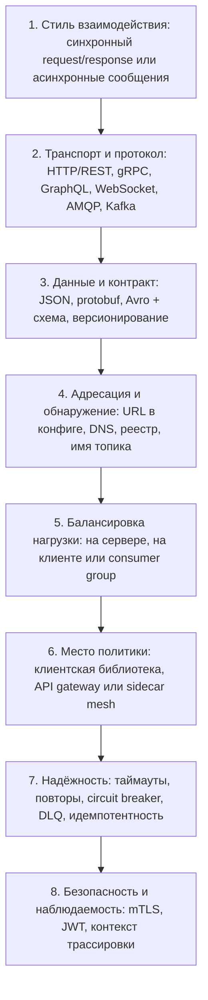
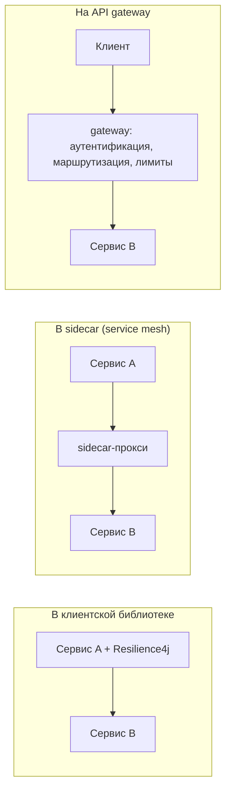
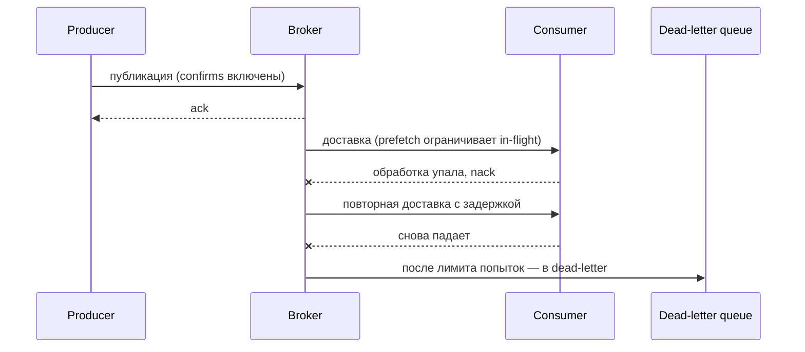

# Варианты настройки взаимодействия между сервисами

«Какие есть варианты?» — вопрос про **меню**, а не про один правильный ответ. Слабый ответ — плоский список модных слов: «REST, gRPC, Kafka, всё». Сильный ответ говорит, что один вызов между сервисами настраивается на нескольких **независимых уровнях**, называет уровень, даёт два-три реальных варианта на нём и объясняет, что решает выбор.

Уровни — от бизнес-решения вниз до провода:

Каждый уровень выбирается отдельно. В этой независимости и суть: можно гонять gRPC через mesh с клиентским обнаружением, а можно REST через gateway с DNS — выборы не мешают друг другу.

## 1. Стиль взаимодействия — решение, которое наследует всё остальное

До любой технологии надо решить, ждёт ли вызывающая сторона ответ: синхронный request/response, асинхронная односторонняя команда, publish/subscribe событий или стрим. Подробно это разобрано в теме [Типы взаимодействия между микросервисами](topic:microservice-interaction-types), а критерии выбора — в темах [Выбор синхронного или асинхронного взаимодействия сервисов](topic:service-communication-choice) и [Синхронная и асинхронная коммуникация](topic:sync-vs-async-communication).

Стиль идёт первым, потому что он обрезает остальное меню: у брокера нет «read timeout», а у HTTP-клиента нет consumer group.

## 2. Транспорт и протокол

Для синхронных вызовов:

- **REST поверх HTTP/JSON** — вариант по умолчанию. Поддерживается везде, отлаживается через `curl`, дружелюбен к кэшированию, проходит через любой прокси. Цена: разбор текста, схема не навязывается форматом, нет встроенного стриминга.
- **gRPC поверх HTTP/2 с protobuf** — бинарный RPC «сначала схема», с генерируемыми клиентами, мультиплексированием соединений и настоящим стримингом. Лучший выбор для интенсивного внутреннего трафика между сервисами и для команд на разных языках. Цена: без прокси не работает нативно в браузере, сложнее смотреть глазами, нужны вложения в инструменты.
- **GraphQL** — одна точка входа, форму ответа задаёт *вызывающая сторона*. Его настоящее место — край системы (BFF для разнородных клиентов), а не связь сервисов между собой.
- **WebSocket / Server-Sent Events** — долгоживущие каналы push-обновлений: прогресс, котировки, уведомления.

Для асинхронных вызовов:

- **Протокол очередей, например AMQP (RabbitMQ)** — маршрутизация, подтверждение каждого сообщения, dead-letter queue; после обработки сообщение исчезает.
- **Лог, например Kafka** — партиционированный, перечитываемый, упорядоченный внутри партиции лог со смещениями потребителей. Разница принципиальна, и её стоит знать назубок: [Kafka vs RabbitMQ](topic:kafka-vs-rabbitmq).

И неромантичные варианты, которые всё ещё живут в реальных системах: JMS, SOAP поверх HTTP и пакетная передача файлов по расписанию для внешних интеграций.

## 3. Формат данных и контракт

Формат на проводе — JSON, protobuf, Avro, MessagePack, XML — это лишь половина. Вторая половина — **артефакт контракта** и то, как он развивается:

- **OpenAPI/Swagger** для HTTP, **файлы `.proto`** для gRPC, **Avro/JSON Schema в schema registry** для событий.
- **Стратегия версионирования**: версия в URL (`/v2/orders`), версия в media type или развитие только добавлением, когда поля никогда не удаляют и не переиспользуют.
- **Проверка**: consumer-driven contract tests или реестр, который отклоняет несовместимую схему в момент публикации.

Клиенты, сгенерированные из общей схемы, убирают целый класс ошибок; клиент, написанный руками по недокументированному JSON, их создаёт. Сторона проектирования API разобрана в темах [Employee API: проектирование](topic:employee-api-design) и [REST и разделение ответственности](topic:employee-api-rest-cqrs).

## 4. Адресация и обнаружение

Откуда вызывающая сторона знает, *где* находится вызываемая?

- **Статическая конфигурация** — URL в `application.yml` или переменной окружения. Нормально для нескольких стабильных сервисов, хрупко при росте.
- **DNS / средства платформы** — в Kubernetes `http://orders` разрешается через `Service`; реестром работает сама платформа. Кода в библиотеке ноль.
- **Реестр сервисов** — Eureka, Consul, Nacos: экземпляры регистрируются сами, клиент превращает логическое имя в список живых экземпляров, а health check убирает мёртвые.
- **Адресация через брокер** — для сообщений хоста нет вообще: настраиваются exchange и routing key или имя топика плюс consumer group. Брокер — единственный адрес, нужный обеим сторонам.

## 5. Балансировка нагрузки

- **На стороне сервера** — впереди стоит балансировщик, ingress или Kubernetes `Service`; клиент шлёт на один виртуальный адрес. Просто, не зависит от языка, но добавляет один переход.
- **На стороне клиента** — вызывающая сторона держит список экземпляров и сама выбирает один (Spring Cloud LoadBalancer). На один переход меньше и можно учитывать близость, но логика нужна в каждом клиентском языке.
- **На стороне брокера** — в рабочей очереди балансировкой *являются* конкурирующие потребители; в Kafka партиции распределяются по consumer group. Масштабирование — добавлением потребителей, с потолком в числе партиций.

## 6. Где живёт политика — архитектурная развилка

Таймауты, повторы, circuit breaker, mTLS и трассировку кто-то должен применять. Домов у этой политики три, и выбор между ними — тот самый ответ, который отличает мидла от джуна:

- **Клиентская библиотека** (Spring Cloud + Resilience4j, перехватчики gRPC): полный контроль, гранулярность до вызова, инфраструктуру поднимать не надо — но политика дублируется в каждом сервисе и каждом языке, а смена таймаута означает передеплой.
- **Sidecar service mesh** (Istio/Linkerd/Envoy): политика — это конфигурация вне кода, единообразная для всех языков, mTLS и телеметрия бесплатно — но это полноценный операционный компонент, который надо эксплуатировать и отлаживать, и он не знает бизнес-семантику.
- **API gateway / BFF**: правильное место для задач *края* — аутентификация, ограничение частоты, маршрутизация, агрегация ответов. Он не заменяет политику между сервисами, потому что внутренние вызовы через него не проходят.

Это дополняющие друг друга вещи, а не конкуренты: gateway на краю, mesh или библиотека между сервисами.

## 7. Настройки надёжности

Здесь «настройка взаимодействия» становится буквальной — это значения, которые вы реально пишете в конфиг.

Синхронные:

- **Connect timeout и read/response timeout** — задавать всегда оба. Незаданный read timeout — классический способ подвесить все потоки пула.
- **Повторы**: сколько, с экспоненциальной задержкой и джиттером, и только для идемпотентных операций или с ключом идемпотентности. Наивные повторы превращают медленную зависимость в аварию.
- **Circuit breaker, bulkhead, rate limiter, fallback** — слой изоляции отказов, разобранный в теме [Таймауты, fallback и circuit breaker](topic:service-timeouts-fallbacks).
- **Размер пула соединений и keep-alive** — сколько параллелизма вы готовы направить в одну зависимость.

Асинхронные:

- **Режим подтверждения** (auto или manual), **prefetch/`max.poll.records`** — сколько потребитель забирает за раз.
- **Топик или очередь повторов с задержкой и dead-letter назначение** — куда уедет «ядовитое» сообщение вместо того, чтобы блокировать партицию.
- **Publisher confirms / `acks=all`** плюс [Outbox pattern](topic:outbox-pattern), чтобы публикация не терялась, когда локальный коммит уже прошёл.
- **Идемпотентная обработка** и дедупликация — [Inbox pattern](topic:inbox-pattern), потому что доставка at-least-once.

## 8. Безопасность и наблюдаемость

- **Безопасность транспорта**: TLS везде, **mTLS** между сервисами, когда важна идентичность (mesh даёт её бесплатно).
- **Авторизация**: пробрасывать токен пользователя или использовать OAuth2 client credentials для идентичности сервиса; решить на уровне gateway, доверенная у вас внутренняя сеть или zero-trust.
- **Контекст трассировки**: пробрасывать `traceparent`/correlation-заголовки на каждом переходе — включая проход через брокер, в заголовках сообщения, — иначе распределённая отладка превращается в гадание.
- **Наблюдать нужно разное в зависимости от стиля**: задержку и долю ошибок для синхронного, глубину очереди и отставание потребителя для асинхронного.

## 9. Как это выглядит в Java и Spring

- **Синхронные клиенты**: `RestClient` (современный синхронный клиент), `WebClient` (реактивный, неблокирующий), `RestTemplate` (устаревший, но встречается везде), декларативные HTTP-интерфейсы (`@HttpExchange`) или OpenFeign. О том, как они попадают в classpath, — в теме [Spring Boot Starter Web и свои стартеры](topic:spring-boot-starter-web).
- **Сообщения**: Spring AMQP (`RabbitTemplate` / `@RabbitListener`), Spring for Apache Kafka (`KafkaTemplate` / `@KafkaListener`) или Spring Cloud Stream, чтобы код не зависел от брокера.
- **Устойчивость**: аннотации Resilience4j или настроенный `ClientHttpRequestFactory` для таймаутов.
- **Где лежат значения**: `application.yml` по профилям, переменные окружения, ConfigMap/Secret в Kubernetes или Spring Cloud Config для централизованных и обновляемых настроек.

## Ответ на собеседовании за 60 секунд

> Я рассматриваю это как стек независимых выборов, а не как одно решение. Сначала **стиль взаимодействия** — синхронный request/response или асинхронные сообщения, — потому что он обрезает всё нижележащее. Затем **транспорт**: REST поверх HTTP/JSON по умолчанию, gRPC с protobuf для интенсивных внутренних вызовов, GraphQL на краю, WebSocket или SSE для push, AMQP или Kafka для сообщений. Затем **контракт**: OpenAPI, `.proto` или schema registry плюс стратегия версионирования и совместимости. Затем **адресация** — URL в конфиге, DNS платформы или реестр вроде Eureka и Consul — и место **балансировки**: на сервере, на клиенте или через конкурирующих потребителей. Дальше архитектурная развилка: где живёт политика надёжности — в **клиентской библиотеке**, в **sidecar service mesh** или на **API gateway**. Поверх этого идут конкретные настройки, которые я реально задаю: connect и read timeout, повторы с задержкой и джиттером только для идемпотентных вызовов, circuit breaker, пулы соединений; режим подтверждения, prefetch, топик повторов и dead-letter queue на асинхронной стороне; плюс mTLS, проброс токена и контекст трассировки. В стеке Spring это `RestClient`, `WebClient` или Feign для вызовов, Spring for Apache Kafka или Spring AMQP для сообщений, Resilience4j для политики, а значения — в `application.yml` или на config server.

## Значение на продакшене

**Значения по умолчанию и есть ваша конфигурация, пока их кто-то не изменил.** Большинство инцидентов, которые сводятся к «настройке взаимодействия», — это незаданный read timeout, бесконечные повторы или пул на 200 соединений, направленный в сервис, который тянет 20. Пропишите числа осознанно, а не унаследуйте умолчания библиотеки случайно.

**Единообразие важнее изящества.** Три сервиса с тремя HTTP-клиентами и тремя философиями повторов эксплуатировать намного дороже, чем один посредственный стандарт, применённый везде. Это самый сильный практический аргумент за mesh или общий внутренний стартер.

**У каждого варианта есть операционная цена, и платится она постоянно.** gRPC требует кодогенерации в сборке и прокси для браузеров. Реестр — ещё один компонент, который надо держать высокодоступным. Mesh — ещё один набор дашбордов, обновлений и загадочных 503. Вопрос «какой вариант лучше» на самом деле означает «какую цену потянет моя команда».

**Конфигурация — это артефакт деплоя.** Таймауты и число повторов должны задаваться отдельно для каждого окружения и меняться без правки кода — config server, ConfigMap или переменная окружения, — потому что крутить их придётся во время инцидента, а не во время спринта.

## Частые заблуждения

- **«Выбрать протокол — значит выбрать стиль взаимодействия».** Это разные уровни. Асинхронный request/reply можно сделать поверх HTTP с callback-URL, а поверх брокера можно построить блокирующий псевдо-RPC. Протокол не решает, ждёт ли вызывающая сторона.
- **«gRPC просто быстрее, значит, это лучший вариант».** Он быстрее на проводе и строже в контракте, но требует кодогенерации, прокси для браузерных клиентов и хуже отлаживается вручную. Для редкого вызова между двумя командами JSON поверх HTTP обычно выигрывает по совокупной стоимости.
- **«Service mesh избавляет от необходимости думать о таймаутах и повторах».** Он меняет *место*, где они настраиваются, а не их правильность. Mesh с удовольствием повторит неидемпотентный POST, если вы ему это скажете.
- **«API gateway отвечает за взаимодействие между сервисами».** Gateway обслуживает трафик север-юг (край системы). Внутренние вызовы восток-запад через него не идут, поэтому его таймауты и лимиты не защищают связь сервисов между собой.
- **«Повторы делают вызов надёжнее».** Только для идемпотентных операций и только с задержкой и бюджетом повторов. Без этого повторы усиливают нагрузку ровно тогда, когда зависимости и так плохо, и превращают частичный отказ в каскадный.
- **«Service discovery нужен только с микросервисными фреймворками».** DNS в Kubernetes — это и есть service discovery, вы им уже пользуетесь. Выбирается механизм, а не сам факт его наличия.
- **«Асинхронность настраивается один раз и дальше просто работает».** Режим подтверждения, prefetch, топики повторов, dead-letter queue, идентификаторы consumer group и политика сброса смещения — всё это конфигурационные решения с острыми краями: неверный `auto.offset.reset` умеет молча пропустить или переобработать данные за сутки.
- **«Общая библиотека — самый безопасный способ стандартизировать взаимодействие».** Общий клиент привязывает каждый сервис к одному языку и одному циклу релизов; его обновление превращается в миграцию масштаба всей компании. Тот же риск связанности обсуждается в теме [Зачем используют микросервисы](topic:why-microservices).
