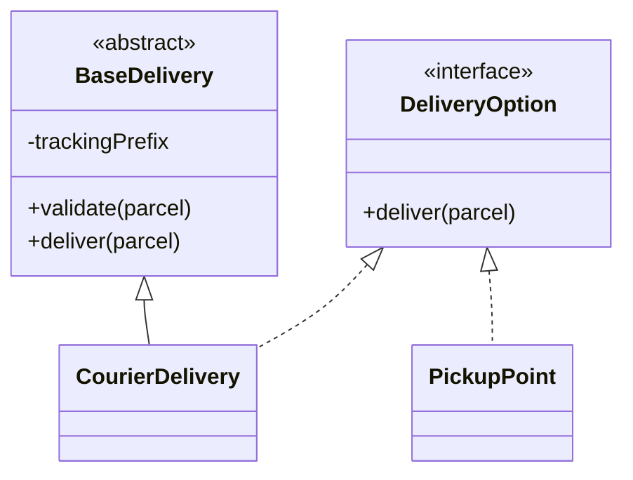
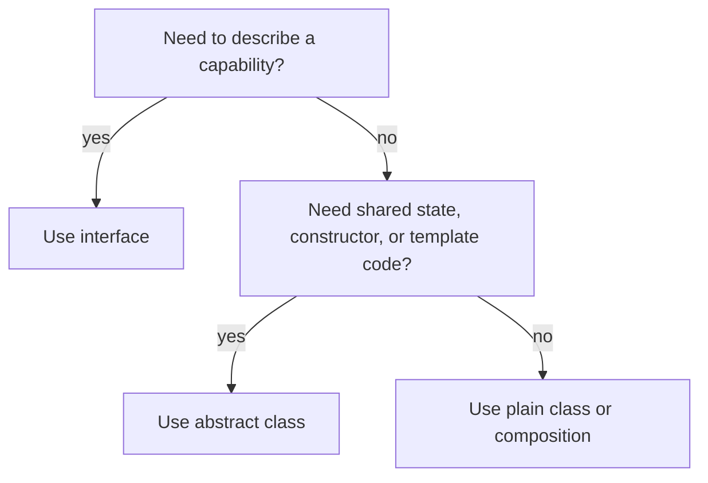

# Interface vs Abstract Class

Both an `interface` and an `abstract class` let Java code depend on an abstraction
instead of a concrete implementation. The key difference is intent: an
`interface` describes a capability or contract, while an `abstract class` is a
partial base implementation for a family of related classes. In everyday terms,
an interface is like a post office service form: it says "this counter accepts and
delivers parcels". An abstract class is like a partly equipped kitchen station:
some tools and rules are already there, but each cook still finishes the dish.

This topic sits inside the broader [OOP principles](topic:oop-principles) idea of
abstraction and polymorphism, and it directly supports [SOLID](topic:solid-principles):
code is easier to extend when it depends on small, stable contracts.



## Interface - a public contract

An `interface` says what an object can do, not how it stores data or how it is
built. A class can implement many interfaces, so interfaces are good for roles:
`Runnable`, `Comparable`, `Closeable`, `PaymentGateway`. Like badges at a busy
post office, one employee can wear several badges: "cashier", "parcel clerk",
"returns desk". Each badge promises a behavior; it does not say what is in the
employee's locker.

```java
public interface PaymentGateway {
    Receipt charge(Money amount);
}
```

Modern interfaces can contain `default`, `static`, and `private` helper methods,
but they still cannot hold per-object instance fields or constructors. Interface
fields are constants: implicitly `public static final`. Think of a sign on the
wall with shared rules, not a private drawer for each worker.

## Abstract class - shared base plus unfinished parts

An `abstract class` can contain instance fields, constructors, concrete methods,
and abstract methods. It is useful when several closely related classes share
state or a common algorithm, but some steps must vary. Like a restaurant base
station, every chef gets the same counter, scale, and safety checklist, then
finishes a pizza, soup, or dessert differently.

```java
public abstract class BasePaymentGateway {
    private final AuditLog auditLog;

    protected BasePaymentGateway(AuditLog auditLog) {
        this.auditLog = auditLog;
    }

    public final Receipt charge(Money amount) {
        auditLog.record("charging " + amount);
        return doCharge(amount);
    }

    protected abstract Receipt doCharge(Money amount);
}
```

The tradeoff is that Java allows a class to extend only one class. If a class
already extends `BasePaymentGateway`, it cannot also extend `BaseRetryableClient`.
This is like having only one main kitchen station assigned to a cook. Interfaces
are lighter roles, so a class can implement many of them.

## The practical decision rule



Choose an `interface` when callers should depend on behavior and many unrelated
classes may provide it. `List`, `Repository`, `PaymentGateway`, and
[Strategy](topic:strategy)-style choices fit this shape. In a traffic analogy,
the sign "vehicles must stop" applies to cars, buses, and bikes without caring
how each vehicle is built.

Choose an `abstract class` when the children are part of the same family and need
shared state, protected helper methods, construction rules, or a template method.
For example, several `BaseReportExporter` subclasses may share file naming,
validation, and logging, while each writes CSV, JSON, or PDF differently. In a
kitchen analogy, all stations follow the same hygiene checklist, but each station
prepares a different dish.

When the only reason is "I want to reuse some code", be careful. Composition is
often simpler: put the reusable behavior in a helper object and inject it. That
keeps the class free to extend another base later and matches the dependency
style used by [Spring IoC and Dependency Injection](topic:spring-ioc-di). It is
like giving every counter access to the same shared scale instead of making every
counter inherit from "ScaleCounter".

## Important Java differences

| Point | Interface | Abstract class |
| --- | --- | --- |
| Main intent | Capability or contract | Partial implementation for a related family |
| Instance fields | No | Yes |
| Constructors | No | Yes |
| Concrete methods | `default`, `static`, `private` helpers | Yes, any normal concrete methods |
| Abstract methods | Public contract methods | Abstract methods with normal class visibility rules |
| Inheritance limit | A class can implement many interfaces | A class can extend only one class |
| Best use | Roles, plugins, APIs, dependency boundaries | Shared state, template methods, protected helpers |

Remember the post office version: an interface is the service label on a counter,
while an abstract class is a half-built counter with drawers, labels, and some
standard procedures already installed.

## 60-second interview answer

> In Java, an interface defines a contract: it says what methods a type must
> provide and is best for capabilities that many unrelated classes can implement.
> A class can implement multiple interfaces. An abstract class is a partial base
> implementation: it can have instance fields, constructors, concrete methods,
> protected helpers, and abstract methods for subclasses to fill in. A class can
> extend only one class. Since Java 8, interfaces can have default methods, but
> that does not make them the same as abstract classes because interfaces still
> do not have per-instance state or constructors. Use an interface for a role or
> API boundary; use an abstract class when related subclasses share state or a
> common algorithm.

## Production relevance

Real Java applications usually expose interfaces at boundaries: service APIs,
repositories, payment providers, serializers, and strategy-like policies. This
lets tests and production code swap implementations without changing callers.
It is like a post office telling customers "any desk with this sign can accept a
parcel"; the customer does not need to know which clerk is behind the desk.

Abstract classes appear where a framework or library wants to provide reusable
base behavior: template methods, adapter base classes, test fixtures, or skeletal
implementations such as `AbstractList`. They are useful, but they couple children
to one base. In kitchen terms, a prebuilt station saves time, but it also decides
where the sink, stove, and cutting board are.

Design patterns often reveal the choice. [Strategy](topic:strategy) usually wants
an interface because strategies are interchangeable roles. [Adapter](topic:adapter)
may use an interface for the target API and a class for the adapter implementation.
The same distinction shows up whenever a clean API matters more than shared code.

## Common misconceptions

- **"An interface is just an abstract class with no code."** Not anymore, and not
  by intent. Interfaces describe roles; abstract classes model a shared base.
- **"Default methods mean interfaces can replace abstract classes."** Default
  methods help evolve APIs, but they do not give interfaces instance state or
  constructors.
- **"Use an abstract class whenever code is duplicated."** Duplication may be a
  sign to extract a helper object instead. Inheritance is a strong relationship,
  not just a copy-paste cleanup tool.
- **"Interfaces are only for dependency injection."** They are useful there, but
  also for plugin points, polymorphism, collections APIs, callbacks, and public
  library contracts.
- **"Abstract classes cannot have concrete methods."** They can. An abstract
  class may be mostly concrete and still leave one method abstract.
- **"Interfaces can have normal mutable fields."** They cannot. Interface fields
  are constants, not per-object state.
