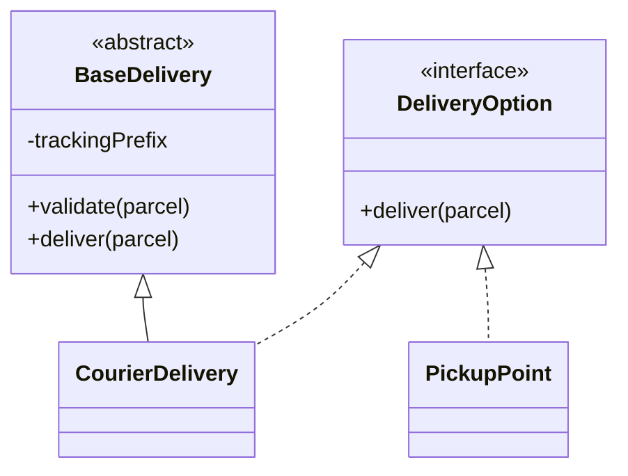
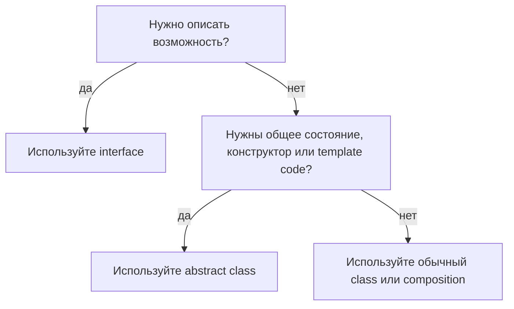

# Интерфейс vs абстрактный класс

И `interface`, и `abstract class` позволяют Java-коду зависеть от абстракции, а не
от конкретной реализации. Главное отличие в намерении: `interface` описывает
возможность или контракт, а `abstract class` является частичной базовой
реализацией для семейства связанных классов. В бытовом примере интерфейс похож на
бланк услуги на почте: он говорит "это окно принимает и доставляет посылки".
Абстрактный класс похож на частично оборудованную кухонную станцию: часть
инструментов и правил уже есть, но каждый повар все равно заканчивает блюдо сам.

Эта тема относится к более широкой идее абстракции и полиморфизма из
[принципов ООП](topic:oop-principles) и напрямую поддерживает
[SOLID](topic:solid-principles): код легче расширять, когда он зависит от
маленьких стабильных контрактов.



## Interface - публичный контракт

`interface` говорит, что объект умеет делать, но не говорит, как он хранит данные
или как он создается. Класс может реализовать много интерфейсов, поэтому
интерфейсы хорошо подходят для ролей: `Runnable`, `Comparable`, `Closeable`,
`PaymentGateway`. Как бейджи на оживленной почте: один сотрудник может носить
несколько бейджей - "кассир", "прием посылок", "возвраты". Каждый бейдж обещает
поведение, но не описывает, что лежит у сотрудника в шкафчике.

```java
public interface PaymentGateway {
    Receipt charge(Money amount);
}
```

Современные интерфейсы могут содержать `default`, `static` и `private`
вспомогательные методы, но они все равно не могут хранить instance-поля объекта и
не имеют конструкторов. Поля интерфейса являются константами: неявно
`public static final`. Представьте табличку на стене с общими правилами, а не
личный ящик каждого работника.

## Abstract class - общая база плюс незавершенные части

`abstract class` может содержать instance-поля, конструкторы, конкретные методы и
абстрактные методы. Он полезен, когда несколько близко связанных классов разделяют
состояние или общий алгоритм, но отдельные шаги должны отличаться. Как базовая
станция в ресторане: каждый повар получает один и тот же стол, весы и чеклист
безопасности, а затем готовит пиццу, суп или десерт по-своему.

```java
public abstract class BasePaymentGateway {
    private final AuditLog auditLog;

    protected BasePaymentGateway(AuditLog auditLog) {
        this.auditLog = auditLog;
    }

    public final Receipt charge(Money amount) {
        auditLog.record("charging " + amount);
        return doCharge(amount);
    }

    protected abstract Receipt doCharge(Money amount);
}
```

Компромисс в том, что Java позволяет классу расширять только один класс. Если
класс уже расширяет `BasePaymentGateway`, он не может одновременно расширять
`BaseRetryableClient`. Это как если повару назначили только одну основную кухонную
станцию. Интерфейсы легче: это роли, поэтому класс может реализовать много
интерфейсов.

## Практическое правило выбора



Выбирайте `interface`, когда вызывающий код должен зависеть от поведения, а
реализовать его могут разные несвязанные классы. `List`, `Repository`,
`PaymentGateway` и выборы в стиле [Strategy](topic:strategy) подходят под эту
форму. В дорожной аналогии знак "транспорт должен остановиться" относится к
машинам, автобусам и велосипедам, не интересуясь тем, как каждый транспорт устроен.

Выбирайте `abstract class`, когда дочерние классы относятся к одному семейству и им
нужны общее состояние, protected-вспомогательные методы, правила создания или
template method. Например, несколько подклассов `BaseReportExporter` могут
разделять имя файла, валидацию и логирование, но по-разному писать CSV, JSON или
PDF. В кухонной аналогии все станции следуют одному санитарному чеклисту, но
каждая станция готовит свое блюдо.

Если единственная причина звучит как "я хочу переиспользовать немного кода", будьте
осторожны. Часто проще композиция: вынести переиспользуемое поведение во
вспомогательный объект и внедрить его. Так класс остается свободным расширять
другую базу позже, и это совпадает со стилем зависимостей в
[Spring IoC and Dependency Injection](topic:spring-ioc-di). Это как дать каждому
окну доступ к общим весам, а не заставлять каждое окно наследоваться от
"ScaleCounter".

## Важные отличия в Java

| Пункт | Interface | Abstract class |
| --- | --- | --- |
| Главный смысл | Возможность или контракт | Частичная реализация для связанного семейства |
| Instance-поля | Нет | Да |
| Конструкторы | Нет | Да |
| Конкретные методы | `default`, `static`, `private` helpers | Да, обычные конкретные методы |
| Абстрактные методы | Public contract methods | Абстрактные методы с обычными правилами видимости класса |
| Ограничение наследования | Класс может реализовать много интерфейсов | Класс может расширить только один класс |
| Лучшее применение | Роли, plugins, APIs, границы зависимостей | Общее состояние, template methods, protected helpers |

Запомните почтовую версию: интерфейс - это табличка услуги на окне, а абстрактный
класс - это наполовину собранное окно с ящиками, табличками и стандартными
процедурами.

## Ответ за 60 секунд

> В Java интерфейс определяет контракт: он говорит, какие методы должен предоставить
> тип, и лучше всего подходит для возможностей, которые могут реализовать разные
> несвязанные классы. Класс может реализовать несколько интерфейсов. Абстрактный
> класс - это частичная базовая реализация: у него могут быть instance-поля,
> конструкторы, конкретные методы, protected-вспомогательные методы и абстрактные
> методы, которые заполняют наследники. Класс может расширить только один класс.
> Начиная с Java 8, у интерфейсов есть default-методы, но это не делает их тем же
> самым, что абстрактные классы, потому что у интерфейсов все равно нет
> per-instance состояния и конструкторов. Используйте интерфейс для роли или границы
> API; используйте абстрактный класс, когда связанные наследники разделяют состояние
> или общий алгоритм.

## Применимость на практике

В реальных Java-приложениях интерфейсы обычно стоят на границах: service APIs,
repositories, платежные провайдеры, serializers и strategy-подобные политики. Это
позволяет тестам и production-коду подменять реализации без изменения вызывающего
кода. Как почта говорит клиентам: "любое окно с этой табличкой может принять
посылку"; клиенту не нужно знать, какой сотрудник за окном.

Абстрактные классы появляются там, где фреймворк или библиотека хочет дать
переиспользуемое базовое поведение: template methods, adapter base classes, test
fixtures или skeletal implementations вроде `AbstractList`. Они полезны, но
привязывают наследников к одной базе. В кухонных терминах готовая станция экономит
время, но она уже решила, где стоят мойка, плита и разделочная доска.

Паттерны проектирования часто показывают выбор. [Strategy](topic:strategy) обычно
хочет интерфейс, потому что стратегии являются взаимозаменяемыми ролями.
[Adapter](topic:adapter) может использовать интерфейс для target API и класс для
реализации adapter. То же различие появляется везде, где чистый API важнее общего
кода.

## Частые заблуждения

- **"Интерфейс - это просто абстрактный класс без кода."** Уже нет, и по смыслу это
  неверно. Интерфейсы описывают роли; абстрактные классы моделируют общую базу.
- **"Default-методы позволяют интерфейсам заменить абстрактные классы."**
  Default-методы помогают развивать API, но не дают интерфейсам instance-состояние
  или конструкторы.
- **"Используйте абстрактный класс всегда, когда код дублируется."** Дублирование
  может быть сигналом вынести helper object. Наследование - сильная связь, а не
  просто инструмент уборки copy-paste.
- **"Интерфейсы нужны только для dependency injection."** Они полезны там, но также
  нужны для plugin points, полиморфизма, collections APIs, callbacks и публичных
  контрактов библиотек.
- **"Абстрактные классы не могут иметь конкретные методы."** Могут. Абстрактный
  класс может быть почти полностью конкретным и оставить абстрактным только один
  метод.
- **"Интерфейсы могут иметь обычные изменяемые поля."** Не могут. Поля интерфейса
  являются константами, а не состоянием конкретного объекта.
