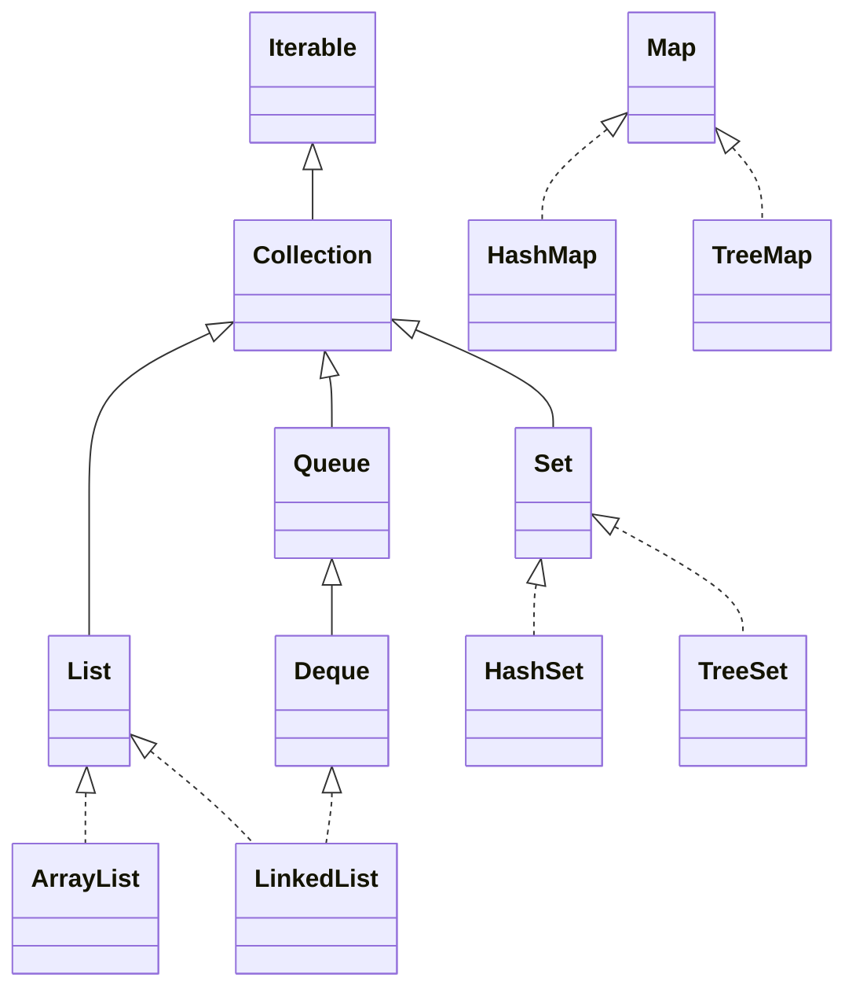
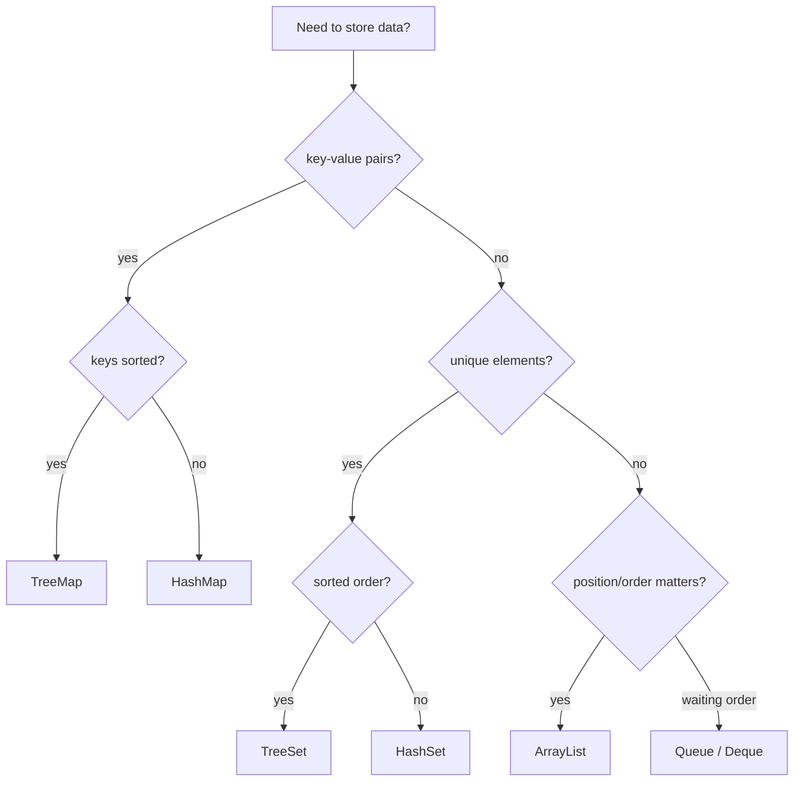

# Java Collections Overview

The Java Collections Framework is the standard toolbox for storing groups of
objects. Think of it like organizing a busy kitchen: plates may need a shelf with
positions, spices may need unique labels, orders may need a queue, and a recipe
book may need fast lookup by name. In Java, those jobs are split across
interfaces such as `List`, `Set`, `Queue`, `Deque` and `Map`.

`Collection` is the root interface for most groups of elements, but `Map` is a
separate branch because it stores key-value pairs instead of single elements. In
real life terms: a shelf holds items one by one, while a post office box system
maps box numbers to parcels.

## The Main Families

**`List`** stores elements in order and allows duplicates. Use it when position
matters: page 1, page 2, page 3. `ArrayList` is the default choice because random
access by index is fast and iteration is cache-friendly. Kitchen analogy: trays
on a numbered shelf are quick to pick by position. `LinkedList` is rarely the
default; it shines only in narrow cases where you need deque operations at both
ends and already hold the relevant node-like position. For the detailed tradeoff,
see [ArrayList vs LinkedList](topic:arraylist-vs-linkedlist).

**`Set`** stores unique elements. Use it when the question is "have I seen this
already?" `HashSet` is the usual fast membership set, backed by hashing.
Kitchen analogy: a spice rack with one jar per spice label. `LinkedHashSet`
keeps insertion order, like keeping the jars in the order they arrived. `TreeSet`
keeps elements sorted, like arranging envelopes alphabetically at the post
office, but each operation costs more because it maintains a tree.

**`Queue`** models waiting order: first in, first out. Use it for tasks, messages,
or breadth-first traversal. Traffic analogy: cars enter a lane and leave in the
same order. `Deque` is a double-ended queue; it can work as both a queue and a
stack. Real life: a serving counter where staff can add or remove trays from
either side.

**`Map`** stores key-value pairs. Use it when you need to find a value by a key:
user id to user, product code to price, word to count. `HashMap` is the everyday
choice for fast lookup and update; see [HashMap basics](topic:hashmap-basics),
[HashMap internals](topic:hashmap), and [HashMap lookup speed](topic:hashmap-lookup-complexity).
Kitchen analogy: a recipe index where the dish name points to the recipe page.
`LinkedHashMap` keeps insertion or access order, useful for simple LRU-like
ordering. `TreeMap` keeps keys sorted, like a postal directory sorted by street
name.

## Ordering And Nulls

Interviewers often ask about ordering because it separates similar classes.
`ArrayList` keeps index order, `HashSet` and `HashMap` do not promise iteration
order, `LinkedHashSet` and `LinkedHashMap` preserve insertion order, and `TreeSet`
or `TreeMap` sort by natural order or a `Comparator`. Analogy: a kitchen shelf
can be "where I placed it", "whatever bin hashing picked", or "alphabetical by
label"; those are different promises.

Null handling also differs. `ArrayList` can store multiple `null` values.
`HashSet` can store one `null`. `HashMap` allows one `null` key and many `null`
values. Sorted collections such as `TreeSet` and `TreeMap` usually reject `null`
unless a custom `Comparator` explicitly handles it. Real life: a blank label may
be acceptable in a casual tray, but an alphabetical post-office sorter needs a
real label to compare.

## Mutability And Thread Safety

Most common collections are mutable and not thread-safe: `ArrayList`, `HashMap`,
`HashSet`, `LinkedList`. If several threads modify them at once, you need external
synchronization or concurrent collections. For that topic, see
[Concurrent vs Synchronized Collections](topic:concurrent-synchronized-collections).
Analogy: if several cooks write on the same order board at once, someone must
control the pen or use a board designed for many writers.

`Collections.unmodifiableList(...)` gives a read-only view over an existing list;
it does not copy by itself. `List.of(...)`, `Set.of(...)` and `Map.of(...)` create
small immutable collections and reject `null`. Kitchen analogy: a laminated menu
cannot be edited, while a glass display window may still show a cake someone can
change behind the counter.

## 60-Second Interview Answer

> Java collections are grouped by the contract they provide. `List` keeps ordered
> elements and allows duplicates; `ArrayList` is the usual default, while
> `LinkedList` is mostly for deque-like operations. `Set` keeps unique elements:
> `HashSet` is fast, `LinkedHashSet` preserves insertion order, and `TreeSet`
> sorts. `Queue` and `Deque` model waiting order or two-ended access. `Map` is not
> a `Collection`; it stores key-value pairs. `HashMap` is the default map,
> `LinkedHashMap` keeps order, and `TreeMap` sorts keys. I choose by asking:
> duplicates or unique, key-value or single values, do I need order or sorting,
> and will multiple threads modify it?

## Production Relevance

Choosing the wrong collection changes both performance and correctness. A
`List.contains(...)` search can become a slow linear scan where a `HashSet` would
be direct lookup. A `HashMap` can silently lose predictable display order where a
`LinkedHashMap` would keep it. A mutable `ArrayList` shared between threads can
fail under load. Real life: using a pile of receipts when you need a numbered
filing cabinet works for five receipts and hurts at five thousand.

## Common Misconceptions

- "All collections are lists." No: `Set`, `Queue`, `Deque` and `Map` solve
  different jobs. A kitchen shelf, waiting line and recipe index are not the same
  object.
- "`Map` extends `Collection`." It does not; it stores entries, keys and values,
  and exposes collection views through `entrySet()`, `keySet()` and `values()`.
  A post-office box directory is not itself a pile of parcels.
- "`HashMap` keeps insertion order because it often looks stable." It has no such
  contract. If order matters, say `LinkedHashMap` or `TreeMap`. A bin system may
  look tidy today and reshuffle tomorrow.
- "`LinkedList` is faster than `ArrayList` for inserts." Only sometimes. Finding
  the position is often O(n), and memory locality is worse. Moving one tray is not
  faster if you first walk through the whole warehouse.
- "Thread-safe means `volatile` or `final` is enough." Collection operations need
  the right synchronization or concurrent implementation when shared mutation is
  involved. One label on the order board does not coordinate five cooks.
