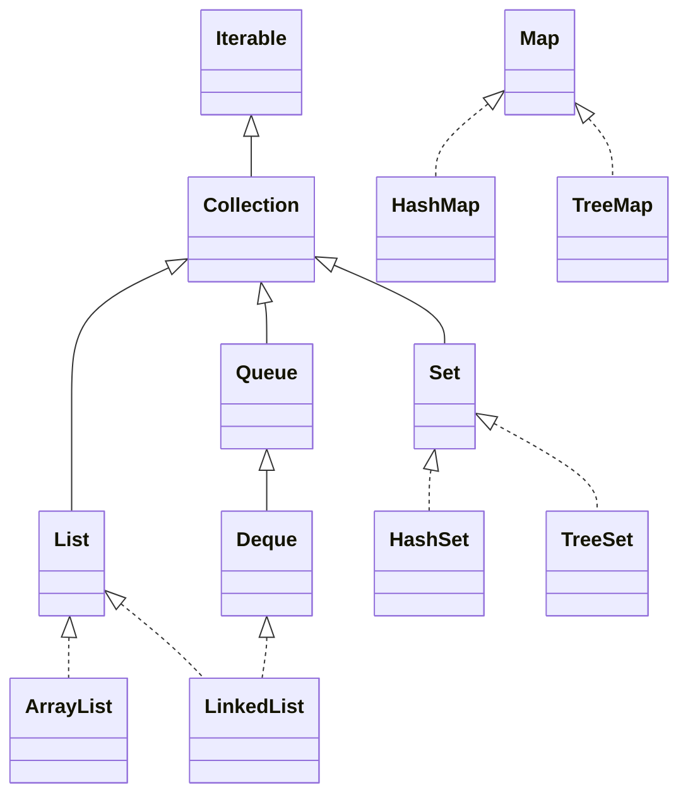
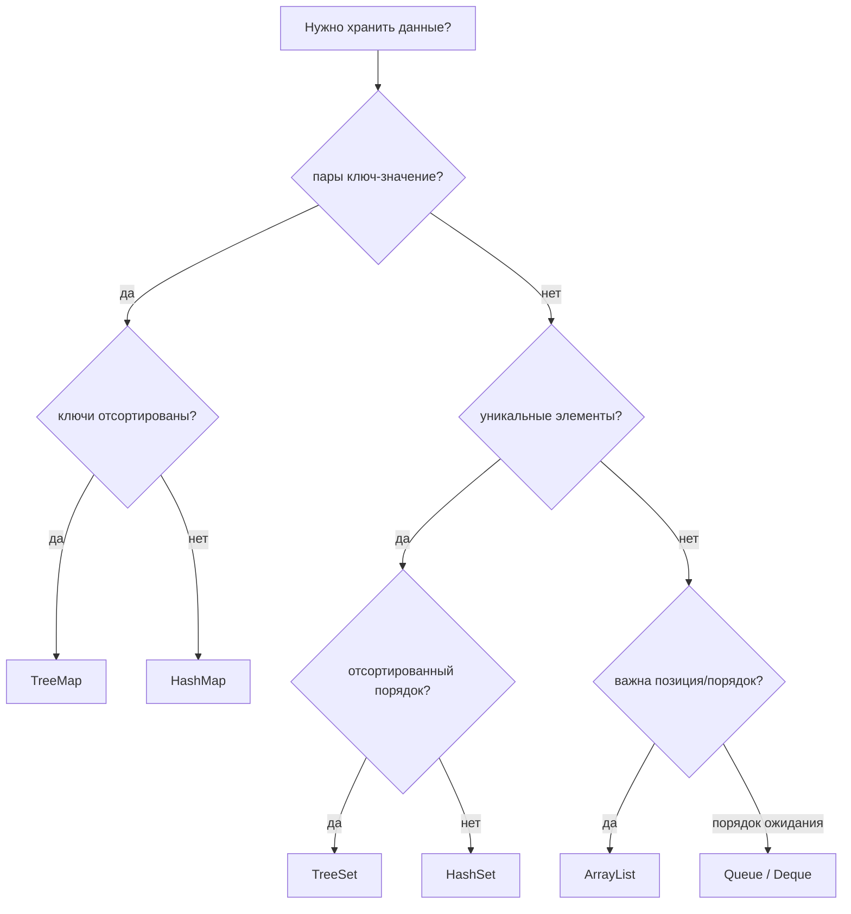

# Обзор коллекций Java

Java Collections Framework — это стандартный набор инструментов для хранения
групп объектов. Представьте организацию большой кухни: тарелкам нужна полка с
позициями, специям нужны уникальные подписи, заказам нужна очередь, а книге
рецептов нужен быстрый поиск по названию. В Java эти задачи разделены между
интерфейсами `List`, `Set`, `Queue`, `Deque` и `Map`.

`Collection` — корневой интерфейс для большинства групп элементов, но `Map`
стоит отдельной веткой, потому что хранит пары ключ-значение, а не одиночные
элементы. Бытовая аналогия: полка держит предметы по одному, а система ячеек на
почте связывает номер ячейки с посылкой.

## Основные семейства

**`List`** хранит элементы по порядку и разрешает дубликаты. Используйте его,
когда важна позиция: страница 1, страница 2, страница 3. `ArrayList` — выбор по
умолчанию, потому что доступ по индексу быстрый, а проход по элементам хорошо
ложится в кэш. Кухонная аналогия: подносы на пронумерованной полке быстро взять
по позиции. `LinkedList` редко бывает выбором по умолчанию; он полезен в узких
случаях, когда нужны операции `Deque` с двух концов и у вас уже есть подходящая
позиция, похожая на узел. Подробный разбор компромиссов есть в теме
[ArrayList vs LinkedList](topic:arraylist-vs-linkedlist).

**`Set`** хранит уникальные элементы. Используйте его, когда вопрос звучит как
«я уже видел это значение?» `HashSet` — обычный быстрый набор для проверки
наличия, основанный на hashing. Кухонная аналогия: стойка специй, где на каждую
подпись есть только одна баночка. `LinkedHashSet` сохраняет порядок вставки,
как будто баночки стоят в порядке прихода. `TreeSet` держит элементы
отсортированными, как конверты на почте по алфавиту, но каждая операция дороже,
потому что поддерживается дерево.

**`Queue`** моделирует порядок ожидания: первым пришёл — первым вышел.
Используйте её для задач, сообщений или обхода в ширину. Дорожная аналогия:
машины въезжают в полосу и выезжают в том же порядке. `Deque` — двусторонняя
очередь; она может работать и как очередь, и как стек. Бытовая аналогия: стойка
выдачи, где сотрудники могут добавлять или убирать подносы с любой стороны.

**`Map`** хранит пары ключ-значение. Используйте её, когда нужно найти значение
по ключу: id пользователя к пользователю, код товара к цене, слово к счётчику.
`HashMap` — повседневный выбор для быстрого поиска и обновления; см.
[основы HashMap](topic:hashmap-basics), [устройство HashMap](topic:hashmap) и
[скорость поиска в HashMap](topic:hashmap-lookup-complexity). Кухонная аналогия:
указатель рецептов, где название блюда ведёт на страницу рецепта.
`LinkedHashMap` сохраняет порядок вставки или доступа, что полезно для простого
LRU-подобного порядка. `TreeMap` держит ключи отсортированными, как почтовый
справочник, отсортированный по названию улицы.

## Порядок И Null

На собеседованиях часто спрашивают про порядок, потому что он разделяет похожие
классы. `ArrayList` хранит порядок индексов, `HashSet` и `HashMap` не обещают
порядок итерации, `LinkedHashSet` и `LinkedHashMap` сохраняют порядок вставки, а
`TreeSet` и `TreeMap` сортируют по natural order или `Comparator`. Аналогия:
кухонная полка может быть «как я поставил», «как выбрал hashing-бакет» или
«по алфавиту на этикетке»; это разные обещания.

Обработка `null` тоже отличается. `ArrayList` может хранить несколько значений
`null`. `HashSet` может хранить один `null`. `HashMap` разрешает один `null`-ключ
и много `null`-значений. Отсортированные коллекции вроде `TreeSet` и `TreeMap`
обычно не принимают `null`, если только пользовательский `Comparator` явно его
не обрабатывает. Бытовая аналогия: пустая этикетка допустима в свободном лотке,
но алфавитному почтовому сортировщику нужна настоящая подпись для сравнения.

## Изменяемость И Потокобезопасность

Большинство популярных коллекций изменяемые и не потокобезопасные: `ArrayList`,
`HashMap`, `HashSet`, `LinkedList`. Если несколько потоков изменяют их
одновременно, нужна внешняя синхронизация или concurrent-коллекции. Об этом есть
отдельная тема [Concurrent vs Synchronized Collections](topic:concurrent-synchronized-collections).
Аналогия: если несколько поваров одновременно пишут на одной доске заказов,
кто-то должен контролировать маркер или нужна доска, рассчитанная на многих
авторов.

`Collections.unmodifiableList(...)` даёт read-only view поверх существующего
списка; сам по себе он не копирует данные. `List.of(...)`, `Set.of(...)` и
`Map.of(...)` создают небольшие immutable collections и не принимают `null`.
Кухонная аналогия: ламинированное меню нельзя редактировать, а витрина за стеклом
может всё ещё показывать торт, который кто-то меняет за прилавком.

## Ответ На Собеседовании За 60 Секунд

> Коллекции Java группируются по контракту, который они дают. `List` хранит
> элементы по порядку и разрешает дубликаты; `ArrayList` обычно выбор по
> умолчанию, а `LinkedList` чаще нужен для операций, похожих на `Deque`. `Set`
> хранит уникальные элементы: `HashSet` быстрый, `LinkedHashSet` сохраняет порядок
> вставки, а `TreeSet` сортирует. `Queue` и `Deque` моделируют порядок ожидания
> или доступ с двух концов. `Map` не является `Collection`; она хранит пары
> ключ-значение. `HashMap` — карта по умолчанию, `LinkedHashMap` сохраняет
> порядок, а `TreeMap` сортирует ключи. Я выбираю по вопросам: нужны дубликаты
> или уникальность, ключ-значение или одиночные значения, нужен ли порядок или
> сортировка, и будут ли несколько потоков изменять структуру.

## Значение В Production

Неправильная коллекция меняет и производительность, и корректность.
`List.contains(...)` может стать медленным линейным поиском там, где `HashSet`
дал бы прямую проверку. `HashMap` может незаметно потерять предсказуемый порядок
отображения там, где `LinkedHashMap` его сохранил бы. Изменяемый `ArrayList`,
разделяемый между потоками, может ломаться под нагрузкой. Бытовая аналогия:
куча чеков вместо пронумерованного шкафа работает для пяти чеков и начинает
мешать на пяти тысячах.

## Частые Заблуждения

- «Все коллекции — это списки». Нет: `Set`, `Queue`, `Deque` и `Map` решают разные
  задачи. Кухонная полка, очередь ожидания и указатель рецептов — не один и тот
  же предмет.
- «`Map` extends `Collection`». Нет; она хранит entries, keys и values, а
  collection views отдаёт через `entrySet()`, `keySet()` и `values()`. Справочник
  почтовых ячеек сам по себе не является кучей посылок.
- «`HashMap` сохраняет порядок вставки, потому что он часто выглядит стабильным».
  Такого контракта нет. Если порядок важен, называйте `LinkedHashMap` или
  `TreeMap`. Система бакетов сегодня может выглядеть аккуратно, а завтра
  перестроиться.
- «`LinkedList` быстрее `ArrayList` для вставок». Только иногда. Поиск позиции
  часто O(n), а локальность памяти хуже. Передвинуть один поднос не быстрее, если
  сначала нужно пройти весь склад.
- «Для thread-safe достаточно `volatile` или `final`». При совместном изменении
  коллекции нужны правильная синхронизация или concurrent-реализация. Одна
  подпись на доске заказов не координирует пять поваров.
